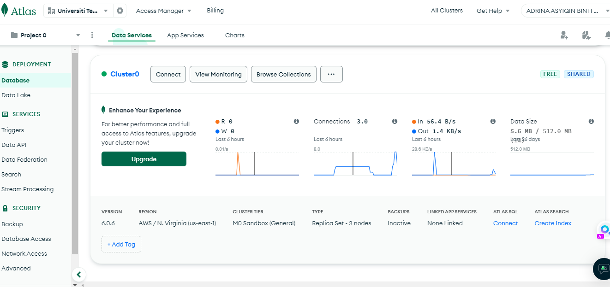
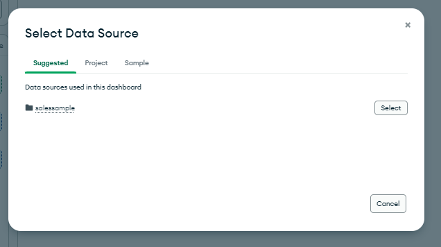
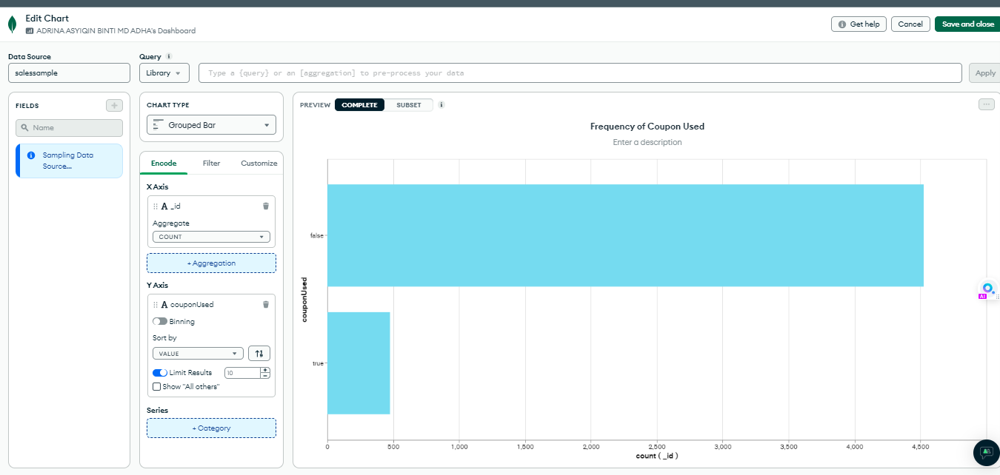

<a href="https://github.com/drshahizan/SECP3843/stargazers"></a>
<a href="https://github.com/drshahizan/SECP3843/network/members"></a>
<a href="https://github.com/drshahizan/SECP3843/pulls"></a>
<a href="https://github.com/drshahizan/SECP3843/issues"></a>
<a href="https://github.com/drshahizan/SECP3843/graphs/contributors"></a>


Don't forget to hit the :star: if you like this repo.

# Special Topic Data Engineering (SECP3843): Alternative Assessment

#### Name: Adrina Asyiqin Binti Md Adha
#### Matric No.: A20EC0174
#### Dataset: sales.json

## Question 5 (a)
### Ways to optimize performance when dealing with large volumes of JSON data
- `Load and preprocess data efficiently`
  
  Use streaming or chunked processing techniques to load and preprocess the JSON data in smaller portions rather than loading the entire dataset into memory at once. This can be done using libraries like pandas with the read_json function and specifying the lines=True parameter for reading JSON files line by line.
    ```py
    import pymongo
    import pandas as pd

    # Connect to MongoDB and retrieve data
    password = "Adrina857600"
    client = pymongo.MongoClient("mongodb+srv://cluster0.yvk5zzq.mongodb.net/", username="adrinaasyiqin", password=password)
    db = client["salesdatabase"]
    collection = db["salessample"]

    # Define the aggregation pipeline
    pipeline = [
        # Stage 1: Match documents based on criteria
        {"$match": {"date": {"$gt": "2022-01-01"}}},
        
        # Stage 2: Project only necessary fields
        {"$project": {"_id": 0, "date": 1, "storeLocation": 1, "customer": 1, "couponUsed": 1}}
    ]

    # Execute the aggregation pipeline
    cursor = collection.aggregate(pipeline)

    # Convert the cursor to a DataFrame
    df = pd.DataFrame(list(cursor))

    # Check the DataFrame
    print(df.head())
    df.info()

    ```
    


- `Optimize data retrieval`
  
  Retrieve only the required data for visualization instead of fetching the entire dataset. Use pagination or limit the number of records retrieved at a time based on user interactions. This can be done by incorporating server-side pagination or using API endpoints with pagination support.
    ```py
    import pymongo
    import pandas as pd

    # Connect to MongoDB and retrieve data
    password = "Adrina857600"
    client = pymongo.MongoClient("mongodb+srv://cluster0.yvk5zzq.mongodb.net/", username="adrinaasyiqin", password=password)
    db = client["salesdatabase"]
    collection = db["salessample"]

    # Create index on the frequently used field
    collection.create_index("date")

    # Define the query filter
    query = {"date": {"$gt": "2022-01-01"}}

    # Define the projection to retrieve only necessary fields
    projection = {"_id": 0, "date": 1, "storeLocation": 1, "customer": 1, "couponUsed": 1}

    # Retrieve data using optimized query and projection
    data = list(collection.find(query, projection))

    # Convert to DataFrame
    df = pd.DataFrame(data)

    # Check the DataFrame
    print(df.head())
    df.info()
    ```
    

- `Indexing`
  
  Create indexes on the fields that are frequently used for filtering or sorting. Indexing can significantly speed up query execution by allowing MongoDB to quickly locate the requested data. Use the create_index() method to create indexes on specific fields.
    ```py
    import pymongo
    import pandas as pd

    # Connect to MongoDB and retrieve data
    password = "Adrina857600"
    client = pymongo.MongoClient("mongodb+srv://cluster0.yvk5zzq.mongodb.net/", username="adrinaasyiqin", password=password)
    db = client["salesdatabase"]
    collection = db["salessample"]

    # Create index on the frequently used field
    collection.create_index("date")

    # Retrieve and filter data using MongoDB query
    query = {"date": {"$gt": "2022-01-01"}}
    data = list(collection.find(query))

    # Convert to DataFrame
    df = pd.DataFrame(data)

    # Check the DataFrame
    print(df.head())
    df.info()
    ```

- `Use data compression techniques`
  
  Compress the JSON data during transmission between the server and the client using compression algorithms like gzip or deflate. This reduces the network bandwidth required to transmit the data and improves the dashboard's loading time.

    ```py
    import pymongo

    # Connect to MongoDB
    password = "Adrina857600"
    client = pymongo.MongoClient("mongodb+srv://cluster0.yvk5zzq.mongodb.net/", username="adrinaasyiqin", password=password)
    db = client["salesdatabase"]
    collection = db["salessample"]

    # Enable compression for the collection
    collection.create_index([("date", pymongo.ASCENDING)], background=True)
    collection.create_index([("storeLocation", pymongo.ASCENDING)], background=True)
    collection.create_index([("customer", pymongo.ASCENDING)], background=True)
    collection.create_index([("couponUsed", pymongo.ASCENDING)], background=True)
    collection.create_index([("items", pymongo.ASCENDING)], background=True)
    collection.create_index([("purchaseMethod", pymongo.ASCENDING)], background=True)
    collection.create_index([("saleDate", pymongo.ASCENDING)], background=True)

    # Check compression status
    compression_status = collection.options().get('storageEngine', {}).get('wiredTiger', {}).get('configString', '').find('block_compressor')
    if compression_status != -1:
        print("Compression is enabled for the collection.")
    else:
        print("Compression is not enabled for the collection.")


    ```

## Question 5 (b)
### F
### Creating Dashboard Using MongoDB Charts.
- Go to `MongoDB Atlas Charts` and sign into your account --> https://www.mongodb.com/products/charts
- Use the connection where sales.json data is uploaded previously
- Click on 'Charts' from the tab menu in the connection
  
  
  
- Choose your database, I has previously created a database collection named `salessample` under `salesdatabase`

  

- Once data source has been chosen, now it is up to ones creativity to visualise the dashboard and charts. I had created four charts using all the tools the MongoDB charts had prepared. It is as easy because users only need to drag and drop to axis and worksheet.

  

- Once a chart had been created, at the top right corner click on `Save and Close` to save the chart. This will then lead us to the main dashboard. Simply click on `Add Chart` to create a new chart. In the dashboard, admin users can adjust the size of each charts and drag them to locate them anywhere in the sheet. In the dashboard, to edit existing chart just hover on the chart. There will be an option to edit chart

  

  


## Final Dashboard 
    


## Contribution 🛠️
Please create an [Issue](https://github.com/drshahizan/special-topic-data-engineering/issues) for any improvements, suggestions or errors in the content.

You can also contact me using [Linkedin](https://www.linkedin.com/in/drshahizan/) for any other queries or feedback.

[](https://visitorbadge.io/status?path=https%3A%2F%2Fgithub.com%2Fdrshahizan)

