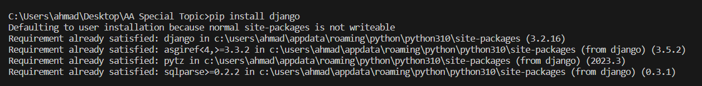

Don't forget to hit the :star: if you like this repo.

# Special Topic Data Engineering (SECP3843): Alternative Assessment

#### Name: AHMAD AIMAN HAFIZI BIN MUHAMMAD
#### Matric No.: A20EC0177
#### Dataset: ANALYTICS DATASET

## Question 1 (a)

Setting up a Django project involves installing Python and Django, creating a virtual environment, creating a new Django project using the django-admin command, configuring the database in the settings.py file, and starting the development server using the python manage.py runserver command.

To integrate Django with the JSON dataset and ensure efficient data storage and retrieval from both MySQL and MongoDB databases for the Analytics Dataset, follow these steps.

1. *Install Django*: Start by installing Django by using the pip package manager to install Django. Since I am using Windows, use `pip install Django`.

## Question 1 (b)
Lorem ipsum dolor sit amet, consectetur adipisicing elit, sed do eiusmod tempor incididunt ut labore et dolore magna aliqua. Ut enim ad minim veniam, quis nostrud exercitation ullamco laboris nisi ut aliquip ex ea commodo consequat. Duis aute irure dolor in reprehenderit in voluptate velit esse cillum dolore eu fugiat nulla pariatur. Excepteur sint occaecat cupidatat non proident, sunt in culpa qui officia deserunt mollit anim id est laborum.

## Contribution 🛠️
Please create an [Issue](https://github.com/drshahizan/special-topic-data-engineering/issues) for any improvements, suggestions or errors in the content.

You can also contact me using [Linkedin](https://www.linkedin.com/in/aiman-hafizi-63b0a8275/) for any other queries or feedback.

