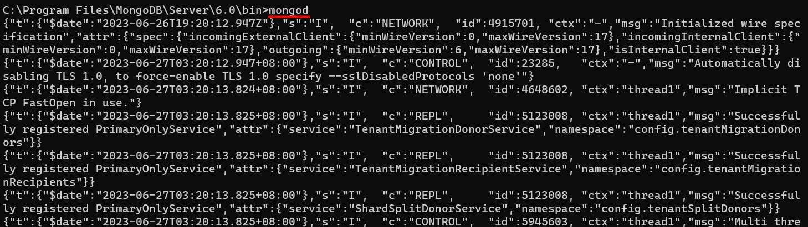
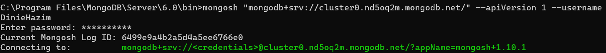
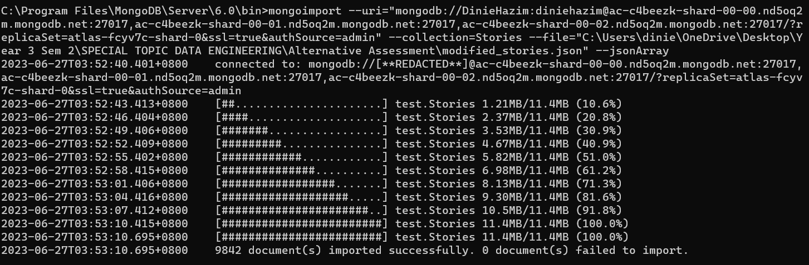
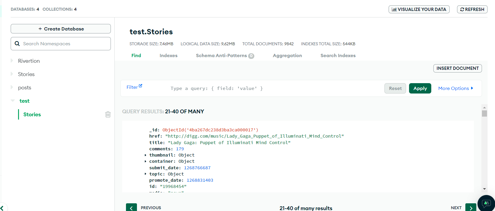

Don't forget to hit the :star: if you like this repo.

# Special Topic Data Engineering (SECP3843): Alternative Assessment

#### Name: Muhammad Dinie Hazim Bin Azali
#### Matric No.: A20EC0084
#### Dataset: [Stories](https://github.com/drshahizan/dataset/tree/main/mongodb/07-stories)

## Question 2 (a)

#### Install all required software:

1. MongDB Community Server
   - Simply go to this [link](https://www.mongodb.com/try/download/community) and click the download button.
     

        </img>
     

2. MongoDB Command Line Database Tools
   - Go to this [link](https://www.mongodb.com/try/download/database-tools) and click download.
     

        </img>
     

3. MongoDB Shell
   - Navigate to this [link](https://www.mongodb.com/try/download/shell) and click the download button.
     

        </img>
     

#### Prepare the JSON File
1. Ensure that JSON file follows the appropriate structure for MongoDB documents.
2. Download `stories.json` dataset.
3. Use python to modified the dataset.
   - `Data Preparation`: [Data Preparation.ipynb](https://github.com/drshahizan/SECP3843/blob/9b1709a25acd8278b73b3a6d17d1e2b2fa47f720/submission/DinieHazim/question%202/files/code/prepareJSON.ipynb)
   - `Modified Dataset`: [Modified_Stories.json](https://github.com/drshahizan/SECP3843/blob/6bf7dcc64f311177227022dc6dd865ea6c4d49bd/submission/DinieHazim/question%202/files/code/modified_stories.json)

#### Start MongoDB Server
1. Install and setup MongoDB Server.
2. Let all the requirement to default.
3. Then, open the zip file from MongoDB Shell and MongoDB Command Line Database Tools into this folder `C:\Program Files\MongoDB\Server\6.0\bin`.

   </img>
   </img>
5. Open terminal or command prompt and direct to `C:\Program Files\MongoDB\Server\6.0\bin`
6. Start the MongoDB server by running the mongod command.
   </img>

#### Access MongoDB Shell
1. Open terminal or command prompt.
2. Run this following command `mongosh "mongodb+srv://cluster0.nd5oq2m.mongodb.net/" --apiVersion 1 --username DinieHazim`.
3. Enter password.
   </img>

#### Import dataset
1. In order to import the dataset into MongoDB, use the mongoimport command.
   </img>

#### Check the data
1. Open MongoDB and will see all the data have been imported.
   </img>

## Question 2 (b)
Lorem ipsum dolor sit amet, consectetur adipisicing elit, sed do eiusmod tempor incididunt ut labore et dolore magna aliqua. Ut enim ad minim veniam, quis nostrud exercitation ullamco laboris nisi ut aliquip ex ea commodo consequat. Duis aute irure dolor in reprehenderit in voluptate velit esse cillum dolore eu fugiat nulla pariatur. Excepteur sint occaecat cupidatat non proident, sunt in culpa qui officia deserunt mollit anim id est laborum.

## Contribution 🛠️
Please create an [Issue](https://github.com/drshahizan/special-topic-data-engineering/issues) for any improvements, suggestions or errors in the content.

You can also contact me using [Linkedin](https://www.linkedin.com/in/mikhel-adam/) for any other queries or feedback.

