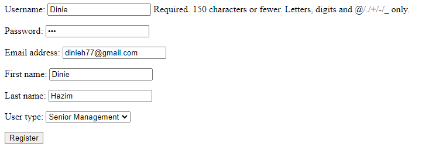
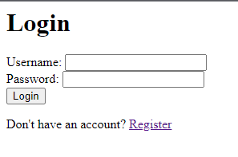

<a href="https://github.com/drshahizan/SECP3843/stargazers"></a>
<a href="https://github.com/drshahizan/SECP3843/network/members"></a>
<a href="https://github.com/drshahizan/SECP3843/pulls"></a>
<a href="https://github.com/drshahizan/SECP3843/issues"></a>
<a href="https://github.com/drshahizan/SECP3843/graphs/contributors"></a>


Don't forget to hit the :star: if you like this repo.

# Special Topic Data Engineering (SECP3843): Alternative Assessment

#### Name: Muhammad Dinie Hazim Bin Azali
#### Matric No.: A20EC0084
#### Dataset: [Stories](https://github.com/drshahizan/dataset/tree/main/mongodb/07-stories)

## Question 3 (a)

#### Setup the virtual environment

1. Open terminal or command prompt and run the following code.
   ```
      py -3 -m venv . venv
      .venv\scripts\activate
   ```

#### Create Django app

1. Type `django-admin startproject stories` in terminal or command prompt.
2. Go to the project directory and create a new app called `storyportal`.
   ```
      django-admin startproject stories
      cd stories
      python manage.py startapp storyportal
   ```

#### Configure the database

1. Inside the project, find `settings.py` file.
2. Change the database setting like the following code.
   ```python
      DATABASES = {
      'default': {
          'ENGINE': 'django.db.backends.mysql',
          'NAME': 'storyportal',
          'USER': 'root',
          'HOST': 'localhost',
          'PORT': '3306',
      }
      }
   ```

3. Make sure in the `INSTALLED_APPS` already add the app name.
   ```python
      INSTALLED_APPS = [
          'django.contrib.admin',
          'django.contrib.auth',
          'django.contrib.contenttypes',
          'django.contrib.sessions',
          'django.contrib.messages',
          'django.contrib.staticfiles',
          'storyportal'
      ]
   ```

#### Define model

1. In your app folder, find `models.py` file.
2. Define the user class for user authentication and login.
   ```python
      class User(AbstractUser):
          is_customer = models.BooleanField(default=False)
          is_technical_worker = models.BooleanField(default=False)
          is_senior_management = models.BooleanField(default=False)
      
          groups = models.ManyToManyField(Group, blank=True, related_name='custome_user_set')
      
          user_permissions = models.ManyToManyField(Permission, blank=True, related_name='custome_user_set')
   ```

#### Create views.

1. Find `views.py` file in your app.
2. Create views for user login, registration and dashboard.
   ```python
      from django.shortcuts import render, redirect
      from .forms import RegistrationForm
      from django.contrib.auth .forms import AuthenticationForm
      from django.contrib.auth import authenticate, login, logout
      from django.contrib.auth.decorators import login_required
      from .decorators import is_customer, is_technical_worker, is_senior_management
      from django.contrib.auth.decorators import user_passes_test
      
      # Create your views here.
      def user_login(request):
          if request.method == 'POST':
              form = AuthenticationForm(request, data=request.POST)
              if form.is_valid():
                  username = form.cleaned_data.get['username']
                  password = form.cleaned_data.get['password']
                  user = authenticate(username=username, password=password)
                  print('User: ', user)
                  if user is not None:
                      login(request, user)
                      print('User logged in successfully')
                      return redirect('dashboard')
          else:
              form = AuthenticationForm()
          return render(request, 'login.html', {'form': form})
      
      def register(request):
          if request.method == 'POST':
              form = RegistrationForm(request.POST)
              if form.is_valid():
                  form.save()
                  return redirect('login')
          else:
              form = RegistrationForm()
          return render(request, 'register.html', {'form': form})
      
      @login_required
      def profile(request):
          user = request.user
      
          return render(request, 'profile.html', {'user': user})
      
      @user_passes_test(is_customer)
      def customer_dashboard(request):
      
          return render(request, 'customer_dashboard.html')
      
      @user_passes_test(is_technical_worker)
      def technical_worker_dashboard(request):
      
          return render(request, 'technical_worker_dashboard.html')
      
      @user_passes_test(is_senior_management)
      def senior_management_dashboard(request):
      
          return render(request, 'senior_management_dashboard.html')
      
      def redirect_dashboard(request):
          user = request.user
          if user.is_customer:
              return redirect('customer_dashboard')
          elif user.is_technical_worker:
              return redirect('technical_worker_dashboard')
          elif user.is_senior_management:
              return redirect('senior_management_dashboard')
          else:
              return redirect('profile')
          
      def user_logout(request):
          logout(request)
          return redirect('login')
   ```

#### Create registration form

1. Create new python file called `forms.py` inside your app.
   ```python
      from django.contrib.auth.forms import UserCreationForm
      from django import forms
      from .models import User
      
      class RegistrationForm(UserCreationForm):
          ROLE_CHOICES = [
              ('customer', 'Customer'),
              ('technical_worker', 'Technical Worker'),
              ('senior_management', 'Senior Management'),
          ]
      
          role = forms.ChoiceField(choices=ROLE_CHOICES, widget=forms.RadioSelect)
      
          class Meta:
              model = User
              fields = ['username', 'email', 'role', 'password1', 'password2']
      
          def save(self, commit=True):
              user = super().save(commit=False)
              role = self.cleaned_data.get('role')
      
              if role == 'customer':
                  user.is_customer = True
              elif role == 'technical_worker':
                  user.is_technical_worker = True
              elif role == 'senior_management':
                  user.is_senior_management = True
      
              if commit:
                  user.save()
              return user
   ```

#### Configure URL route

1. Open `urls.py` file and insert this code.
   ```python
      from django.contrib import admin
      from django.urls import path
      from storyportal.views import user_login, register, customer_dashboard, technical_worker_dashboard, senior_management_dashboard, redirect_dashboard, user_logout
      
      urlpatterns = [
          path('admin/', admin.site.urls),
          path('', register, name='register'),
          path('register/', register, name='register'),
          path('login/', user_login, name='login'),
          path('dashboard/', redirect_dashboard, name='dashboard'),
          path('customer_dashboard/', customer_dashboard, name='customer_dashboard'),
          path('technical_worker_dashboard/', technical_worker_dashboard, name='technical_worker_dashboard'),
          path('senior_management_dashboard/', senior_management_dashboard, name='senior_management_dashboard'),
          path('logout/', user_logout, name='logout'),
      ]
   ```

#### Create HTML file

1. Create `login.html`.

```html
 
<h2>Login</h2>
<form method="POST">
     {{ form.as_p }}
    <button type="submit">Login</button>
</form>

```

2. Create `register.html`

```html
 
<h2>Register</h2>
<form method="POST">
     {{ form.as_p }}
    <button type="submit">Register</button>
</form>
<br>
<text>Already have an account? <a href="">Login</a></text>

```

#### Migrate

1. In order to apply the changes have been made, run the command below.
   ```
      python manage.py makemigrations
      python manage.py migrate
   ```

#### Execute

1. Run the project by run this command
   ```
      python manage.py runserver
   ```

#### Register


#### Login


#### Dashboard
1. Customer


2. Technical Worker


4. Senior Management


## Question 3 (b)

#### 1. Choose a Replication Method:

- MySQL Replication: MySQL provides built-in replication features, such as master-slave replication or multi-master replication, which allow data to be automatically copied from one MySQL server (master) to another (slave) in real-time.
- MongoDB Replication: MongoDB offers replica sets, which are a group of MongoDB instances that host the same data set. Replica sets provide automatic failover and data replication across multiple MongoDB nodes.

#### 2. Configure MySQL Replication:

- Set up a MySQL replication environment with a master and one or more slave servers.
- Configure the master MySQL server by enabling binary logging in the MySQL configuration file (my.cnf). Add the following line under the [mysqld] section:
  ```
  log_bin = mysql-bin
  ```

- Restart the MySQL service to apply the configuration changes.
- Create a replication user on the master server and grant the necessary replication privileges.
- Configure the slave MySQL servers by specifying the replication settings in the MySQL configuration file (my.cnf). Add the following lines under the [mysqld] section:
  ```
      server-id = unique_id
      log_bin = mysql-bin
      relay-log = mysql-relay-bin
  ```

- Restart the MySQL service on the slave servers.
- Use the CHANGE MASTER TO command on each slave server to specify the master server's details.
- Start the replication process on each slave server.

#### 3. Configure MongoDB Replication:

- Set up a MongoDB replica set by deploying multiple MongoDB instances.
- Initialize the replica set by connecting to one MongoDB instance and running the rs.initiate() command.
- Add the remaining MongoDB instances to the replica set using the rs.add() command.
- MongoDB replica sets automatically elect a primary node to handle write operations and replicate data to secondary nodes.

#### 4. Implement Data Synchronization Logic:

- Write application logic to listen for changes in one database and propagate them to the other database.
- For example, in Django, you can utilize signals or database triggers to capture data changes and trigger the synchronization process.
- When a change occurs in the MySQL database, such as an update or insertion, capture the change event and use the appropriate MongoDB driver (e.g., PyMongo) to update the corresponding data in the MongoDB database. Similarly, when a change occurs in the MongoDB database, update the corresponding data in the MySQL database using Django's ORM.

#### 5. Test and Monitor the Replication:

- Perform thorough testing to ensure that data changes made in one database are accurately reflected in the other.
- Monitor the replication process to identify any potential issues or delays in data synchronization.
- Monitor the status of MySQL replication using commands like SHOW MASTER STATUS on the master server and SHOW SLAVE STATUS on the slave servers.
- Monitor the MongoDB replica set using commands like rs.status() to check the replication state and member status.

## Contribution 🛠️
Please create an [Issue](https://github.com/drshahizan/special-topic-data-engineering/issues) for any improvements, suggestions or errors in the content.

You can also contact me using [Linkedin](https://www.linkedin.com/in/mikhel-adam/) for any other queries or feedback.

[](https://visitorbadge.io/status?path=https%3A%2F%2Fgithub.com%2Fdrshahizan)


