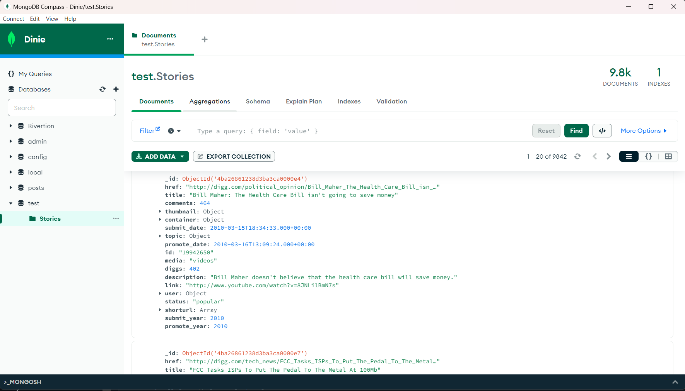
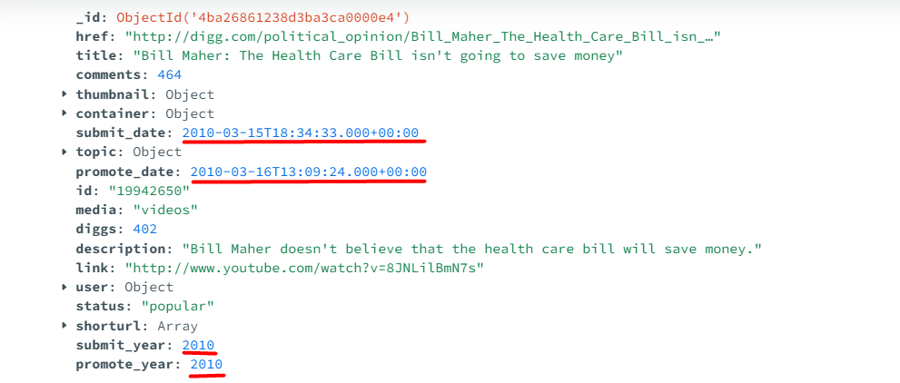
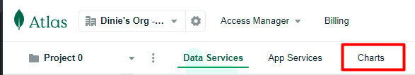
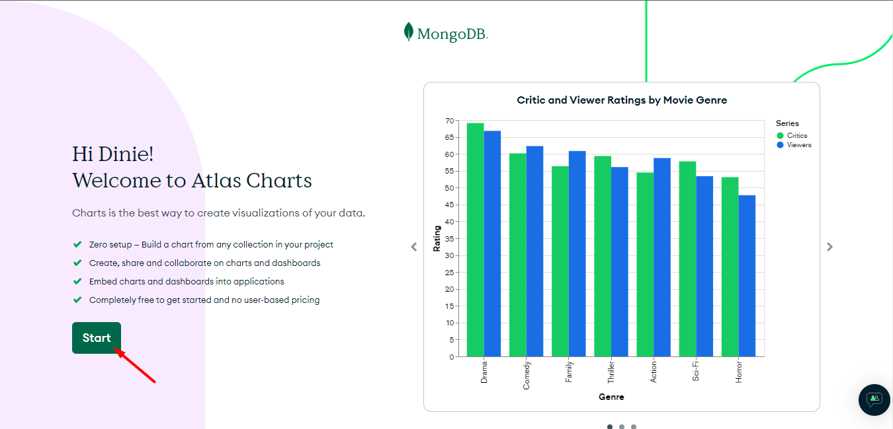
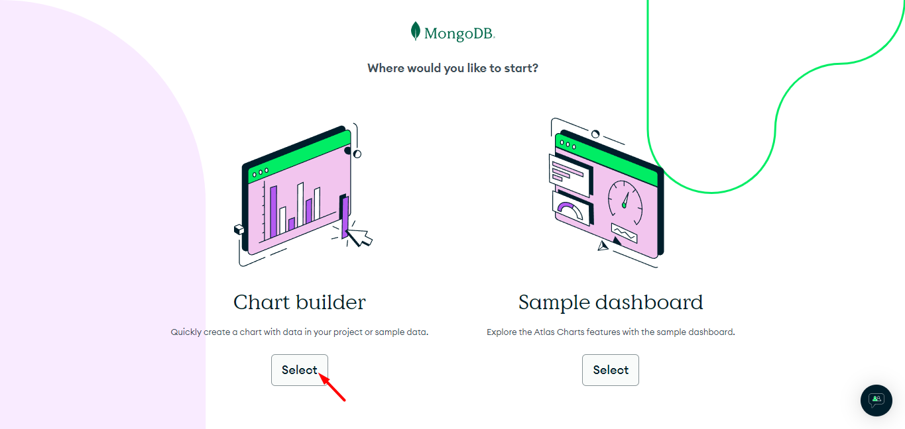
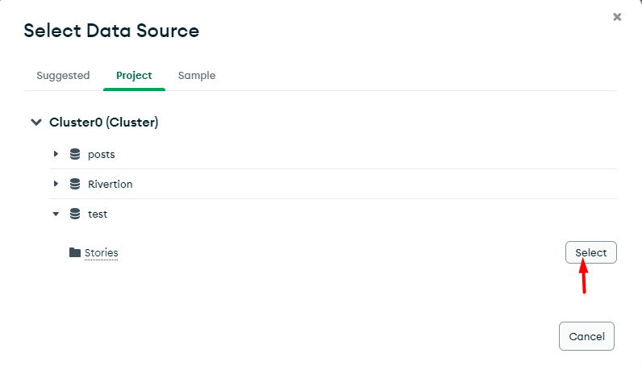
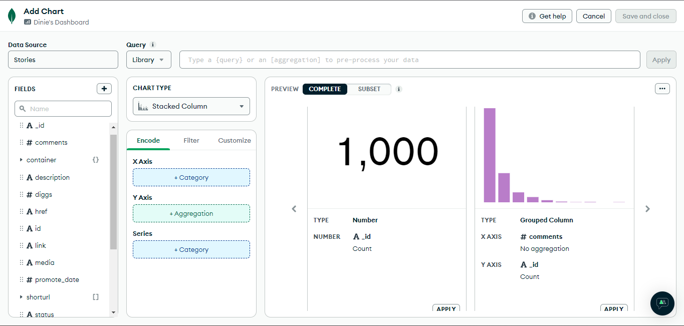

<a href="https://github.com/drshahizan/SECP3843/stargazers"></a>
<a href="https://github.com/drshahizan/SECP3843/network/members"></a>
<a href="https://github.com/drshahizan/SECP3843/pulls"></a>
<a href="https://github.com/drshahizan/SECP3843/issues"></a>
<a href="https://github.com/drshahizan/SECP3843/graphs/contributors"></a>


Don't forget to hit the :star: if you like this repo.

# Special Topic Data Engineering (SECP3843): Alternative Assessment

#### Name: Muhammad Dinie Hazim Bin Azali
#### Matric No.: A20EC0084
#### Dataset: [Stories](https://github.com/drshahizan/dataset/tree/main/mongodb/07-stories)

## Question 5 (a)
In order to optimize the perfomance of a portal when dealing with large volumes of JSON data for dashboard visualizations, we can consider Data Aggregation.

1. Open MongoDB Compass.
   
2. Open your Mongo Shell.
3. In my dataset, my `submit_date` and `promote_date` was in Unix timestamp.
4. In order to change it to format that I want, I run this code below in Mongo Shell.
   ```
      db.Stories.updateMany(
        {},
        [
          {
            $set: {
              submit_date: {
                $toDate: {
                  $multiply: ["$submit_date", 1000]
                }
              },
              promote_date: {
                $toDate: {
                  $multiply: ["$promote_date", 1000]
                }
              }
            }
          },
          {
            $set: {
              submit_year: { $year: "$submit_date" },
              promote_year: { $year: "$promote_date" }
            }
          }
        ]
      );
   ```

5. This is the value of `submit_date` and `promote_date` that I get after run the code.
   
6. The first $set stage converts the submit_date and promote_date fields to date format.
7. The second $set stage extracts the years from the converted dates and assigns them to submit_year and promote_year fields

## Question 5 (b)

#### Import JSON dataset into MongoDB

For this step, can refer my [Question 2(a)](https://github.com/drshahizan/SECP3843/blob/10fa31e68212c6819884e25714778b51d031b2e1/submission/DinieHazim/question%202/question2.md) for better insight.

#### Create Dashboard

1. Login to your MongoDB Atlas account by simply go this [link](https://account.mongodb.com/account/login?signedOut=true)
2. In the navigation bar, click on the button named `Charts`.
   <p align="center">
      
   </p>
3. It will bring you to the Welcome page and simply click on the Start button.
   <p align="center">
      
   </p>
4. Select the Chart Builder to create a chart with your own data.
   <p align="center">
      
   </p>
5. Select your collection.
   <p align="center">
      
   </p>
7. It will bring you to this page so that you can start to drag and drop attributes fields to make a chart.
   <p align="center">
      
   </p>

#### Charts and Dashboard development

## Contribution 🛠️
Please create an [Issue](https://github.com/drshahizan/special-topic-data-engineering/issues) for any improvements, suggestions or errors in the content.

You can also contact me using [Linkedin](https://www.linkedin.com/in/mikhel-adam/) for any other queries or feedback.

[](https://visitorbadge.io/status?path=https%3A%2F%2Fgithub.com%2Fdrshahizan)

