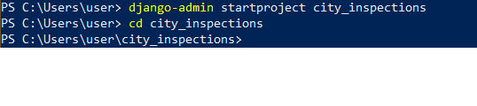
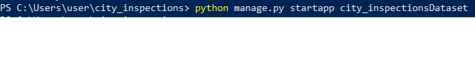
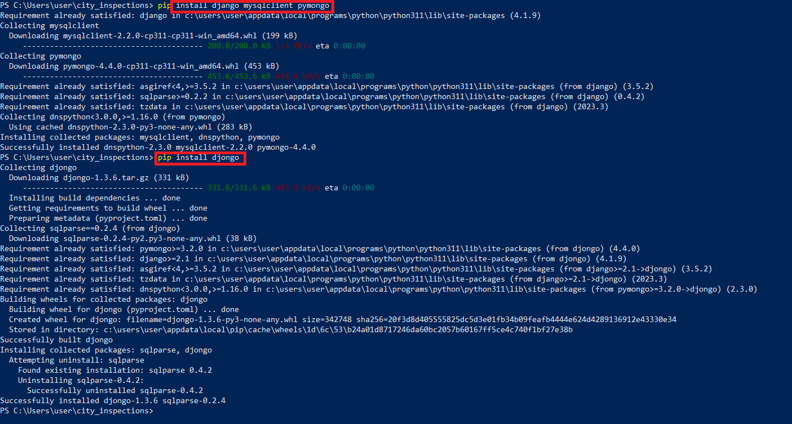
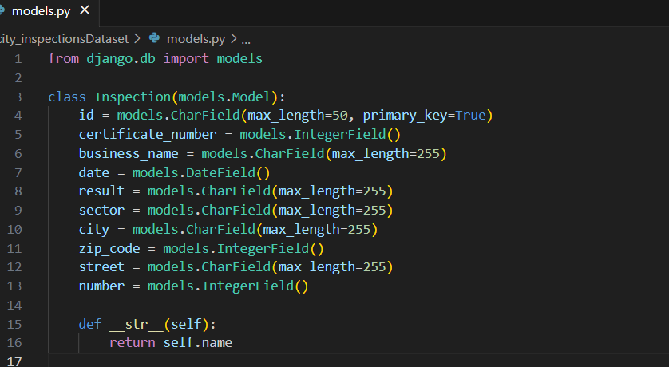

<a href="https://github.com/drshahizan/SECP3843/stargazers"></a>
<a href="https://github.com/drshahizan/SECP3843/network/members"></a>
<a href="https://github.com/drshahizan/SECP3843/pulls"></a>
<a href="https://github.com/drshahizan/SECP3843/issues"></a>
<a href="https://github.com/drshahizan/SECP3843/graphs/contributors"></a>


Don't forget to hit the :star: if you like this repo.

# Special Topic Data Engineering (SECP3843): Alternative Assessment

#### Name: Kelvin Ee
#### Matric No.: A20EC0195
#### Dataset: City Inspection

## Question 1 (a)

As an IT consultant, it is crucial for me to actively participate in overviewing the critical stages and concerns involved in developing a portal that seamlessly integrates various hardware and software applications. Implementing an amount of 5 servers in this project is possible, whereby the servers are used as:

a) Web Server: This server will handle incoming HTTP requests and serve the Django web application. It will run the web server software (such as Apache or Nginx) and the necessary components for Django to operate.

b) Database Server 1 (MySQL): This server will host the MySQL database. It will handle storing and retrieving data from the MySQL database management system. Django will connect to this server to interact with the MySQL database.

c) Database Server 2 (MongoDB): This server will host the MongoDB database. It will handle storing and retrieving data from the MongoDB NoSQL database. Django will connect to this server to interact with the MongoDB database.

d) Load Balancer: If the web server has high traffic expect or want to distribute the load across multiple web servers, implement a load balancer to receive incoming requests and distribute them among the available web servers to ensure efficient handling of traffic.

e) Caching Server:  Introduce a caching server to improve performance and reduce database load. This server will store frequently accessed data in memory, allowing faster retrieval. For example, Redis or Memcached are popular choices for caching servers.

To integrate Django with the JSON dataset and ensure efficient data storage and retrieval from both MySQL and MongoDB databases :

#### 1. Django Installation: 
a. Locate to the project file and create a virtual environment.
```python
py -m venv env
env\Scripts\activate
```
b. Begin by installing Django on all five servers. use the pip package manager to install Django by running the following command:
```pip install Django```


c. Set up Django project: Create a Django project on one of the servers. Use the following command to create a new Django project:
```django-admin startproject city_inspections```
Then redirect to city_inspections using the following commands:
```cd city_inspections```


d. Create Django app: Inside the Django project, create a new app that will handle the integration with the JSON dataset and databases. Use the following command to create a new app:
```python manage.py startapp city_inspectionsDataset```


e. Install necessary packages by using the following command :
```pip install django mysqlclient pymongo``` and ```pip install djongo```


### 2. Configuring Django database settings
   a. Open the Django project's `settings.py` file.
   b. Define the database settings for both MySQL and MongoDB.
``` python
 DATABASES = {
         'default': {
             'ENGINE': 'django.db.backends.mysql',
             'NAME': 'aa',
             'USER': 'root',
             'PASSWORD': '',
             'HOST': 'localhost',
             'PORT': 3306,
         },
         'mongodb': {
             'ENGINE': 'djongo',
             'ENFORCE_SCHEMA': False,
             'NAME': 'AA',
             'CLIENT': {
                 'host': 'localhost:27017',
                 'port': 27017,
                 'username': '',
                 'password': '',
             }
         }
     }
```


### 3. Configuring Django models
 To define Django models that represent the structure and fields of the JSON dataset, open the models.py file in the city_inspectionsDataset app and define the models based on the data dictionary. 
-  In `models.py` file, define the models according to its data structure and data types.

      ```python
      from django.db import models
      
      class Inspection(models.Model):
          id = models.CharField(max_length=50, primary_key=True)
          certificate_number = models.IntegerField()
          business_name = models.CharField(max_length=255)
          date = models.DateField()
          result = models.CharField(max_length=255)
          sector = models.CharField(max_length=255)
          city = models.CharField(max_length=255)
          zip_code = models.IntegerField()
          street = models.CharField(max_length=255)
          number = models.IntegerField()
      
          def __str__(self):
              return self.name
             


### 4. Configuring Django Database Routing
 a. Run the following commands to create the necessary database tables for MySQL and MongoDB `python manage.py makemigrations` and `python manage.py migrate`

b. Load JSON Data into Databases: A Python script has been declared to read the JSON dataset and populate the Django models.
    ```python
class Command(BaseCommand):
    help = 'Load JSON data into Django models'

    def add_arguments(self, parser):
        parser.add_argument('json_file', type=str, help='Path to the JSON file')

    def handle(self, *args, **options):
        json_file = options['json_file']
        with open(json_file, 'r') as file:
            data = json.load(file)

            for item in data:
                # Convert the 'date' field to a datetime object
                date = datetime.strptime(item['date'], "%Y-%m-%d").date()

                inspection = Inspection(
                    id=item['id'],
                    certificate_number=item['certificate_number'],
                    business_name=item['business_name'],
                    date=date,
                    result=item['result'],
                    sector=item['sector'],
                    city=item['city'],
                    zip_code=item['zip_code'],
                    street=item['street'],
                    number=item['number']
                )
                inspection.save()

        self.stdout.write(self.style.SUCCESS('Data loaded successfully.'))
        
Then, run the following command to import JSON file into MySQL and MongoDB database:
`python manage.py load_data city_inspections.json`

## Question 1 (b)
### System Architecture Diagram
Figure below shows the breakdown of the system architecture:

### Detailed explanations for each component, utilizing precise terminology and suggesting acceptable terms:

- **Frontend**:

Web browsers or client applications that interact with the system.
Utilizes HTML, CSS, and JavaScript to render the user interface.
Communicates with the backend to fetch and update data.

- **Backend:**

  - **Django Web Server and MVT (Model-View-Template):**
  Django acts as an agent to process user requests and send responses while interacting with databases and datasets.
    - **Models:** Specify the necessary data structures and relationships required by the application, allowing seamless CRUD operations.
    - **Views:** Handle the logic for processing requests, retrieving data from databases, and rendering templates.
    - **Templates:** Contain the HTML structure and placeholders for dynamic data.

- **Dataset (JSON):**
Location of the dataset is stored. In this AA, the dataset was downloaded to local from github.Provides data to populate dynamic web pages.

- **Databases:**
Handles data storage, retrieval, and management operations.
  - **MySQL:**
    A relational database server used to store structured data.
    Used in this project for user authentication data, including user registration and login.
  - **MongoDB:**
    A NoSQL database server used to store JSON data.
    Used in this project to store the JSON dataset (Stories dataset).

- **External Libraries for Database Integration:**

  - **ORM (Object-Relational Mapping):**
    Django's ORM provides an abstraction layer to interact with MySQL using Python classes and methods, simplifying database operations.
  - **Djongo:**
    Enables integration between Django models and MongoDB collections, allowing interaction with MongoDB.


## Contribution 🛠️
Please create an [Issue](https://github.com/drshahizan/special-topic-data-engineering/issues) for any improvements, suggestions or errors in the content.

You can also contact me using [Linkedin](https://www.linkedin.com/in/drshahizan/) for any other queries or feedback.

[](https://visitorbadge.io/status?path=https%3A%2F%2Fgithub.com%2Fdrshahizan)


