<a href="https://github.com/drshahizan/SECP3843/stargazers"></a>
<a href="https://github.com/drshahizan/SECP3843/network/members"></a>
<a href="https://github.com/drshahizan/SECP3843/pulls"></a>
<a href="https://github.com/drshahizan/SECP3843/issues"></a>
<a href="https://github.com/drshahizan/SECP3843/graphs/contributors"></a>


Don't forget to hit the :star: if you like this repo.

# Special Topic Data Engineering (SECP3843): Alternative Assessment

#### Name: Kelvin Ee
#### Matric No.: A20EC0195
#### Dataset: City Inspection

## Question 2 (a)

### Prerequisites
To carry out the tasks of this question, it it crucial to do the following:
1. Install [MongoDB Community Server](https://www.mongodb.com/try/download/community)
2. Install [MongoDB Shell](https://www.mongodb.com/try/download/shell)
3. Install [MongoDB Database Tools](https://www.mongodb.com/try/download/database-tools)
4. Edit paths in the system environment variables. Include the MongoDB and Mongosh folder directory
<br></br>

### 1. Download JSON file provided in dataset repository
After completing the prerequisite task, Go to Github and click the download button to download the [City Inspections](https://github.com/drshahizan/dataset/tree/main/mongodb/08-city_inspections) dataset into the device.
 It is found that the tweets.json file is not formatted correctly as a JSON array. Therefore, python will be used to perform data preparation by adding brackets at the beginning and end of the file. Each individual tweet object should be enclosed within square brackets '[ ]' and separated by commas ','. <br>
 ```Data Preparation```: <a href="./files/code/Data_Cleaning.ipynb">Data_Cleaning.ipynb</a> <br>
```Modified dataset```: <a href="./files/code/modified_city_inspections.json">modified_city_inspections.json</a>

### 2. Launch MongoDB server
Open Command Prompt and type `"mongod"` to start the MongoDB server.
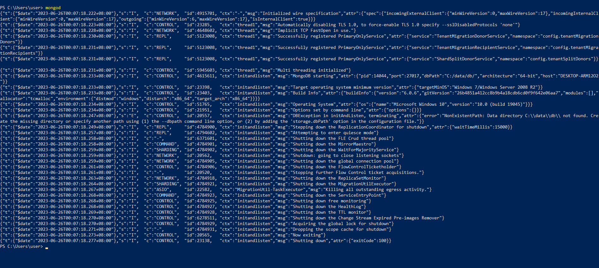</img>

### 3. Access MongoDB shell
In the terminal, type `mongosh` to access MongoDB shell.
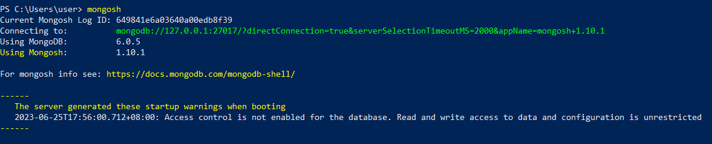</img>


### 4. Import Dataset into Mongodb
In the terminal, type `mongoimport -d AA -collection "City Inspection" --file "C:\Users\user\Downloads\city_inspections.json" --jsonArray`
 to import the dataset into MongoDB. 
 The database and collection are automatically created as -d AA specifies the name of the database on which to run the mongoimport and -collection "City Inspection" specifies the collection to import.

### 5. View Dataset in Mongodb Compass
Once the dataset is imported, To see all available databases, type `show dbs`.<br>
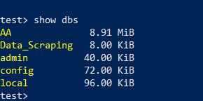</img>

Besides, it could be viewed in MongoDB Compass.
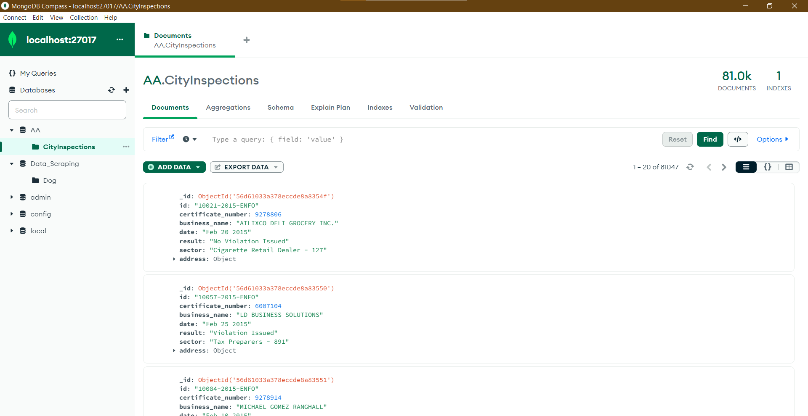</img>

## Question 2 (b)
In the MongoDB compass terminal (Mongosh) or Window Power Shell, type `use AA` to switch to the database named AA.<br>
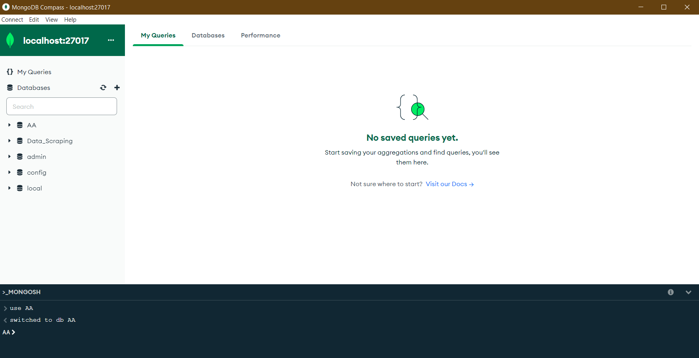</img>

### i. Create Query
The db.collection.insertOne() method in MongoDB inserts a single document into a collection. If the inserted document does not explicitly specify an _id field, MongoDB automatically adds the _id field with an ObjectId value to uniquely identify the new document.

To insert a new document into the AA.CityInspection collection:
```
db.CityInspections.insertOne(
    {
        id: "10001-2012-ENFO",
        certificate_number: 2108520,
        business_name: "Penang Laksa",
        date: "Jun 25 2023",
        result: "No Violation Issued",
        sector: "Mobile Food Vendor - 881",
        address: ["Bukit Mertajam", 14000, "JLN Song Bang Kheang", 8]
    }
)
```
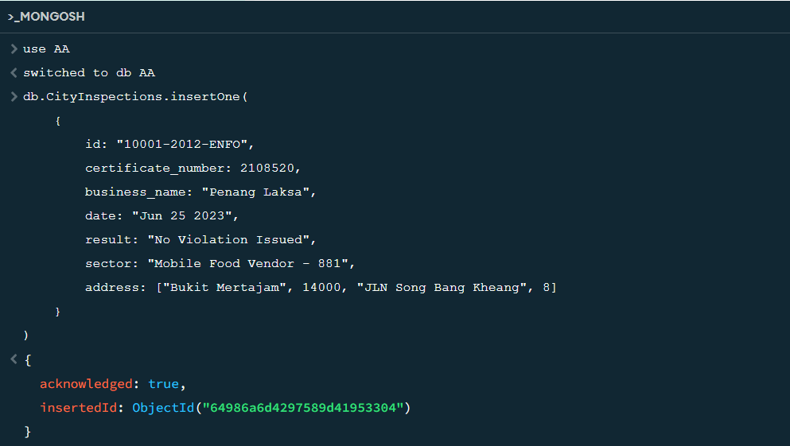</img>

The newly created document can be found in the database:
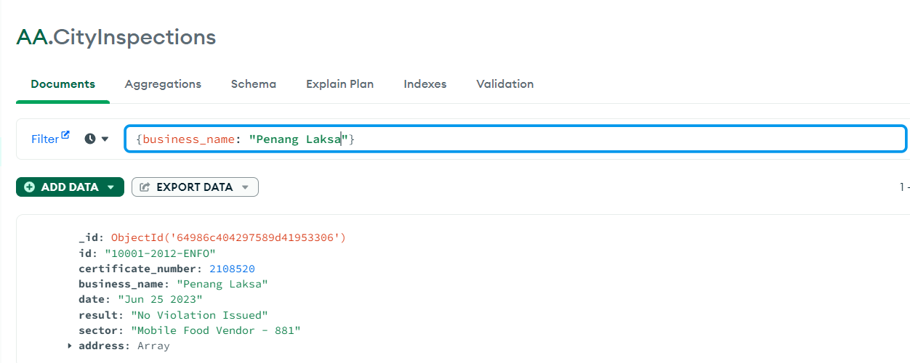</img>

### ii. Read
The db.collection.find() method in MongoDB is used to read documents from a collection. By specifying a query filter document, you can select documents that match certain conditions.

In the case of retrieving all inspections where the id field equals "10057-2015-ENFO" from the City collection, the following query can be used:
```
db.CityInspections.find( { id: "10057-2015-ENFO" } )
```
This query instructs MongoDB to find all documents in the City collection where the value of the id field is equal to "10057-2015-ENFO".
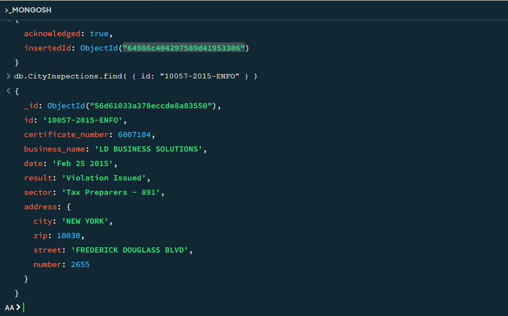</img>

### iii. Update 
#### Update Query 1:
To update the result of an inspection with the id "10021-2015-ENFO" in the CityInspections collection to "Violation Issued", you can use the following update query:
```
db.CityInspections.updateOne(
  { id: "10021-2015-ENFO" },
  { $set: { result: "Violation Issued" } }
)
```
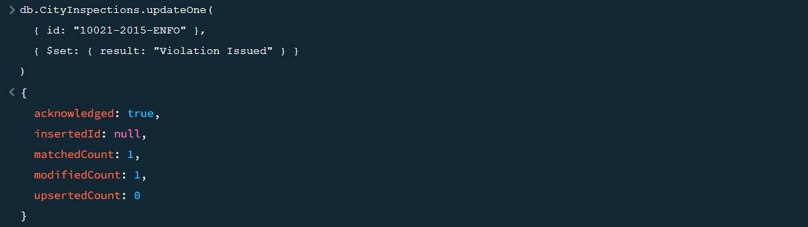</img>
This query uses the updateOne() method to update a single document that matches the specified filter. The $set operator is used to set the value of the result field to "Violation Issued" for the matched document.

#### Update Query 2:
The provided query is correct. It updates the "business_name" field to "Akmal Bus" in the "City" collection for all documents where the "business_name" is empty and the "sector" is "Sightseeing Bus - 078".

Executing the query using the MongoDB shell will update the matching documents accordingly.

Here's an example screenshot showing the result of executing the db.City.updateMany() query in the MongoDB shell:

```
db.CityInspections.updateMany(
  { business_name: "", sector: "Sightseeing Bus - 078" },
  { $set: { business_name: "Akmal Bus" } }
)
```
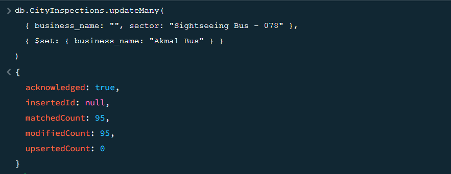</img>

Now, we check for the null value in sector: `"Sightseeing Bus - 078"`
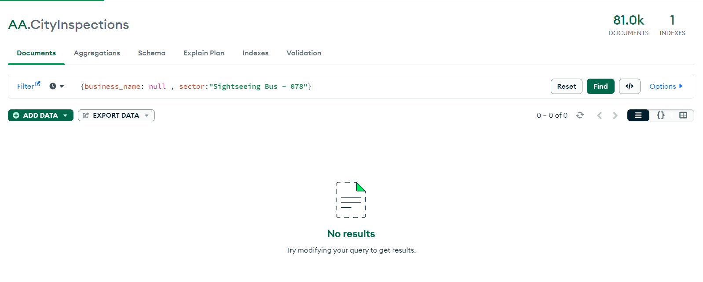</img>
There are no null value for sector: `"Sightseeing Bus - 078"`

### iv. Delete
`db.collection.deleteOne()` method deletes the first document that matches a specified filter.

To delete the first document in the AA.CityInspections collection where result equals "Fail":
```
db.CityInspections.deleteOne( { result: "Fail" } )
```
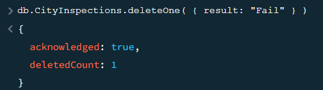</img>

The result count has successfully decreased by 1.

## Contribution 🛠️
Please create an [Issue](https://github.com/drshahizan/special-topic-data-engineering/issues) for any improvements, suggestions or errors in the content.

You can also contact me using [Linkedin](https://www.linkedin.com/in/drshahizan/) for any other queries or feedback.

[](https://visitorbadge.io/status?path=https%3A%2F%2Fgithub.com%2Fdrshahizan)


