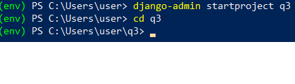
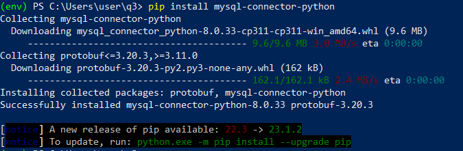
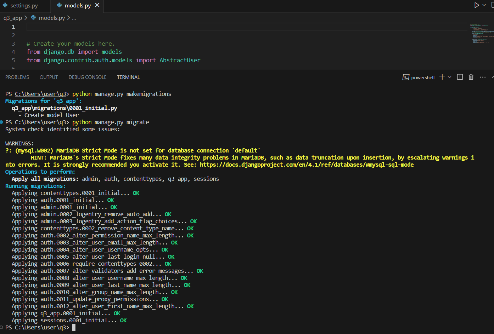
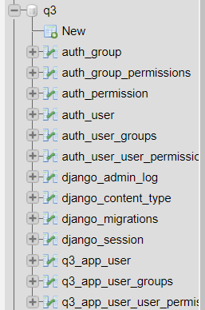

<a href="https://github.com/drshahizan/SECP3843/stargazers"></a>
<a href="https://github.com/drshahizan/SECP3843/network/members"></a>
<a href="https://github.com/drshahizan/SECP3843/pulls"></a>
<a href="https://github.com/drshahizan/SECP3843/issues"></a>
<a href="https://github.com/drshahizan/SECP3843/graphs/contributors"></a>


Don't forget to hit the :star: if you like this repo.

# Special Topic Data Engineering (SECP3843): Alternative Assessment

#### Name: Kelvin Ee
#### Matric No.: A20EC0195
#### Dataset: City Inspection

## Question 3 (a)

### 1. To install and set up Django, follow these steps:

a. Create Virtual Environment
```
virtualenv env
```

Once you have created the virtual environment, you can activate it by running the following command.
```
env\Scripts\activate
```

b. Run the command `pip install Django` to install Django using pip, the Python package manager. Make sure you have Python and pip installed on your system.

c. After the installation is complete, you can create a new Django project by running the following command:   
```python
django-admin startproject q3
```
This command will create a new Django project with the name "q3". You can replace "q3" with your desired project name.

d.Once the project is created, navigate to the project folder using the cd command. In this case, run:


### 2. MySQL setup

a. To set up MySQL for your Django project, follow these steps:

Install the MySQL connector for Python by running the command `pip install mysql-connector-python`. This package allows Django to communicate with the MySQL database.



b. After the installation is complete, create a new database named q3 in phpMyAdmin. This will be the database where the Django project will store its data.

c. Open the `settings.py` file in  Django project and locate the DATABASES configuration. Modify it to match the following configuration:

```python 
DATABASES = {
    'default': {
        'ENGINE': 'django.db.backends.mysql',
        'NAME': 'q3',
        'USER': 'root',
        'PASSWORD': '',
        'HOST': 'localhost',
        'PORT': '3306',
    }
}
```

### 3. Create a Django app

a. Open the command prompt and navigate to the root directory of  Django project. Then run the following command:
```bash
python manage.py startapp q3_app
```
This will create a new Django app named q3_app within the project directory. The app will have a basic structure and files.

b. Open the settings.py file in the Django project and locate the INSTALLED_APPS configuration. Add 'q3_app' to the list of installed apps as shown below:
```kotlin
INSTALLED_APPS = [
    'django.contrib.admin',
    'django.contrib.auth',
    'django.contrib.contenttypes',
    'django.contrib.sessions',
    'django.contrib.messages',
    'django.contrib.staticfiles',
    'q3_app',
]
```
By adding 'q3_app' to the INSTALLED_APPS,  the q3_app Django app are registered to be used in your project.


### 4. Define the User model

a. Open the models.py file in the q3_app directory and add the following code:

```ruby
from django.db import models
from django.contrib.auth.models import AbstractUser

class User(AbstractUser):
    USER_TYPES = (
        ('customer', 'Customer'),
        ('technical_worker', 'Technical Worker'),
        ('senior_management', 'Senior Management'),
    )
    user_type = models.CharField(max_length=20, choices=USER_TYPES)
    # Add any additional fields you need for each user type

    groups = models.ManyToManyField(
        'auth.Group',
        related_name='custom_user_set',
        blank=True,
        help_text='The groups this user belongs to. A user will get all permissions granted to each of their groups.',
        verbose_name='groups',
    )

    user_permissions = models.ManyToManyField(
        'auth.Permission',
        related_name='custom_user_set',
        blank=True,
        help_text='Specific permissions for this user.',
        verbose_name='user permissions',
    )
```
b. To apply the model changes to the database, run the following commands in the command prompt:

```bash
python manage.py makemigrations
python manage.py migrate
```




After running the migrations, the User model will be created in the database with the defined fields and relationships.

### 5. Create registrations views and templates

a. Create a new file called `forms.py` in your q3_app directory. Add the following code to define the UserRegistrationForm:

```python
from django import forms
from .models import User

class UserRegistrationForm(forms.ModelForm):
    password = forms.CharField(widget=forms.PasswordInput)
    user_type = forms.ChoiceField(choices=User.USER_TYPES)

    class Meta:
        model = User
        fields = ['username', 'password', 'email', 'first_name', 'last_name', 'user_type']
```

b. Open app's views.py file and add the following code to create a view function for user registration:

```python
from django.shortcuts import render, redirect
from .forms import UserRegistrationForm

def user_registration(request):
    if request.method == 'POST':
        form = UserRegistrationForm(request.POST)
        if form.is_valid():
            user = form.save(commit=False)
            user.set_password(form.cleaned_data['password'])
            user.save()
            return redirect('login')  # Replace 'login' with the URL name of your login page
    else:
        form = UserRegistrationForm()
    return render(request, 'user_registration.html', {'form': form})
```
c. Create new direcotry and file:

```kotlin
q3_app/
├── __init__.py
├── admin.py
├── apps.py
├── forms.py
├── models.py
├── tests.py
├── urls.py
├── views.py
└── templates/
    └── registration/  <--- New directory
        └── user_registration.html  <--- New file
```

d.  Inside the registration directory, create a file named user_registration.html with the following content:

```html
<form method="post">
  
  {{ form.as_p }}
  <button type="submit">Register</button>
</form>
```
e. In your settings.py file, update the TEMPLATES setting to include the directory where the user_registration.html template is located. Add the following paths to the DIRS list:

```rust
TEMPLATES = [
    {
        'BACKEND': 'django.template.backends.django.DjangoTemplates',
        'DIRS': [
            os.path.join(BASE_DIR, 'q3_app/templates/registrations'),
            os.path.join(BASE_DIR, 'q3_app/templates/'),
        ],
        'APP_DIRS': True,
        'OPTIONS': {
            'context_processors': [
                'django.template.context_processors.debug',
                'django.template.context_processors.request',
                'django.contrib.auth.context_processors.auth',
                'django.contrib.messages.context_processors.messages',
            ],
        },
    },
]
```

### 6. Create login views and templates

a.  Inside  forms.py file, add a new class called LoginForm to handle the login form:
```python 
class LoginForm(forms.Form):
    username = forms.CharField(label='username')
    password = forms.CharField(label='password', widget=forms.PasswordInput)
```
The LoginForm class defines two fields, username and password, which will be displayed in the login form.

b. In views.py file, add the following code to handle the login view:

```python 
def login_view(request):
    if request.method == 'POST':
        username = request.POST.get('username')
        password = request.POST.get('password')
        user = authenticate(request, username=username, password=password)

        if user is not None:
            login(request, user)
            print(f"Logged in as {username}")
            print(f"User type: {user.user_type}")
            
            if user.user_type == 'customer':
                print("Redirecting to customer dashboard")
                return redirect('customer_dashboard')
            elif user.user_type == 'technical_worker':
                print("Redirecting to technical worker dashboard")
                return redirect('technical_worker_dashboard')
            elif user.user_type == 'senior_management':
                print("Redirecting to management dashboard")
                return redirect('management_dashboard')
        else:
            messages.error(request, 'Invalid username or password.')
    
    return render(request, 'login.html')

  def customer_dashboard_view(request):
    return render(request, 'customer_dashboard.html')

  def technical_worker_dashboard_view(request):
        return render(request, 'technical_worker_dashboard.html')
    
  def management_dashboard_view(request):
        return render(request, 'management_dashboard.html')
```

c. Create the login template login.html with the following content:

```html
<div style="background-color: rgb(86, 86, 175); padding: 20px;">
    <div style="max-width: 400px; margin: 0 auto; background-color: white; padding: 20px;">
        <h1 style="text-align: center; font-family: 'Comic Sans MS', cursive; color: navy;">Login</h1>

        <form method="POST" action="">
            

            <div style="margin-bottom: 10px;">
                <label for="id_username">Username:</label>
                <input type="text" id="id_username" name="username" class="form-control">
            </div>

            <div style="margin-bottom: 10px;">
                <label for="id_password">Password:</label>
                <input type="password" id="id_password" name="password" class="form-control">
            </div>

            <div style="text-align: center;">
                <button type="submit" class="btn btn-primary">Login</button>
            </div>

            
            <div style="text-align: center; color: red; margin-top: 10px;">
                
                <p>{{ message }}</p>
                
            </div>
            
        </form>

        <p style="text-align: center; font-family: 'Comic Sans MS', cursive; color: navy;">
            Don't have an account? <a href="">Register</a>
        </p>
    </div>
</div>

```

d. Create three dashboard templates for each user type: customer_dashboard.html, technical_worker_dashboard.html, and management_dashboard.html. These templates  contain the HTML code specific to each user type's dashboard.

`customer_dashboard.html`
`management_dashboard.html`
`technical_worker_dashboard.html`

### 7. Path setting and run the App

a. Open the urls.py file in your Django project. This file is usually located in the main project directory. Import the views you need to map to the URL paths.

```python
from django.contrib import admin
from django.urls import path, include
from q3_app.views import user_registration, login_view, customer_dashboard_view, technical_worker_dashboard_view, management_dashboard_view

urlpatterns = [
    path('customer_dashboard/', customer_dashboard_view, name='customer_dashboard'),
    path('technical_worker_dashboard/', technical_worker_dashboard_view, name='technical_worker_dashboard'),
    path('management_dashboard/', management_dashboard_view, name='management_dashboard'),
    path('', login_view, name='home'),
    path('login/', login_view, name='login'),
    path('admin/', admin.site.urls),
    path('register/', user_registration, name='user_registration'),
]

```

b. Run the following command to start the Django development server: `python manage.py runserver`

   

## Question 3 (b)
Lorem ipsum dolor sit amet, consectetur adipisicing elit, sed do eiusmod tempor incididunt ut labore et dolore magna aliqua. Ut enim ad minim veniam, quis nostrud exercitation ullamco laboris nisi ut aliquip ex ea commodo consequat. Duis aute irure dolor in reprehenderit in voluptate velit esse cillum dolore eu fugiat nulla pariatur. Excepteur sint occaecat cupidatat non proident, sunt in culpa qui officia deserunt mollit anim id est laborum.

## Contribution 🛠️
Please create an [Issue](https://github.com/drshahizan/special-topic-data-engineering/issues) for any improvements, suggestions or errors in the content.

You can also contact me using [Linkedin](https://www.linkedin.com/in/drshahizan/) for any other queries or feedback.

[](https://visitorbadge.io/status?path=https%3A%2F%2Fgithub.com%2Fdrshahizan)


