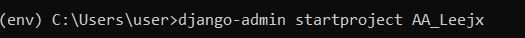
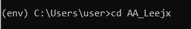
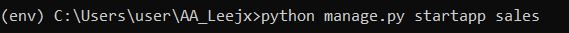
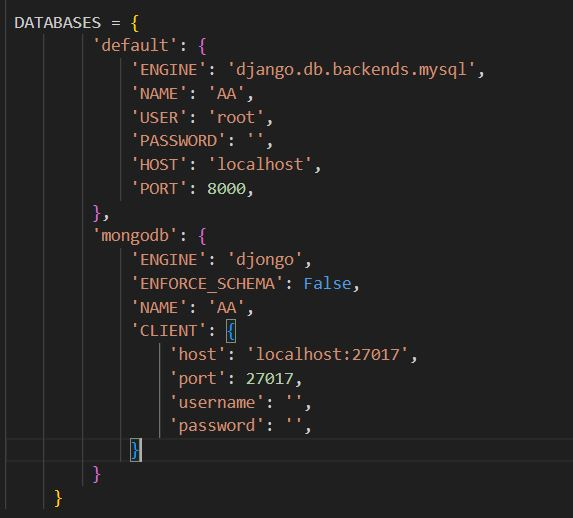
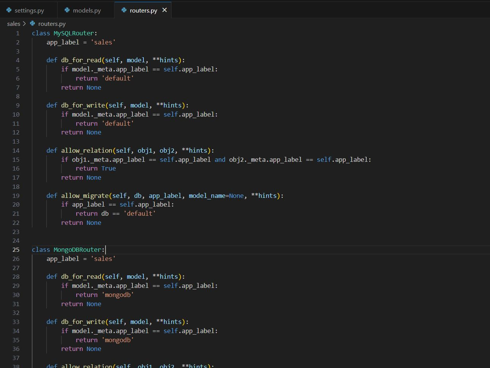

<a href="https://github.com/drshahizan/SECP3843/stargazers"></a>
<a href="https://github.com/drshahizan/SECP3843/network/members"></a>
<a href="https://github.com/drshahizan/SECP3843/pulls"></a>
<a href="https://github.com/drshahizan/SECP3843/issues"></a>
<a href="https://github.com/drshahizan/SECP3843/graphs/contributors"></a>


Don't forget to hit the :star: if you like this repo.

# Special Topic Data Engineering (SECP3843): Alternative Assessment

#### Name: Lee Jia Xian  
#### Matric No.: A20EC0200
#### Dataset: <a href="https://github.com/drshahizan/dataset/tree/main/mongodb/01-sales" >Supply Store Dataset</a>

## Question 1 (a)

  To successfully integrate Django with the JSON dataset and ensure efficient data storage and retrieval from both MySQL and MongoDB databases, a configuration utilizing five servers is required. These servers work together to facilitate seamless integration and enable the creation of dynamic web pages for the portal. In this guide, we will provide a comprehensive explanation of the necessary steps to implement this configuration. We will explore the roles of each server involved, including the web server, Django application server, MySQL database server, MongoDB database server, and the JSON dataset server. By understanding the functionality of each server and their interactions, the technical staff will be equipped to successfully implement the integration and optimize the data management processes.

1. <b>Web Server</b>:
The web server is responsible for serving the Django web application to clients. It handles incoming HTTP requests, interacts with the Django application, and sends back the appropriate HTTP responses. Common web servers used with Django include Apache HTTP Server and Nginx.

2. <b>Django Application Server</b>:
The Django application server runs the Django web application. It executes the Python code, handles URL routing, processes requests, and generates responses. Popular choices for Django application servers are Gunicorn and uWSGI.

3. <b>MySQL Database Server</b>:
The MySQL database server is responsible for storing and managing the user registration and login data. It provides a relational database management system for storing structured data. The server handles SQL queries, manages transactions, and ensures data integrity. Examples of MySQL server options are MySQL Server (Community Edition) and MariaDB.

4. <b>MongoDB Database Server</b>:
The MongoDB database server is used to store and manage the sales data from the JSON dataset. It provides a NoSQL database management system that stores data in a flexible, JSON-like format called BSON. MongoDB is designed for handling large amounts of unstructured or semi-structured data efficiently.

5. <b>JSON Dataset Server</b>:
The JSON dataset server stores the JSON dataset that will be integrated with Django. This server could be a separate file server or a service that provides access to the JSON data. The JSON dataset server may handle requests for retrieving specific JSON data or provide a mechanism to access the entire dataset.


#### To integrate Django with the JSON dataset and ensure efficient data storage and retrieval from both MySQL and MongoDB databases, follow these are comprehensive steps:
### 1. Install Django and required packages:
  a) Before the installation, we have to  create and activate a virtual environment in Python.
  
    ```
    py -m venv env
    env\Scripts\activate
    ```

  b) Begin by installing Django using pip, the Python package installer. Run the command: `pip install Django`.
  </img>

  c) Additionally, install the necessary packages for MySQL and MongoDB connectivity: `pip install mysql-connector-python djongo pymongo`.
  </img>
### 2. Create Django project and app:
  a) Create a new Django project using the command: `django-admin startproject AA_Leejx`.
    </img>
  b) Then redirect to the created project (AA_Leejx) using the following commands: `cd AA_leejx`.
    </img>
  c) Create a new Django app within the project using: `python manage.py startapp appname`.
     </img>
### 3. Configure the Django database settings:
  a) In the project's settings.py file, locate the DATABASES section.
  b) Configure the MySQL database settings, including the database name, user, password, host, and port.
  c) Configure the MongoDB database settings, including the connection URL, database name, and authentication credentials.
 </img>

### 4. Define Django models:
  a) In the app's models.py file, define the models that will represent the data from the JSON dataset.
  b) Map the fields in the JSON dataset to the corresponding fields in the Django models.
  c) Use Django's model fields and relationships to define the structure of data.
 </img>

### 5. Set up databases routers:
  a) Create a database router to route specific models to their respective databases.
  b) In this case, the MySQLRouter class is responsible for routing models related to user registration and login to the MySQL database. Meanwhile, the MongoDBRouter class is responsible for routing the sales-related models to the MongoDB database.

  ```
class MySQLRouter:
    app_label = 'your_app_label'

    def db_for_read(self, model, **hints):
        if model._meta.app_label == self.app_label:
            return 'default'
        return None

    def db_for_write(self, model, **hints):
        if model._meta.app_label == self.app_label:
            return 'default'
        return None

    def allow_relation(self, obj1, obj2, **hints):
        if obj1._meta.app_label == self.app_label and obj2._meta.app_label == self.app_label:
            return True
        return None

    def allow_migrate(self, db, app_label, model_name=None, **hints):
        if app_label == self.app_label:
            return db == 'default'
        return None


class MongoDBRouter:
    app_label = 'your_app_label'

    def db_for_read(self, model, **hints):
        if model._meta.app_label == self.app_label:
            return 'mongodb'
        return None

    def db_for_write(self, model, **hints):
        if model._meta.app_label == self.app_label:
            return 'mongodb'
        return None

    def allow_relation(self, obj1, obj2, **hints):
        if obj1._meta.app_label == self.app_label and obj2._meta.app_label == self.app_label:
            return True
        return None

    def allow_migrate(self, db, app_label, model_name=None, **hints):
        if app_label == self.app_label:
            return db == 'mongodb'
        return None

```
</img>
  ### 6. Create database tables:
    a) 


## Question 1 (b)
</img>

- ###  User
  - The User component represents the end-user or client who interacts with the web application.
  - Users access the application through a web browser and initiate requests by interacting with the user interface.

- ### Web Server
  - The Web Server component receives HTTP requests from users and forwards them to the appropriate URL within the Django application.
  - It handles the communication between the user's web browser and the application.
 
- ### Django Web Application
   In this project, Django will be as the framework for the web application.Django is a high-level web framework written in Python that follows 
   <b>MVT</b> architectural pattern, although it refers to the components as Models, Views, and Templates. It provides a comprehensive set of tools and libraries for building web applications efficiently and securely.
  - Model :
    - The Model component in Django defines the data structure and provides an interface to interact with the database.
    - It represents the logical structure of the data and includes fields and relationships between different entities.
    - In this case, the Model interacts with the MongoDB database to store and retrieve data represented in JSON format and also intracts with MySQL to manage the user registration and login.
  - Views :
    - The Views component contains the business logic of the application.
    - It processes the HTTP requests received from the Web Server, interacts with the Models and Databases, and prepares the appropriate response.
    - Views can perform actions such as retrieving data from the Models, modifying data, and rendering templates for the user interface.
  - Template
    - The Template component is responsible for rendering the user interface and generating dynamic web pages.
    - It defines the HTML structure and includes placeholders for dynamic content to be populated by Views.
    - Templates are rendered by Views and combined with data to produce the final output that is sent back to the user's browser.

- ### Database
  - MongoDB:
    - MongoDB is a NoSQL document database.
    - In this architecture, MongoDB is used as the database for storing data represented in JSON format.
    - The Model component interacts with the MongoDB database to perform CRUD operations (Create, Read, Update, Delete).
  - MySQL:
    - MySQL is a relational database management system.
    - The MySQL database is used specifically for user authentication in this architecture.
    - It stores user-related information, such as usernames, passwords, and other authentication details.
    - The user authentication functionality is handled separately from the main data storage in MongoDB.
- ### JSON Dataset (Supply Store Dataset)
   - The JSON dataset contains information about sales transactions, including items purchased, customer details, store location, coupon usage, and purchase method.
   - The dataset serves as the source of data for the portal's visualization and analysis features.
 
- ### Libraries user
   - Object-Relational Mapping (ORM):
       - Django's ORM is primarily designed to work with relational databases such as MySQL, PostgreSQL, and SQLite.
       - In this case, we use Django's ORM to interact with the MySQL database for user authentication.
       - Django's ORM provides an object-oriented interface to define models, query the database, and perform CRUD operations.
   - Djongo:
       - Djongo is a package that allows Django to integrate with MongoDB, a NoSQL database.
       - In this case, we use Djongo to interact with MongoDB for storing and retrieving JSON data.
       - Djongo translates Django's ORM queries and operations into MongoDB-specific queries, allowing us to utilize Django's ORM syntax and features with MongoDB.
     
  

    
 


## Contribution 🛠️
Please create an [Issue](https://github.com/drshahizan/special-topic-data-engineering/issues) for any improvements, suggestions or errors in the content.

You can also contact me using [Linkedin](https://www.linkedin.com/in/drshahizan/) for any other queries or feedback.

[](https://visitorbadge.io/status?path=https%3A%2F%2Fgithub.com%2Fdrshahizan)


