<a href="https://github.com/drshahizan/SECP3843/stargazers"></a>
<a href="https://github.com/drshahizan/SECP3843/network/members"></a>
<a href="https://github.com/drshahizan/SECP3843/pulls"></a>
<a href="https://github.com/drshahizan/SECP3843/issues"></a>
<a href="https://github.com/drshahizan/SECP3843/graphs/contributors"></a>


Don't forget to hit the :star: if you like this repo.

# Special Topic Data Engineering (SECP3843): Alternative Assessment

#### Name: Lee Jia Xian  
#### Matric No.: A20EC0200
#### Dataset: <a href="https://github.com/drshahizan/dataset/tree/main/mongodb/01-sales" >Supply Store Dataset</a>

## Question 2 (a)
### 1. Download & Prepare dataset (JSON File)
Download the dataset: <a href="https://github.com/drshahizan/dataset/tree/main/mongodb/01-sales" >Supply Store Dataset</a>

Preparing the data before importing it into MongoDB involves converting the data into a valid JSON format. MongoDB stores data in a flexible and schema-less format called BSON (Binary JSON), which is a binary representation of JSON-like documents. When importing data into MongoDB, it expects the data to be in a specific format, typically JSON or CSV.

In this case of my modified data (modified_data), wrapping the JSON objects in square brackets [ ] and joining them with commas , creates a valid JSON array. This format allows MongoDB to interpret each element of the array as a separate document when importing it into a collection. <br>
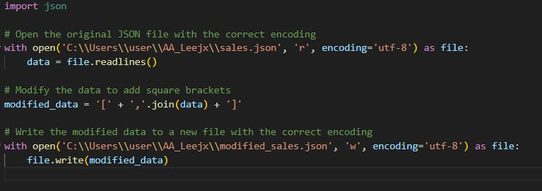</img>

### 2. Start MongoDB server with command Prompt
Open Command Prompt and enter `mongod` to start the MongoDB server.
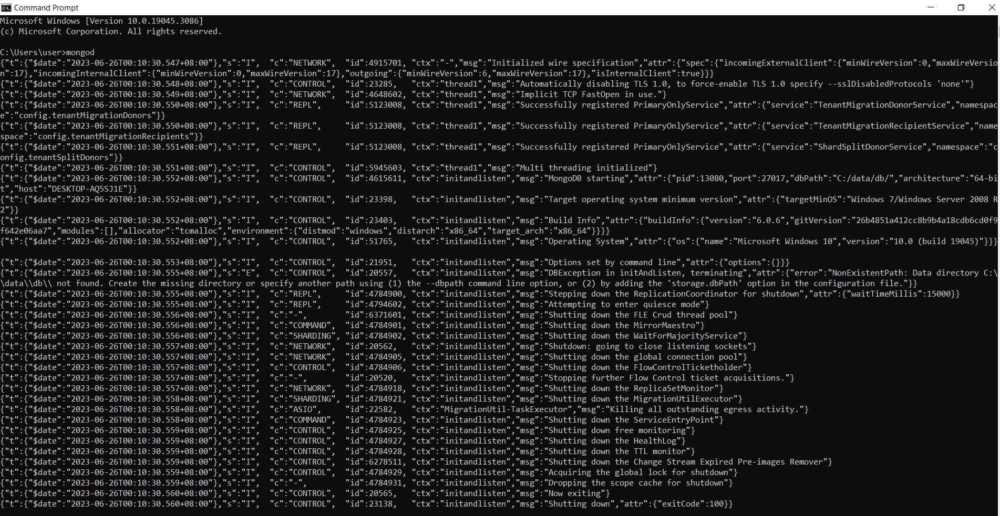</img>

### 3. Import Dataset
In cmd enter `mongoimport "C:\Users\user\OneDrive\Desktop\special topic\AA\dataset\sales.json" -d AA -c Sales`.
The provided command mongoimport is used to import the JSON file sales.json into a MongoDB database named AA and the data will be stored in a collection called Sales.
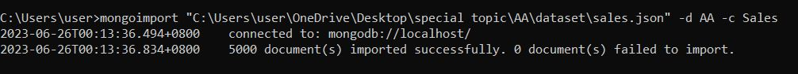</img>

After the dataset is imported, you can find it at the MongoDB Compass:
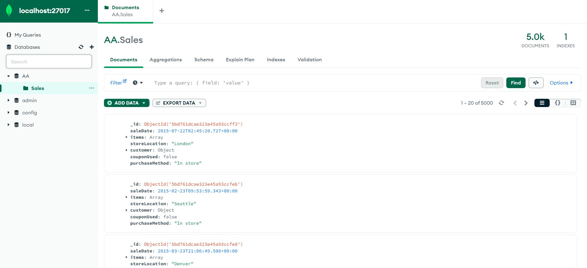</img>

### 4. Accessing the MongoDB shell
Enter `mongosh` in the terminal to access the MongoDB shell
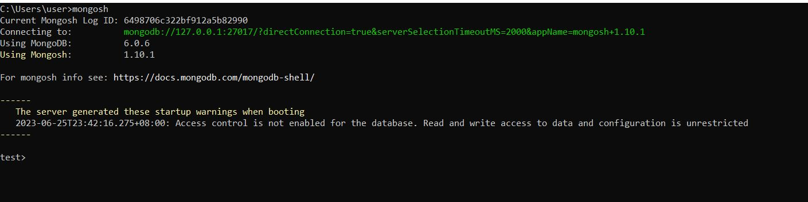</img>

You can return the list of all databases running on MongoDB Server including default and user-defined databases with `show dbs`.
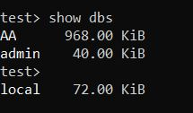</img>

Then enter `use AA` to switch to the desired database where we want.

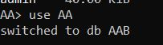</img>

## Question 2 (b)
### i. Create - Insert a new document:
To create a new document, we can use the `insertOne()` method in MongoDB. Here's the example query that I used to insert a new document:
```
db.Sales.insertOne({
  "saleDate": new Date("2023-06-25T10:30:00.000Z"),
  "items": [
    {
      "name": "laptop",
      "tags": [
        "electronics",
        "computers"
      ],
      "price": 999.99,
      "quantity": 1
    },
    {
      "name": "headphones",
      "tags": [
        "electronics",
        "audio"
      ],
      "price": 79.99,
      "quantity": 2
    }
  ],
  "storeLocation": "San Francisco",
  "customer": {
    "gender": "M",
    "age": 35,
    "email": "john@example.com",
    "satisfaction": 4
  },
  "couponUsed": true,
  "purchaseMethod": "Online"
});

```
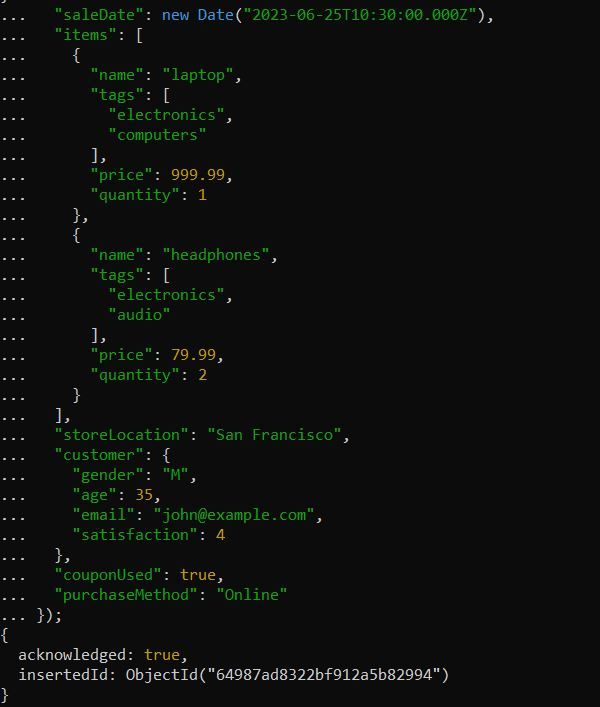</img>

You can found the created document in the mongoDB database:
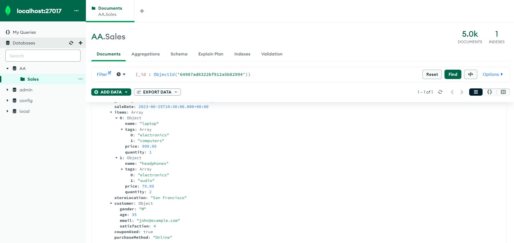</img>

### ii.Read
The db.find() method in MongoDB is used to search for and retrieve documents from a collection based on specified query criteria.
In this case i want to return the document which _id equals "5bd761dcae323e45a93ccff3":

```
db.Sales.find({ "_id": ObjectId("5bd761dcae323e45a93ccff3") })
```
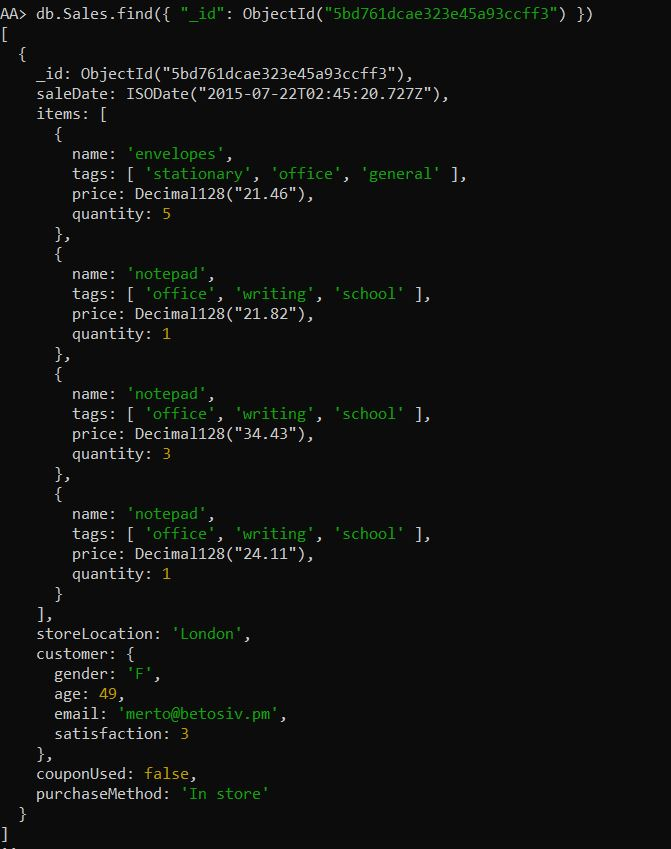</img>

You can find it by using the filter in Mongo DB too
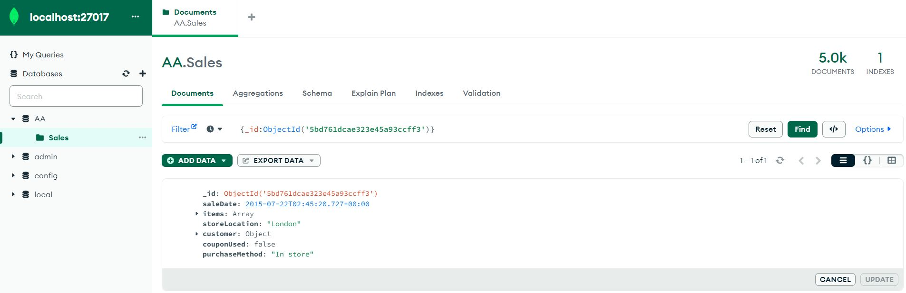</img>

### iii. Update
#### a) updateOne()
The updateOne() function is used to update a single document within a collection by specifying a filter criteria to match the desired document and providing the update operations to be performed on that document. For this case, i want to update the purchase method of the sale document with the _id value "5bd761dcae323e45a93ccfe8" and set it to "In-store".
```
db.Sales.updateOne(
  { _id: ObjectId("5bd761dcae323e45a93ccfe8") }, // Specify the filter criteria to match the document
  { $set: { purchaseMethod: "In-store" } } // Update the purchaseMethod field
);

```
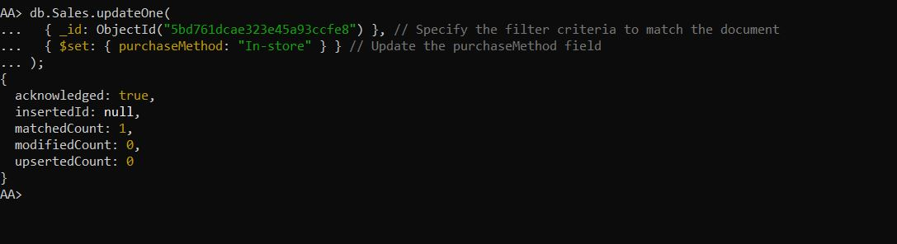</img>

Before update:
</img>

After update:
</img>
We noticed that the purchaseMethod is changed from `Online` to `In-store`

#### b) updateMany()
The `updateMany()` function is used to update multiple documents in a collection based on a specified filter criteria, allowing us to modify existing data in bulk. In this case, updateMany() operation will update all documents in the Sales collection where the purchaseMethod field is from "In store" and set it to "In-store". 
```
db.Sales.updateMany(
  { purchaseMethod: "In store" }, // Filter criteria
  { $set: { purchaseMethod: "In-store" } } // Update operation
);

```
**From below, we can notice that 2819 documents meet the criteria and have been modified..
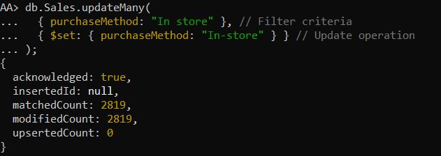</img>


Before updateMany():
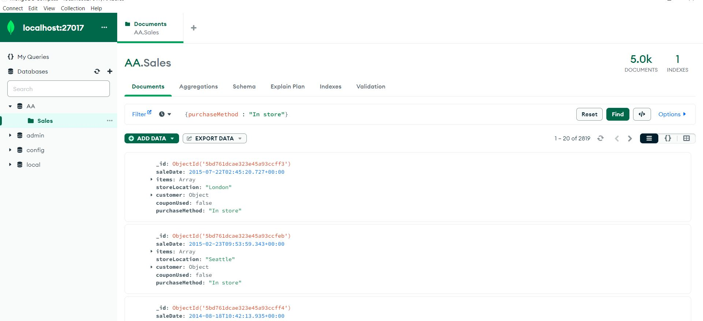</img>

After updateMany():
All the purchaseMethod field with "In store" is changed to "In-store"
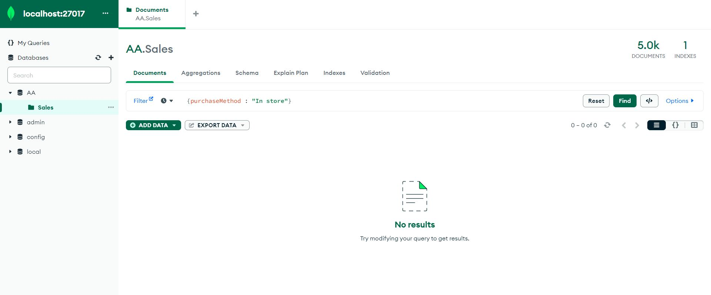</img>
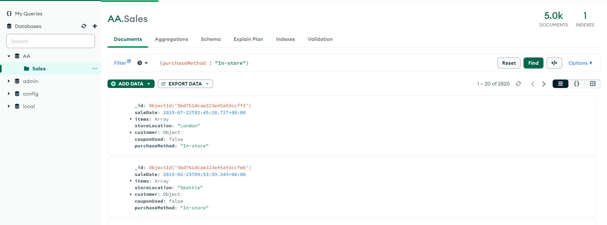</img>

### iv. Delete
deleteOne() is a MongoDB method that allows use to delete a single document from a collection based on a specified filter criterion. It removes <b>the first document</b> that matches the given filter.
In this case, I want to delete a single document from the sales collection where the storeLocation field matches the value "Denver". It will remove the first document that meets the specified criteria.
```
db.Sales.deleteOne({ "storeLocation": "Denver" });
```
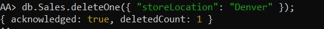</img>

Before delete(total number is 1549):
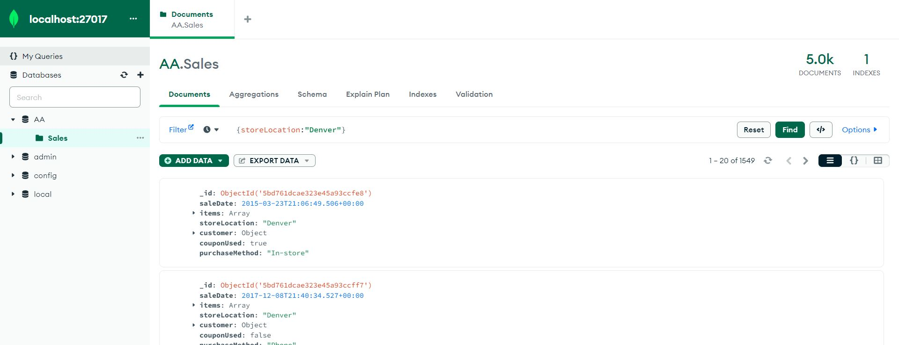</img>

After delete(total number is 1548):
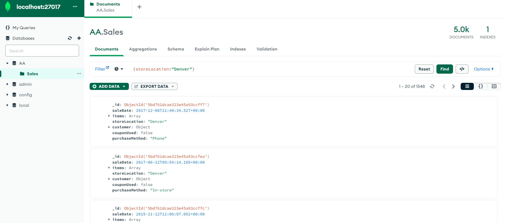</img>


## Contribution 🛠️
Please create an [Issue](https://github.com/drshahizan/special-topic-data-engineering/issues) for any improvements, suggestions or errors in the content.

You can also contact me using [Linkedin](https://www.linkedin.com/in/drshahizan/) for any other queries or feedback.

[](https://visitorbadge.io/status?path=https%3A%2F%2Fgithub.com%2Fdrshahizan)


