

Don't forget to hit the :star: if you like this repo.

# Special Topic Data Engineering (SECP3843): Alternative Assessment

#### Name: Lee Jia Xian
#### Matric No.: A20EC0200
#### Dataset:  <a href="https://github.com/drshahizan/dataset/tree/main/mongodb/01-sales" >Supply Store Dataset</a>

## Question 3 (a)
For this question, I will used the projecy(AA_Leejx) that created in Question 1a).
To create a user registration and login module using Django and MySQL for three types of users (customers, technical workers, and senior management), the steps are:

### 1. Database Setup for User Authentication (MySQL)
  a) In my case, i create a new app within the project(AA_Leejx) for User Authentication purpose:
  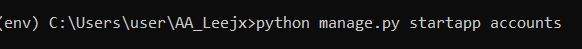</img>

  b) Then define the model for the new created app(user_accounts). From the question, we need to define the user_type field to the User model to distinguish between customer, technical worker, and senior management users. :
  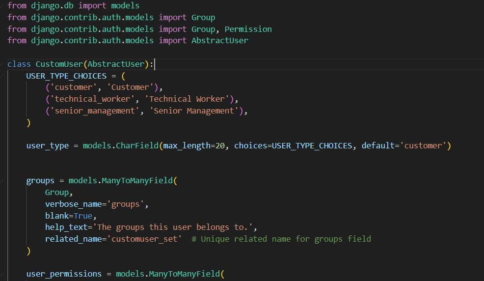</img>

  c) Specify a custom user model for the Django project. For my case:
  
  </img>

### 2. Database Migration
  a) Generate database migrations: Run the command `python manage.py makemigrations` to generate database migration files based on the changes made to the User model.
  
   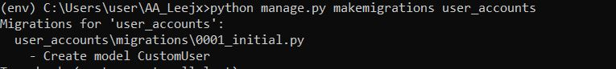</img>

  b) Apply database migrations: Run the command `python manage.py migrate` to apply the generated migrations and create the necessary tables in the MySQL database.
  
   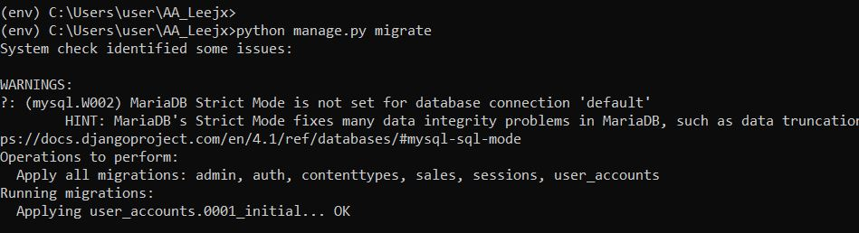</img>

  c) Result:

   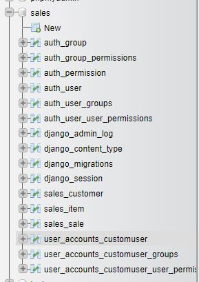</img>
  

### 3. User Registration
  a) Create a registration form: Create a Django form (UserRegistrationForm) that includes fields for username, password, email. 
     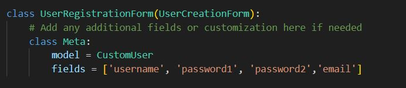</img>
     
  b) Create a registration view: Define a view function (register) that handles the registration logic. In this view, validate the form data, create a new User instance, save it to the database.
     </img>
     
  c) Create a registration template: Create an HTML template (register.html) that displays the registration form and handles form submission.
     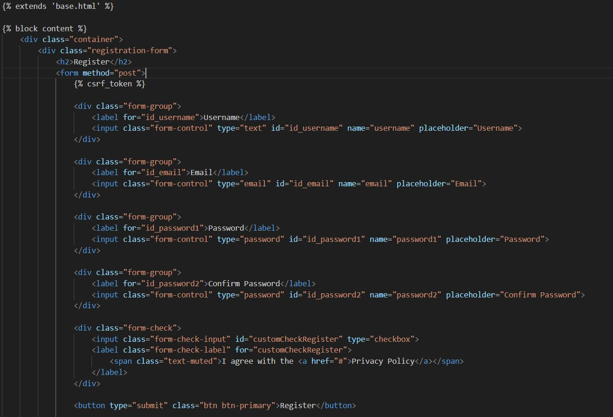</img>

### 4. User Login
  a) Create a login form: Create a Django form (UserLoginForm) that includes fields for username and password.
    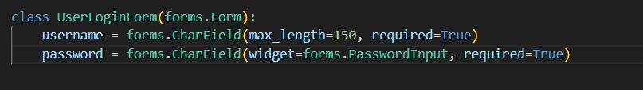</img> 

  b) Create a login view: Define a view function (user_login) that handles the login logic. In this view, validate the form data, authenticate the user using Django's authenticate() function, and log in the user using login().
    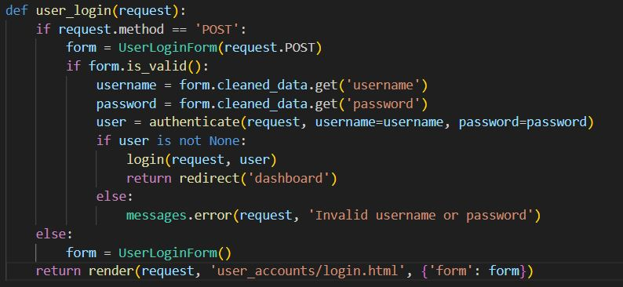</img>

  c) Create a login template: Create an HTML template (login.html) that displays the login form and handles form submission.
    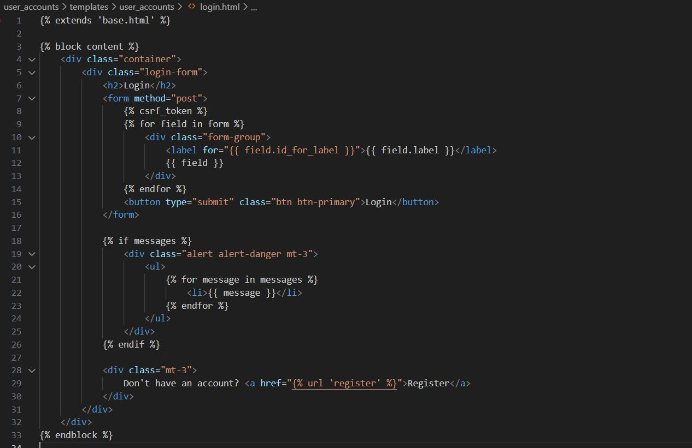</img>

### 5. User Dashboard
  a) Create dashboard templates: for me, I created three HTML templates (customer_dashboard.html, technicalWorker_dashboard.html, seniorManagement_dashboard.html) that represent the dashboards for each user type. 
     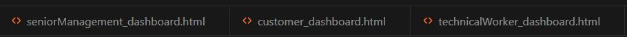</img>

  b) Create a dashboard view: Define a view function (dashboard) that checks the authenticated user's user_type attribute and renders the appropriate dashboard template based on the user type. If the user is not recognized or not authenticated, redirect them to the login page.
    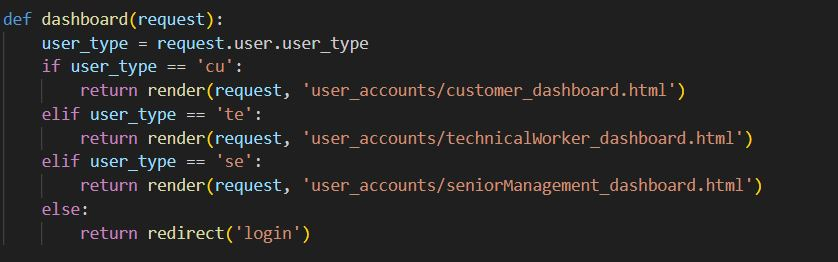</img>

### 6. URL Configuration:
  a) Update URL patterns: Update the project's URL configuration (urls.py) to include URL patterns for user registration, login, and the dashboard view. Map the URLs to their respective views.
     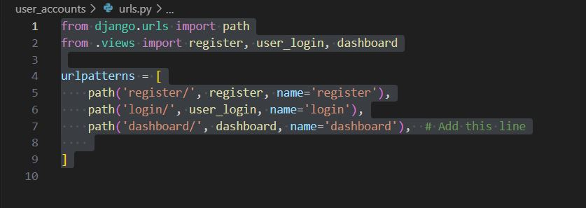</img>

### User interfaces:
  a) Login:
     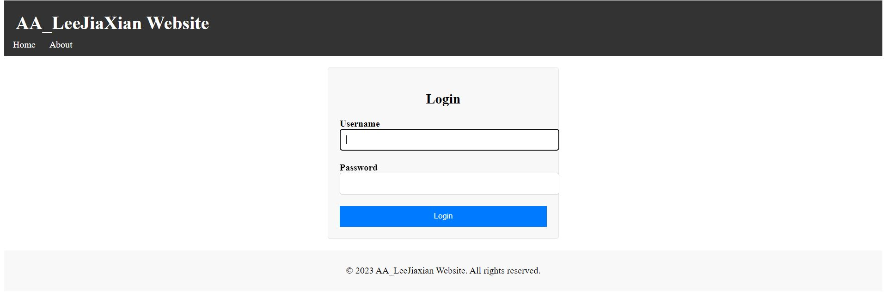</img>
     
  b) Register:
     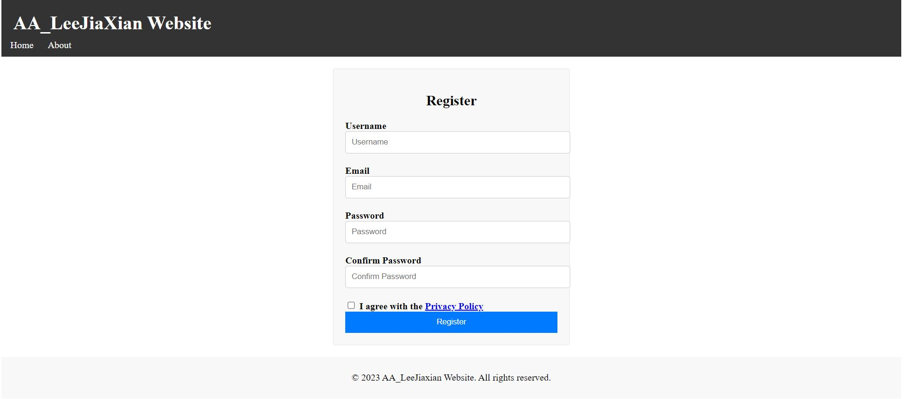</img>

  c) Customer's dashboard:
    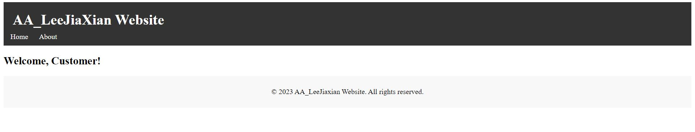</img>
    
  d) Technical Worker's dahboard:
     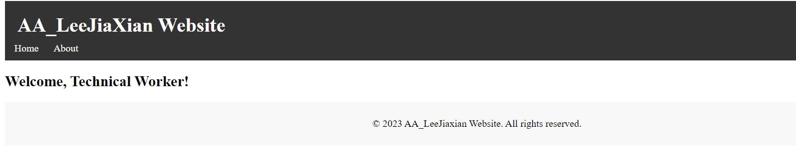</img>

  e) Senior Management's dahboard:
     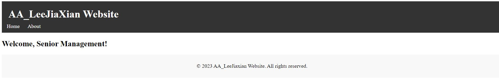</img>

## Question 3 (b)
To address the challenge of data replication and synchronization between the MySQL and MongoDB databases, we need to implement a solution that involves real-time updates and seamless interaction between the databases.Based on my case of having MySQL for user authentication and a JSON dataset (sales), along with MongoDB for another JSON dataset (sales), a suitable replication strategy would be the <b>Dual Writes </b> approach. This strategy ensures that any changes made in one database are accurately reflected in the other database.

The dual write approach is a strategy used in database management systems to ensure data consistency across multiple systems or databases. It involves simultaneously writing data to two or more separate data stores, typically with different underlying technologies or purposes.

The main goal of the dual write approach is to maintain synchronized data between multiple systems in real-time or near-real-time. Here's a brief explanation of how the dual write approach works:

1. Capture the data: When new data is generated or updated in the system, it is captured by the application or service responsible for handling the data changes.

2. Transform the data: Before writing the data to multiple data stores, it may undergo some transformations or mappings to ensure compatibility with the target systems. This step is necessary when the data models or schemas of the target systems differ.

3. Write to primary data store: The data is first written to the primary data store, which is the main source of truth for the system. This ensures that the primary data store always reflects the most up-to-date information.

4. Write to secondary data store(s): After writing to the primary data store, the data is then written to one or more secondary data stores. These secondary data stores could be replicas, caches, or other databases used for specific purposes or as backup systems.

5. Synchronize the data: To ensure consistency, any changes made to the primary data store are propagated or synchronized to the secondary data store(s). This can be achieved through various mechanisms such as event-driven processing, database triggers, or data replication techniques.

6. Handle conflicts: In some cases, conflicts or inconsistencies may arise when writing to multiple data stores. For example, if a write operation fails in one of the data stores while succeeding in others. Conflict resolution mechanisms need to be implemented to handle such situations and ensure data integrity.

The dual write approach offers several advantages, including improved fault tolerance, data redundancy, and the ability to support different system requirements or data access patterns. However, it also introduces complexities, such as increased write latency, synchronization overhead, and the need for robust conflict resolution mechanisms.

Overall, the dual write approach is a powerful technique for maintaining consistent data across multiple systems, enabling organizations to leverage the strengths of different data stores while ensuring data integrity.

Here are the steps involved in implementing the Dual Writes strategy: 

### 1. Set up the MySQL and MongoDB connections:
  a) In the Django application's settings.py file, configure the MySQL database connection using Django's database configuration.
  b) Establish a connection to the MongoDB database using the `pymongo` library.
    </img>

### 2. Define the Django model for the Sales dataset
  a) In the Django application's models.py file, define the Sales model that represents the sales data.
   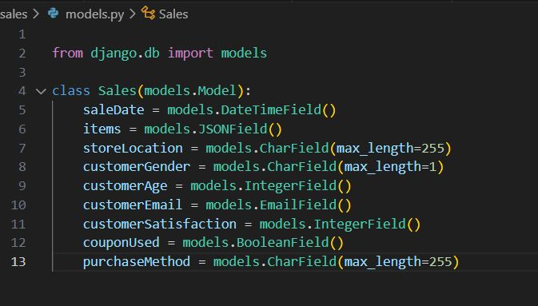</img>

### 3. Dual Writes Approach
  a) Insert:  
     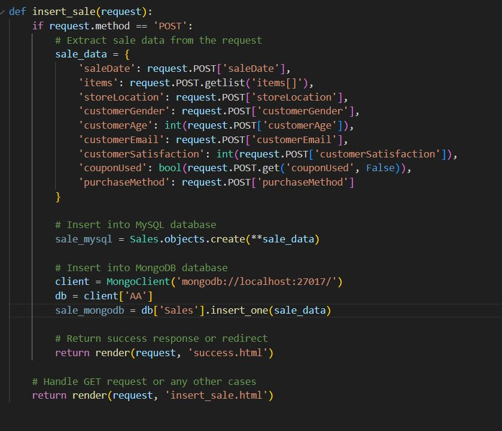</img>

  b) Update:  
    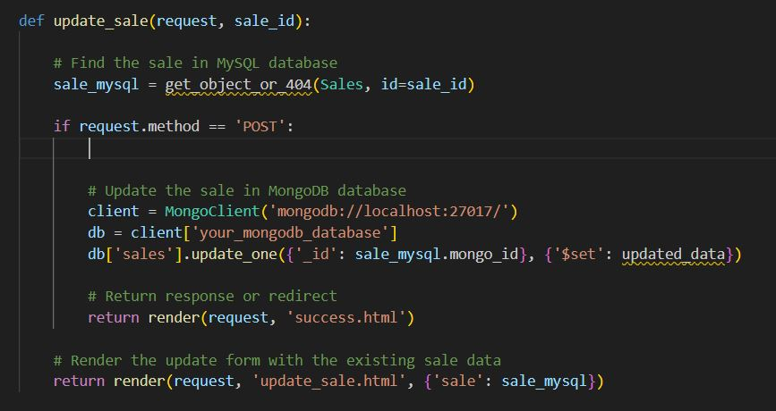</img>

  c) Delete:  
    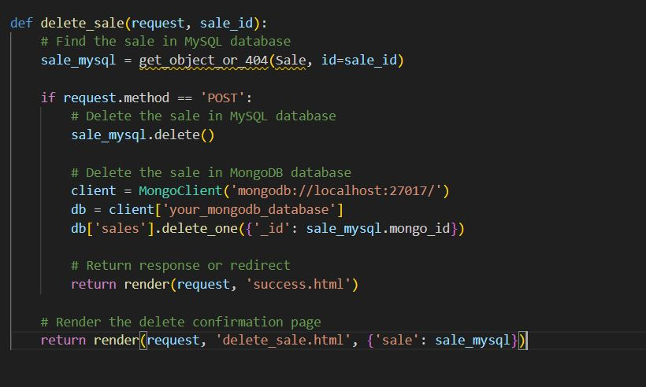</img>

### 4. Testing and Validation
  a) In my case i use a form page for the user to insert or update the sales in database:
     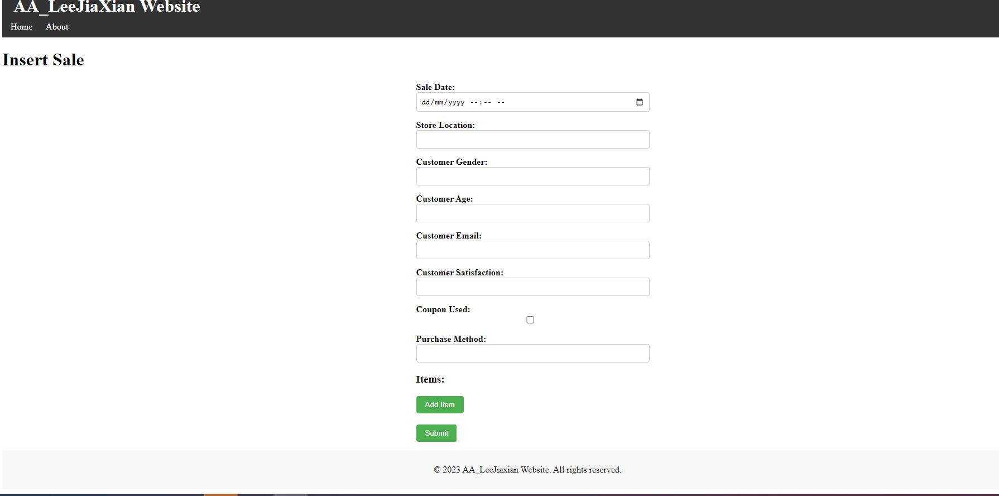</img>
     
  b) Input sales:  
    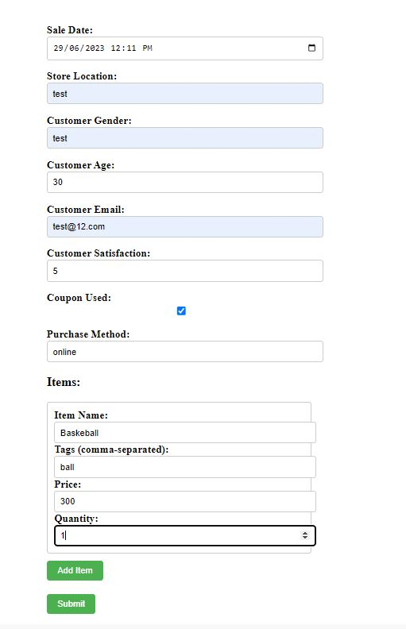</img>  
    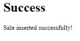</img>

  c) Output:

  <b>MySQL:</b>  
  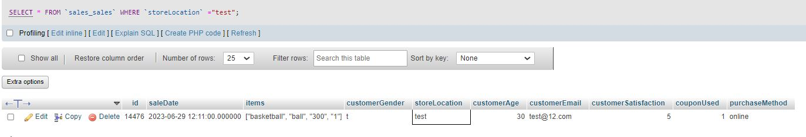</img>

  <b>MongoDB:</b>  
  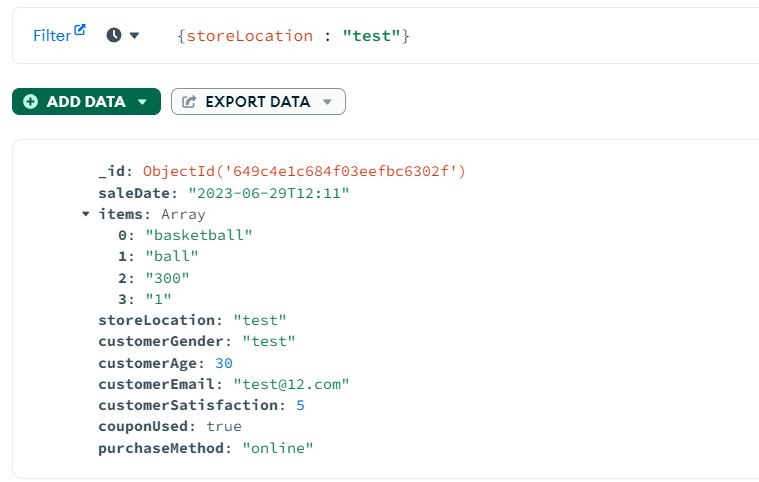</img>
  

  
  

## Contribution 🛠️
Please create an [Issue](https://github.com/drshahizan/special-topic-data-engineering/issues) for any improvements, suggestions or errors in the content.

You can also contact me using [Linkedin](https://www.linkedin.com/in/drshahizan/) for any other queries or feedback.

