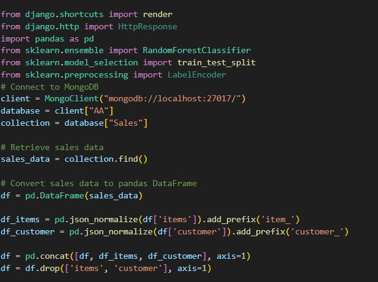
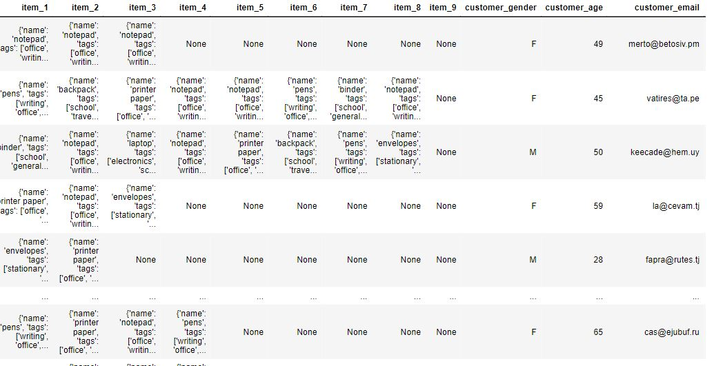
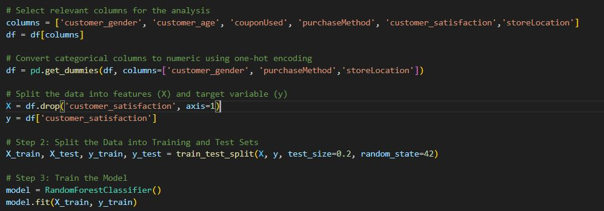
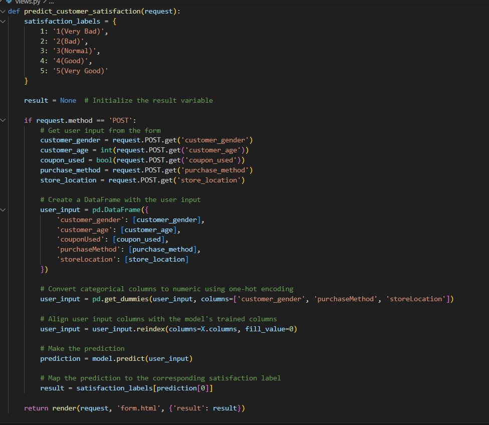
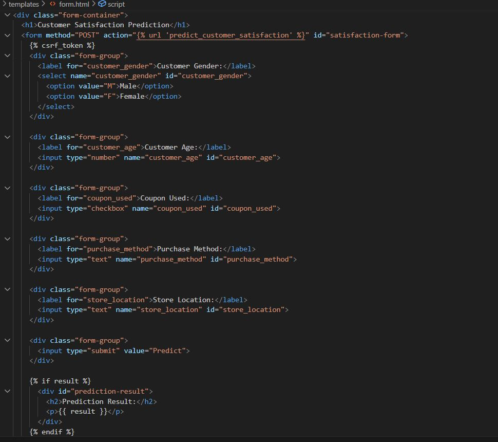
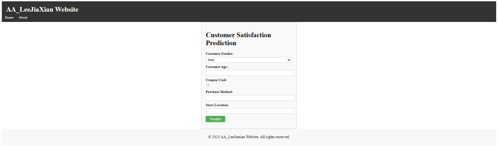
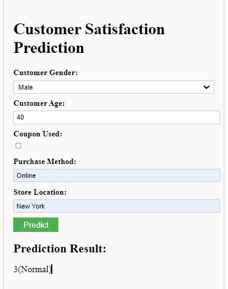
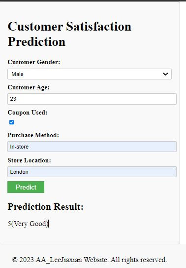
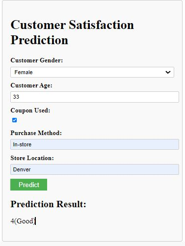

Don't forget to hit the :star: if you like this repo.

# Special Topic Data Engineering (SECP3843): Alternative Assessment

#### Name: Lee Jia Xian
#### Matric No.: A20EC0200
#### Dataset: <a href="https://github.com/drshahizan/dataset/tree/main/mongodb/01-sales" >Supply Store Dataset</a>

## Question 4 

### Overview
  In this case study, machine learning is utilized to improve the functioning of the portal by predicting customer satisfaction based on various features such as customer gender, age, coupon usage, purchase method, and store location. This prediction can provide valuable insights for businesses to enhance their decision-making processes and improve customer experiences.

### Approach
  The chosen machine learning algorithm for this case study is the Random Forest Classifier. This algorithm is an ensemble learning method that combines multiple decision trees to make predictions. It is well-suited for classification tasks and can handle both numerical and categorical features effectively.

### Data Preprocessing 
  The sales data collected from the portal is initially stored in a MongoDB database. To prepare the data for the machine learning model, it is extracted from the database and converted into a pandas DataFrame. Categorical columns are one-hot encoded, and irrelevant columns are dropped to create a clean and suitable dataset for training the model.
  </img>

  result:
  </img>

### Training the Model
  The dataset is split into training and test sets using the train_test_split function from the sklearn.model_selection module. The Random Forest Classifier model is then instantiated and trained on the training data using the fit method.
  </img>

### Prediction
  To predict customer satisfaction, user input is collected from the portal's form, including features like customer gender, age, coupon usage, purchase method, and store location. The user input is then converted into a DataFrame, one-hot encoded, and aligned with the trained model's columns. Finally, the model's predict method is used to make the prediction.
    </img>

### Result and Visualization
  The predicted customer satisfaction label is obtained from the model, and a human-readable label is mapped to it. This result is then displayed on the portal's form page, providing immediate feedback to the user.

  form.html:
  </img>

  interface:
  </img>

 Result 1:  
   </img> 
   Result 2:  
   </img>
   Result 3:  
   </img>

### Conclusion
  By utilizing machine learning techniques, specifically the Random Forest Classifier algorithm, I have developed a solution to predict customer satisfaction based on various features collected from the portal. This predictive capability can help businesses gain insights into customer preferences and make informed decisions to enhance their services and improve overall customer satisfaction.

## Contribution 🛠️
Please create an [Issue](https://github.com/drshahizan/special-topic-data-engineering/issues) for any improvements, suggestions or errors in the content.

You can also contact me using [Linkedin](https://www.linkedin.com/in/drshahizan/) for any other queries or feedback.

