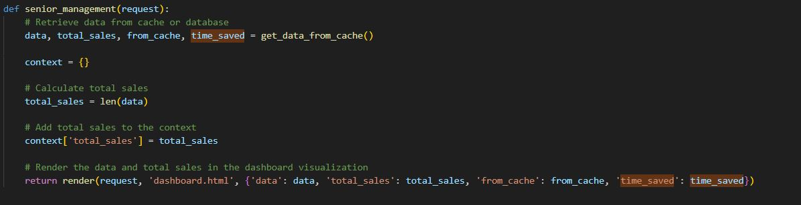
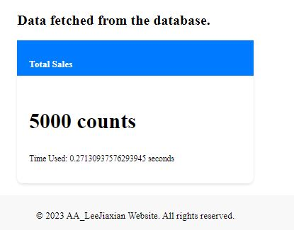
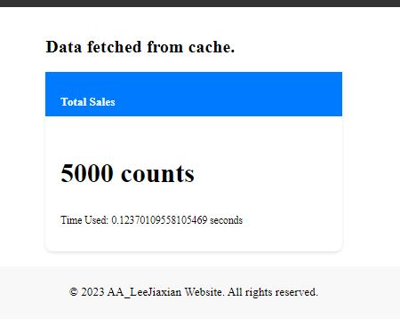
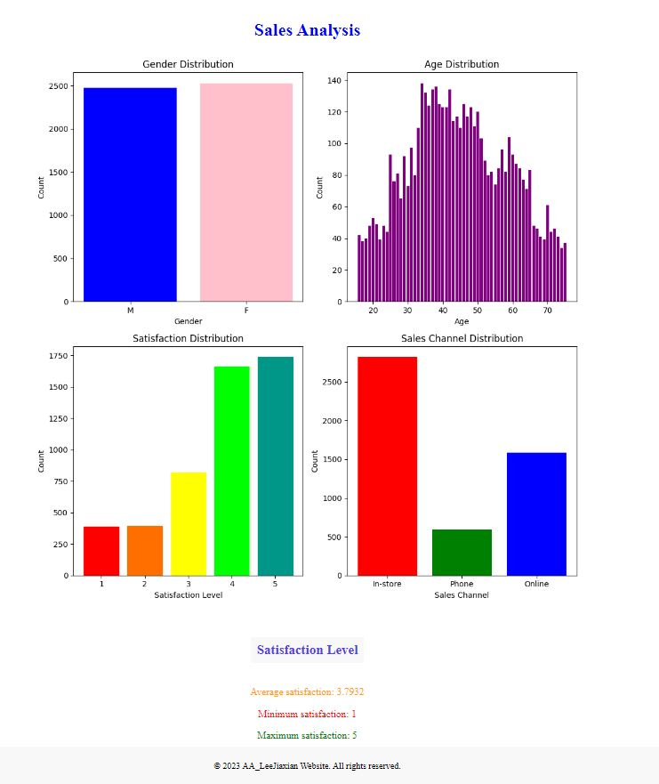
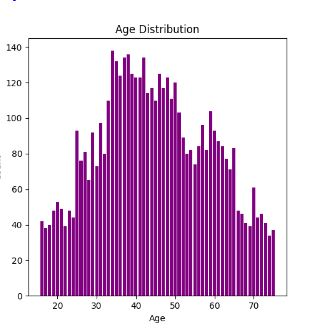
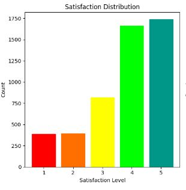
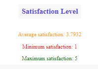
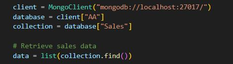
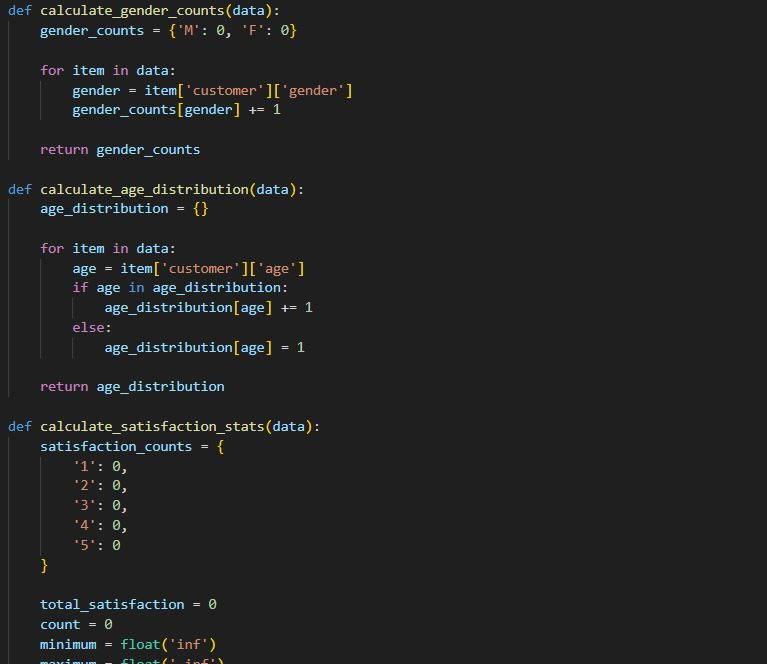
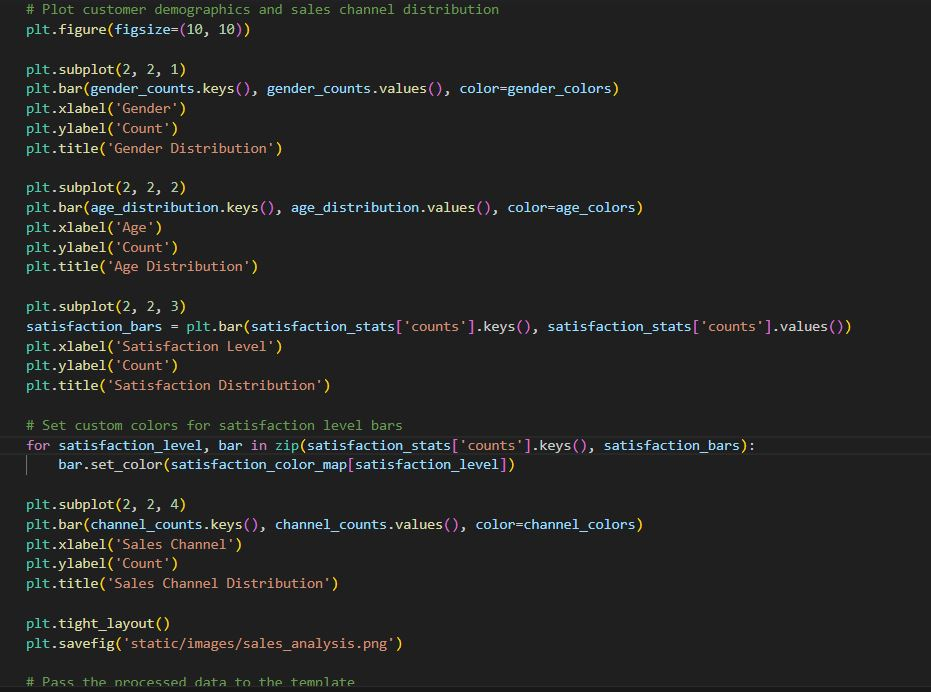

Don't forget to hit the :star: if you like this repo.

# Special Topic Data Engineering (SECP3843): Alternative Assessment

#### Name: Lee Jia Xian
#### Matric No.: A20EC0200
#### Dataset: <a href="https://github.com/drshahizan/dataset/tree/main/mongodb/01-sales" >Supply Store Dataset</a>

## Question 5 (a)
  When dealing with large volumes of JSON data for dashboard visualizations, the performance of the portal can be adversely affected due to the time-consuming process of fetching and processing the data from the dataset.

### Solution : Caching
  Implement caching mechanisms to store pre-rendered visualizations or intermediate data results. This way, subsequent requests for the same data can be served from the cache, reducing processing time and improving overall performance.The objective is to optimize the performance by implementing a caching mechanism that stores the fetched data in memory, reducing the need for repetitive database queries and improving the response time for subsequent requests.

  #### Step 1: Implement Caching
    Use the Django caching framework to store and retrieve data from cache. The caching framework provides various cache backends such as in-memory cache, file-based cache, or database cache. In this example, we will use the in-memory cache backend.
   </img>

  #### Step 2: Retrieve Data from Cache or Database
    Implement a function to retrieve data from cache. First, check if the data is available in the cache. If so, return the cached data. If not, retrieve the data from the database and store it in the cache for future use. 
  </img>

  #### Step 3: Retrieve and Render Data in Dashboard
  In the view function for the dashboard, call the function to retrieve data from cache or database. Pass the retrieved data, along with other relevant information such as the total sales to the template for rendering.
   </img>

### Screenshot:
  - Screenshot 1: Dashboard with data fetched from the database.  
   </img>
   
  - Screenshot 2: Dashboard with data fetched from cache.  
    </img>

### Conclusion
  By implementing a caching mechanism, the performance of the portal can be significantly improved when dealing with large volumes of JSON data during dashboard visualizations. Caching reduces the need for repetitive database queries, resulting in faster response times and an overall optimized user experience.

## Question 5 (b)
The dashboard is designed to provide comprehensive analysis and visualization of a JSON dataset. It offers various functionalities to explore and understand the data.

### Sales Analysis
 </img>
  The sales analysis section provides insights into customer demographics, sales channels, and satisfaction levels. It includes the following features:

  <b>-Gender Distribution</b>: A bar chart displaying the distribution of customers based on gender. 
  </img>
  
  <b>-Age Distribution</b>: A bar chart representing the distribution of customers across different age groups. 
  </img>
  
   <b>-Satisfaction Distribution</b>: A bar chart displaying the distribution of the customer's satisfaction leven (1-5) 
  </img>
  
  <b>-Satisfaction Level</b>: Average, minimum, and maximum satisfaction levels of customers. 
  </img>
  
  <b>-Sales Channel Distribution</b>: A bar chart showcasing the distribution of sales channels used by customers. 
  </img>

### Steps:
  #### 1. Data Loading
  The dashboard loads the JSON dataset using the MongoDB database. It retrieves the required data for analysis and processing. 
    </img>
    
  #### 2. Data Preprocessing
  The loaded data is processed to generate statistics and distributions for customer demographics, sales channels, and satisfaction levels. The processed data is then visualized using charts and displayed on the dashboard. 
     </img>

  #### 3. Visualization
  The dashboard utilizes various charts and graphs to present the analyzed data in a visually appealing manner 
      </img> 
      </img>

### Conclusion
  The dashboard provides an interactive and comprehensive analysis of the JSON dataset. It enables users to explore customer demographics, sales channels, and satisfaction levels through visualizations and statistics

## Contribution 🛠️
Please create an [Issue](https://github.com/drshahizan/special-topic-data-engineering/issues) for any improvements, suggestions or errors in the content.

You can also contact me using [Linkedin](https://www.linkedin.com/in/drshahizan/) for any other queries or feedback.

