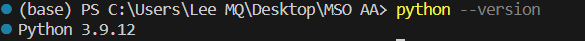
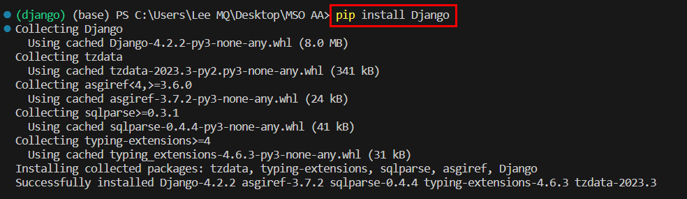
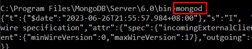
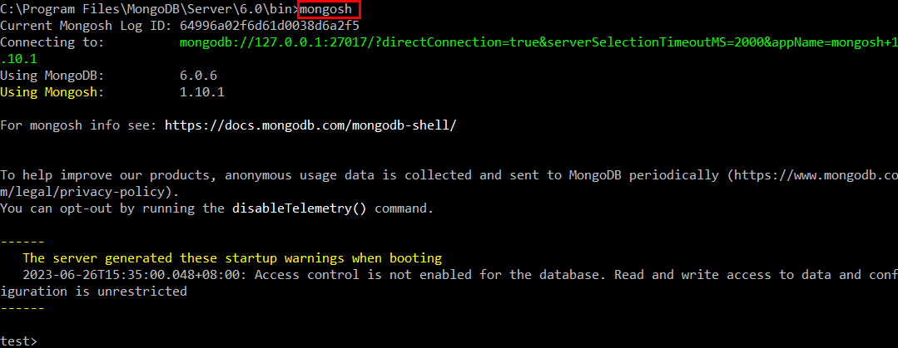
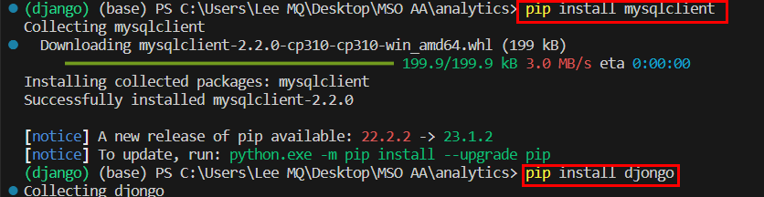
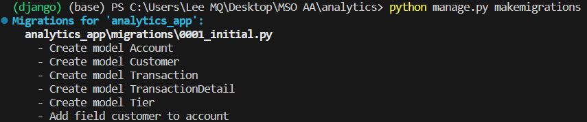
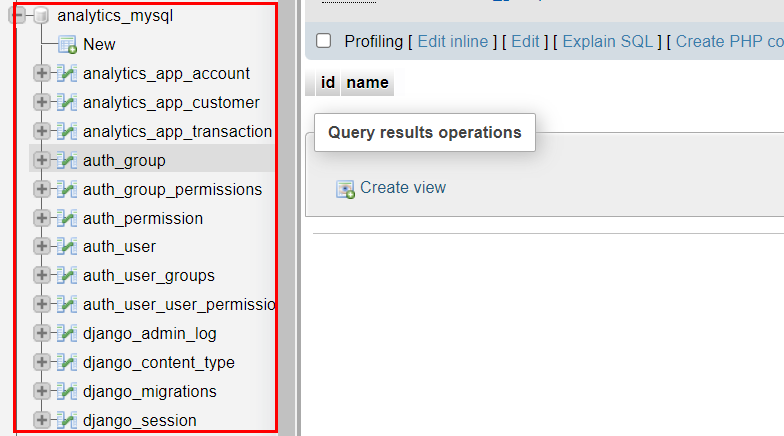
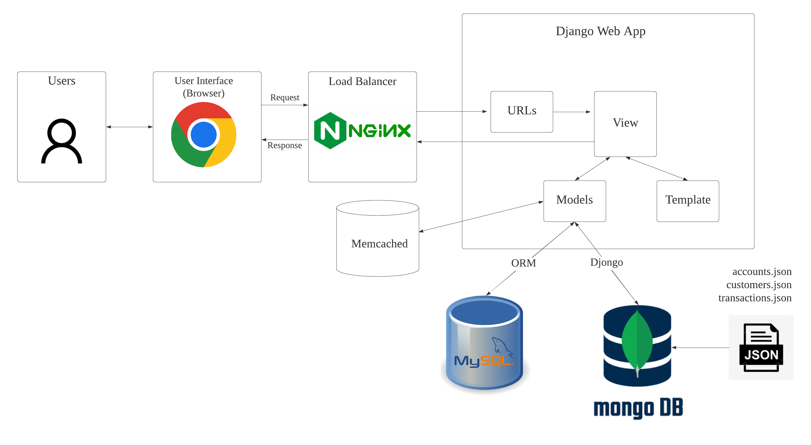

# Special Topic Data Engineering (SECP3843): Alternative Assessment

#### Name: Lee Ming Qi
#### Matric No.: A20EC0064
#### Dataset: [Analytics](https://github.com/drshahizan/dataset/tree/main/mongodb/02-analytics)

## Question 1 (a)

The five servers that will be used in this project are:

- Server 1: Django Application Server

  - Hosts the Django web application
  - Handles user requests
  - Runs the Django framework
  - Renders web pages
  - Handles user authentication and session management

- Server 2: MySQL Database Server

  - Hosts the MySQL database
  - Handles data storage and retrieval for components that require a relational database
  - Stores user registration and login information

- Server 3: MongoDB Database Server

  - Hosts the MongoDB database
  - Handles data storage and retrieval for components that require a NoSQL database
  - Stores data from the JSON dataset provided in the project

- Server 4: Load Balancer/Reverse Proxy

  - Acts as a load balancer or reverse proxy
  - Distributes incoming web requests across multiple Django Application Servers (Server 1)
  - Ensures high availability and scalability of the application
  - Can be implemented using technologies like Nginx or Apache HTTP Server

- Server 5: Caching Server

  - Acts as a caching layer to improve performance
  - Caches frequently accessed data, database query results, or rendered web pages
  - Helps reduce the load on the database servers and improves response times
  - Can be implemented using technologies like Redis or Memcached

This architecture separates different responsibilities to improve scalability, maintainability, and performance of the Django application. It allows for distributing the load across multiple application servers, utilizing both relational (MySQL) and NoSQL (MongoDB) databases based on specific requirements, and efficiently serving static files using a dedicated file server.

In order to integrate Django with the JSON dataset,
ensuring efficient data storage and retrieval from both MySQL and MongoDB databases, please follow the steps below.

## 1. Install Django

Verify Python Installation:
- Make sure Python is installed on your server. You can check the Python version by running the command below in the VS code terminal. Django requires Python version 3.6 or higher. 

```
  python --version
```
Terminal:



> Download [python](https://www.python.org/downloads/) if not installed.

Setup a virtual environment for the Django server. 
- In the terminal, run the code as below to create a new virtual environment called "django".

```
py -m venv django
```

- Activate the virtual envionment with the following code:
```
django\Scripts\activate
```
> Once activated, your terminal prompt should change to indicate that you are now working within the virtual environment.

Install Django

- Use the package manager pip to install Django. Run the command below to install the latest version of Django.

```
pip install Django
```

Terminal :



Verify Django Installation:

- After the installation is complete, you can verify the Django installation by running the command below. It should display the version number of Django.

```
django-admin --version
```

Terminal :



## 2. Create new Django project

- Run the following command to create a new Django project name ```analytics```:
```
django-admin startproject analytics
```

## 3. Create an App for the project

- Navigate to the project folder which contains ```manage.py``` by running the code below:
```
cd analytics
```

- Run the following command to create a new app name ```analytics_app```:

```
python manage.py startapp analytics_app
```

- To use the analytics_app in Django project, add it to the project's configuration. Open the project's ```settings.py``` file located in the ```analytics``` project directory.

- In the ```INSTALLED_APPS``` section of the settings.py file, add ```analytics_app``` to the list of installed apps and save the ```settings.py``` file. It should look like this:



## 4. Install necessary libraries for MySQL and MongoDB

- For MySQL, install the mysqlclient library: 
```
pip install mysqlclient
```
- For MongoDB, install the djongo library
```
pip install djongo
```

Terminal:



## 5. Configuring the database settings in Django

- Open the ```settings.py``` file located in the project's directory.
- Update the ```DATABASES``` setting to configure both MySQL and MongoDB databases in ```analytics``` Django project:

```
DATABASES = {
    'default': {
        'ENGINE': 'django.db.backends.mysql',
        'NAME': 'analytics_mysql',
        'USER': 'root',
        'PASSWORD': '',
        'HOST': 'localhost',
        'PORT': 3306,
    },
    'mongodb': {
        'ENGINE': 'djongo',
        'ENFORCE_SCHEMA': False,
        'NAME': 'analytics',
        'CLIENT': {
            'host': 'localhost:27017',
            'port': 27017,
            'username': '',
            'password': '',
        }
    }
}
```

## 6. Define the Django Models

- Open the models.py file in ```analytics_app``` app directory.
- Define the models to represent the structure of the JSON dataset, ensuring appropriate fields for storing the data as shown below.

```python
from django.db import models
from django.contrib.postgres.fields import ArrayField

class Customer(models.Model):
    username = models.CharField(max_length=100)
    name = models.CharField(max_length=100)
    address = models.CharField(max_length=200)
    birthdate = models.DateField()
    email = models.EmailField()

class Account(models.Model):
    account_id = models.IntegerField(unique=True)
    limit = models.IntegerField()
    products = ArrayField(models.CharField(max_length=100))
    customer = models.ForeignKey(Customer, on_delete=models.CASCADE, related_name='accounts')

class Tier(models.Model):
    tier = models.CharField(max_length=100)
    benefits = ArrayField(models.CharField(max_length=100))
    active = models.BooleanField(default=True)
    customer = models.ForeignKey(Customer, on_delete=models.CASCADE, related_name='tiers')

class Transaction(models.Model):
    account = models.ForeignKey(Account, on_delete=models.CASCADE)
    transaction_count = models.IntegerField()
    bucket_start_date = models.DateField()
    bucket_end_date = models.DateField()

class TransactionDetail(models.Model):
    transaction = models.ForeignKey(Transaction, on_delete=models.CASCADE, related_name='details')
    date = models.DateField()
    amount = models.IntegerField()
    transaction_code = models.CharField(max_length=100)
    symbol = models.CharField(max_length=100)
    price = models.DecimalField(max_digits=20, decimal_places=10)
    total = models.DecimalField(max_digits=20, decimal_places=10)
```

> In the provided Django model structure, the Tier and TransactionDetail models are created as separate models because they represent related entities with a one-to-many relationship to the Customer and Transaction models, respectively.

> Using separate models for related entities allows organization of data in a more efficient and maintainable way. It defines relationships between different entities and query and manipulate the data more effectively.

> Additionally, creating separate models for related entities follows the principles of database normalization, which helps eliminate data redundancy and improves data integrity and consistency. It also allows for better scalability and flexibility in the future if extension or modification of the data structure is required.

## 7. Migrate

After creating the models, run the code below to create the models for the migration.
  
```
python manage.py makemigrations
```
Terminal :



For MySQL, run the code below to create tables in the ```analytics_sql``` database.

```
python manage.py migrate
```

Database :




<hr />

## Question 1 (b)



## Detailed explanations for each component

### 1. Web Application:
The web application is built using Django, a Python web framework. Django follows the MVT (Model-View-Template) design pattern:

```Model```: The model component represents the data structure and defines how data is stored in the databases. It includes models for user registration, login information (stored in MySQL), and JSON data (stored in MongoDB).

```View```: The view component receives requests from the user interface, retrieves and manipulates data from the models, and renders templates to generate HTML or other response formats. It handles business logic and interacts with the databases.

```Template```: The template is responsible for generating the user interface by presenting the data to the user. It utilizes HTML templates to dynamically render data received from the views.

> ```URLs``` play a crucial role in linking the user interface with the views in a Django web application. They define the mapping between the user's requested URL and the corresponding view function that handles the request and generates the response.

### 2. MySQL and ORM in Django:
MySQL is a popular relational database management system (RDBMS) widely used for storing structured data. In the context of the system architecture, MySQL is utilized to store data such as user registration and login information.

Django provides a robust ORM that abstracts the interaction with the MySQL database. The ORM allows developers to work with the database using Python code instead of writing raw SQL queries. It simplifies database operations, enhances code readability, and promotes database portability across different database engines.

With Django's ORM, developers can define models that represent database tables and their relationships. Each model class corresponds to a table in the MySQL database, and attributes within the class represent columns. The ORM handles the translation between Python objects and database records, enabling seamless CRUD (Create, Read, Update, Delete) operations.

The ORM provides a high-level API to perform common database operations, including querying, filtering, sorting, and aggregating data. It supports complex queries and provides a convenient way to express relationships between models through foreign keys, many-to-many relationships, and other field types.

### 3. MongoDB and Djongo:
MongoDB is a popular NoSQL database that offers a flexible and scalable approach for storing unstructured or semi-structured data, such as the JSON dataset used in the project. Unlike traditional relational databases, MongoDB stores data in collections and documents.

Djongo is a third-party library that integrates Django with MongoDB. It allows developers to use Django's familiar ORM syntax and features while working with MongoDB. Djongo translates Django ORM queries into MongoDB queries, enabling seamless interaction with the MongoDB database.

By using Djongo, developers can define models that represent MongoDB collections and leverage Django's ORM to perform CRUD operations. Djongo supports various field types and allows embedding or referencing documents within other documents, facilitating complex data structures.

Djongo also handles schema migration, indexing, and other MongoDB-specific features. It ensures that Django's migration framework works seamlessly with MongoDB, enabling smooth database schema updates.

### 4. JSON Datasets
JSON represents the file type used in the project. It contains unstructured or semi-structured data.

### 5. User
The user refers to the individuals who interact with the portal.

### 6. User Interface:
The user interface is the front-end component of the web application that allows users to interact with the system. It includes elements such as HTML, CSS, and JavaScript that define the visual layout, design, and interactivity of the web pages.

### 7. Memcached:
Memcached is a widely used open-source caching system that improves the performance and scalability of web applications. It serves as a distributed in-memory cache, storing frequently accessed data and reducing the load on the backend systems, such as databases.