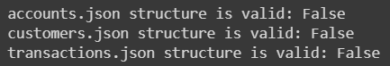
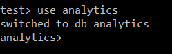
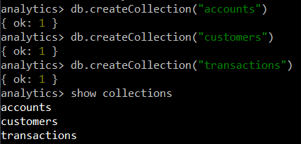
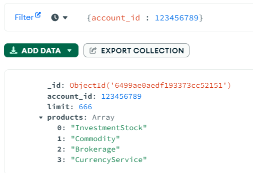
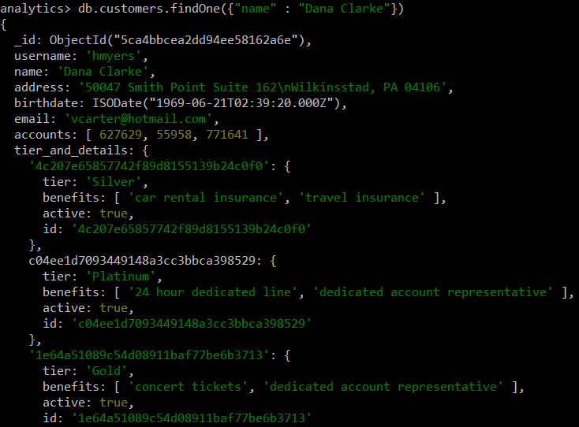
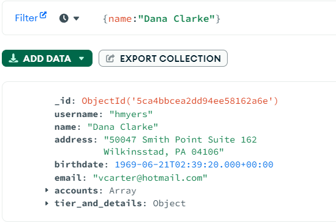
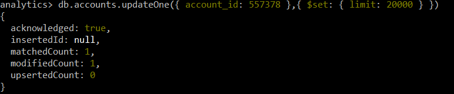
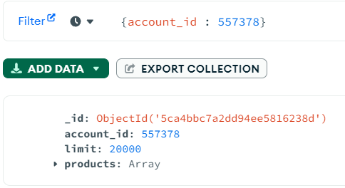
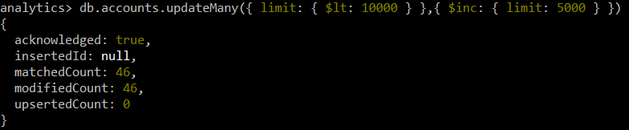
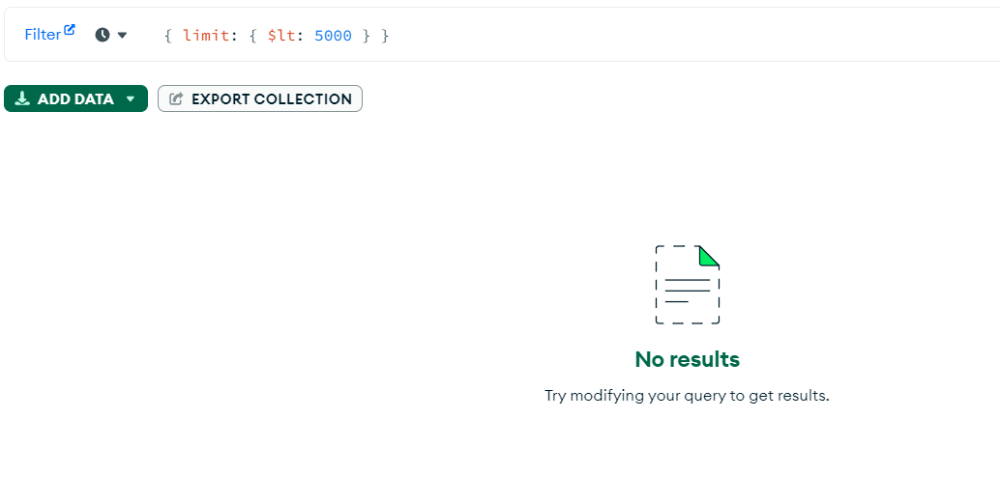

# Special Topic Data Engineering (SECP3843): Alternative Assessment

#### Name: Lee Ming Qi  
#### Matric No.: A20EC0064
#### Dataset: [Analytics](https://github.com/drshahizan/dataset/tree/main/mongodb/02-analytics)

## Question 2 (a)

### 1. Preparation of the JSON file
   a. Download the Datasets from [Analytics](https://github.com/drshahizan/dataset/tree/main/mongodb/02-analytics). There should be 3 JSON files, which are accounts.json, customers.json and transactions.json.

   b. Verify the JSON file structure. Open a google colab and upload the json files. Use the code below to check if the files are in correct json file structure or not.

  ```
  import json

  def check_json_structure(file_path):
    try:
      with open(file_path) as file:
          data = json.load(file)
          if isinstance(data, list):
              if all(isinstance(doc, dict) for doc in data):
                  return True
  except (IOError, ValueError):
      pass
  return False

  # Check the structure of the JSON files
  is_accounts_valid = check_json_structure('accounts.json')
  is_customers_valid = check_json_structure('customers.json')
  is_transactions_valid = check_json_structure('transactions.json')

  # Print the validation results
  print(f"accounts.json structure is valid: {is_accounts_valid}")
  print(f"customers.json structure is valid: {is_customers_valid}")
  print(f"transactions.json structure is valid: {is_transactions_valid}")
  ```

  > If the results return false, it means that the json files are in wrong structure, whereas true, the json files are in correct structure. Unfortunately, 3 of the json files return files in this case.

  

  c. After checking the json files, all the files are not formatted correctly as json array files. The files are missing the opening square bracket "[" and a closing square bracket "]" to denote an array. Each line of the data will be seperated with a comma ",". Hence, the code below is used to modified the json files into correct json array format.

  ```
  def modify_json_structure(file_path):
    try:
        with open(file_path, 'r', encoding='utf-8') as file:
            data = file.readlines()

        # Modify the data to add square brackets
        modified_data = '[' + ','.join(data) + ']'

        # Write the modified data to a new file with the correct encoding
        with open('correct_' + file_path, 'w', encoding='utf-8') as modified_file:
            modified_file.write(modified_data)

        print(f"Modified {file_path} to have the correct JSON structure.")
    except IOError:
        print(f"Error: Unable to open or modify {file_path}.")

  # Modify the customers.json file
  modify_json_structure('customers.json')

  # Modify the accounts.json file
  modify_json_structure('accounts.json')

  # Modify the transactions.json file
  modify_json_structure('transactions.json')
  ```

d. Lastly, verify the JSON file structure again by running the code below.

```
# Verify the structure of the modified JSON files
is_modified_accounts_valid = check_json_structure('correct_accounts.json')
is_modified_customers_valid = check_json_structure('correct_customers.json')
is_modified_transactions_valid = check_json_structure('correct_transactions.json')

# Print the validation results
print(f"Modified accounts.json structure is valid: {is_modified_accounts_valid}")
print(f"Modified customers.json structure is valid: {is_modified_customers_valid}")
print(f"Modified transactions.json structure is valid: {is_modified_transactions_valid}")
```

> This time, all the files return true, which means all of the json files are in correct format and ready to be imported into mongodb.


- Notebook for json preparation : [json_validation.ipynb](./files/source-code/json_validation.ipynb)
- Modified accounts.json : [accounts.json](./files/source-code/correct_accounts.json)
- Modified customers.json : [customers.json](./files/source-code/correct_customers.json)
- Modified transactions.json : [transactions.json](./files/source-code/correct_transactions.json)

<hr />
   
### 2. Starting the MongoDB server

a. Install MongoDB server if MongoDB server is not installed in the system. Visit the [MongoDB Download Center](https://www.mongodb.com/try/download) and download the appropriate version for your operating system. Follow the installation instructions for your specific platform.

b. Open Command prompt and navigate to the MongoDB installation directory, usually located at C:\Program Files\MongoDB\Server\6.0\bin

```
cd C:\Program Files\MongoDB\Server\6.0\bin
```

c. Run the following command to start the MongoDB server

```
mongod
```

Command Prompt:


<hr />
   
### 3. Accessing the MongoDB shell

Access the MongoDB shell using the following command.

```
mongosh
```

Command Prompt:


<hr />
   
### 4. Selecting the target database
Once you are in the MongoDB shell, you can select the target database using the use command followed by the database name. In this case, we create a database name "analytics". After executing the use command, MongoDB will switch to the specified database or create it if it doesn't already exist. You will see a message indicating the switch to the new database, such as `switched to db analytics `.

```
use analytics
```

MongoDB Shell:



<hr />

### 5. Choosing the collection

Use the codes below to create collections in the analytics database. The first code create a collection with name "accounts".
```
db.createCollection("accounts")
```
The second code create a collection with name "customers".

```
db.createCollection("customers")
```
The third code create a collection with name "transactions".
```
db.createCollection("transactions")
```
Use ```show collections``` to view all the collections in the database.

MongoDB Shell:



<hr />
   
### 6. Executing the import command

Import the json file into their respective collections by running the code below.

Import accounts.json
```
mongoimport --db analytics --collection accounts --file "C:\Users\Lee MQ\Documents\GitHub\SECP3843\submission\MQiLEE\questions 2\files\source-code\correct_accounts.json" --jsonArray
```
Import customers.json
```
mongoimport --db analytics --collection customers --file "C:\Users\Lee MQ\Documents\GitHub\SECP3843\submission\MQiLEE\questions 2\files\source-code\correct_customers.json" --jsonArray
```
Import transactions.json
```
mongoimport --db analytics --collection transactions --file "C:\Users\Lee MQ\Documents\GitHub\SECP3843\submission\MQiLEE\questions 2\files\source-code\correct_transactions.json" --jsonArray
```

All of the documents are imported successfully!

Command Prompt:


<hr />
<hr />

## Question 2 (b)

Make sure that the command prompt has already accessed to the mongodb shell by using ```mongosh``` and connect to the analytics database by using ```use analytics```.

i. Create - Insert a new document into the collection:
- ```insertOne()``` is used to insert a single document into the collection 
- ```insertMany()``` is used to insert multiple documents into the collection

In the code below, ```insertOne()``` is used to insert a document into the accounts collection.

```
db.accounts.insertOne({
  "account_id": 123456789,
  "limit": 666,
  "products": [
    "InvestmentStock",
    "Commodity",
    "Brokerage",
    "CurrencyService"
  ]
})
```

Mongodb Shell:


Mongodb Compass:



<hr />

ii. Read - Find a document in the collection:

- ```findOne()``` is used to retrieve the first document that matches a specified condition from a collection.
- ```find()``` is used to retrieve multiple documents that match a specified condition from a collection.

In the code below, ```findOne()``` is used to find a document with the name "Dana Clarke" in the customers collection.

```
db.customers.findOne({
  "name" : "Dana Clarke"
})
```

Mongodb Shell:



Mongodb Compass:



<hr />

iii. Update - Update a document in the collection:

- ```updateOne()``` is used to update a single document that matches a specified condition in a collection.
- ```updateMany()``` is used to update multiple documents that match a specified condition in a collection.

In the code below, ```updateOne()``` is used to find the document in the accounts collection where account_id is 557378 and update its limit field to 20000. If the document is found, only the first matching document will be updated.

```
db.accounts.updateOne(
  { account_id: 557378 },
  { $set: { limit: 20000 } }
)
```

Mongodb Shell:



Mongodb Compass:




In the code below, ```updateMany()``` is used to find all the documents in the accounts collection where limit is less than 10000 and increment their limit field by 5000.

```
db.accounts.updateMany(
  { limit: { $lt: 10000 } },
  { $inc: { limit: 5000 } }
)
```

Mongodb Shell:



Mongodb Compass:



> There is no account with the limit that is below 5000 as all of them are increment by 5000.

<hr />

iv. Delete - Delete document in the collection:

- ```deleteOne()``` is used to delete the first document that matches a specified condition from a collection.
- ```deleteMany()``` is used to delete multiple documents that match a specified condition from a collection.

In the code below, ```deleteOne()``` is used to find the document in the accounts collection where account_id is 123456789 and delete it. If the document is found, only the first matching document will be deleted.

```
db.accounts.deleteOne({ 
    account_id: 123456789 
})
```


Mongodb Shell:


Mongodb Compass:


> The newly created account "123456789" in the first step is deleted and cannot be found in the collection.