# Special Topic Data Engineering (SECP3843): Alternative Assessment

#### Name: Lee Ming Qi
#### Matric No.: A20EC0064
#### Dataset: [Analytics](https://github.com/drshahizan/dataset/tree/main/mongodb/02-analytics)

## Question 3 (a)
To create a user registration and login module in Django using the MySQL database, perform the following steps:

### 1. Configure Django to use the MySQL database:
   - Makesure the `mysqlclient` package is installed, which allows Django to interact with the MySQL database. If not, install it using pip: `pip install mysqlclient`.
   - Update the Django project's settings file (`settings.py`) to specify the MySQL database settings.
  ```python
  DATABASES = {
    'default': {
        'ENGINE': 'django.db.backends.mysql',
        'NAME': 'analytics_mysql',
        'USER': 'root',
        'PASSWORD': '',
        'HOST': 'localhost',
        'PORT': 3306,
    }
  }
  ```
   - Make sure the MySQL database is created with the specified name and have the necessary privileges to access it. In this case, the name of the database is `analytics_mysql`.

### 2. Create a Django app for user management:

   - The project used in this question will be continuation from the question 1, which is `analytics` project.
  
   - Navigate to the project directory and run the following command to create a new Django app.
  
  ```
  python manage.py startapp user_management
  ```
  
   - This will create a new directory called `user_management` containing the necessary files for the app.
   - Add the `user_management` into the `INSTALLED_APPs` under the `settings.py` file.

   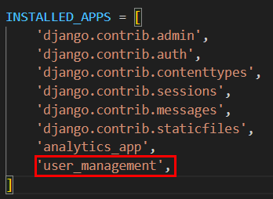

### 3. Define the User model:
   - Open the `models.py` file in the `user_management` app directory.
   - Define a custom User model that extends Django's built-in `AbstractUser` model.
  
     ```python
      from django.db import models
      from django.contrib.auth.models import AbstractUser, Group, Permission

      class CustomUser(AbstractUser):
         CUSTOMER = 'customer'
         TECHNICAL_WORKER = 'technical_worker'
         SENIOR_MANAGEMENT = 'senior_management'

         USER_TYPES = [
            (CUSTOMER, 'Customer'),
            (TECHNICAL_WORKER, 'Technical Worker'),
            (SENIOR_MANAGEMENT, 'Senior Management'),
         ]

         role = models.CharField(max_length=50, choices=USER_TYPES)
         groups = models.ManyToManyField(Group, verbose_name='groups', blank=True, related_name='customuser_set', related_query_name='user')
         user_permissions = models.ManyToManyField(Permission, verbose_name='user_permissions', blank=True, related_name='customuser_set', related_query_name='user')

         def __str__(self):
            return self.username
     ```    

### 4. Configure Django to use the custom User model:
   - Open the `settings.py` file and update the `AUTH_USER_MODEL` setting to point to the custom User model:
  
     ```python
     AUTH_USER_MODEL = 'user_management.CustomUser'
     ```

### 5. Run migrations:
   - Apply the database migrations to create the necessary tables for the user model in the MySQL database. Open the terminal and navigate to the project directory. Run the following command: 
  
      ```
      python manage.py makemigrations user_management
      python manage.py migrate
      ```

      MySQL Database :

      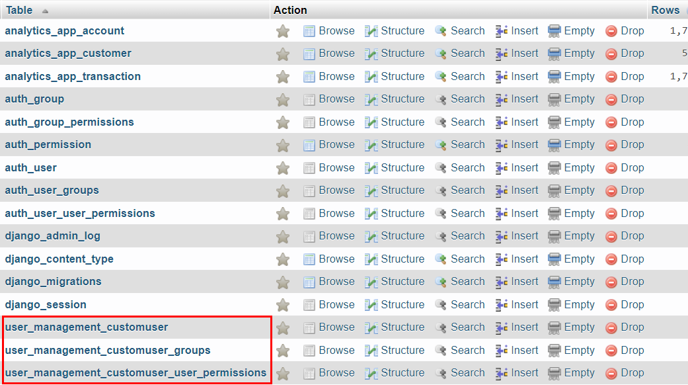

### 6. Create Registration module

- Create the `forms.py` file in Django app directory:

- Enter the code below into the file

```python
from django import forms
from django.contrib.auth.forms import UserCreationForm
from .models import CustomUser

class RegistrationForm(UserCreationForm):
    CUSTOMER = 'customer'
    TECHNICAL_WORKER = 'technical_worker'
    SENIOR_MANAGEMENT = 'senior_management'

    USER_TYPES = [
        (CUSTOMER, 'Customer'),
        (TECHNICAL_WORKER, 'Technical Worker'),
        (SENIOR_MANAGEMENT, 'Senior Management'),
    ]

    user_type = forms.ChoiceField(choices=USER_TYPES)

    class Meta(UserCreationForm.Meta):
        model = CustomUser
        fields = ['username', 'password1', 'password2', 'user_type']

    def save(self, commit=True):
        user = super().save(commit=False)
        user.role = self.cleaned_data['user_type']
        if commit:
            user.save()
        return user
```

- Create the view for the registration by entering the code below in `views.py`.

```python
from django.shortcuts import render, redirect
from django.contrib import messages
from .forms import RegistrationForm

def registration(request):
    if request.method == 'POST':
        form = RegistrationForm(request.POST)
        if form.is_valid():
            form.save()
            messages.success(request, 'Registration successful. Please login.')
            return redirect('register')
        else:
            messages.error(request, 'Invalid credentials. Please try again.')  # Display error message
    else:
        form = RegistrationForm()
    
    context = {
        'form': form,
    }
    return render(request, 'registration.html', context)
```

- Create the template for the registration by creating a new file `registration.html` and enter the code below.

```html
<form method="post">
   

   <div class="form-group">
   <label for="id_username">Username:</label>
   <input type="text" class="form-control" id="id_username" name="username" required>
   </div>

   <div class="form-group">
   <label for="id_password1">Password:</label>
   <input type="password" class="form-control" id="id_password1" name="password1" required>
   </div>

   <div class="form-group">
   <label for="id_password2">Confirm Password:</label>
   <input type="password" class="form-control" id="id_password2" name="password2" required>
   </div>

   <div class="form-group">
   <label for="id_user_type">User Type:</label>
   <select class="form-control" id="id_user_type" name="user_type">
      
         <option value="{{ choice.0 }}">{{ choice.1 }}</option>
      
   </select>
   </div>

   <button type="submit" class="btn btn-primary">Register</button>
</form>
```

### 7. Create Login module

- Enter the code below into `forms.py`.

```python
class LoginForm(forms.Form):
    username = forms.CharField(max_length=150)
    password = forms.CharField(widget=forms.PasswordInput)
```

- Create the view for the login by entering the code below in `views.py`.

```python
from django.contrib.auth import authenticate, login, logout
from .forms import RegistrationForm, LoginForm

def login_view(request):
    if request.method == 'POST':
        form = LoginForm(request.POST)
        if form.is_valid():
            username = form.cleaned_data['username']
            password = form.cleaned_data['password']
            user = authenticate(request, username=username, password=password)
            if user is not None:
                login(request, user)
                return redirect('dashboard')  # Replace 'dashboard' with the URL name of your dashboard view
            else:
                form.add_error(None, 'Invalid username or password.')
    else:
        form = LoginForm()
    
    return render(request, 'login.html', {'form': form})
```

- Create the template for the login by creating a new file `login.html` and enter the code below.

```html
<form method="post">
   

   
   <div class="alert alert-danger">
      
         {{ error }}
      
   </div>
   

   <div class="form-group">
   <label for="id_username">Username:</label>
   <input type="text" class="form-control" id="id_username" name="username" required>
   </div>

   <div class="form-group">
   <label for="id_password">Password:</label>
   <input type="password" class="form-control" id="id_password" name="password" required>
   </div>

   <button type="submit" class="btn btn-primary">Login</button>
</form>
```

### 8. Create Dashboard for each user type

- Create the view for the dashboard by entering the code below in `views.py`.

```python
def dashboard(request):
    user_type = request.user.role
    
    if user_type == 'customer':
        # Logic for customer dashboard
        return render(request, 'customer_dashboard.html')
    elif user_type == 'technical_worker':
        # Logic for technical worker dashboard
        return render(request, 'technical_dashboard.html')
    elif user_type == 'senior_management':
        # Logic for senior management dashboard
        return render(request, 'senior_dashboard.html')
    else:
        # Handle unrecognized user type or default dashboard
        return render(request, 'default_dashboard.html')
```

- Create the template for the dashboard by creating a new file for each user type.

  - Customer : `customer_dashboard.html`
  - Senior Management : `senior_dashboard.html`
  - Technical Worker : `technical_dashboard.html`

### 9. Create Logout Module

- Create the logout module by entering the code below in `views.py`.

```python
def logout_view(request):
    logout(request)
    return redirect('login')
```

### 10. URL Configuration

- Modify the project's URL configuration `urls.py` to include URL patterns for registration, login, dashboard and logout. Map the URLs to their respective views.

```python
from django.contrib import admin
from django.urls import path
from user_management.views import registration, login_view, dashboard, logout_view

urlpatterns = [
    path('admin/', admin.site.urls),
    path('register/', registration, name='registration'),
    path('login/', login_view, name='login'),
    path('dashboard/', dashboard, name='dashboard'),
    path('logout/', logout_view, name='logout'),
]
```

### 11. User Interfaces

- To have a view on the user interfaces, open the terminal and navigate to the project directory. Run the command as below:

```
python manage.py runserver
```

- Registration Interface

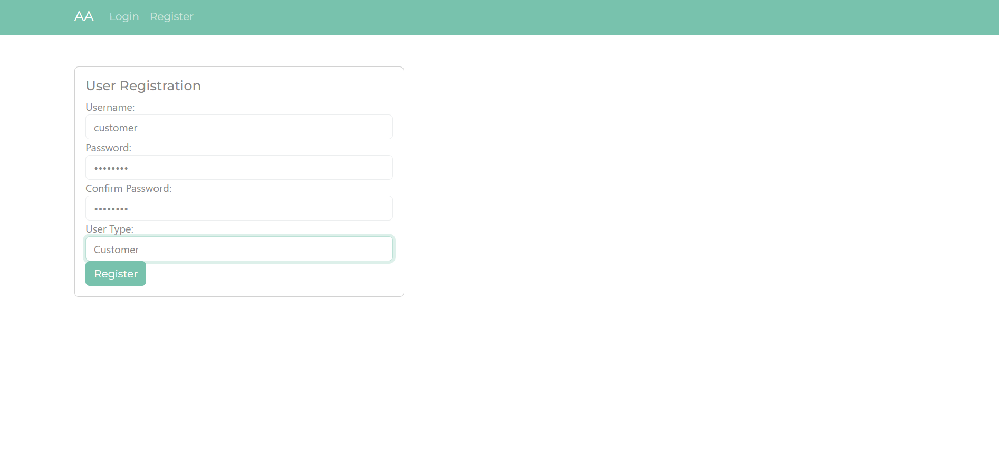

- Login Inteface

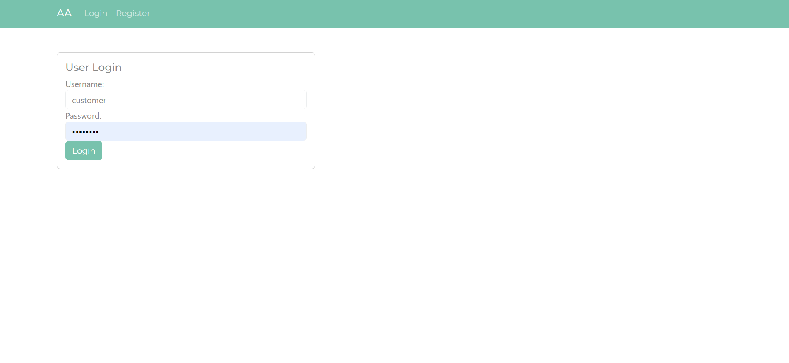

- MySQL Database

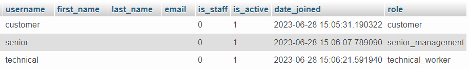

After Login

- Customer Dashboard

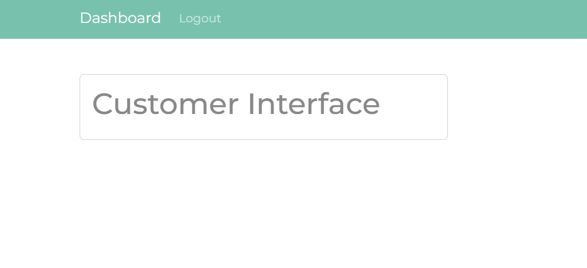

- Senior Management Dashboard

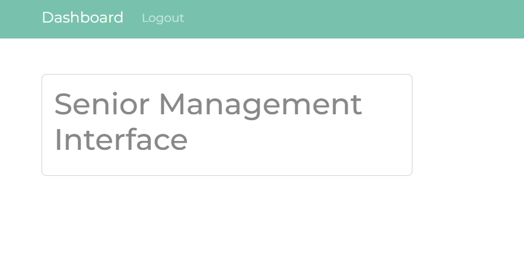

- Technical Worker Dashboard

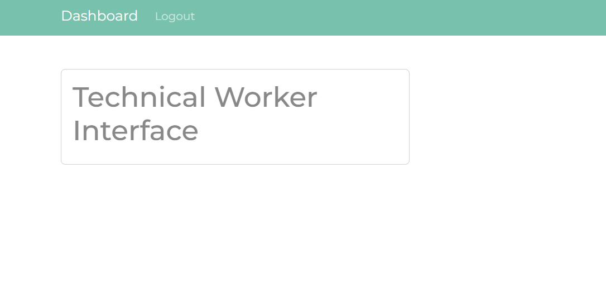

<hr />

## Question 3 (b)
The "dual write" strategy can help overcome the challenge of data replication and synchronization between MySQL and MongoDB databases by ensuring that any changes made in one database are accurately reflected in the other. Here's how dual write helps address the challenge:

`Real-time updates`: Dual write allows for real-time updates between the databases. Whenever a change is made in one database, the dual write mechanism captures that change and propagates it to the other database almost instantaneously. This helps maintain data consistency and reduces the chances of data discrepancies.

`Seamless interaction`: Dual write enables seamless interaction between the databases. It allows applications to read and write data to either database without worrying about inconsistencies. Applications can leverage the strengths of both MySQL and MongoDB databases, depending on their specific needs, while ensuring that the data remains consistent across both systems.

`Flexibility and compatibility`: Dual write provides flexibility and compatibility between different database systems. It allows organizations to leverage the benefits of both MySQL and MongoDB based on their respective strengths. For example, MySQL may be suitable for structured data and complex querying, while MongoDB may excel in handling unstructured or semi-structured data and providing flexible data models. Dual write ensures that the data in both databases remains in sync, allowing applications to leverage the strengths of each system.

`Compatibility with existing systems`: Dual write can be implemented without significant changes to existing systems. By integrating the dual write mechanism at the application level, it becomes transparent to the underlying database systems. This means that existing applications and workflows can continue to interact with the databases as they normally would, without the need for major modifications.

Overall, dual write helps maintain data consistency and allows organizations to leverage the strengths of different database systems while working with multiple databases simultaneously. Steps to implement dual write in the project is as follow:

### 1. Set up the databases:

- In the Django project, configure the database connections for MySQL and MongoDB in the `settings.py` file.
- Make sure you have the required database drivers installed, such as mysqlclient for MySQL and pymongo for MongoDB.
- As the project is continued from Question 1, the databases are already setup and ready to use in this step.

### 2. Implement Dual-Write:

- To implement dual write, which means writing data to both MySQL and MongoDB databases simultaneously, modify Django models in `models.py` and create a custom method to handle the dual write process.

```python
from django.db import models
from pymongo import MongoClient

class Account(models.Model):
    _id = models.CharField(max_length=255)
    account_id = models.IntegerField()
    limit = models.IntegerField()
    products = models.JSONField()

    def save(self, *args, **kwargs):
        # Perform dual write
        self.dual_write()
        super(Account, self).save(*args, **kwargs)

    def dual_write(self):
        # Get the MongoDB connection
        client = MongoClient('mongodb://localhost:27017')
        db = client.analytics

        # Create or update document in MongoDB
        document = {
            '_id': str(self._id),
            'account_id': self.account_id,
            'limit': self.limit,
            'products': self.products,
        }
        db.accounts.update_one({'_id': str(self._id)}, {'$set': document}, upsert=True)

        # Close the MongoDB connection
        client.close()


class Customer(models.Model):
    _id = models.CharField(max_length=255)
    username = models.CharField(max_length=255)
    name = models.CharField(max_length=255)
    address = models.CharField(max_length=255)
    birthdate = models.BigIntegerField()
    email = models.EmailField()
    accounts = models.JSONField()
    tier_and_details = models.JSONField()

    def save(self, *args, **kwargs):
        # Perform dual write
        self.dual_write()
        super(Customer, self).save(*args, **kwargs)

    def dual_write(self):
        # Get the MongoDB connection
        client = MongoClient('mongodb://localhost:27017')
        db = client.analytics

        # Create or update document in MongoDB
        document = {
            '_id': str(self._id),
            'username': self.username,
            'name': self.name,
            'address': self.address,
            'birthdate': self.birthdate,
            'email': self.email,
            'accounts': self.accounts,
            'tier_and_details': self.tier_and_details,
        }
        db.customers.update_one({'_id': str(self._id)}, {'$set': document}, upsert=True)

        # Close the MongoDB connection
        client.close()

class Transaction(models.Model):
    _id = models.CharField(max_length=255)
    account_id = models.IntegerField()
    transaction_count = models.IntegerField()
    bucket_start_date = models.BigIntegerField()
    bucket_end_date = models.BigIntegerField()
    transactions = models.JSONField()

    def save(self, *args, **kwargs):
        # Perform dual write
        self.dual_write()
        super(Transaction, self).save(*args, **kwargs)

    def dual_write(self):
        # Get the MongoDB connection
        client = MongoClient('mongodb://localhost:27017')
        db = client.analytics

        # Create or update document in MongoDB
        document = {
            '_id': str(self._id),
            'account_id': self.account_id,
            'transaction_count': self.transaction_count,
            'bucket_start_date': self.bucket_start_date,
            'bucket_end_date': self.bucket_end_date,
            'transactions': self.transactions,
        }
        db.transactions.update_one({'_id': str(self._id)}, {'$set': document}, upsert=True)

        # Close the MongoDB connection
        client.close()
```

> With the modified models, whenever saving a model instance, it will perform a dual write to both MySQL and MongoDB databases. The dual_write method connects to the MongoDB database using the pymongo library and creates or updates the corresponding document in the transactions collection.


### 3. Test and Validate Dual Write function:

- Create a new directory called `management` within the Django app directory if it doesn't already exist.

- Inside the `management` directory, create another directory called `commands`.

- Create a new Python file inside the commands directory and name it `dual_write_test.py`.

- For Test Create new Transaction
  
  - Open the `dual_write_test.py` file and define the custom management command:


   ```python
   from django.core.management.base import BaseCommand
   from django.utils import timezone
   from analytics_app.models import Transaction

   class Command(BaseCommand):
      help = 'Run dual write test'

      def handle(self, *args, **options):
         # Instantiate a Transaction object and save it to trigger the dual write process
         transaction = Transaction(
               _id='1',
               account_id=123,
               transaction_count=5,
               bucket_start_date=int(timezone.now().timestamp()),
               bucket_end_date=int((timezone.now() + timezone.timedelta(days=7)).timestamp()),
               transactions={'transaction1': 100, 'transaction2': 200}
         )
         transaction.save()

         self.stdout.write(self.style.SUCCESS('Dual write test completed successfully.'))
   ```

  - Open the terminal and navigate to the project directory. Run the following command to start the test

```
python manage.py dual_write_test
```

Terminal :

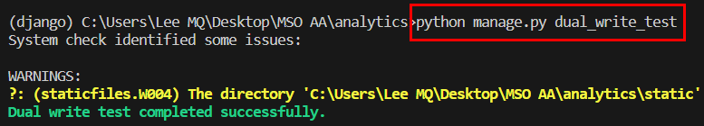

MySQL Database :

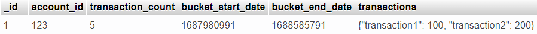

MongoDB Database :

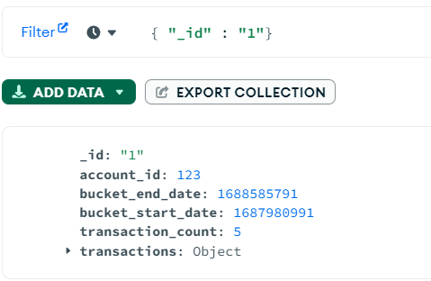

> In this test, the data is save into the MySQL database, but with the help of dual write, the data is also saved into MongoDB database.


- For Test Modify Transaction
  
  - Open the `dual_write_test.py` file and define the custom management command:


   ```python
   from django.core.management.base import BaseCommand
   from django.utils import timezone
   from analytics_app.models import Transaction

   class Command(BaseCommand):
      help = 'Run dual write test'

      def handle(self, *args, **options):
         # Modify and save an existing transaction to trigger an update in both databases
        transaction = Transaction.objects.get(_id='1')
        transaction.transaction_count = 10
        transaction.transactions['transaction1'] = 500
        transaction.save()

        self.stdout.write(self.style.SUCCESS('Dual write test completed successfully.'))
   ```

  - Open the terminal and navigate to the project directory. Run the following command to start the test

```
python manage.py dual_write_test
```

Terminal :

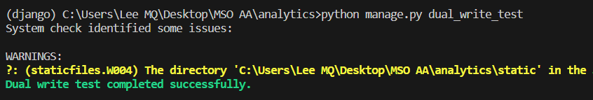

MySQL Database :


MongoDB Database :

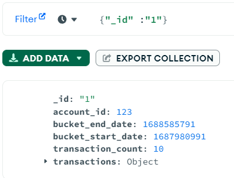

> In this test, the data is modified and the changes is saved into the MySQL database, but with the help of dual write, the modified data is also saved into MongoDB database.
