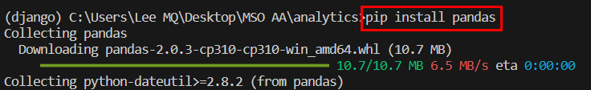
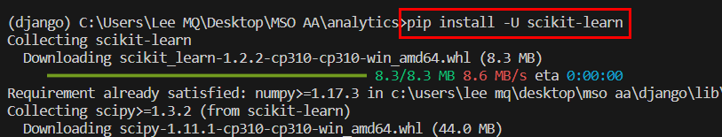
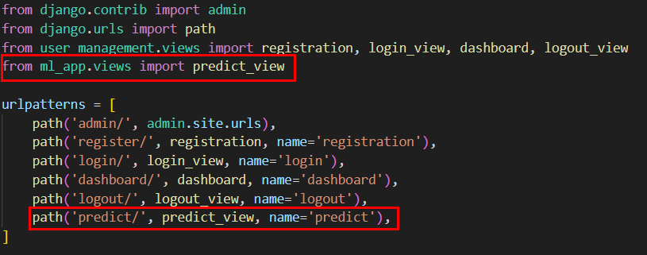
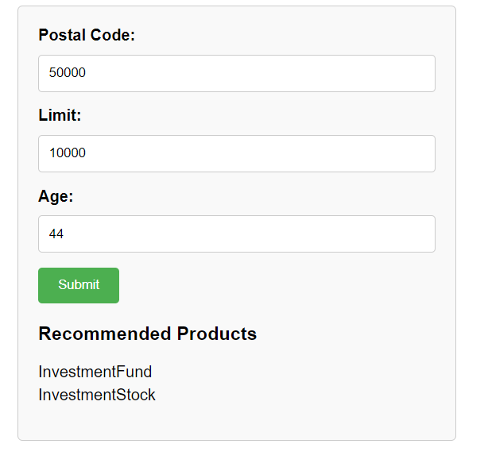
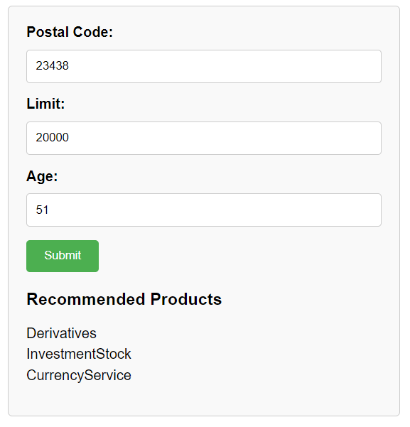

# Special Topic Data Engineering (SECP3843): Alternative Assessment

#### Name: Lee Ming Qi
#### Matric No.: A20EC0064
#### Dataset: [Analytics](https://github.com/drshahizan/dataset/tree/main/mongodb/02-analytics)

## Question 4

For this case study, Product Recommendation will be developed as the machine learning models. Product recommendation is important because it enables businesses to personalize the shopping experience for their customers. By analyzing customer data and behavior, recommendations can be tailored to individual preferences, increasing customer engagement and satisfaction. It also allows for cross-selling and upselling opportunities, leading to higher revenue. Recommendations help customers discover new products, increasing their choices and exposure to different offerings. By presenting relevant suggestions, businesses can improve conversion rates and drive sales. Additionally, personalized recommendations contribute to customer retention and loyalty, setting the business apart from competitors and positioning it as a trusted advisor. Overall, product recommendation enhances the customer experience, drives sales, and fosters long-term relationships with customers.

In the case study, Random Forest is used to build a model that can analyze customer data, from the `birthdate (age)`, `region (postal code)` and their `accounts (account limit)`, and predict the most suitable products for individual customers. The Random Forest algorithm is chosen as it is capable of handling both numerical and categorical features, provides good accuracy, and is robust against overfitting.


### 1. Install the required dependacies

- Install pandas for data preprocessing



- Install scikit-learn for machine learning




### 2. Deploy the machine learning model in Django

- Create a new file `ml_utils.py` to perform machine learning in the file.

- Import required library

```python
import json
import pandas as pd
from sklearn.ensemble import RandomForestClassifier
from sklearn.model_selection import train_test_split
from sklearn.preprocessing import MultiLabelBinarizer
from sklearn.metrics import accuracy_score
from sklearn.preprocessing import StandardScaler
```

- Retrieve Data

```python
account_file = 'C:\\Users\\Lee MQ\\Desktop\\MSO AA\\correct_accounts.json'
customer_file = 'C:\\Users\\Lee MQ\\Desktop\\MSO AA\\correct_customers.json'
transaction_file = 'C:\\Users\\Lee MQ\\Desktop\\MSO AA\\correct_transactions.json'

# Load the accounts data from accounts.json
with open(account_file) as accounts_file:
    accounts_data = json.load(accounts_file)

# Load the customers data from customers.json
with open(customer_file) as customers_file:
    customers_data = json.load(customers_file)
```

- Data Peprocessing

```python
# Convert the accounts data to a DataFrame
accounts_df = pd.DataFrame(accounts_data)

# Convert the customers data to a DataFrame
customers_df = pd.DataFrame(customers_data)

# Extract the account IDs from the list in accounts_df
accounts_df['account_id'] = accounts_df['account_id'].apply(lambda x: int(x['$numberInt']))

# Explode the accounts column to create multiple rows for each account ID
customers_df = customers_df.explode('accounts')

# Extract the account IDs from the dictionary in customers_df
customers_df['account_id'] = customers_df['accounts'].apply(lambda x: int(x['$numberInt']))

# Extract the "limit" field as a separate column
accounts_df['limit'] = accounts_df['limit'].apply(lambda x: int(x['$numberInt']))

# Extract the birthdate as a string from the dictionary in customers_df
customers_df['birthdate'] = customers_df['birthdate'].apply(lambda x: x['$date']['$numberLong'])

# Convert the birthdate string to datetime format
customers_df['birthdate'] = pd.to_datetime(customers_df['birthdate'], unit='ms')

# Calculate the age based on the birthdate
current_date = pd.Timestamp.now().normalize()  # Get the current date without the time
customers_df['birthdate'] = pd.to_datetime(customers_df['birthdate'], unit='ms')
customers_df['age'] = (current_date - customers_df['birthdate']) / pd.Timedelta(days=365.25)

# Convert the age to integer
customers_df['age'] = customers_df['age'].astype(int)

# Extract the postcode from the address using string manipulation
customers_df['postcode'] = customers_df['address'].str.extract(r'(\d{5})')

# Merge the accounts and customers data on the "account_id" column
merged_data = pd.merge(accounts_df, customers_df, on='account_id')

# Specify the columns to keep in the merged data
columns_to_keep = ['age', 'postcode', 'limit', 'products']

# Drop the unimportant columns
df = merged_data[columns_to_keep]
```

- Feature Selection

```python
features = df[['age', 'limit', 'postcode']]
target = df['products']

label_binarizer = MultiLabelBinarizer()
target_encoded = label_binarizer.fit_transform(target)
```

- Split the features (age, limit, postcode) and the target variable (products) into training and testing sets using train_test_split.

```python
X_train, X_test, y_train, y_test = train_test_split(features, target_encoded, test_size=0.2, random_state=42)
```

- Train the Random Forest Classifier model.

```python
# Initialize the Random Forest Classifier
rf_classifier = RandomForestClassifier(random_state=42)

# Train the classifier
rf_classifier.fit(X_train, y_train)
```

- Make Predictions by using a function that receive the input and return the predicted products

```python
def predict_products(postal_code, limit, age):
    # Preprocess the input features
    input_data = [[age, limit, postal_code]]
    scaler = StandardScaler()
    input_data_scaled = scaler.fit_transform(input_data)
    
    # Make predictions using the trained classifier
    predictions = rf_classifier.predict(input_data_scaled)
    
    # Decode the predicted labels
    predicted_labels = label_binarizer.inverse_transform(predictions)
    
    # Return the predicted labels as a list
    return list(predicted_labels[0])
```

### 3. Create view for the product recommendation

- In `views.py`, enter the code below:

```python
from django.shortcuts import render
from .ml_utils import predict_products

def predict_view(request):
    if request.method == 'POST':
        # Retrieve user inputs from the form
        postal_code = request.POST.get('postal_code')
        limit = int(request.POST.get('limit'))
        age = int(request.POST.get('age'))
        
        # Call the machine learning function to make predictions
        predictions = predict_products(postal_code, limit, age)

        return render(request, 'predict.html', {'predictions': predictions})

    return render(request, 'predict.html')
```

### 4. Create template for the product recommendation

- Create a new file `predict.html` and enter the code below:

```html
<form method="post" action="">
  
  <label for="postal_code">Postal Code:</label>
  <input type="text" name="postal_code" required>
  <br>
  <label for="limit">Limit:</label>
  <input type="number" name="limit" required>
  <br>
  <label for="age">Age:</label>
  <input type="number" name="age" required>
  <br>
  <input type="submit" value="Submit">

  
    <h3>Recommended Products</h3>
    <ul>
      
        <li>{{ prediction }}</li>
      
    </ul>
  
</form>
```

### 5. Modify the URL path

- Update the URL pattern: In urls.py, make sure the URL pattern for the predict_view is named 'predict'.



### 6. Test and validate the product recommendation model

- Open the terminal and navigate to the project directory. Run the command below.

```
python manage.py runserver
```

- Enter the postal code, limit and age. After submit, the products recommended will be shown below the form.

Result 1 :



Result 2 :

