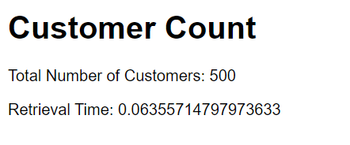
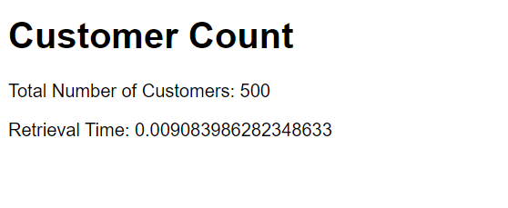
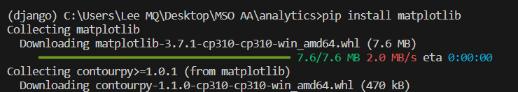
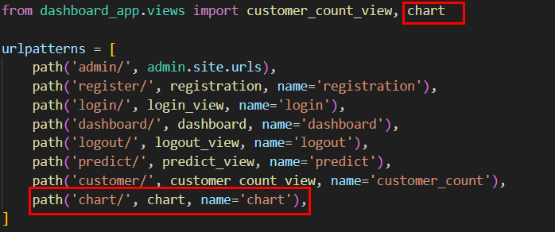
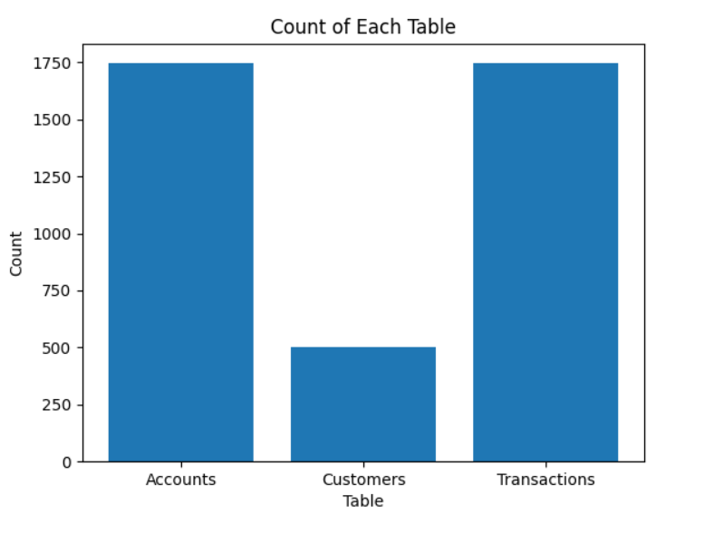

# Special Topic Data Engineering (SECP3843): Alternative Assessment

#### Name: Lee Ming Qi
#### Matric No.: A20EC0064
#### Dataset: [Analytics](https://github.com/drshahizan/dataset/tree/main/mongodb/02-analytics)

## Question 5 (a)

To optimize the performance of the portal when dealing with large volumes of JSON data from the dataset, especially during dashboard visualizations, caching can be employed. Caching involves storing precomputed or frequently accessed data in memory, reducing the need to fetch data from the dataset repeatedly and resulting in faster response times. Here's an illustrative solution using caching in Python with the help of the Django framework:

### 1. Use Caching in Views
In the `views.py`, utilize caching to store and retrieve data. Here's an example of using caching to fetch JSON data from the dataset and cache it for subsequent requests:

```python
from django.shortcuts import render
from django.core.cache import cache
from pymongo import MongoClient
import time

def customer_count_view(request):
    start_time = time.time()
    count = get_data_from_cache('customer_count')
    retrieval_time = time.time() - start_time
    return render(request, 'customer_count.html', {'count': count, 'retrieval_time': retrieval_time})

client = MongoClient('mongodb://localhost:27017')
db = client['analytics']

def get_data_from_cache(key):

    # Check if data exists in the cache
    data = cache.get(key)

    if data is not None:
        # Data exists in the cache, return it
        return data
    else:
        # Fetch data from the dataset
        customers_collection = db['analytics_app_customer']
        customer_count = customers_collection.count_documents({})

        # Store the data in the cache for future use
        cache.set(key, customer_count)
        return customer_count
```

### 2. Render the Dashboard Template

Create a template file (customer_count.html) and render the cached data in your dashboard visualization.

```html
<!DOCTYPE html>
<html>
<head>
    <title>Customer Count</title>
</head>
<body>
    <h1>Customer Count</h1>
    <p>Total Number of Customers: {{ count }}</p>
    <p>Retrieval Time: {{ retrieval_time }}</p>
</body>
</html>
```

### 3. Test and validate the caching function

- Open the terminal and navigate to the project directory. Run the command below.

```
python manage.py runserver
```

Result without Caching :



Result after Caching :



### How does caching improves the performance of the portal when dealing with large volumes of JSON data from the dataset during dashboard visualizations?

- `Reduced Database Queries`: With caching, the data is stored in memory after the initial retrieval from the database. Subsequent requests for the same data can be served directly from the cache without querying the database again. This reduces the number of database queries, which can be time-consuming and resource-intensive, especially with large volumes of data.

- `Faster Response Times`: By serving data from the cache, the portal can respond to requests more quickly. Retrieving data from memory is significantly faster compared to fetching it from the database, as memory access is much faster than disk access. This leads to improved response times for dashboard visualizations, allowing users to interact with the portal more efficiently.

- `Reduced Processing Overhead`: Caching precomputes or stores frequently accessed data, eliminating the need to perform complex calculations or aggregations repeatedly. Instead of executing time-consuming operations on large volumes of data for every request, the portal can retrieve the precomputed or cached results, saving processing time and reducing the overall overhead.

- `Scalability`: Caching can improve the scalability of the portal by reducing the load on the database. When multiple users access the dashboard simultaneously, caching helps minimize the strain on the database server by serving the cached data, allowing it to handle a higher number of concurrent requests more effectively.

- `Optimized Resource Utilization`: By reducing the number of database queries and minimizing processing overhead, caching helps optimize the utilization of system resources. This allows the portal to handle a larger user base and handle high volumes of data without overwhelming the server, ensuring a smooth and efficient user experience.

## Question 5 (b)

- Install the required dependacies.

```
pip install matplotlib
```



- In `views.py`, create the graphs

```python
import matplotlib.pyplot as plt
import numpy as np

def chart(request):
    # Retrieve data from MongoDB collections
    accounts = db.analytics_app_account.find()
    customers = db.analytics_app_customer.find()
    transactions = db.analytics_app_transaction.find()

    # Count of Each Table
    table_names = ['Accounts', 'Customers', 'Transactions']
    table_counts = [len(list(accounts)), len(list(customers)), len(list(transactions))]

    # Create a bar graph for count of each table
    plt.bar(table_names, table_counts)
    plt.xlabel('Table')
    plt.ylabel('Count')
    plt.title('Count of Each Table')

    # Save the graph to a file
    graph_path = 'C:/Users/Lee MQ/Desktop/MSO AA/analytics/dashboard_app/static/graph.png'
    plt.savefig(graph_path)

    # Pass the graph path and data to the template
    return render(request, 'dashboard.html', {
        'graph_path': graph_path,
        'table_names': table_names,
        'table_counts': table_counts
    })
```

- Create the template for the graph `dashboard.html`.

```html
<!DOCTYPE html>
<html>
<head>
    <title>Dashboard</title>
</head>
<body>
    
    
</body>
</html>
```

- Add the path in `urls.py`




- Open the terminal and navigate to the project directory. To test and validate the dashboard, run the command below.

```
python manage.py runserver
```

- Bar Chart Count of data in each datasets



> Knowing the count of each dataset in a MongoDB collection can provide valuable insights and serve various purposes in data analysis and visualization. Here are some reasons why it is important to know the count of each dataset. The count of each dataset gives a high-level overview of the size and volume of data in the collection. It helps in understanding the scale and scope of the data being analyzed.