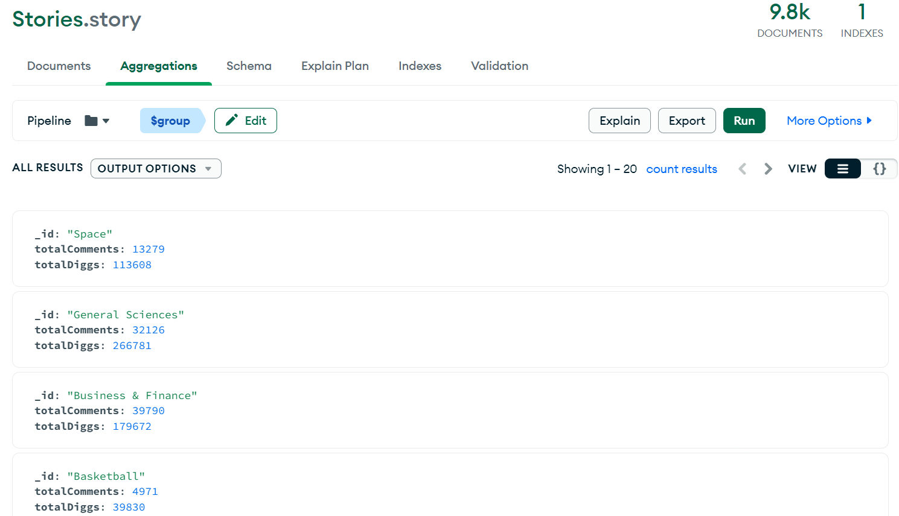
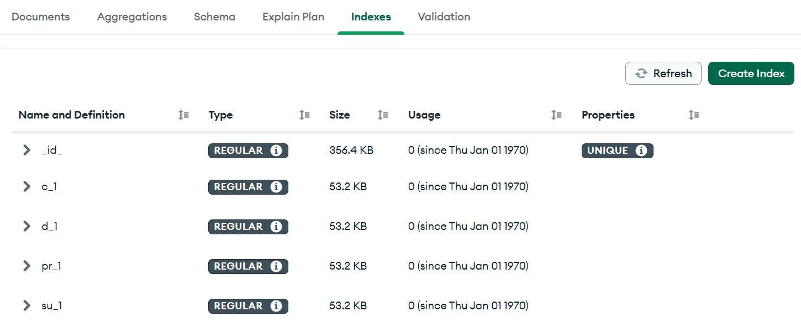
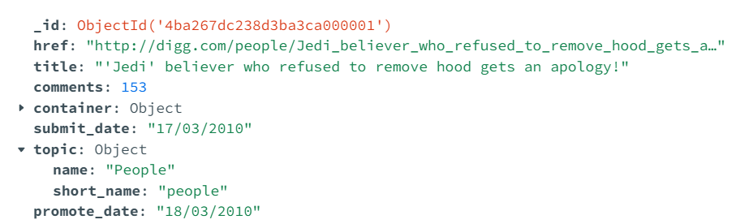
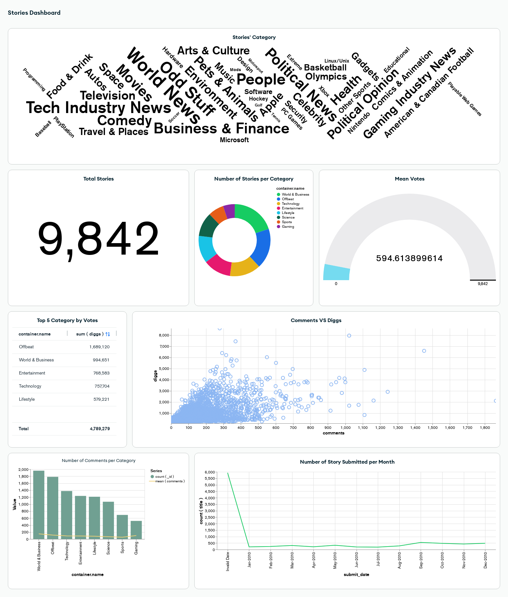

<a href="https://github.com/drshahizan/SECP3843/stargazers"></a>
<a href="https://github.com/drshahizan/SECP3843/network/members"></a>
<a href="https://github.com/drshahizan/SECP3843/pulls"></a>
<a href="https://github.com/drshahizan/SECP3843/issues"></a>
<a href="https://github.com/drshahizan/SECP3843/graphs/contributors"></a>


Don't forget to hit the :star: if you like this repo.

# Special Topic Data Engineering (SECP3843): Alternative Assessment

#### Name: Madihah binti Che Zabri
#### Matric No.: A20EC0074
#### Dataset: <a href="https://github.com/drshahizan/dataset/blob/c8e9f4a7cbdb0c1b78ca2c73915ff56ceeb50e70/mongodb/07-stories/stories.json">stories.json</a>

## Question 5 (a)

In order to optimize the performance of the portal when working with a lot of JSON data on the dashboard, we can do a few approach :

#### Data Aggregation:
When we aggregate data, this will help speed up the rendering process on the dashboard, as we won't need to perform complex calculations each time.
In this project, I will perform aggregate to calculate the total number of comments and total number of diggs based on topic.name. The result will contain the _id (topic name), totalComments, and totalDiggs fields.
```
   {
      _id: "$topic.name",
      totalComments: { $sum: "$comments" },
      totalDiggs: { $sum: "$diggs" }
   }
```
<p align="center">
   
</p>

#### Indexing:

When we create an index on a field, the DB system creates a separate data structure that maps the values in that field to the corresponding records or documents in the dataset, typically stored in a more efficient and optimized format. So, when we perform a query or filter based on an indexed field, the DB can quickly refer to the index to locate the relevant records or documents, rather than scanning through the entire dataset. This will definitely speeds up the data retrieval process and improves the overall performance of the queries.

In this project, The _id, submit_date, promote_date, comments and diggs are frequently used in queries, sort or filters. Since _id already created, I will create indexes on the submit_date, promote_date, comments, diggs.

<p align="center">
   
</p>

#### Make sure the data type is correct and efficient when performing queries and analysis.
   In stories.json, submit_date and promote_date was in Unix timestamp. Thus, in Mongo Shell, run the queries:
```
   use Stories

    db.story.find().forEach(function(doc) {
      var timestamp = doc.submit_date;
      var date = new Date(timestamp * 1000);
      var formattedDate = date.toLocaleDateString();
      db.story.updateOne({ _id: doc._id }, { $set: { submit_date: formattedDate } });
    });

    db.story.find().forEach(function(doc) {
      var timestamp = doc.promote_date;
      var date = new Date(timestamp * 1000);
      var formattedDate = date.toLocaleDateString();
      db.story.updateOne({ _id: doc._id }, { $set: { promote_date: formattedDate } });
    });
  ```

<p align="center">
   
</p>

## Question 5 (b)
For implementing data visualization in this project, I will use MongoDB Charts from MongoDB Atlas. From there, we will create 8 charts that will be included in Stories Dashboard.

Steps :

1. Login to [MongoDB Atlas](https://account.mongodb.com/account/login?signedOut=true)
2. At the three dynamic tab, click on the `Charts` tab.
3. After that, select either Start or Add Dashboard (if you already have dashboard) button.
4. Fill in the Title of the dashboard.
5. Select the Chart Builder..
6. Select collection of the dataset which is story.
7. Finally, we can start building the charts

#### Charts and Dashboard development

1. For the first chart, I would like to display all the categories of the story.
2. For first chart in second row, I want to display number of distinct story. Basically, there are 9842 data or rows (exclude header) in the dataset.
3. Second, I would like to know number of stories for each category
4. Then, I choose mean in gauge chart as I would like to show the mean votes.
5. In third row, I want to display the top 5 categories by votes.
6. Next, I display relation between comments and diggs, which I used in question 4.
7. As we already have votes and number per category, thus I want to display the number of comments per category too in the last row of chart in the dashboard.
8. For the last chart, I was very curious about the number of story submitted per month in 2010, therefore I create a line chart that has the date as x-axis.

Stories Dashboard:
<p align="center">
   
</p>

## Contribution 🛠️
Please create an [Issue](https://github.com/drshahizan/special-topic-data-engineering/issues) for any improvements, suggestions or errors in the content.

You can also contact me using [Linkedin](https://www.linkedin.com/in/drshahizan/) for any other queries or feedback.

[](https://visitorbadge.io/status?path=https%3A%2F%2Fgithub.com%2Fdrshahizan)


