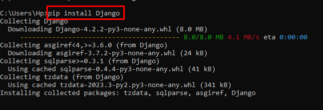
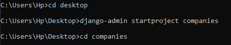
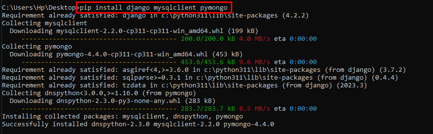
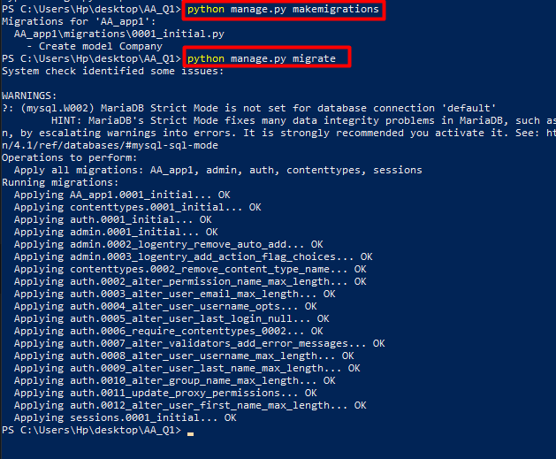
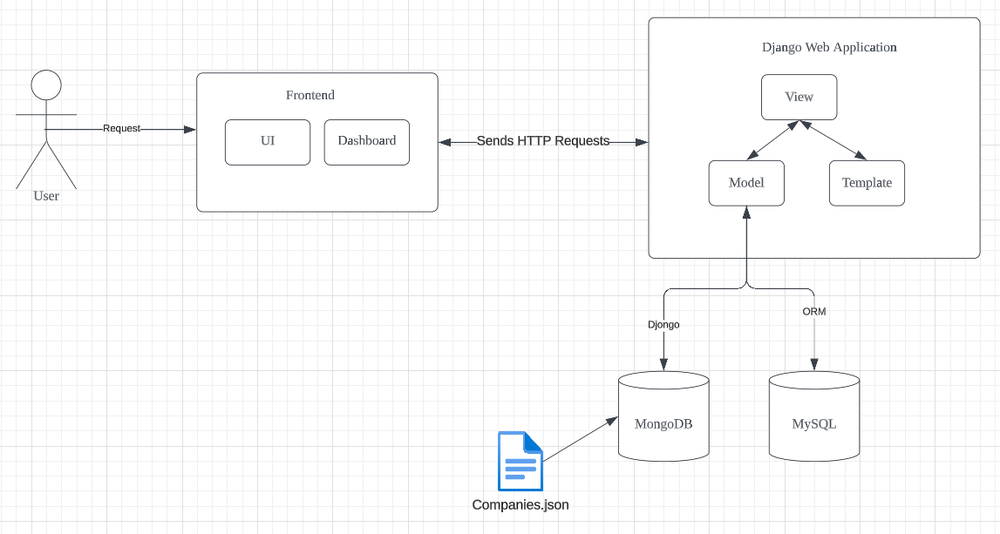

<a href="https://github.com/drshahizan/SECP3843/stargazers"></a>
<a href="https://github.com/drshahizan/SECP3843/network/members"></a>
<a href="https://github.com/drshahizan/SECP3843/pulls"></a>
<a href="https://github.com/drshahizan/SECP3843/issues"></a>
<a href="https://github.com/drshahizan/SECP3843/graphs/contributors"></a>


Don't forget to hit the :star: if you like this repo.

# Special Topic Data Engineering (SECP3843): Alternative Assessment

#### Name: AHMAD MUHAIMIN BIN AHMAD HAMBALI

#### Matric No.: A20EC0006

#### Dataset: Companies

## Question 1 (a)

Follow the steps below to connect Django with the JSON dataset and ensure effective data storage and retrieval from both MySQL and MongoDB databases:

#### Django Installation: 

1. Open Command Prompt and run this command ```pip install Django```


2. Create Django project by typing this command ```django-admin startproject comppanies```


3. Create new Django app inside newly created folder by run this command ```python manage.py startapp companiesDataset```

4. Install necessary packages ```pip install django mysqlclient pymongo``` and `pip install djongo`



#### Define models for MySQL and MongoDB:

1. define json structure into `models.py` and define the models for MySQL

```python from django.db import models

class Company(models.Model):
    _id = models.CharField(max_length=255, primary_key=True)
    acquisition = models.JSONField(null=True)
    acquisitions = models.JSONField(null=True)
    alias_list = models.JSONField(null=True)
    blog_feed_url = models.URLField(null=True)
    blog_url = models.URLField(null=True)
    category_code = models.CharField(max_length=255, null=True)
    competitions = models.JSONField(null=True)
    created_at = models.DateTimeField(null=True)
    crunchbase_url = models.URLField(null=True)
    deadpooled_day = models.IntegerField(null=True)
    deadpooled_month = models.IntegerField(null=True)
    deadpooled_url = models.URLField(null=True)
    deadpooled_year = models.IntegerField(null=True)
    description = models.TextField(null=True)
    email_address = models.EmailField(null=True)
    external_links = models.JSONField(null=True)
    founded_day = models.IntegerField(null=True)
    founded_month = models.IntegerField(null=True)
    founded_year = models.IntegerField(null=True)
    funding_rounds = models.JSONField(null=True)
    homepage_url = models.URLField(null=True)
    image = models.JSONField(null=True)
    investments = models.JSONField(null=True)
    ipo = models.JSONField(null=True)
    milestones = models.JSONField(null=True)
    name = models.CharField(max_length=255)
    number_of_employees = models.IntegerField(null=True)
    offices = models.JSONField(null=True)
    overview = models.TextField(null=True)
    partners = models.JSONField(null=True)
    permalink = models.CharField(max_length=255)
    phone_number = models.CharField(max_length=20, null=True)
    products = models.JSONField(null=True)
    providerships = models.JSONField(null=True)
    relationships = models.JSONField(null=True)
    screenshots = models.JSONField(null=True)
    tag_list = models.JSONField(null=True)
    total_money_raised = models.CharField(max_length=255, null=True)
    twitter_username = models.CharField(max_length=255, null=True)
    updated_at = models.DateTimeField(null=True)
    video_embeds = models.JSONField(null=True)

    def __str__(self):
        return self.name
```

2. Create a new file named `models_mongodb.py` and define the models for mongoDB

```python 
from djongo import models

class Company(models.Model):
    _id = models.CharField(max_length=255, primary_key=True)
    acquisition = models.JSONField(null=True)
    acquisitions = models.JSONField(null=True)
    alias_list = models.JSONField(null=True)
    blog_feed_url = models.URLField(null=True)
    blog_url = models.URLField(null=True)
    category_code = models.CharField(max_length=255, null=True)
    competitions = models.JSONField(null=True)
    created_at = models.DateTimeField(null=True)
    crunchbase_url = models.URLField(null=True)
    deadpooled_day = models.IntegerField(null=True)
    deadpooled_month = models.IntegerField(null=True)
    deadpooled_url = models.URLField(null=True)
    deadpooled_year = models.IntegerField(null=True)
    description = models.TextField(null=True)
    email_address = models.EmailField(null=True)
    external_links = models.JSONField(null=True)
    founded_day = models.IntegerField(null=True)
    founded_month = models.IntegerField(null=True)
    founded_year = models.IntegerField(null=True)
    funding_rounds = models.JSONField(null=True)
    homepage_url = models.URLField(null=True)
    image = models.JSONField(null=True)
    investments = models.JSONField(null=True)
    ipo = models.JSONField(null=True)
    milestones = models.JSONField(null=True)
    name = models.CharField(max_length=255)
    number_of_employees = models.IntegerField(null=True)
    offices = models.JSONField(null=True)
    overview = models.TextField(null=True)
    partners = models.JSONField(null=True)
    permalink = models.CharField(max_length=255)
    phone_number = models.CharField(max_length=20, null=True)
    products = models.JSONField(null=True)
    providerships = models.JSONField(null=True)
    relationships = models.JSONField(null=True)
    screenshots = models.JSONField(null=True)
    tag_list = models.JSONField(null=True)
    total_money_raised = models.CharField(max_length=255, null=True)
    twitter_username = models.CharField(max_length=255, null=True)
    updated_at = models.DateTimeField(null=True)
    video_embeds = models.JSONField(null=True)

    class Meta:
        abstract = True

    def __str__(self):
        return self.name
```
#### Set up database connections :

1. Configure the MySQL and MongoDB connection

```python DATABASES = {
    'default': {
        'ENGINE': 'django.db.backends.mysql',
        'NAME': 'companies',
        'USER': 'root',
        'PASSWORD': '',
        'HOST': 'localhost',
        'PORT': '3306',
    },
    'mongodb': {
        'ENGINE': 'djongo',
        'NAME': 'Companies',
        'CLIENT': {
            'host': 'localhost',
            'port': 27017,
            'username': 'mincridible',
            'password': 'miznpro1',
            'authSource': 'admin',
            'authMechanism': 'SCRAM-SHA-1',
        }
    }
}
```

#### Migrate the databases :

1. Run the following commands to create the necessary database tables for MySQL and MongoDB `python manage.py makemigrations` and `python manage.py migrate`


#### Import JSON dataset into the models

1. create a folder named management inside it create another folder name commands and create a new file named import_data.py

```python import os
import json
from django.core.management.base import BaseCommand
from django.conf import settings
from myapp.models import Company

class Command(BaseCommand):
    help = 'Import data from companies.json'

    def handle(self, *args, **options):
        
        json_file = os.path.join(settings.BASE_DIR, 'data', 'companies.json')

       
        with open(json_file, 'r', encoding='utf-8') as f:
            data = json.load(f)

        
        for item in data:
           
            company = Company()
            company._id = item['_id']
            company.acquisition = item['acquisition']
            company.acquisitions = item['acquisitions']
            company.alias_list = item['alias_list']
            


            company.save()

        self.stdout.write(self.style.SUCCESS('Data imported successfully.'))
```

2. Create new folder named data and put the companies.json inside the folder

3. Run `python manage.py import_data`

## Question 1 (b)

## System Architecture Diagram

The following diagram illustrates the detailed components and their relationships within the system architecture:


### Frontend

The system's user-facing frontend is referred to as things like client apps or web browsers. When rendering the user interface and interacting with the web server, it makes use of technologies including HTML, CSS, and JavaScript.

### Web Server

The system's backend is the web server, in this case specifically Django. It takes in requests from the front end, works with the data, and produces answers. Models create the data structure, views manage request processing, and templates produce the user interface in Django's Model-View-Template (MVT) design pattern.

### Interaction with MySQL and MongoDB

1. Django uses ORM (Object-Relational Mapping) for interacting with the databases. Developers can connect with databases using Python code rather than writing raw SQL queries because of the ORM.

2. The Djongo library is used to integrate MongoDB. Djongo enables communication between Django and MongoDB by bridging the gap between Django models and MongoDB collections. 

### Dataset

In this case, we will acquire the dataset from a GitHub repository, specifically the "companies.json" file.

## Contribution 🛠️

Please create an [Issue](https://github.com/drshahizan/special-topic-data-engineering/issues) for any improvements, suggestions or errors in the content.

You can also contact me using [Linkedin](https://www.linkedin.com/in/drshahizan/) for any other queries or feedback.

[](https://visitorbadge.io/status?path=https%3A%2F%2Fgithub.com%2Fdrshahizan)

