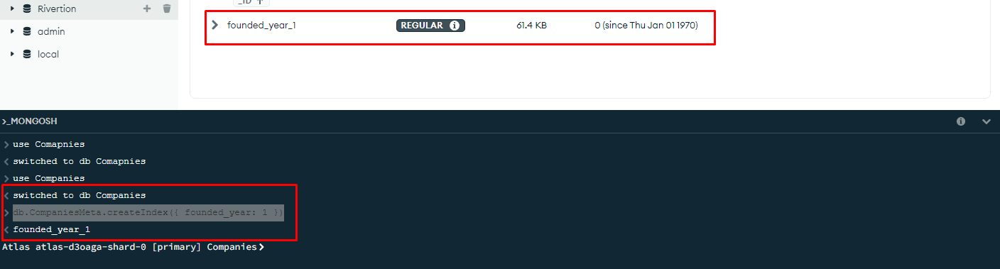
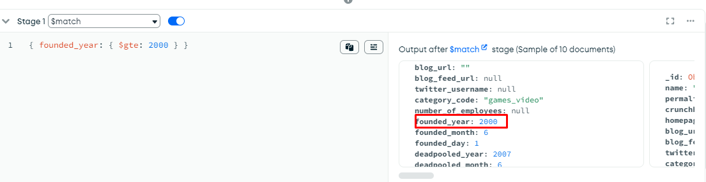
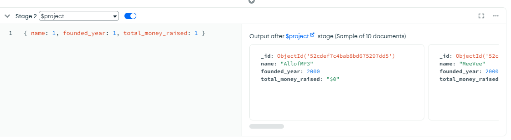
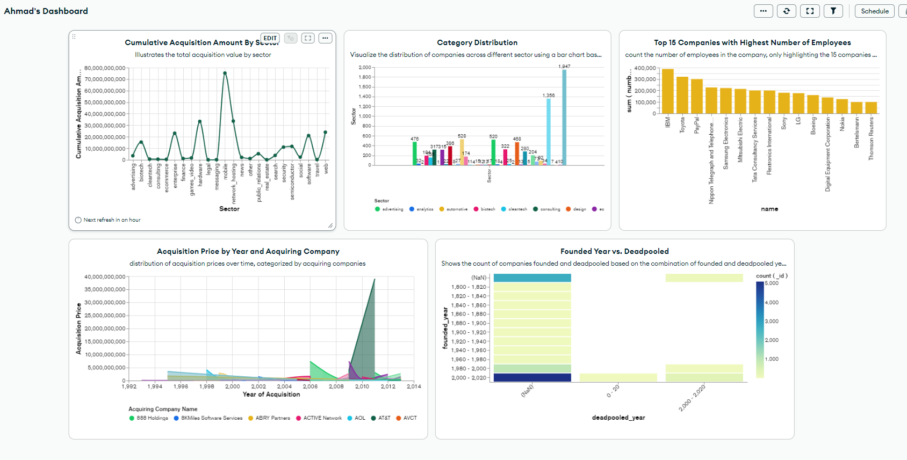
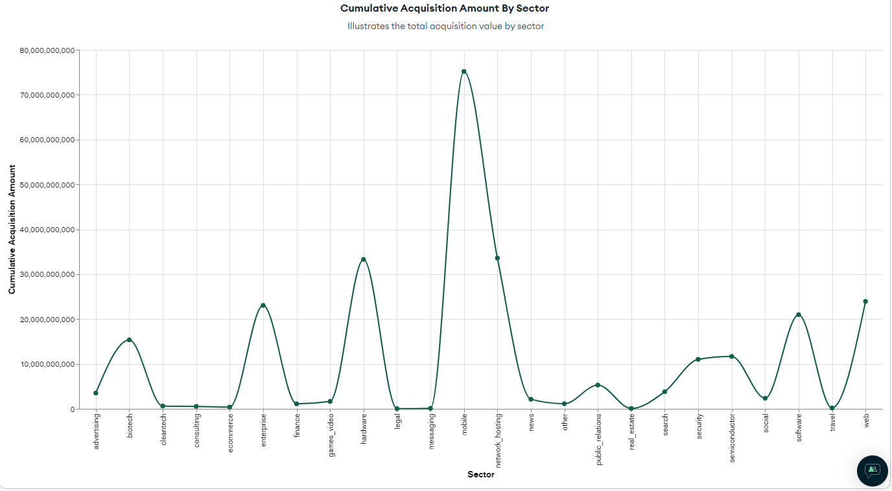
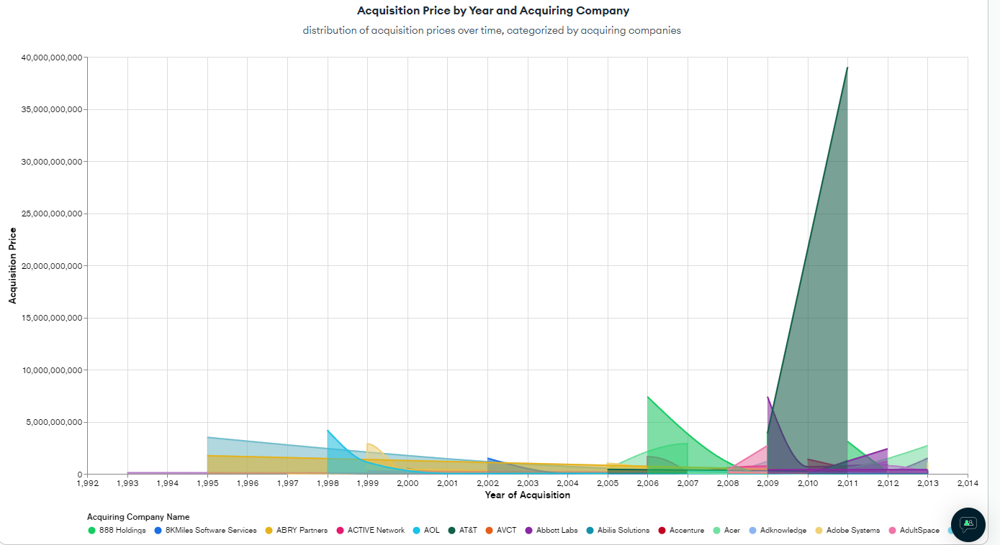

<a href="https://github.com/drshahizan/SECP3843/stargazers"></a>
<a href="https://github.com/drshahizan/SECP3843/network/members"></a>
<a href="https://github.com/drshahizan/SECP3843/pulls"></a>
<a href="https://github.com/drshahizan/SECP3843/issues"></a>
<a href="https://github.com/drshahizan/SECP3843/graphs/contributors"></a>


Don't forget to hit the :star: if you like this repo.

# Special Topic Data Engineering (SECP3843): Alternative Assessment

#### Name: AHMAD MUHAIMIN BIN AHMAD HAMABLI

#### Matric No.: A20EC0006

#### Dataset: Companies

## Question 5 (a)

### There are many way to optimize perfomance when dealing with large volumes of JSON data. Here the 3 most popular way to optimize the perfomance using MongoDB:

## Indexing

### Why ?

1. Indexing are used by MongoDB to quickly identify and get data based on the criteria given.
2. This can significantly improve query speed by defining indexes on columns that are often used for filtering or aggregating data.

### Implementation 

1. First, open MongoDB Compass and navigate to the database and collection that we are dealing with.

2. Open MongoDB shell script editor run the `use databasename` to switch database from the default.

3. Run the query ```bash db.CompaniesMeta.createIndex({ founded_year: 1 }) ``

4. Then, new Indexes will be created



By creating an index on the `founded_year` field, MongoDB can efficiently locate and retrieve data based on the `founded_year` criteria, resulting in improved query performance for dashboard visualizations that use filtering or sorting based on this field.

## Aggregation Pipeline Optimization

### Why ?

Optimizing these pipelines is important to improve performance by reducing unnecessary data processing.

### Implementation

#### $match Stage

This step allows for the filtering of data in the pipeline, hence helping in reducing the amount of data that being process resulting improving in performance.

1. Open MongoDB and go to `Aggregations` tab and choose dropdown $match for Stage 1. Then, run the appropriate query. For example: 

```bash { founded_year: { $gte: 2000 } } ```

this query help to filters documents based on the condition that `founded_year` is greater than or equal to 2000.



#### $project Stage

1. Add another stage by clicking `Add Stage` option on the bottom of the page.

2. Choose $project in the Stage 2 dropdown list.

3. Run the intended query. For example:
```bash { name: 1, founded_year: 1, total_money_raised: 1 }```

By giving just the fields that are required, we can reduce the amount of data processed.



## Question 5 (b)

### Building Chart Process

1. Login our MongoDB account and create new cluster inside the MongoDB Atlas.

2. Then connect the MongoDB atlas via MongoDB Compass

3. Create New Database and Collection and Upload the `companies.json` file inside the newly created collection.


4. Then, go to MongoDB Atlas go to `Charts` option, select our intended dataset and start creating our dashboard


# Dashboard


 
### Category Distribution


I use the `company_code` variable as our Y-axis in this chart since it represents a specific type of sector. While preparing the chart, we also filter the `null and empty string` value. To count each sector in the 'company_code' attributes, we use `COUNT BY VALUE`.

### Top 15 Companies with Highest Number of Employees


In this Chart, I am using two fields from the json file. For X Axis is `name` attribute that represent name for each company in the json file and for Y Axis is `number_of_employees` attribute. We limit the X Axis by toggling `Limit Results` and set the counter to 15. For Y Axis I use `SUM` in the aggregate option to sum up the number of employees for each companies.

### Founded Year vs. Deadpooled Year


In this Heatmap, I am linking the two fields which are `founded_year` and `deadpooled_year`. For X Axis I use `deadpooled_year` while for Y Axis I use `founded_year` and the intensity is `id` set it to count. I use 20 Years interval for `each deadpooled_year` and `founded_year`. The `NaN` value on the X Axis indicates that the company is still alive or that the `deadpooled_year` is missing from the fields.


### Cumulative Acquisition Amount By Sector



For this specific graph, I use a discrete line chart with the Y Axis set to `category_code` and the Y Axis set to `price amount` under the acquisition field. Then, in the Aggregate box, I select `SUM` to total all of the `price amount`. I also exclude `NULL and EMPTY STRING` and set the Min Option for `price_amount` to 1. The chart's discrete design highlights the various categories, making the differences between them easier to read and analyse.


### Acquisition Price by Year and Acquiring Company



In the making of chart, I use `accquired_year` as my X Axis and `price_amount` as my Y Axis and `name` as Series. I filter `acquired_year` and set min to `1992` and `price_amount` to 1. This graph displays the relationship between acquisition price, acquisition year, and acquiring company names.


## Contribution 🛠️

Please create an [Issue](https://github.com/drshahizan/special-topic-data-engineering/issues) for any improvements, suggestions or errors in the content.

You can also contact me using [Linkedin](https://www.linkedin.com/in/drshahizan/) for any other queries or feedback.

[](https://visitorbadge.io/status?path=https%3A%2F%2Fgithub.com%2Fdrshahizan)

