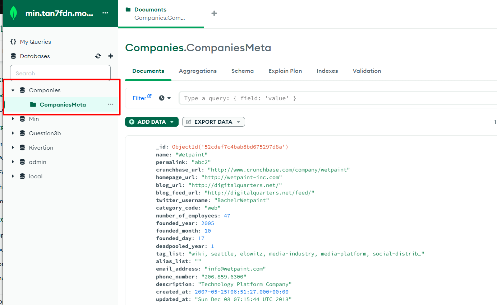
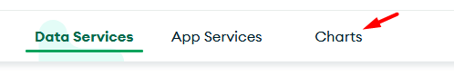
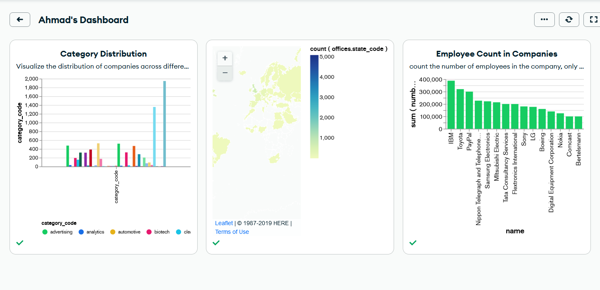
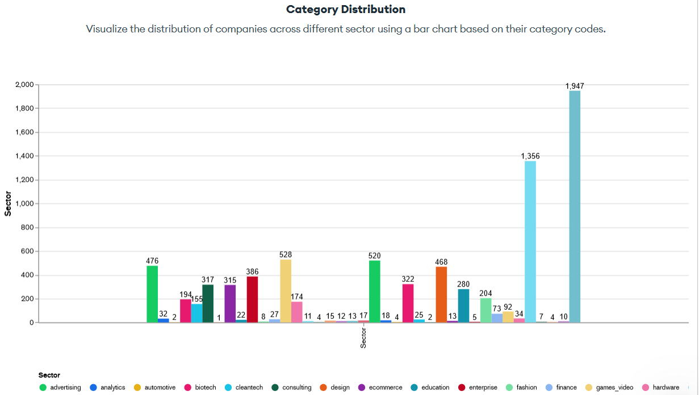
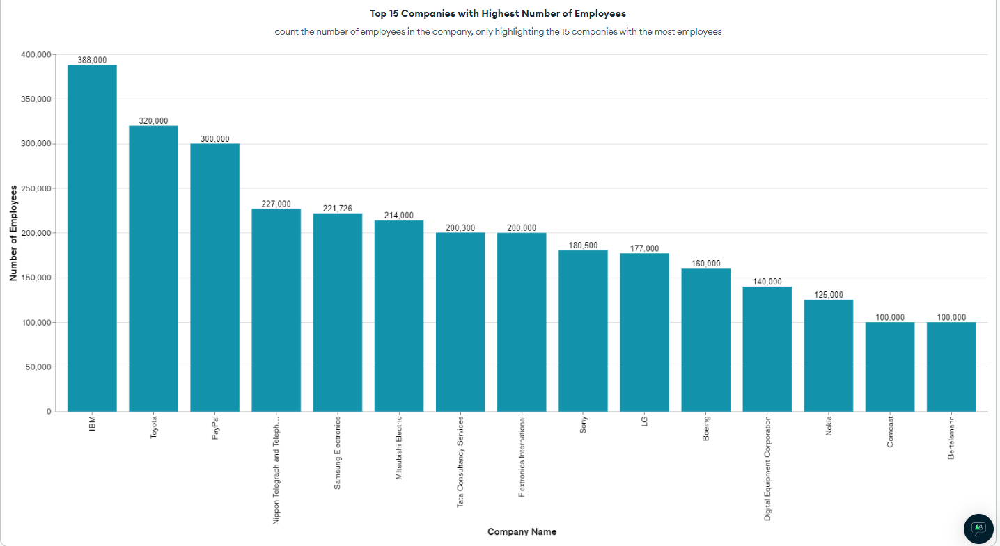
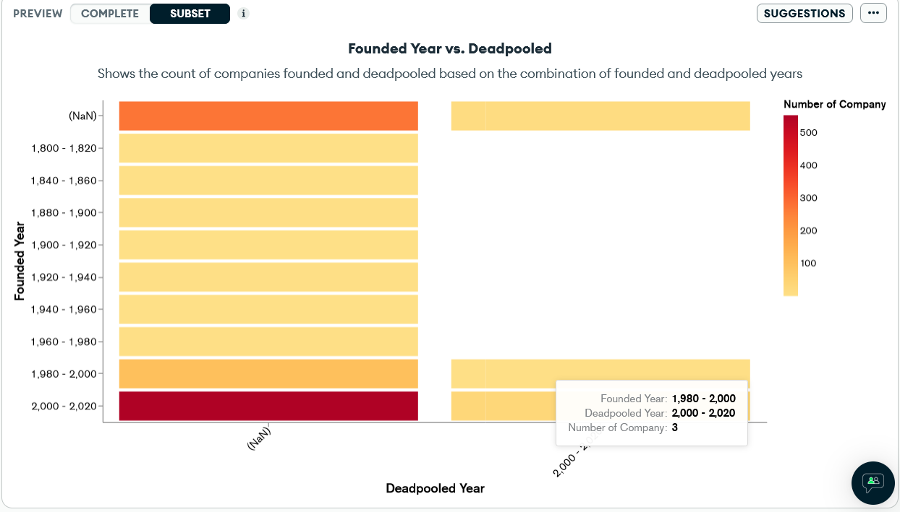

Don't forget to hit the :star: if you like this repo.

# Special Topic Data Engineering (SECP3843): Alternative Assessment

#### Name: AHMAD MUHAIMIN BIN AHMAD HAMABLI

#### Matric No.: A20EC0006

#### Dataset: Companies

## Question 5 (a)

Lorem ipsum dolor sit amet, consectetur adipisicing elit, sed do eiusmod tempor incididunt ut labore et dolore magna aliqua. Ut enim ad minim veniam, quis nostrud exercitation ullamco laboris nisi ut aliquip ex ea commodo consequat. Duis aute irure dolor in reprehenderit in voluptate velit esse cillum dolore eu fugiat nulla pariatur. Excepteur sint occaecat cupidatat non proident, sunt in culpa qui officia deserunt mollit anim id est laborum.

## Question 5 (b)

### Building Chart Process

1. Login our MongoDB account and create new cluster inside the MongoDB Atlas.

2. Then connect the MongoDB atlas via MongoDB Compass

3. Create New Database and Collection and Upload the `companies.json` file inside the newly created collection.

4. Then, go to MongoDB Atlas go to `Charts` option, select our intended dataset and start creating our dashboard

 
### Category Distribution Explanation

I use the `company_code` variable as our Y-axis in this chart since it represents a specific type of sector. While preparing the chart, we also filter the `null and empty string` value. To count each sector in the 'company_code' attributes, we use `COUNT BY VALUE`.

### Top 15 Companies with Highest Number of Employees

In this Chart, I am using two fields from the json file. For X Axis is `name` attribute that represent name for each company in the json file and for Y Axis is `number_of_employees` attribute. We limit the X Axis by toggling `Limit Results` and set the counter to 15. For Y Axis I use `SUM` in the aggregate option to sum up the number of employees for each companies.

### Founded Year vs. Deadpooled Year

In this Heatmap, I am linking the two fields which are `founded_year` and `deadpooled_year`. For X Axis I use `deadpooled_year` while for Y Axis I use `founded_year` and the intensity is `id` set it to count. I use 20 Years interval for `each deadpooled_year` and `founded_year`.

### 

## Contribution 🛠️

Please create an [Issue](https://github.com/drshahizan/special-topic-data-engineering/issues) for any improvements, suggestions or errors in the content.

You can also contact me using [Linkedin](https://www.linkedin.com/in/drshahizan/) for any other queries or feedback.

