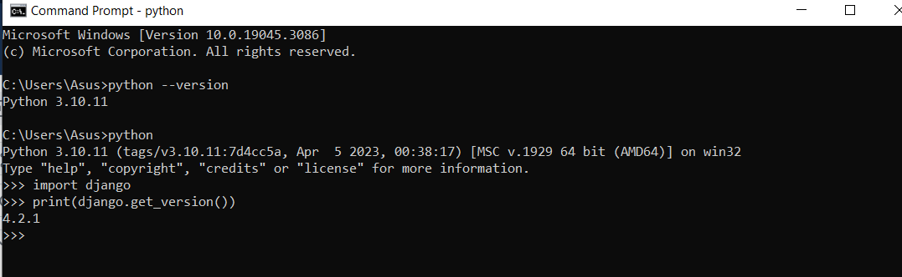
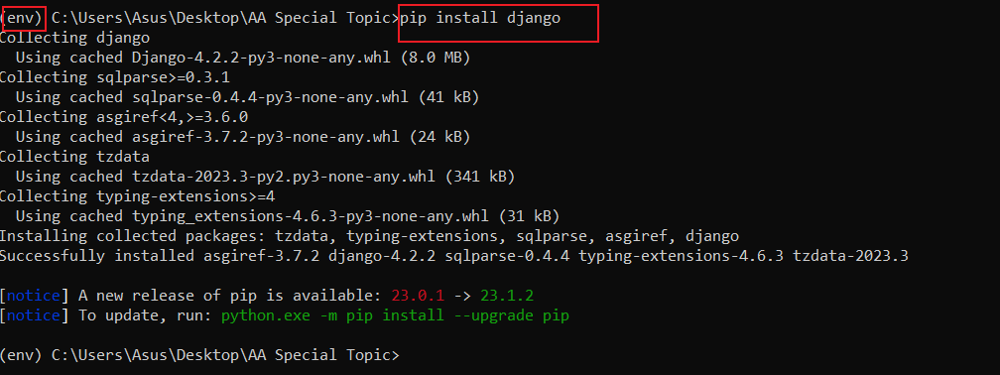
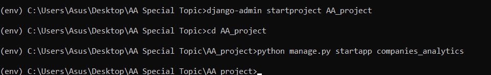

<a href="https://github.com/drshahizan/SECP3843/stargazers"></a>
<a href="https://github.com/drshahizan/SECP3843/network/members"></a>
<a href="https://github.com/drshahizan/SECP3843/pulls"></a>
<a href="https://github.com/drshahizan/SECP3843/issues"></a>
<a href="https://github.com/drshahizan/SECP3843/graphs/contributors"></a>


Don't forget to hit the :star: if you like this repo.

# Special Topic Data Engineering (SECP3843): Alternative Assessment

#### Name: Eddie Wong Chung Pheng
#### Matric No.: A20EC0031
#### Dataset: <a href="https://github.com/drshahizan/dataset/tree/main/mongodb/04-companies" >Companies</a>

## Question 1 (a)
### Step 1. Install Python & Django
Install Python 3 from the <a href=" www.python.org"> official website </a> according to your operating system. <br/>
Command: 
```
python 
```

Open cmd and  verify that Django is installed by importing it in Python and printing its version.
Command: 
```
python
>>> import django
>>> print(django.get_version())
```
</img>

### Step 2. Create & activate virtual environment
After successfully installed Python and Django. I need to create Django project and activate virtual environment. <br/>

Direct to project directory first and create a virtual environment for your Django project.

Command: 
```
python -m venv env
```

Activate your virtual environment. This will ensure that any packages you install will be isolated from the rest of your system

Command: 
```
env\Scripts\activate
```

### Step 3. Install Django Package 
After activate virtual environment, next is to install Django by using the pip command and install the latest Django release from the Python

Command: 
```
pip install django
```
</img>

### Step 4. Create Django Project & App
create a new Django project with the name AA_project. This will create a AA_project directory with some files inside it, such as manage.py, settings.py, urls.py, asgi.py, and wsgi.py. These files are responsible for configuring the project and setting up the web server interface.

Command: 
```
django-admin startproject AA_project
```

 Before create the Django app, cd to the project directory and this will be the container for the project and its apps. This will create a polls directory with some files inside it, such as models.py, views.py, tests.py, admin.py, apps.py, and migrations. These files are responsible for defining your app's data models, views, tests, admin interface, configuration, and database migrations.

 Command:
```
django-admin startproject AA_project
```
</img>

## Question 1 (b)


## Contribution 🛠️
Please create an [Issue](https://github.com/drshahizan/special-topic-data-engineering/issues) for any improvements, suggestions or errors in the content.

You can also contact me using [Linkedin](https://www.linkedin.com/in/drshahizan/) for any other queries or feedback.

[](https://visitorbadge.io/status?path=https%3A%2F%2Fgithub.com%2Fdrshahizan)


