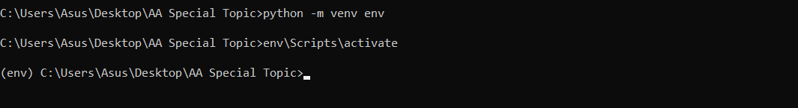
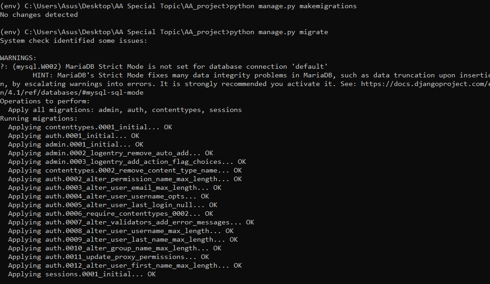
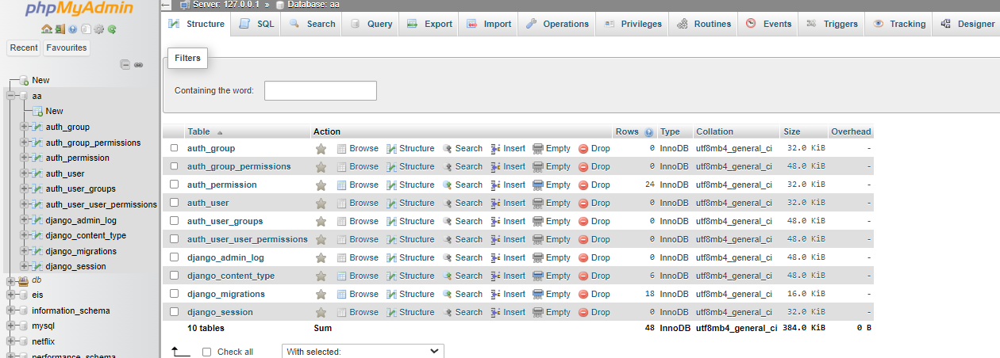
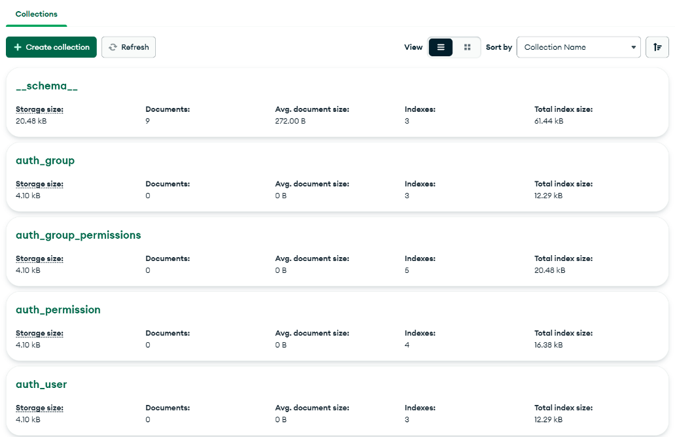
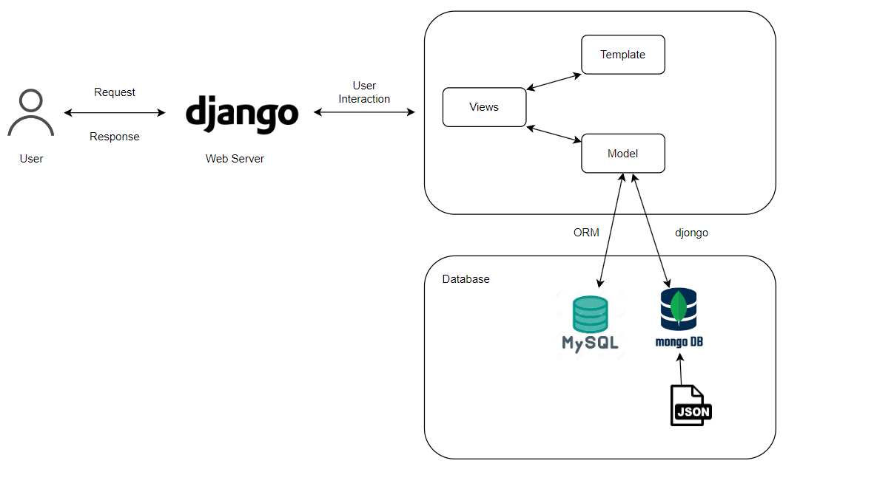

<a href="https://github.com/drshahizan/SECP3843/stargazers"></a>
<a href="https://github.com/drshahizan/SECP3843/network/members"></a>
<a href="https://github.com/drshahizan/SECP3843/pulls"></a>
<a href="https://github.com/drshahizan/SECP3843/issues"></a>
<a href="https://github.com/drshahizan/SECP3843/graphs/contributors"></a>


Don't forget to hit the :star: if you like this repo.

# Special Topic Data Engineering (SECP3843): Alternative Assessment

#### Name: Eddie Wong Chung Pheng
#### Matric No.: A20EC0031
#### Dataset: <a href="https://github.com/drshahizan/dataset/tree/main/mongodb/04-companies" >Companies</a>

## Question 1 (a)
Below are the brief introduction of the 5 servers that will be used in this project.

1. Django Application Server:<br>
   This is a server that runs Django web application using a Python web framework. It handles requests from clients, executes your code, and returns responses. It can be use by different web servers to run Django app, such as Apache, Nginx, Gunicorn, or uWSGI

2. MySQL Database Server:<br>
   This is a server that runs MySQL, a relational database management system (RDBMS) that uses SQL (Structured Query Language) to store and manipulate data. MySQL is one of the most popular and widely used databases in the world. It can handle large amounts of data and support transactions, replication, and backup.

3. MongoDB Database Server:<br>
   This is a server that runs MongoDB, a document-oriented database that stores data in JSON-like documents. MongoDB is a NoSQL database that is designed for high performance, scalability, and flexibility. MongoDB can handle unstructured and semi-structured data, such as chats, real-time streams, feeds, and surveys.

4. Caching Server:<br>
   This is a server that stores frequently accessed data or web pages in memory for faster retrieval. A caching server can reduce the latency and bandwidth consumption of your web application by serving cached data instead of requesting it from the origin server every time. A caching server can also improve the user experience and SEO (Search Engine Optimization) of your web application by delivering faster responses.

5. Load Balancer or Reverse Proxy:<br>
   This is a server that distributes incoming requests to multiple backend servers based on various criteria, such as load, availability, or location. A load balancer or reverse proxy can improve the performance, reliability, and security of your web application by reducing the load on individual servers, preventing server overload or failure, and providing encryption or authentication.

### Step 1: Install Python & Django
Install Python 3 from the <a href=" www.python.org"> official website </a> according to your operating system and verify that Python is installed <br/>
Command: 
```
python --version
```

Open cmd and  verify that Django is installed by importing it in Python and printing its version. <br/>
Command: 
```
python
>>> import django
>>> print(django.get_version())
```
</img>

### Step 2: Create & activate virtual environment
After successfully installed Python and Django. I need to create Django project and activate virtual environment. 
Direct to project directory first and create a virtual environment for your Django project.

Command: 
```
python -m venv env
```

Activate your virtual environment. This will ensure that any packages you install will be isolated from the rest of your system

Command: 
```
env\Scripts\activate
```
</img>

### Step 3: Install Django Package 
After activate virtual environment, next is to install Django by using the pip command and install the latest Django release from the Python

Command: 
```
pip install django
```
</img>

### Step 4: Create Django Project & App
Next, create a new Django project with the name AA_project. This will create a AA_project directory with some files inside it, such as manage.py, settings.py, urls.py, asgi.py, and wsgi.py. These files are responsible for configuring the project and setting up the web server interface.

Command: 
```
django-admin startproject AA_project

```

 Before create the Django app, cd to the project directory and this will be the container for the project and its apps. This will create a polls directory with some files inside it, such as models.py, views.py, tests.py, admin.py, apps.py, and migrations. These files are responsible for defining your app's data models, views, tests, admin interface, configuration, and database migrations.

Command:
```
cd AA_project
python manage.py startapp companies_analytics
```
</img>

### Step 5: Configure the Database
To configure both MySQL and MongoDB databases in Django project, ppen the settings.py file located in the project's directory and update the DATABASES setting to configure both MySQL and MongoDB databases. You need to specify the database engine, name, user, password, host, and port for each database as shown below.

```
DATABASES = {
    'default': {
        'ENGINE': 'django.db.backends.mysql',
        'NAME': 'AA',
        'USER': 'root',
        'HOST': 'localhost',
        'PORT': '3306',
    },

    'mongodb': {
        'ENGINE': 'djongo',
        'NAME': 'AA',
        'ENFORCE_SCHEMA': False,
        'CLIENT': {
            'host': 'localhost:27017',
            'port': 27017,
            'username': '',
            'password': '',
        }
    }
}
```

### Step 6: Define Django Models
To create a model, you need to subclass django.db.models.Model and declare the fields as class attributes. Open the models.py file in ```companies_analytics``` app directory.

Command:
```
# Create your models here.
from django.db import models

# Create your models here.
class Company(models.Model):

    name = models.CharField(max_length=200)
    permalink = models.CharField(max_length=200)
    crunchbase_url = models.URLField()
    homepage_url = models.URLField()
    blog_url = models.URLField()
    blog_feed_url = models.URLField()
    twitter_username = models.CharField(max_length=50)
    category = models.ForeignKey(Category, on_delete=models.CASCADE) # A foreign key field that references the Category model
    number_of_employees = models.IntegerField()
    founded_year = models.IntegerField()
    founded_month = models.IntegerField()
    founded_day = models.IntegerField()
    deadpooled_year = models.IntegerField(null=True) # A nullable field that allows empty values
    tag_list = models.TextField() # A text field that can store long strings
    alias_list = models.TextField()
    email_address = models.EmailField()
    phone_number = models.CharField(max_length=20)
    description = models.CharField(max_length=200)
    overview = models.TextField()

def __str__(self):
        return str(self.id)

```
### Step 7:Create Migration
To create migrations for these models, I need to use the manage.py command with the makemigrations option.

```
python manage.py makemigrations
```

</img> </br>

```
python manage.py migrate
```
</img>

```
python manage.py migrate --database=mongodb
```
</img>


## Question 1 (b)
</img>

#### User
User can send requests to the web server, such as viewing a web page, submitting a form, or calling an API. The web server then responds to the user by sending back the requested data or content. The user can also provide feedback to the web server, such as rating, commenting, or liking a web page or an API response. The user component is important for understanding the user needs, preferences, and behaviors, which can help improve the usability and functionality of the web application.


#### Django Web Server
This is the component that handles the requests from the clients and serves the web pages or API responses. You can use Django as your web framework to build your web server, as it provides a high-level abstraction of common web development tasks, such as URL routing, template rendering, authentication, etc. Django also supports multiple database backends, which allows you to use MySQL and MongoDB in your system.

#### Database (MySQL & MongoDB)
These are the components that persistently store and manage data. </br>
-MySQL: MySQL is a relational database that uses tables, rows, and columns to store structured data. It supports SQL queries, transactions, and joins, which can be useful for performing complex operations on data.</br>

-MongoDB: MongoDB is a document database that uses collections, documents, and fields to store unstructured or semi-structured data. It supports dynamic schemas, flexible queries, and aggregation pipelines, which can be useful for handling large amounts of data or data with varying structures.

#### External Database Integration Libraries
-ORM: stands for Object-Relational Mapping, a technique that maps Python objects to database tables and allows developers to manipulate data using object-oriented programming. Django ORM uses the active record pattern, which means each model class corresponds to a single database table and each model instance corresponds to a single row in the table. </br>

-Djongo: It is a Django database connector that allows Django applications to use MongoDB, a popular NoSQL database, as the backend. Djongo also supports features such as embedded models, array references, and raw queries.

#### Dataset (JSON)
This is the component that stores the data that want to use in web application. I use JSON as the data format, as it is a lightweight and human-readable format that can be easily parsed and manipulated by Python. JSON also supports nested structures, which can be useful for storing complex data. 

## Contribution 🛠️
Please create an [Issue](https://github.com/drshahizan/special-topic-data-engineering/issues) for any improvements, suggestions or errors in the content.

You can also contact me using [Linkedin](https://www.linkedin.com/in/drshahizan/) for any other queries or feedback.

[](https://visitorbadge.io/status?path=https%3A%2F%2Fgithub.com%2Fdrshahizan)


