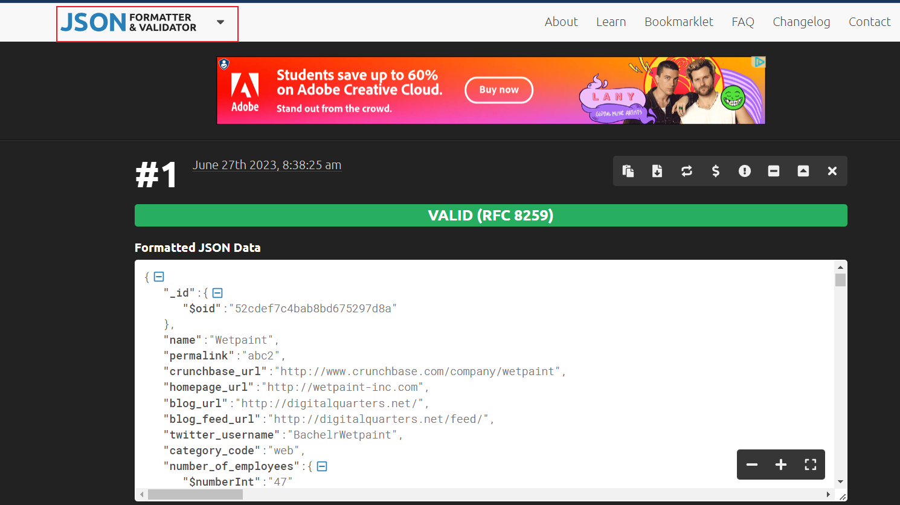
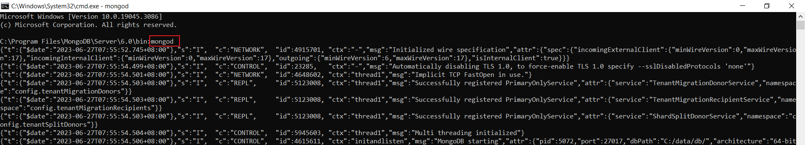
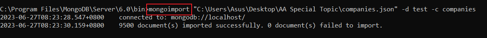
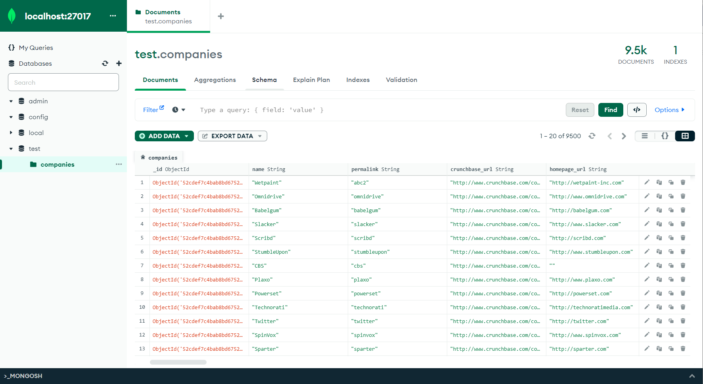
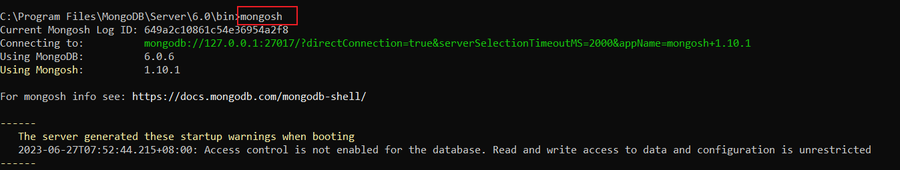

Don't forget to hit the :star: if you like this repo.

# Special Topic Data Engineering (SECP3843): Alternative Assessment

#### Name: Eddie Wong Chung Pheng
#### Matric No.: A20EC0031
#### Dataset: <a href="https://github.com/drshahizan/dataset/tree/main/mongodb/04-companies" >Companies</a>

## Question 2 (a)
### Prerequisites
Download and Install All Required Software including:
1. MongoDB Shell
2. MongoDB Command Line Database Tools
3. MongoDB Community Server

#### Step 1: Prepare the JSON File
Download the dataset: <a href="https://github.com/drshahizan/dataset/tree/main/mongodb/04-companies" >Companies Dataset</a>
After download the dataset, I need to make sure that it follows the JSON syntax rules and can be import into MongoDB. I use the online tools (JSON Formatter) to validate the JSON file.
</img>

#### Step 2: Start the MongoDB Server
To start MongoDB server, run the mongod command in your terminal or command prompt. This will launch the MongoDB server and listen for connections on port 27017 by default. 
</img>
 
### Step 3. Import Dataset
In cmd enter `mongoimport "C:\Users\Asus\Desktop\AA Special Topic\companies.json" -d test -c companies`.
The command format is `mongoimport "dataset_location_path" -d name_of_database -c name_of_collection`
This command will import a JSON file named companies.json into a collection named companies in a database named test
</img>

View the collection at MongoDB Compass
</img>

### Step 3. Access MongoDB Shell
Enter `mongosh` in the terminal to access the MongoDB shell.
</img>

## Question 2 (b)
Lorem ipsum dolor sit amet, consectetur adipisicing elit, sed do eiusmod tempor incididunt ut labore et dolore magna aliqua. Ut enim ad minim veniam, quis nostrud exercitation ullamco laboris nisi ut aliquip ex ea commodo consequat. Duis aute irure dolor in reprehenderit in voluptate velit esse cillum dolore eu fugiat nulla pariatur. Excepteur sint occaecat cupidatat non proident, sunt in culpa qui officia deserunt mollit anim id est laborum.

## Contribution 🛠️
Please create an [Issue](https://github.com/drshahizan/special-topic-data-engineering/issues) for any improvements, suggestions or errors in the content.

You can also contact me using [Linkedin](https://www.linkedin.com/in/drshahizan/) for any other queries or feedback.

