<a href="https://github.com/drshahizan/SECP3843/stargazers"></a>
<a href="https://github.com/drshahizan/SECP3843/network/members"></a>
<a href="https://github.com/drshahizan/SECP3843/pulls"></a>
<a href="https://github.com/drshahizan/SECP3843/issues"></a>
<a href="https://github.com/drshahizan/SECP3843/graphs/contributors"></a>


Don't forget to hit the :star: if you like this repo.

# Special Topic Data Engineering (SECP3843): Alternative Assessment

#### Name: Eddie Wong Chung Pheng
#### Matric No.: A20EC0031
#### Dataset: <a href="https://github.com/drshahizan/dataset/tree/main/mongodb/04-companies" >Companies</a>

## Question 2 (a)
### Prerequisites
Download and Install All Required Software including:
1. MongoDB Shell
2. MongoDB Command Line Database Tools
3. MongoDB Community Server

#### Step 1: Prepare the JSON File
Download the dataset: <a href="https://github.com/drshahizan/dataset/tree/main/mongodb/04-companies" >Companies Dataset</a>. <br/>
After download the dataset, I need to make sure that it follows the JSON syntax rules and can be import into MongoDB. I use the online tools (JSON Formatter) to validate the JSON file.
</img>

#### Step 2: Start the MongoDB Server
To start MongoDB server, run the mongod command in your terminal or command prompt. This will launch the MongoDB server and listen for connections on port 27017 by default. 
</img>
 
#### Step 3. Import Dataset
In cmd enter `mongoimport "C:\Users\Asus\Desktop\AA Special Topic\companies.json" -d test -c companies`.
The command format is `mongoimport "dataset_location_path" -d name_of_database -c name_of_collection`
This command will import a JSON file named companies.json into a collection named companies in a database named test
</img>

View the collection at MongoDB Compass
</img>

#### Step 4. Access MongoDB Shell
Enter `mongosh` in the terminal to access the MongoDB shell.
</img>

#### Step 5. View and check the data in MongoDB
Enter `showdbs` to view the databases in MongoDB Shell and `db.companies.find().limit(3)` is to query the first 3 data from the dataset.
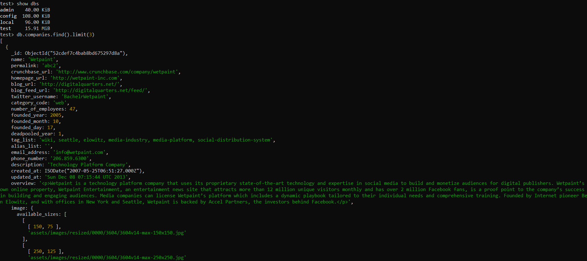</img>

## Question 2 (b)
#### 1. Create Query
Use `insertOne()` method to insert a new document into the collection.

This is my query:
```
db.companies.insertOne({
  "name": "Eddie",
  "permalink": "link",
  "crunchbase_url": "",
  "homepage_url": "",
  "blog_url": "",
  "blog_feed_url": "",
  "twitter_username": "Prowong01",
  "category_code": "web",
  "number_of_employees": 88,
  "founded_year": 2020,
  "founded_month": 7,
  "founded_day": 100,
  "deadpooled_year": 1,
  "tag_list": "wiki",
  "alias_list": "",
  "email_address": "eddie@google.com",
  "phone_number": "01118767163",
     });
```
MongoDB Shell:
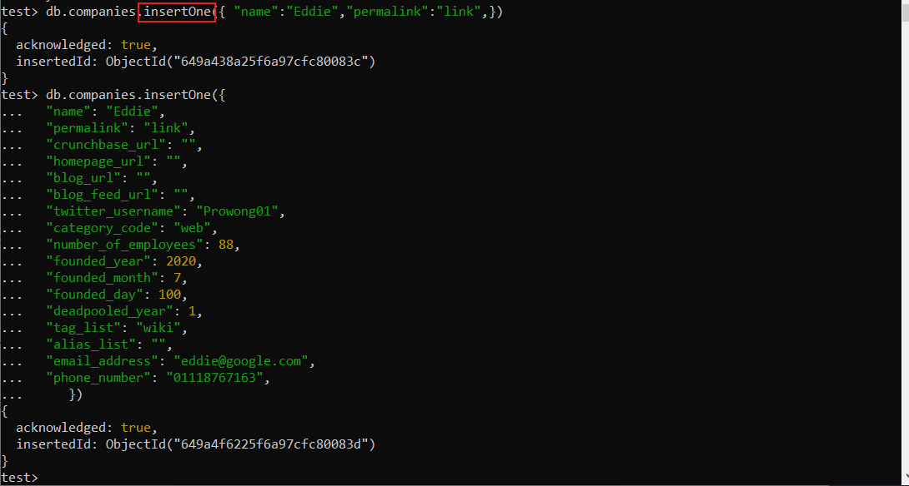</img>

MongoDB Compass:
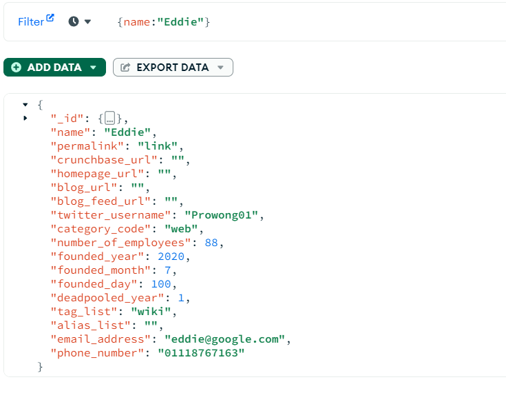</img>

#### 2. Read Query
Use `findOne()` method to query all documents from the collection based on the criteria

This is my query:
```
db.companies.find({ "email_address": "eddie@google.com"});
```

MongoDB Shell:
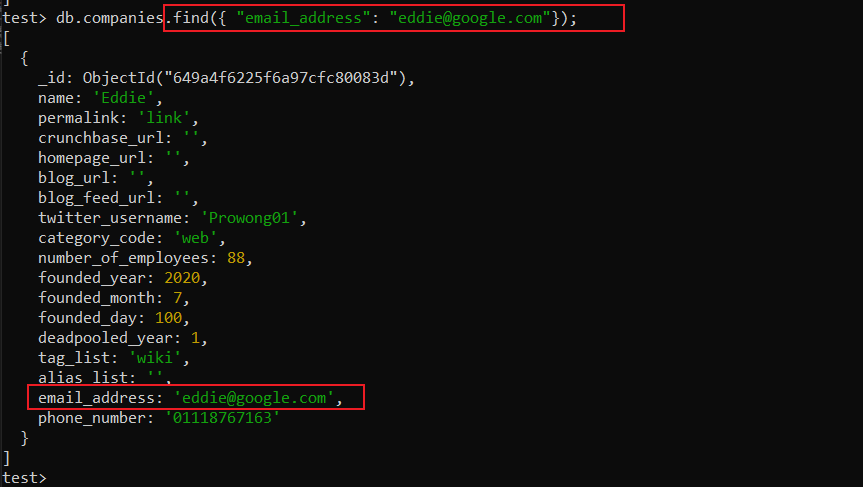</img>

MongoDB Compass:
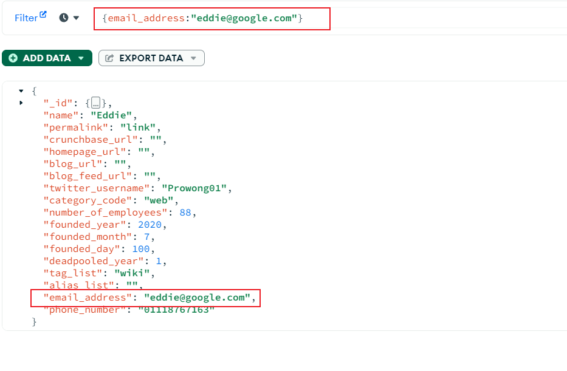</img>

#### 3. Update Query
##### a) updateOne
Use `updateOne()` method to modifies a single document in a collection that matches a filter condition.

This is my query:
```
db.companies.updateOne({ "number_of_employees": 88}, {$set: {"number_of_employees":999}});
```

MongoDB Shell:
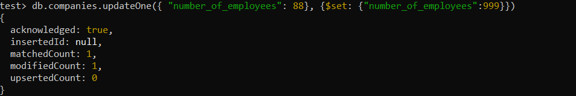</img>

MongoDB Compass:
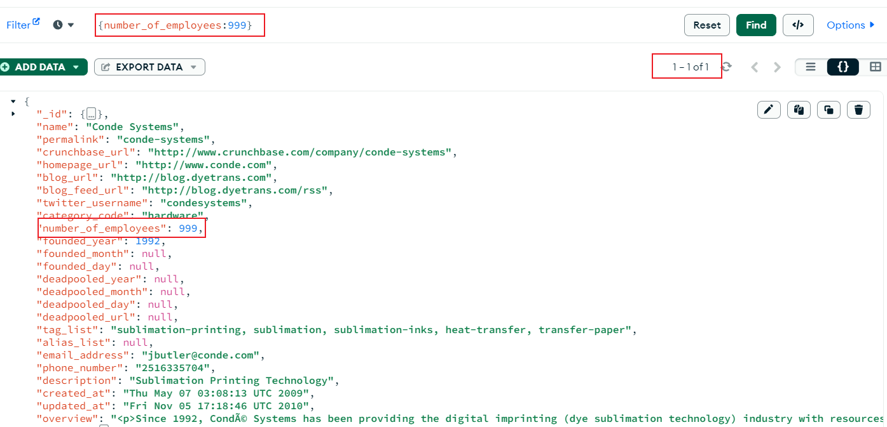</img>
There is only 1 document is modified the number_of_employess to 999 as i use the updateOne


##### b) updateMany
Use `updateMany()` method to modifies one or more documents in a collection that match a filter condition.

This is my query:
```
db.companies.updateMany({ "founded_month": 12}, 
{$set: {"founded_month":11}});
```

MongoDB Shell:
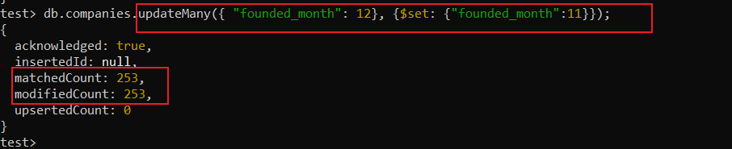</img>

MongoDB Compass (Before Query):
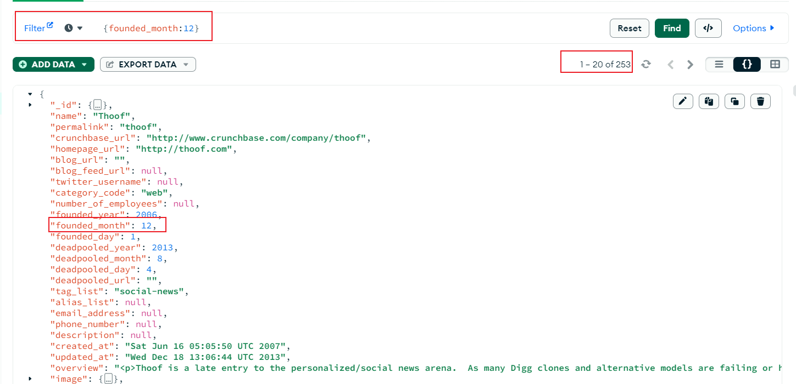</img>

MongoDB Compass (After Query):
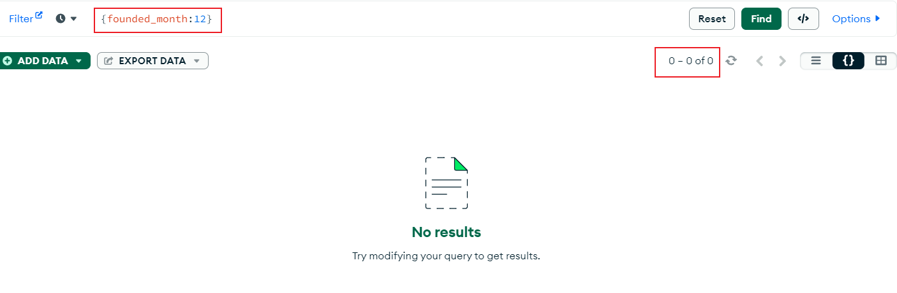</img>
The query updates all documents in the companies collection where the "founded_month" field is set to 11.

 #### 4. Delete Query
 Use `deleteOne()` method to delete at most one document that matches the filter condition. If multiple documents match the filter, only the first one is deleted.

 This is my query:
```
db.companies.deleteOne({"name": "Eddie"});
```
MongoDB Shell:
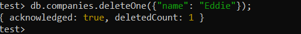</img>

MongoDB Compass (Before Query):
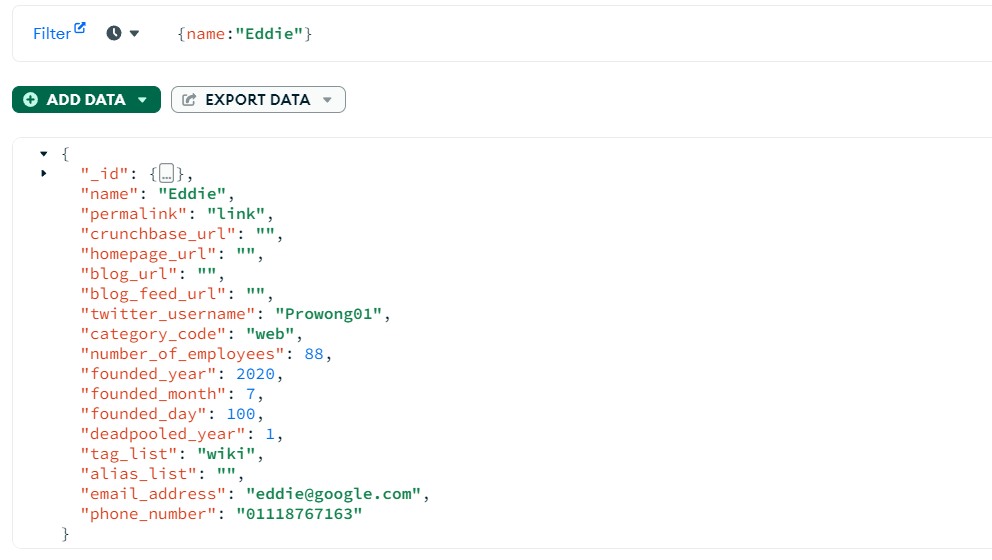</img>

MongoDB Compass (After Query):
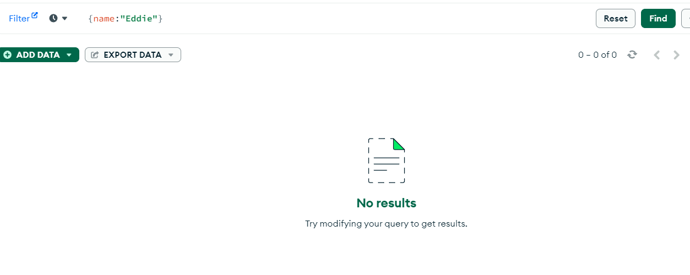</img>

## Contribution 🛠️
Please create an [Issue](https://github.com/drshahizan/special-topic-data-engineering/issues) for any improvements, suggestions or errors in the content.

You can also contact me using [Linkedin](https://www.linkedin.com/in/drshahizan/) for any other queries or feedback.

[](https://visitorbadge.io/status?path=https%3A%2F%2Fgithub.com%2Fdrshahizan)


