<a href="https://github.com/drshahizan/SECP3843/stargazers"></a>
<a href="https://github.com/drshahizan/SECP3843/network/members"></a>
<a href="https://github.com/drshahizan/SECP3843/pulls"></a>
<a href="https://github.com/drshahizan/SECP3843/issues"></a>
<a href="https://github.com/drshahizan/SECP3843/graphs/contributors"></a>


Don't forget to hit the :star: if you like this repo.

# Special Topic Data Engineering (SECP3843): Alternative Assessment

#### Name: Chloe Racquelmae Kennedy
#### Matric No.: A20EC0026
#### Dataset: City Inspections	

## Question 2 (a)
### 1. Prepare JSON file 
Download the [City Inspections](https://github.com/drshahizan/dataset/tree/main/mongodb/08-city_inspections) dataset into the pc. 

### 2. Start MongoDB server
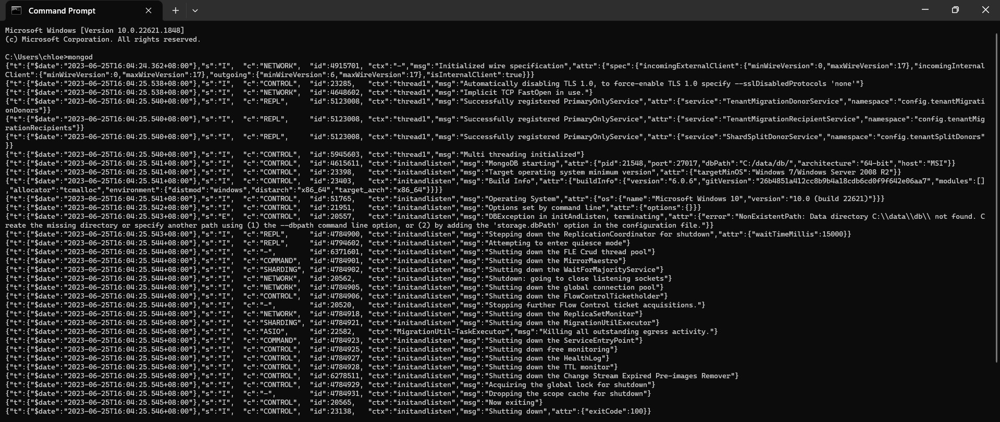</img>
Open Command Prompt and type `mongod` to start the MongoDB server.

### 3. Import Dataset
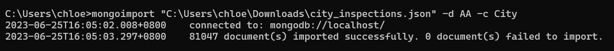</img>
In the terminal, type `mongoimport "C:\Users\chloe\Downloads\city_inspections.json" -d AA -c City` to import the dataset into MongoDB. The database and collection are automatically created as `-d AA` specifies the name of the database on which to run the mongoimport and `-c City` specifies the collection to import.
<br>
<br>
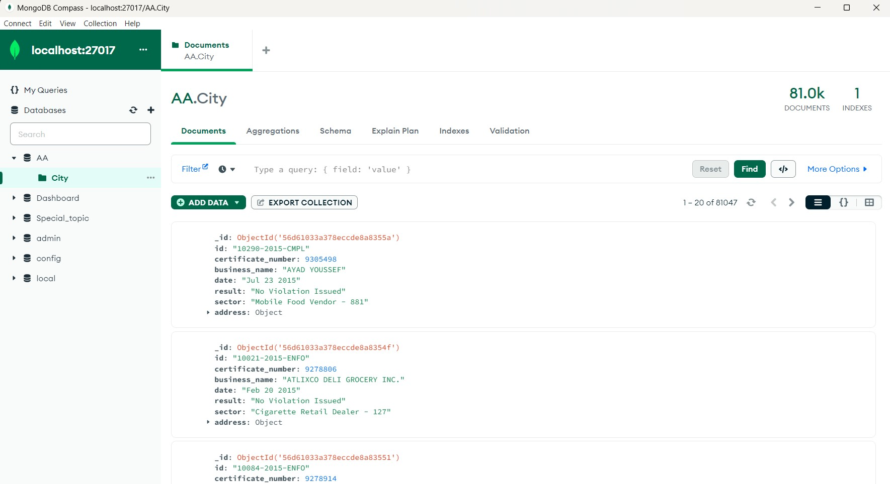</img>
Once the dataset is imported, it could be seen in MongoDB Compass.

### 4. Access MongoDB shell
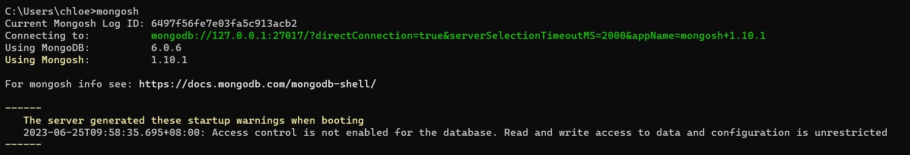</img>
In the terminal, type `mongosh` to access MongoDB shell.

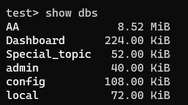</img>

To see all available databases, type `show dbs`.

## Question 2 (b)
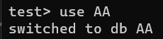</img>

In the terminal, type 'use AA' to switch to the AA database.

### i. Create
`db.collection.insertOne()` method inserts a single document into a collection. If the document does not specify an _id field, MongoDB adds the _id field with an ObjectId value to the new document. 

To insert a new document into the AA.City collection:
```json
db.City.insertOne(
    {
        id: "71101-2023-ENFO",
        certificate_number: 2506202,
        business_name: "TOKYO THRIFT STORE",
        date: "Jun 25 2023",
        result: "No Violation Issued",
        sector: "Wearing Apparel - 450",
        address: ["SENAI", 81400, "JLN TERMINAL 5", 22]
    }
)
```
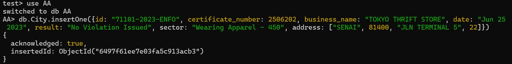</img>
<br>
<br>
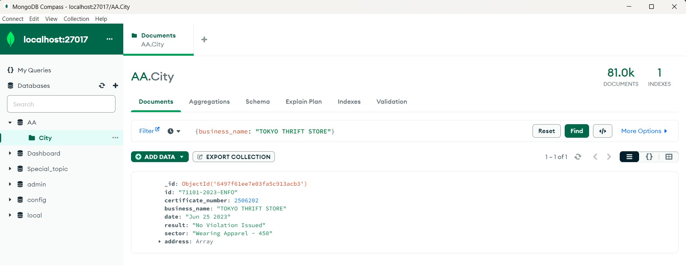</img>
The newly created document can be found in the database.

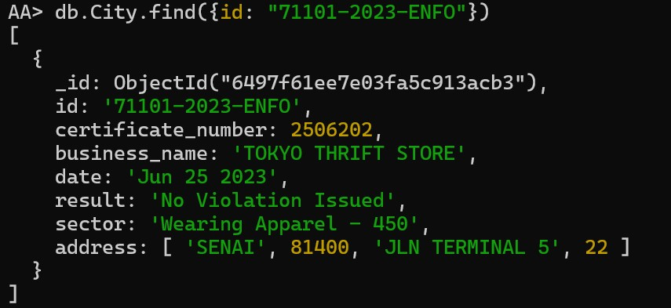</img>

Or using the find method in the terminal. 

### ii. Read
`db.collection.find()` method reads documents in the collection. To select documents which match an equality condition, specify the condition as a `<field>:<value>` pair in the query filter document.

To return all inspections where the id equals 10312-2015-ENFO from the AA.City collection:
```json
db.City.find( { id: "10312-2015-ENFO" } )
```
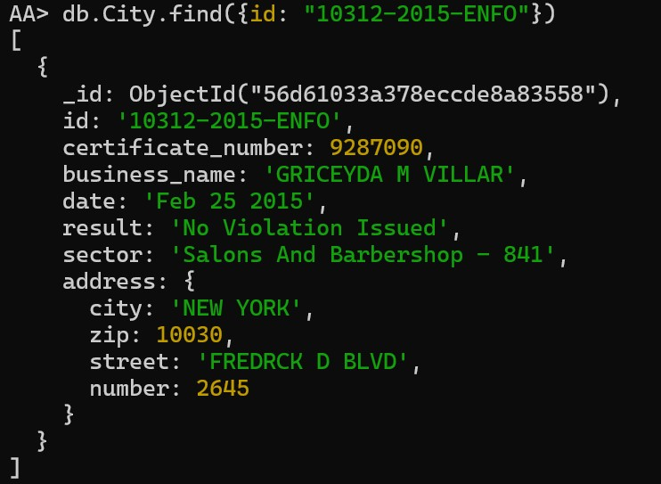</img>
<br>
<br>
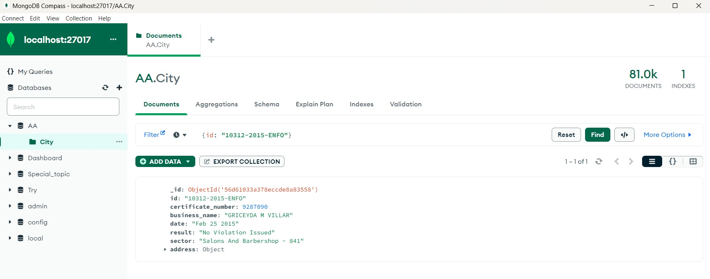</img>
The document can also be found in the database.

### iii. Update
`db.collection.updateOne()` method updates the first document that matches a specified filter.

To update the first document in the AA.City collection where certificate_number equals 10003479:
```json
db.City.updateOne( 
    { certificate_number: 10003479 },

    {
        $set: { address: ["NEW YORK", 10456, "WEBSTER AVE BRONX", 1135]}
    }
)
```
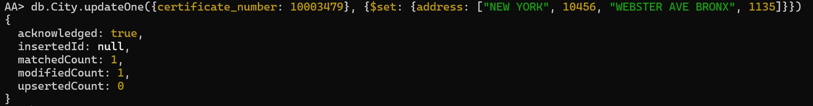</img>
<br>
<br>
</img>
Before the document was updated, the address is null.

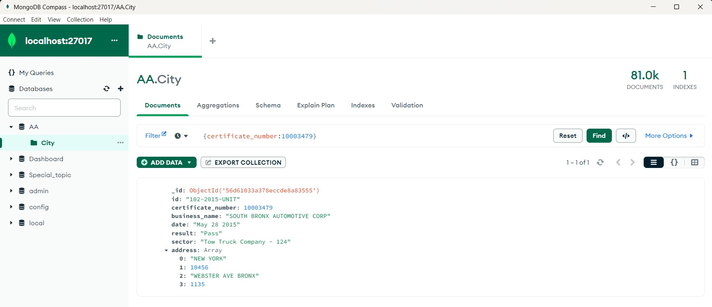</img>
The updated document can be found in the database.

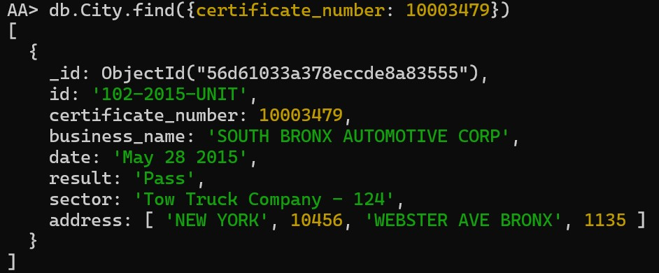</img>

Or using the find method in the terminal. 

`db.collection.updateMany()` method updates all documents that match a specified filter.

To update all documents in the AA.City collection where business_name is null and sector equals "Mobile Food Vendor - 881":
```json
db.City.updateMany(
  { business_name: "", sector:"Mobile Food Vendor - 881" },

  {
    $set: { business_name: "Kitchen Express" }
  }
)
```
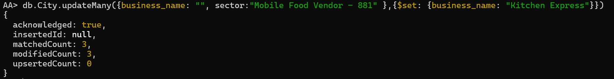</img>
<br>
<br>
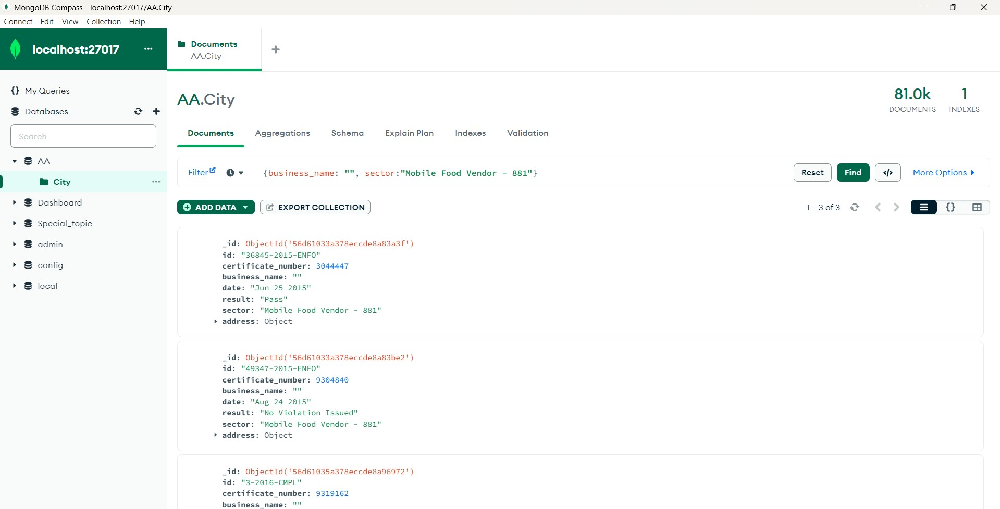</img>
Before the document was updated, the business_name is null.

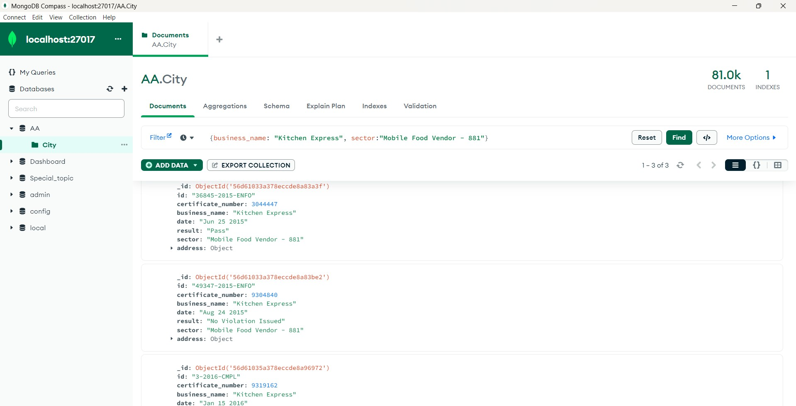</img>
The updated document can be found in the database.

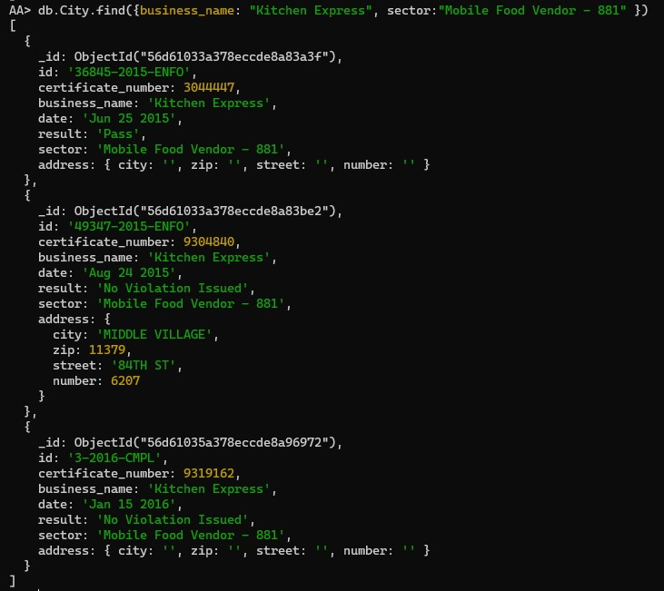</img>

Or using the find method in the terminal. 

### iv. Delete
`db.collection.deleteOne()` method deletes the first document that matches a specified filter.

To delete the first document in the AA.City collection where result equals "Unable to Locate":
```json
db.City.deleteOne( { result: "Unable to Locate" } )
```
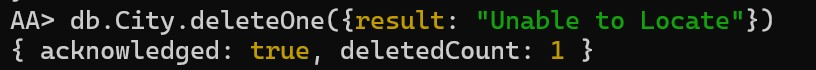</img>
<br>
<br>
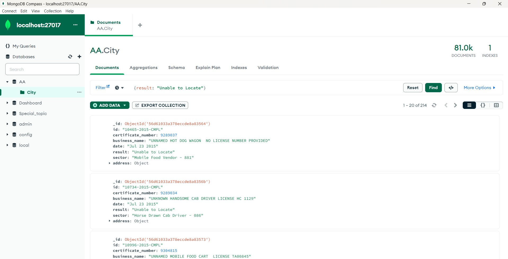</img>
Before the document was deleted, the total number of documents is 214.

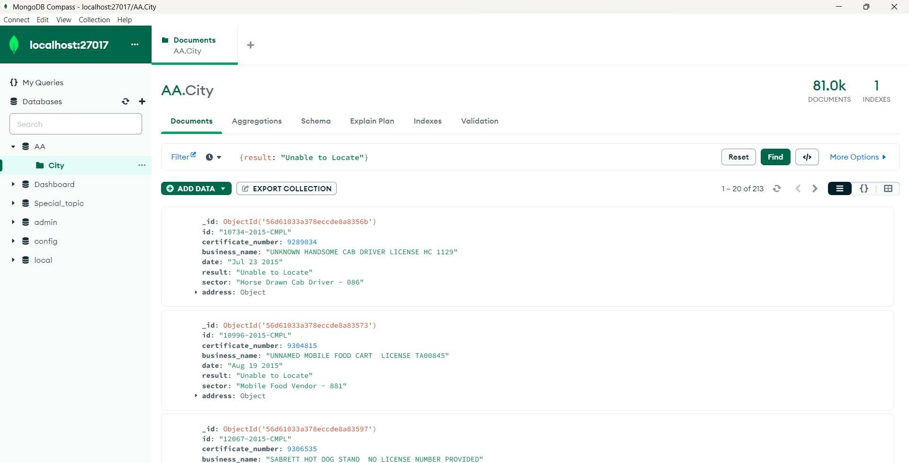</img>
After the document was deleted, the total number of documents is decrease to 213.

</img>
The delete document cannot be found in the database.

## Contribution 🛠️
Please create an [Issue](https://github.com/drshahizan/special-topic-data-engineering/issues) for any improvements, suggestions or errors in the content.

You can also contact me using [Linkedin](https://www.linkedin.com/in/drshahizan/) for any other queries or feedback.

[](https://visitorbadge.io/status?path=https%3A%2F%2Fgithub.com%2Fdrshahizan)

