<a href="https://github.com/drshahizan/SECP3843/stargazers"></a>
<a href="https://github.com/drshahizan/SECP3843/network/members"></a>
<a href="https://github.com/drshahizan/SECP3843/pulls"></a>
<a href="https://github.com/drshahizan/SECP3843/issues"></a>
<a href="https://github.com/drshahizan/SECP3843/graphs/contributors"></a>


Don't forget to hit the :star: if you like this repo.

# Special Topic Data Engineering (SECP3843): Alternative Assessment

#### Name: Chloe Racquelmae Kennedy
#### Matric No.: A20EC0026
#### Dataset: City Inspections	

## Question 3 (a)
#### Prerequisites
To utilize Django, a Python installation is required which can be obtained by downloading it from the [official website](https://www.python.org/downloads/).

### 1. Create & activate virtual environment
To create a virtual environment, run `python -m venv env` in your command prompt. Once the virtual environment is created, activate it by typing `env\Scripts\activate`.
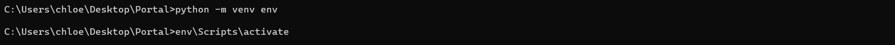</img>

### 2. Install Django
With the virtual environment activated, type `pip install django` to install Django.
</img>

### 3. Create project & app
Use `django-admin startproject portalproject` to create the Django project. Then, navigate to the project directory and create a new app by running `python manage.py startapp account`. 
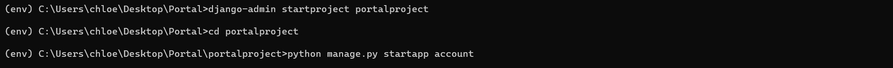</img>

Once the app is created, add the app name in the INSTALLED_APPS array of settings.py file.<br>
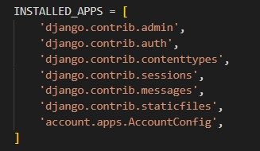</img>

### 4. Install package 
After creating the database in MySQL database servers, install the required package by running this command: 
- `pip install mysqlclient`<br>

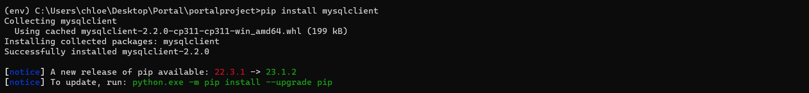</img>

### 5. Configure the database
To use MYSQL as the database, modify the `settings.py` file in the project folder.<br>
</img>

### 6. Create urls
Create a new file `urls.py` in the project folder and type the following code:<br>
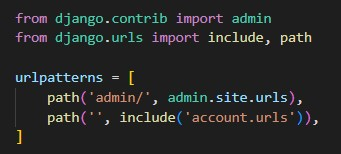</img>

Then, add the following code in the `urls.py` of the account(app) folder:<br>
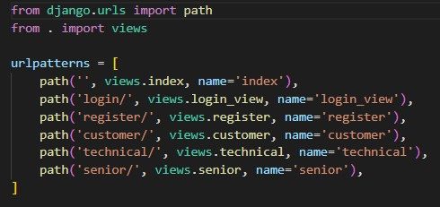</img>

### 7. Define model
In the `models.py`, define the model that represents the user types `customers`, `technical workers` and `senior management`.
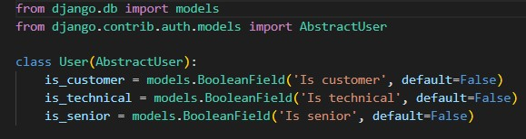</img>

Then add the following code in the `settings.py` file:
```
AUTH_USER_MODEL = "account.User"
```

### 8. Migrate database
Once the models are defined, create the database tables by running `python manage.py makemigrations`. Then, apply the migration by using this command `python manage.py migrate`

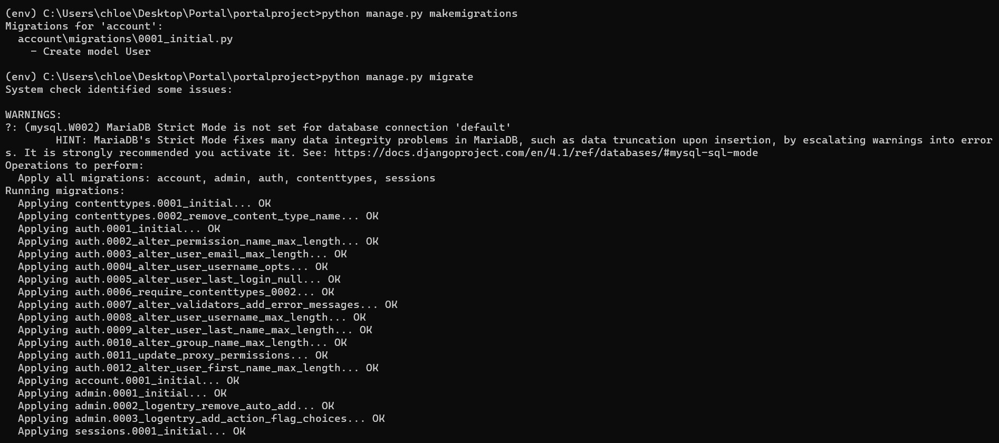</img><br>

Results:
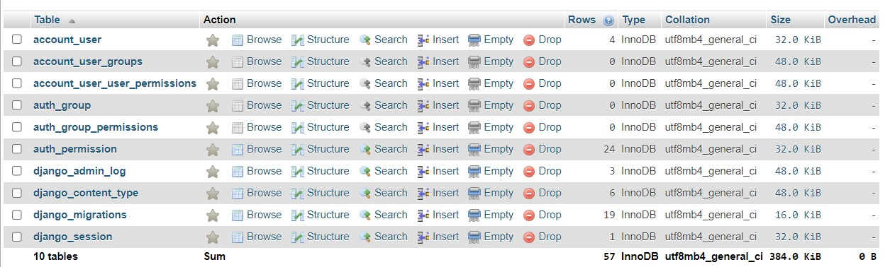</img>

### 8. Create forms
Create a new file `forms.py` in the account(app) folder.
- Login form<br>

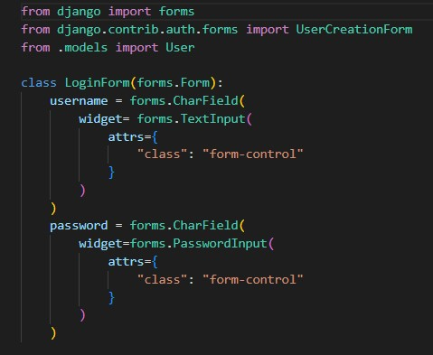</img>

- Register form

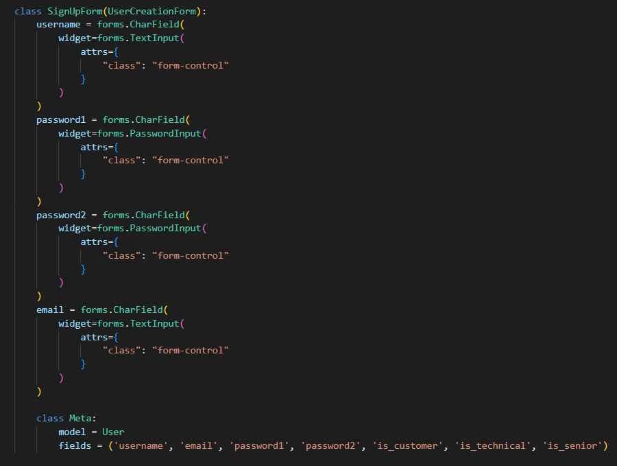</img>

After creating the forms, update the views with the following code:
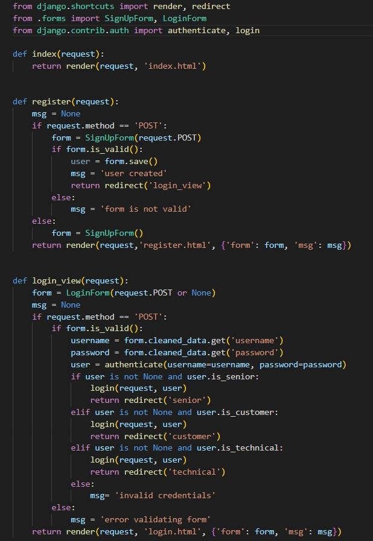</img>
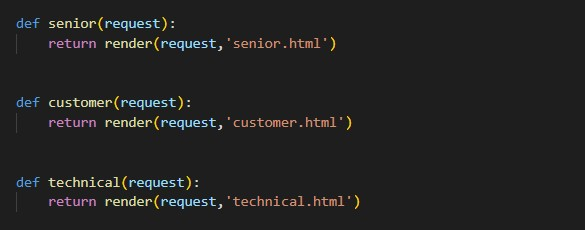</img>

### 8. Create templates
- index.html
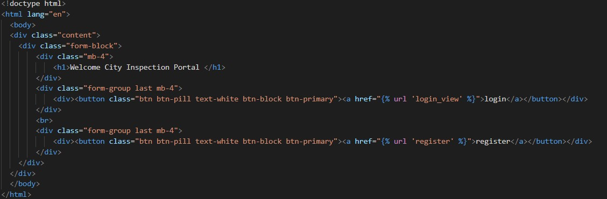</img>
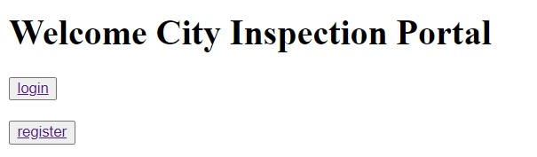</img>

- login.html<br>
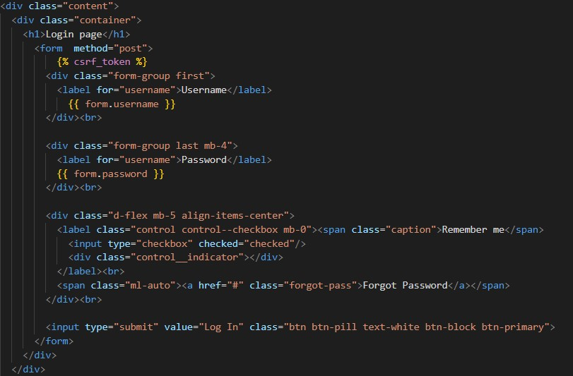</img>
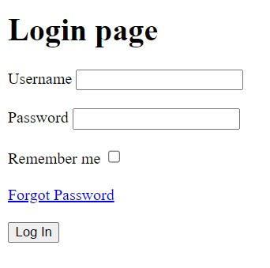</img>

- register.html<br>
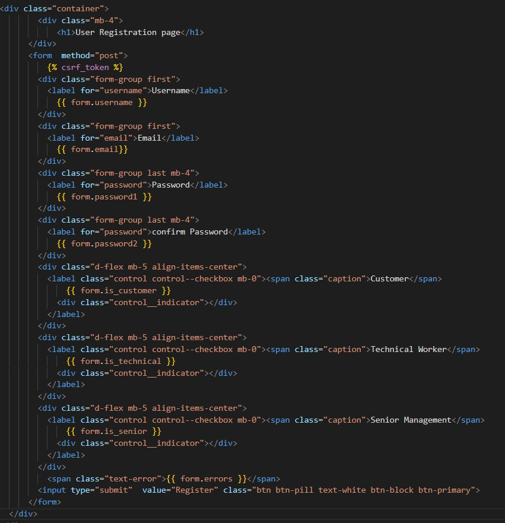</img>
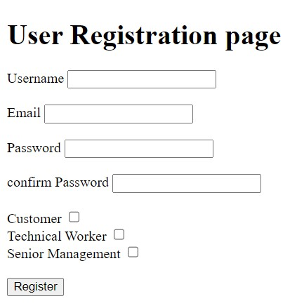</img>

- customer.html
```
<!DOCTYPE html>
<html lang="en">
<body>
 <h1> hello {{ user.username }}.cutomer</h1>
</body>
</html>
```
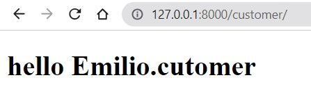</img>

- technical.html
```
<!DOCTYPE html>
<html lang="en">
<body>
    <h1> hello {{ user.username }}.technical worker</h1>
</body>
</html>
```
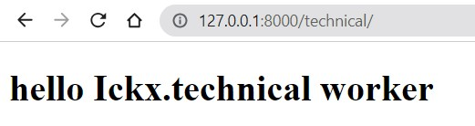</img>

- senior.html
```
<!DOCTYPE html>
<html lang="en">
<body>
    <h1> hello {{ user.username }}.senior worker</h1>
</body>
</html>
```
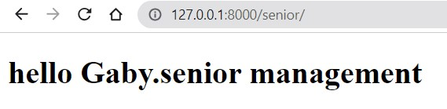</img>

## Question 3 (b)
In order to ensure the changes made on one database will also be reflected in the other database, the dual-write techniques enables the flow of data between two databases by creating a mapping within the Django app. 

### 1. Configure the database
To use MongoDB and MYSQL as the database, modify the settings.py file in the project folder.
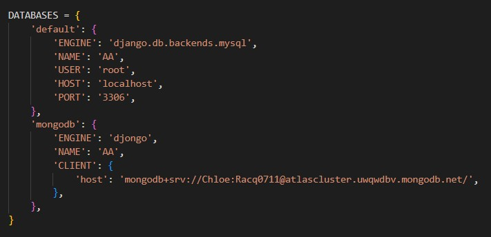</img>

### 2. Define models
In the models.py, define the model that represents the data in databases.
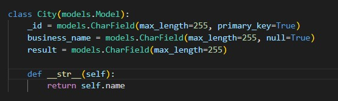</img>

### 3. Create function
Create a replicate function to insert the three values into both database.
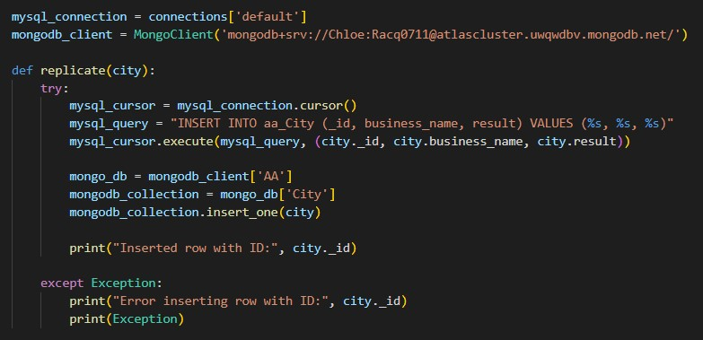</img>

### 4. Apply function
Insert the following code in the views file to apply the function created.  
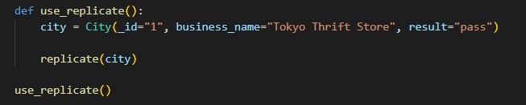</img>

### 5. Results
Once the function is executed, the data is then successfully inserted into both databases. 

- MySQL<br>
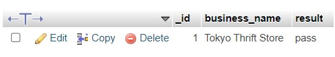</img>

- Mongodb<br>
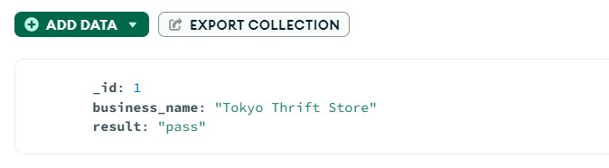</img>


## Contribution 🛠️
Please create an [Issue](https://github.com/drshahizan/special-topic-data-engineering/issues) for any improvements, suggestions or errors in the content.

You can also contact me using [Linkedin](https://www.linkedin.com/in/drshahizan/) for any other queries or feedback.

[](https://visitorbadge.io/status?path=https%3A%2F%2Fgithub.com%2Fdrshahizan)


