<a href="https://github.com/drshahizan/SECP3843/stargazers"></a>
<a href="https://github.com/drshahizan/SECP3843/network/members"></a>
<a href="https://github.com/drshahizan/SECP3843/pulls"></a>
<a href="https://github.com/drshahizan/SECP3843/issues"></a>
<a href="https://github.com/drshahizan/SECP3843/graphs/contributors"></a>


Don't forget to hit the :star: if you like this repo.

# Special Topic Data Engineering (SECP3843): Alternative Assessment

#### Name: Chloe Racquelmae Kennedy
#### Matric No.: A20EC0026
#### Dataset: City Inspections	

## Question 4 (a)
K-modes clustering algorithm is the machine learning technique applied in this case study as the majority of the data types in this dataset are categorical. K-modes is used to partition the dataset into clusters where each cluster is characterized by the most frequent categorical value in the cluster.

Code: [ML.ipynb](./files/code/ML.ipynb)
### 1. Import data into Pandas dataframe
```
import json
import pandas as pd

with open('new_city_inspections.json', 'r', encoding='utf-8') as file:
    data = json.load(file)

df = pd.DataFrame(data)
``` 

### 2. Drop columns
```
df = df.drop(['_id', 'certificate_number', 'date', 'address'], axis=1)
```
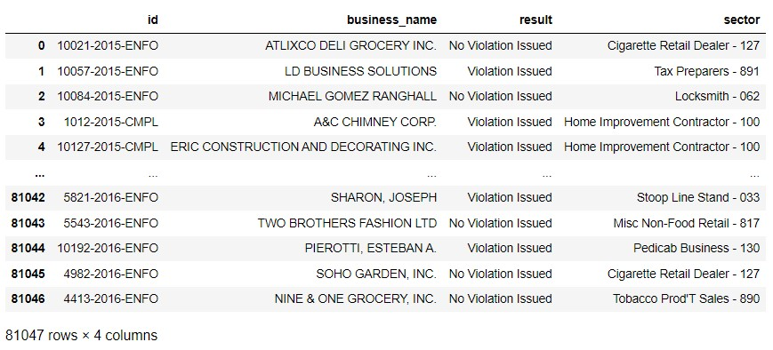</img>

### 3. Label Encoding
Convert the categorical data into numerical data. 
```
from sklearn.preprocessing import LabelEncoder

new_df = df.copy()
for col in df:
    le = LabelEncoder()
    new_df[col] = le.fit_transform(df[col])
```
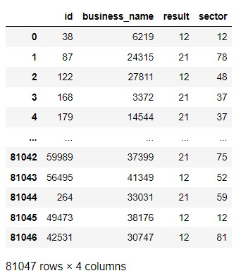</img>

Description of data in the dataframe:
```
new_df.describe()
```
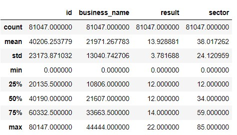</img>

### 4. Standard Scaler
Reduce difference between values.
```
from sklearn.preprocessing import StandardScaler

scaler = StandardScaler()
scaler.fit(new_df)
scaled_data = scaler.transform(new_df)
```
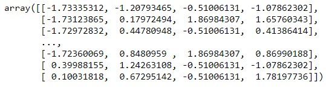</img>

### 5. PCA
Reduce the dimensions from 4 to 2.
```
from sklearn.decomposition import PCA

pca = PCA(n_components = 2)
pca.fit(scaled_data)
x_pca = pca.transform(scaled_data)
```
Compare array shape:
The columns are reduced from 4 to 2.<br>
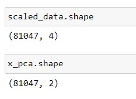</img>

Ratio:
The first column is capturing 27% of useful information while the second column is capturing 25% of useful information from the dataset.
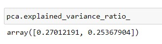</img>

### 6. Plot graph
The scatter graph is plotted based on the result data. 
```
import matplotlib.pyplot as plt

plt.figure(figsize = (8,6))
plt.scatter(x_pca[:,0], x_pca[:,1], c=new_df['result'],cmap='rainbow')
plt.xlabel('First principle component')
plt.ylabel('Second principle component')
```
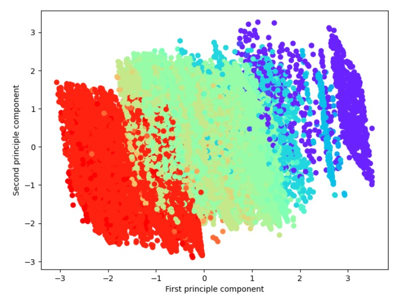</img>

### 7. Perform K-modes algorithm
#### Install kmodes
```
!pip install kmodes
```
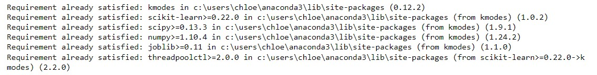</img>

#### Import libraries
```
import numpy as np

from kmodes.kmodes import KModes
import matplotlib.pyplot as plt
%matplotlib inline
```

#### Drop columns
Keep only the result and sector columns for clustering.
```
k_df = df.drop(['id', 'business_name'], axis=1)
```
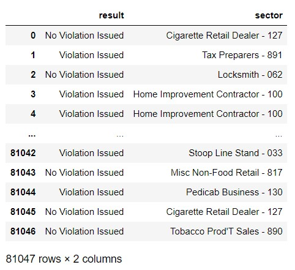</img>

#### Find optimal number of clusters
The elbow method is used to find the optimal number of clusters (Kvalues).
```
cost = []
K = range(1,5)
for num_clusters in list(K):
    kmode = KModes(n_clusters=num_clusters, init = "random", n_init = 5, verbose=1)
    kmode.fit_predict(k_df)
    cost.append(kmode.cost_)

plt.plot(K, cost, 'bx-')
plt.xlabel('No. of clusters')
plt.ylabel('Cost')
plt.title('Elbow Method For Optimal k')
plt.show()
```
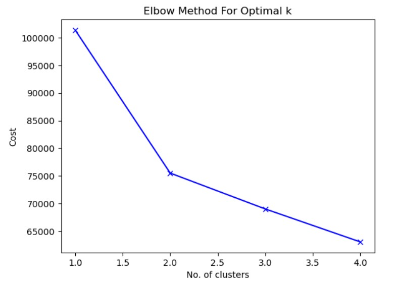</img>

#### Build model with 3 clusters
Based on the elbow curve, the bend with a lesser cost value is at K=3 which shows that 3 is the optimal number of clusters.
```
kmode = KModes(n_clusters=3, init = "random", n_init = 5, verbose=1)
clusters = kmode.fit_predict(k_df)
clusters
```
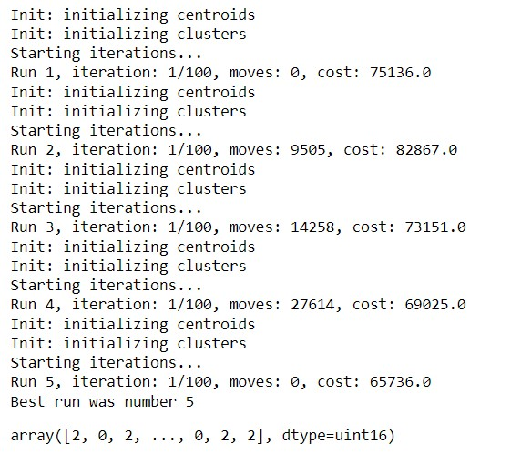</img>

#### Map column
```
k_df.insert(0, "Cluster", clusters, True)
```
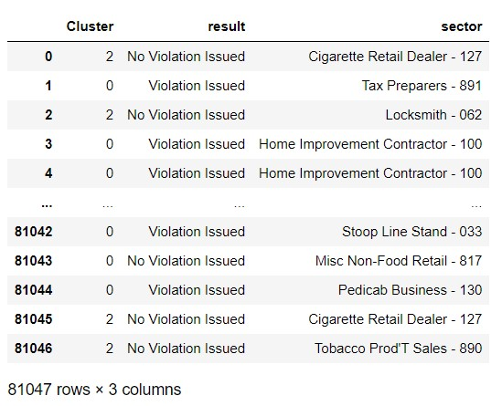</img>

#### Results
```
k_df[k_df['Cluster']==0].head(10)
```
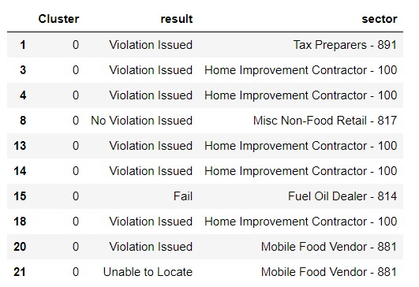</img>

```
k_df[k_df['Cluster']==1].head(10)
```
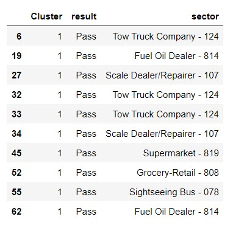</img>

```
k_df[k_df['Cluster']==2].head(10)
```
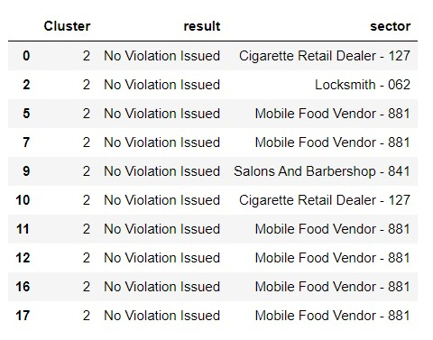</img>

### Conclusion
- Based on the results, it shows that the clustering is applied based on the results of inspections in different sectors. 
- In cluster 0, the mode is `Violation Issued`. 
- In cluster 1, the mode is `Pass`.
- In cluster 2, the mode is `No Violation Issued`.
- Therefore, clustering helps to identify sectors that needs more inspections. For example, sectors in cluster 0 require further monitoring and implement effective solutions to reduce the violation issues in those sectors. 

## Contribution 🛠️
Please create an [Issue](https://github.com/drshahizan/special-topic-data-engineering/issues) for any improvements, suggestions or errors in the content.

You can also contact me using [Linkedin](https://www.linkedin.com/in/drshahizan/) for any other queries or feedback.

[](https://visitorbadge.io/status?path=https%3A%2F%2Fgithub.com%2Fdrshahizan)


