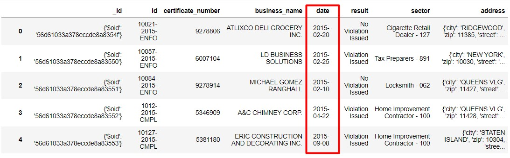
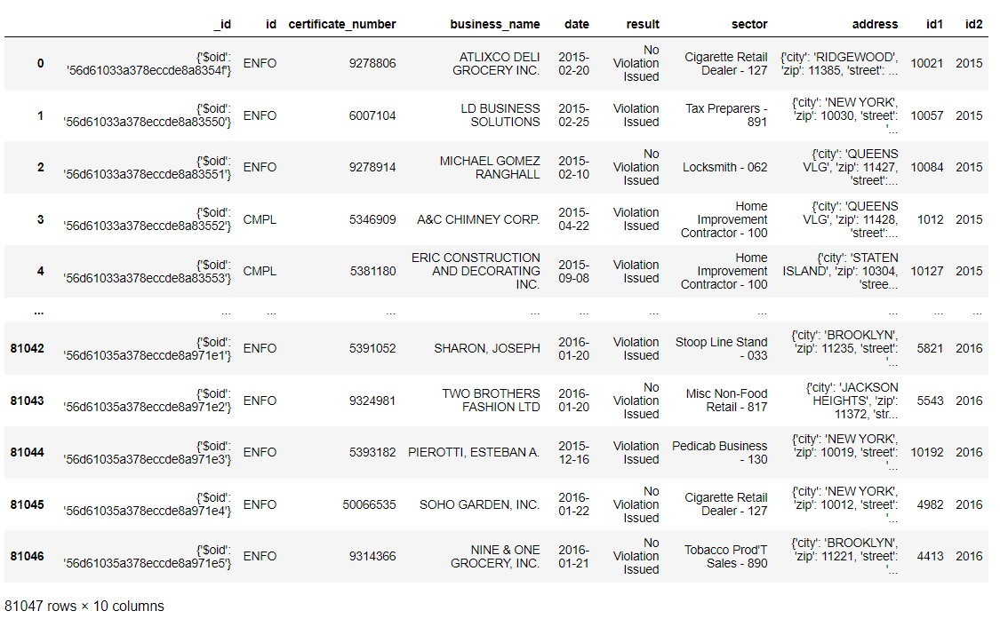
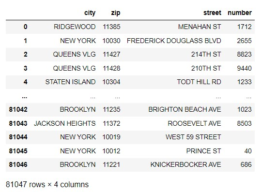
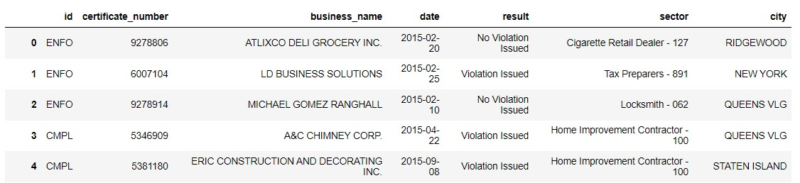
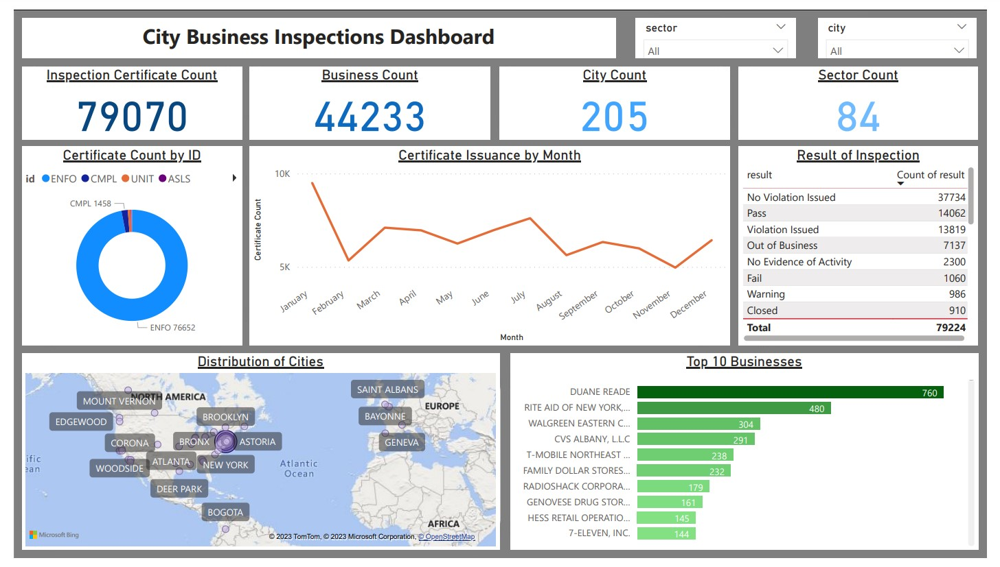

<a href="https://github.com/drshahizan/SECP3843/stargazers"></a>
<a href="https://github.com/drshahizan/SECP3843/network/members"></a>
<a href="https://github.com/drshahizan/SECP3843/pulls"></a>
<a href="https://github.com/drshahizan/SECP3843/issues"></a>
<a href="https://github.com/drshahizan/SECP3843/graphs/contributors"></a>


Don't forget to hit the :star: if you like this repo.

# Special Topic Data Engineering (SECP3843): Alternative Assessment

#### Name: Chloe Racquelmae Kennedy
#### Matric No.: A20EC0026
#### Dataset: City Inspections	

## Question 5 (a)
The large dataset is handle with the following steps to optimized the performancce of portal.<br>
Code: [Optimize.ipynb](./files/code/Optimize.ipynb)

### 1. Import data into Pandas dataframe
```
import json
import pandas as pd

with open('new_city_inspections.json', 'r', encoding='utf-8') as file:
    data = json.load(file)

df = pd.DataFrame(data)
``` 

### 2. Change data types
Change the data type of date from string to date.
```
df['date'] = pd.to_datetime(df['date'])
```
</img>

### 3. Split string
Split the id column into 3 and keep the last column only.
```
df[['id1', 'id2', 'id']] = df['id'].str.split(pat = '-', expand=True)
```
</img>

### 4. Create new dictionary 
Extract the address column from the dataframe. Then, create a new address dictionary, append each item to the list and create a new dataframe for the address.
```
new_address = []
for item in df['address']:
    address_item = {
        'city': item['city'],
        'zip': item['zip'],
        'street': item['street'],
        'number': item['number']
    }
    new_address.append(address_item)

af = pd.DataFrame(new_address)
```
</img>

### 5. Concatenate columns
Combine 2 dataframes together.
```
df = pd.concat([df, af], axis=1)
```
</img>

### 6. Drop columns
```
df = df.drop(['_id','id1','id2','address','zip','street','number'], axis=1)
```
</img>

### 7. Export csv
Export and save the new dataset as [City.csv](./files/code/City.csv) into the pc. 
```
df.to_csv(r'C:\Users\chloe\Desktop\City.csv', index=False)
```

## Question 5 (b)
</img>

### City Business Inspections Dashboard
The [dashboard](./files/code/City%20Business%20Inspections%20Dashboard.pbix) above is created using Power BI by importing the processed dataset and it displays the overview of the business inspections results in different cities and sectors.

#### Filter
The drop down columns of sector and city are filters of the dashboard to view specific results based on sector or city.

#### Card
- Inspection Certificate Count: Total number of certificates issued after inspections.
- Business Count: Total number of businesses involved in inspections.
- City Count: Total number of cities involved in inspections.
- Sector Count: Total number of sectors involved in inspections.

#### Donut chart
- Certificate Count by ID: Total number of certificates issued based on ID such as ENFO, CMPL, UNIT, ASLS, AMND, DRT, ATTC and ASWC. This shows that the majority businesses are issued with the certificate of ID type `ENFO`. 

#### Line chart
- Certificate Issuance by Month: Total number of certificates issued based on month. From the chart, it visualises that the month `January` has the most number of certificates issued.

#### Table
- Result of Inspection: Total number of results after inspections in descending order. This illustrates that the `no violation issued` result is the most common result after inspection as the majority of businesses follows the rules.

#### Map
- Distribution of Cities: Cities involved in inspections. `Brooklyn` is the city with the most businesses as the bubble size of Brooklyn is the largest.

#### Clustered bar chart
- Top 10 Businesses: Top 10 businesses with the most inspection certificates. `DUANE READE` is the business with the most inspection certificates followed by `RITE AID OF NEW YORK, INC.` at second and `WALGREEN EASTERN CO INC` at third.

## Contribution 🛠️
Please create an [Issue](https://github.com/drshahizan/special-topic-data-engineering/issues) for any improvements, suggestions or errors in the content.

You can also contact me using [Linkedin](https://www.linkedin.com/in/drshahizan/) for any other queries or feedback.

[](https://visitorbadge.io/status?path=https%3A%2F%2Fgithub.com%2Fdrshahizan)


