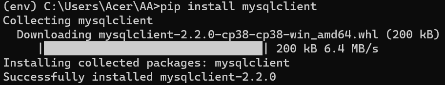
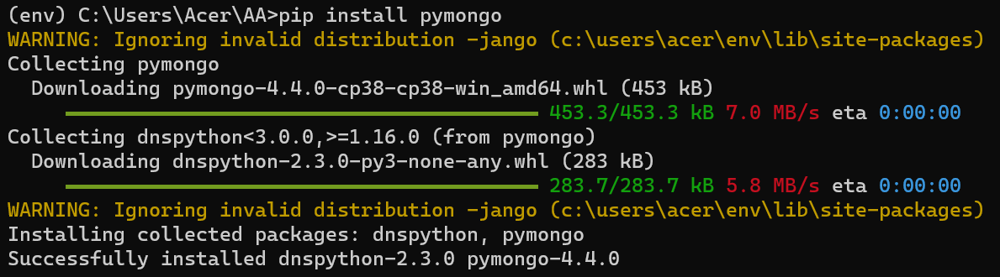
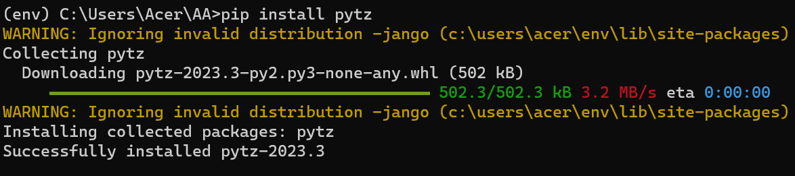
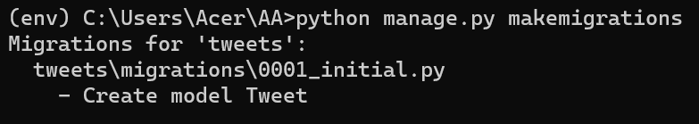
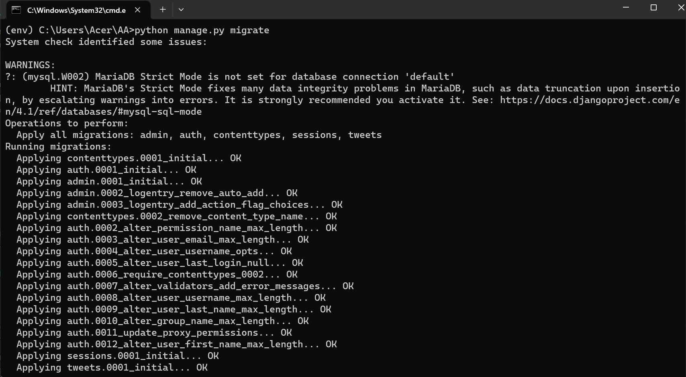
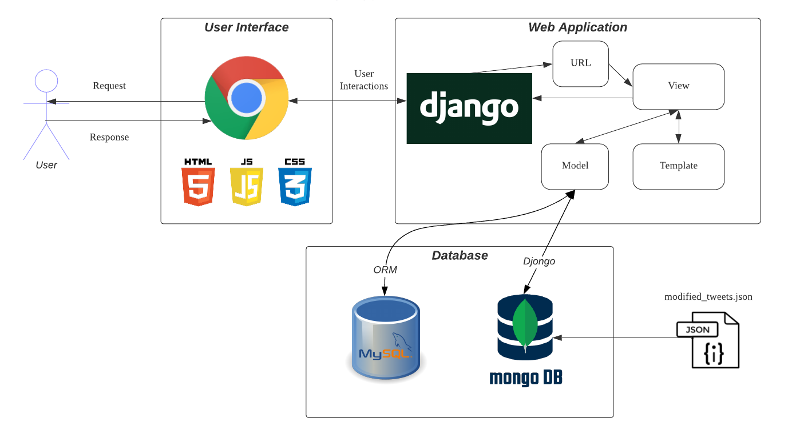

<a href="https://github.com/drshahizan/SECP3843/stargazers"></a>
<a href="https://github.com/drshahizan/SECP3843/network/members"></a>
<a href="https://github.com/drshahizan/SECP3843/pulls"></a>
<a href="https://github.com/drshahizan/SECP3843/issues"></a>
<a href="https://github.com/drshahizan/SECP3843/graphs/contributors"></a>


Don't forget to hit the :star: if you like this repo.

# Special Topic Data Engineering (SECP3843): Alternative Assessment

#### Name: Tan Yong Sheng
#### Matric No.: A20EC0157
#### Dataset: <a href="https://github.com/drshahizan/dataset/tree/main/mongodb/06-tweets">Tweets</a>

## Question 1 (a)
For this question, there are 5 servers requested. Below are the brief explanation for each server involved in the integration. 

1. Django Application Server:<br>
   This server hosts the Django web application. It runs the Django framework and handles HTTP requests from clients. It is responsible for rendering dynamic web pages, processing user input, and communicating with the databases.

2. MySQL Database Server:<br>
   The MySQL database server is responsible for storing and managing data in a relational database. It stores data in tables with a predefined schema and supports SQL queries. It is commonly used for structured data storage.

3. MongoDB Database Server:<br>
   The MongoDB database server is a NoSQL database that stores data in a flexible, document-oriented format. It does not rely on predefined schemas and supports dynamic, JSON-like documents. It is suitable for storing unstructured or semi-structured data.

4. Load Balancer:<br>
   The load balancer distributes incoming client requests across multiple Django application servers. It helps distribute the traffic evenly, improves performance, and ensures high availability by directing requests to healthy servers. It helps handle a large number of concurrent users.

5. File Server:<br>
   The file server is responsible for storing static files and media files (such as images, videos, or user-uploaded files) used by the Django application. It serves these files to clients upon request. Separating static files from the application server can improve performance and scalability.

To perform and ensure efficient data storage and retrieval from both MySQL and MongoDB database, below are the specific steps to do this.

### Setup Django Server
1. <strong>Downlaod Python</strong><br>
In order to run Django server first need to install python into our local computer first by navigate to this website <a href="https://www.python.org/downloads/">Python</a>.

2. <strong>Downlaod Django</strong><br>
Next need to install the latest version of Django using pip, the python manage manager. 
```
pip install django
```

3. <strong>Create Virtual Environment</strong><br>
Use the code below to create an environment
```
python -m venv env
```
Then we can activate the environment using the code below.
```
env\Scripts\activate
```

4. <strong>Create New Project</strong><br>
Start a new django project by using the code below
```
django-admin startproject AA
```
A new folder will be created with the name "AA"
<p align="center">
    </img>
</p>

5. <strong>Create App</strong><br>
Within the project we can create a new app by using the code below
```
python manage.py startapp tweets
```
<p align="center">
    </img>
</p>

6. <strong>Update Setting.py</strong><br>
After create the app we need to register it into the setting.py file under the project folder.
<p align="center">
    </img>
</p>

#
### Setup MySQL Database
1. First, execute the XAMPP software and run both the Apache and MySQL module to secure the connection to phpmyadmin. 
2. Click the admin button to redirect to phpmyadmin local database website. From there create a new database for this app. 
<p align="center">
    </img>
</p>

#
### Setup MongoDB Server
1. To access the mongodb database first need to install the <a href = "https://www.mongodb.com/try/download/community">MongoDB Community Server</a> using the link.  
2. Next, open the MongoDB Compass and connect to the clsuter in MongoDB Atlas and create a new database using the steps in the figure.
<p align="center">
    </img>
</p>

#
### Configure Django Database
1. The first step is to install all the requried packages using pip command.
```
pip install mysqlclient
``` 
<p align="center">
    </img>
</p>

```
pip install pymongo
```
<p align="center">
    </img>
</p>

```
pip install djongo
```
<p align="center">
    </img>
</p>

```
pip install pytz
```
<p align="center">
    </img>
</p>

2. Next, open the setting.py again to configure the database section 
 - MySQL setting, including the database name, user, password, host and port number.
  - MongoDB database setting, including connection URL, database name, authentication credentials

  Below are the codes for both database in setting.py file
  <p align="center">
    </img>
</p>

```
DATABASES = {
    'default': {
        'ENGINE': 'django.db.backends.mysql',
        'NAME': 'tweets',
        'USER': 'root',
        'PASSWORD': '',
        'HOST': 'localhost',
        'PORT': '3306',
    },
    'mongodb': {
        'ENGINE': 'djongo',
            'NAME': 'AA',
            'CLIENT': {
                'host': 'mongodb+srv://tyscluster.tyt40lp.mongodb.net/',
                'username': 'tys072801',
                'password': 'alextys072801AB',
                'authMechanism': 'SCRAM-SHA-1',
                'authSource': 'admin',
            },
    }
}
```

3. <strong>Define Django Model</strong><br>
This step can be done in the model.py file located in the apps folder. The model need to define to represent the data from JSON dataset by mapping all the fields in the JSON dataset to the Django model accurately. 
<p align="center">
    </img>
</p>

```
class Tweet(models.Model):
    _id = models.CharField(max_length=255)
    text = models.TextField()
    in_reply_to_status_id = models.CharField(max_length=255, null=True)
    retweet_count = models.IntegerField(null=True)
    contributors = models.CharField(max_length=255, null=True)
    created_at = models.DateTimeField()
    geo = models.CharField(max_length=255, null=True)
    source = models.CharField(max_length=255)
    coordinates = models.CharField(max_length=255, null=True)
    in_reply_to_screen_name = models.CharField(max_length=255, null=True)
    truncated = models.BooleanField()
    entities = models.JSONField()
    retweeted = models.BooleanField()
    place = models.CharField(max_length=255, null=True)
    user = models.JSONField()
    favorited = models.BooleanField()
    in_reply_to_user_id = models.CharField(max_length=255, null=True)
    id = models.CharField(max_length=255, primary_key=True, unique=True)
```

4. <strong>Make Migration</strong><br>
Migrate all the tables into each database by using the code below to make migration into each database. 
```
python manage.py makemigrations
```
<p align="center">
    </img>
</p>

```
python manage.py migrate
```
<p align="center">
    </img>
</p>

After done migrate, navigate back to phpmyadmin to observe the changes on the database created previously.
<p align="center">
    </img>
</p>

Migration to MongoDB is almost the same as the code above, just need to specify the database name. 
```
python manage.py migrate --database=mongodb
```

<p align="center">
    </img>
</p>

5. <strong>Load JSON into Database</strong><br>
To load the dataset into mysql and mongodb, we need to create a folder in the tweet app folder. The code below are the file loading function.
```
from django.core.management.base import BaseCommand
import json
from tweets.models import Tweet
from datetime import datetime

class Command(BaseCommand):
   help = 'Loads JSON data into the Tweet model'

   def add_arguments(self, parser):
       parser.add_argument('json_file', type=str, help='Path to the JSON file')

   def handle(self, *args, **options):
       json_file = options['json_file']
       with open(json_file, encoding='utf-8') as f:
           data = json.load(f)
           for item in data:
               created_at = datetime.strptime(item['created_at'], "%a %b %d %H:%M:%S %z %Y").strftime("%Y-%m-%d %H:%M:%S")
               tweet = Tweet(
                   _id=item['_id'],
                   text=item['text'],
                   in_reply_to_status_id=item['in_reply_to_status_id'],
                   retweet_count=item['retweet_count'],
                   contributors=item['contributors'],
                   created_at=created_at,
                   geo=item['geo'],
                   source=item['source'],
                   coordinates=item['coordinates'],
                   in_reply_to_screen_name=item['in_reply_to_screen_name'],
                   truncated=item['truncated'],
                   entities=item['entities'],
                   retweeted=item['retweeted'],
                   place=item['place'],
                   user=item['user'],
                   favorited=item['favorited'],
                   in_reply_to_user_id=item['in_reply_to_user_id'],
                   id=item['id']
               )
               tweet.save()
               tweet.save(using='mongodb')
               self.stdout.write(self.style.SUCCESS(f'Successfully loaded data for tweet with id {tweet.id}'))
```

Save the code above as ```load_data.py``` and open the terminal to run the following code.
```
python manage.py load_data modified_tweets.json
```

After running the code, the data will start to load into the database automatically. This is going to be a long process as it will load the data one by one. 
<p align="center">
    </img>
</p>

When loading completed, navigate to MySQL and MongoDB to verify the laoding result.<br><br>
<strong>MySQL:</strong>
<p align="center">
    </img>
</p>

<strong>MongoDB:</strong>
<p align="center">
    </img>
</p>

#
## Question 1 (b)
<p align="center">
    </img>
</p>

### Components Explanation
#### 1. <strong>User</strong><br>
Refer to the end-user or client access the application through a web browser and interact with it.

#### 2.  <strong>User Interface</strong><br>
 - The User Interface represents the front-end component of the system, where users interact with the web application.
 - It includes web pages, forms, and user interface elements that are rendered and displayed in the user's web browser.
 - The User Interface communicates with the Django web server to send requests and receive responses.
 - Contain html, js, css file type that used to build a dynamic web page with fantastic interface.

#### 3.  <strong>Web Application</strong><br>
#### The web application is divided into 3 main parts which is Model, View, and Templates. There is also another part called URL which also plays an important role.
 - Model: <br>
 Django Models define the structure and behavior of the entities in the system.
Each Model represents a database table or collection and defines fields (attributes) and relationships.
Django Models provide an abstraction layer that allows seamless integration with both MySQL and MongoDB databases.
They are responsible for mapping the JSON dataset and facilitating efficient storage and retrieval of data.
 - Views: <br>
 Django Views handle the logic behind processing user requests and generating responses.
They retrieve data from the dataset or databases, apply business logic, and render appropriate templates for the User Interface.
Views interact with Django Models to fetch data from MySQL or MongoDB based on the requested operations.
 - Templates: <br>
 Django Templates define the structure and layout of the dynamic web pages that are rendered to the User Interface.
Templates incorporate data retrieved from the dataset or databases and present it in a visually appealing format.
They utilize Django's template language to dynamically generate HTML, CSS, and JavaScript code.
 - URL: <br>
 URL link the user interface (UI) with the Django web application by defining the view function with user's requested URL.
<br>

#### 4. <strong>Django Web Server</strong><br>
 - The Django web server acts as the core of the system, responsible for handling client requests and generating dynamic web pages.
 - It receives HTTP requests from the User Interface and routes them to appropriate views.
 - Django's request-response cycle processes the incoming request, triggers relevant actions, and returns responses to the client.
 - It integrates with the dataset and databases to fetch and store data as required.

#### 5. <strong>Django ORM</strong><br>
 - Django's Object-Relational Mapping (ORM) acts as a bridge between the Django web server and the MySQL and MongoDB databases.
 - It abstracts the underlying database operations, allowing developers to interact with databases using Python code instead of raw SQL.
 - The ORM maps Django Models to database tables or collections and handles data retrieval, insertion, update, and deletion operations.

#### 6.  <strong>Database</strong><br>
#### In this project we are dealing with two database which is MySQL and MongoDB database.
 - MySQL Database: <br>
 It provides structured data storage and enforces a predefined schema based on tables, columns, and relationships.
The MySQL database is used for efficient and reliable storage of data retrieved from the JSON dataset.
<strong>Django's Object-Relational Mapping (ORM)</strong> handles the communication between the Django web server and the MySQL database.

 - MongoDB Database: <br>
 MongoDB is a NoSQL database that offers flexibility and scalability for storing unstructured or semi-structured data.
It stores data in a document-oriented format, using collections and documents instead of tables and rows.
The MongoDB database stores data retrieved from the JSON dataset, allowing for easy retrieval and modification.
The <strong>djongo</strong> package is used as the database engine to enable Django's compatibility with MongoDB.

#### 7.  <strong>Dataset (JSON)</strong><br>
 - The dataset consists of JSON files containing structured data that needs to be integrated into the system.
 - JSON (JavaScript Object Notation) is the file type we are going to use in this project.
 - The dataset may include various entities, such as text, geo, or retweets, with their corresponding attributes and relationships.

## Contribution 🛠️
Please create an [Issue](https://github.com/drshahizan/special-topic-data-engineering/issues) for any improvements, suggestions or errors in the content.

You can also contact me using [Linkedin](https://www.linkedin.com/in/drshahizan/) for any other queries or feedback.

[](https://visitorbadge.io/status?path=https%3A%2F%2Fgithub.com%2Fdrshahizan)


