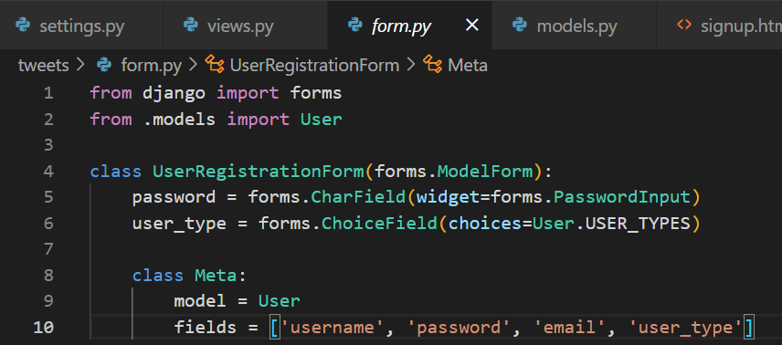
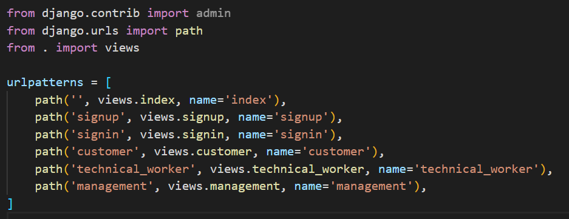
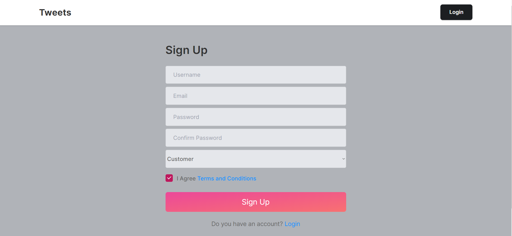
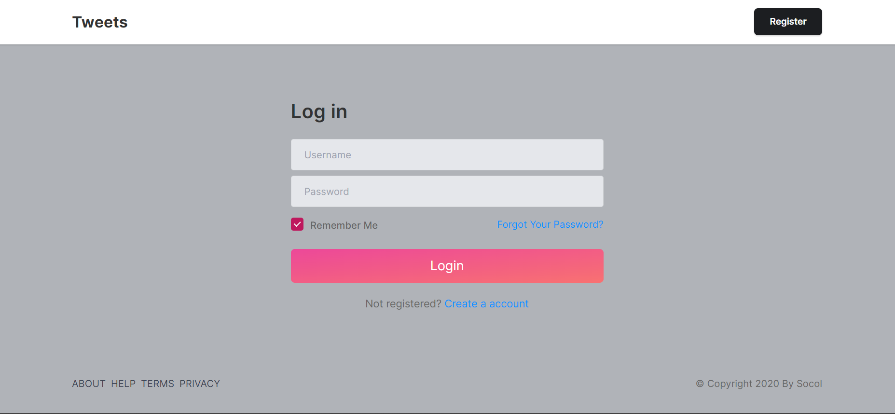
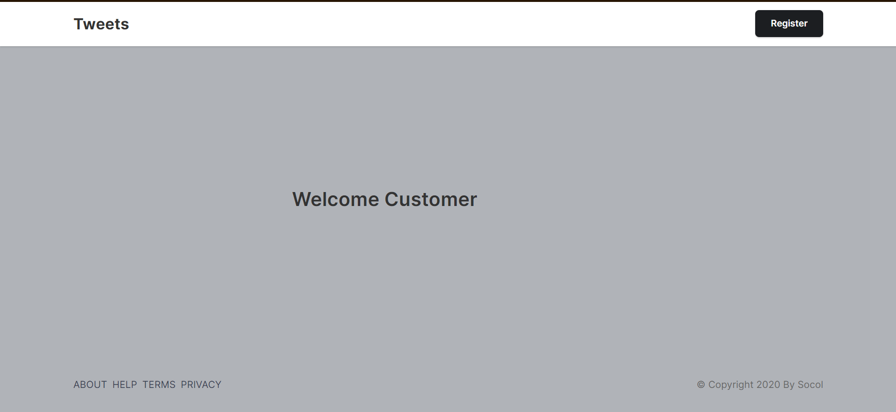

<a href="https://github.com/drshahizan/SECP3843/stargazers"></a>
<a href="https://github.com/drshahizan/SECP3843/network/members"></a>
<a href="https://github.com/drshahizan/SECP3843/pulls"></a>
<a href="https://github.com/drshahizan/SECP3843/issues"></a>
<a href="https://github.com/drshahizan/SECP3843/graphs/contributors"></a>


Don't forget to hit the :star: if you like this repo.

# Special Topic Data Engineering (SECP3843): Alternative Assessment

#### Name: Tan Yong Sheng
#### Matric No.: A20EC0157
#### Dataset: <a href="https://github.com/drshahizan/dataset/tree/main/mongodb/06-tweets">Tweets</a>

## Question 3 (a)
Steps to create user registration and login module in Django using MySQL database.<br>
1. Configure MYSQL database<br>
First need to ensure the ```mysqlclient``` package is installed using 
    ```
    pip install mysqlclient
    ```
    Update the Django project setting.py file with MySQL database setting.
    ```
    DATABASES = {
    'default': {
        'ENGINE': 'django.db.backends.mysql',
        'NAME': 'tweets',
        'USER': 'root',
        'PASSWORD': '',
        'HOST': 'localhost',
        'PORT': '3306',
    }
    }
    ```
#
2. Define Model<br>
Now navigate to `model.py` file in tweets app and define a new user model for user authentication.
```
from django.db import models
from django.contrib.auth.models import AbstractUser, Permission

class User(AbstractUser):
    USER_TYPES = (
        ('customer', 'Customer'),
        ('technical_worker', 'Technical Worker'),
        ('senior_management', 'Senior Management'),
    )
    user_type = models.CharField(max_length=20, choices=USER_TYPES)

    groups = models.ManyToManyField(
        'auth.Group',
        related_name='custom_user_set',
        blank=True,
        help_text='The groups this user belongs to. A user will get all permissions granted to each of their groups.',
        verbose_name='groups',
    )

    user_permissions = models.ManyToManyField(
        'auth.Permission',
        related_name='custom_user_set',
        blank=True,
        help_text='Specific permissions for this user.',
        verbose_name='user permissions',
    )
```
#
3. Update Setting<br>
Navigate to the `setting.py` under the project folder and add a new column to register our apps.
```
INSTALLED_APPS = [
    'django.contrib.admin',
    'django.contrib.auth',
    'django.contrib.contenttypes',
    'django.contrib.sessions',
    'django.contrib.messages',
    'django.contrib.staticfiles',
    'tweets',
]
```
#
4. Run Migration<br>
Make sure to run the migration to ensure the model created in the `model.py` is migrated to the sql database.
```
python manage.py makemigrations
python manage.py migrate
```
Command Prompt:
<p align="center">
</img>
</p>

MySQL: 
<p align="center">
</img>
</p>

#
5. Import Template<br>
 - First we need to create a new folder under the project named `template`. Then move all the template html file into the folder. 
  - Then create another folder named `static` to place all the js, css file into it.
  <p align="center">
</img>
</p>

 - In the `setting` folder specify the DIRS for template path.

 ```
 import os

 TEMPLATES = [
    {
        'BACKEND': 'django.template.backends.django.DjangoTemplates',
        'DIRS': [os.path.join(BASE_DIR, 'templates')],
        'APP_DIRS': True,
        'OPTIONS': {
            'context_processors': [
                'django.template.context_processors.debug',
                'django.template.context_processors.request',
                'django.contrib.auth.context_processors.auth',
                'django.contrib.messages.context_processors.messages',
            ],
        },
    },
]
```

 - Next create a static path as well to ensure the system able to retrieve the requried assets which store in static folder.
 ```
 STATIC_URL = 'static/'
STATIC_ROOT = os.path.join(BASE_DIR, 'staticfiles')
STATICFILES_DIRS = (os.path.join(BASE_DIR, 'static'), )
```
 - Change the link format into `{% static 'assets/css/your_css'}` so that the system can recognize the file path.

 <p align="center">
</img>
</p>

#
6. Create views and update url <br>
 - First we create a register form under the app folder to handle the user register process.
 <p align="center">
</img>
</p>

 - Next, create a signup view in the `views.py` to pass the input from user to database which handle the backend.
 ```
 def signup(request):
    if request.method == 'POST':
        username = request.POST['username']
        email = request.POST['email']
        password = request.POST['password']
        password2 = request.POST['password2']

        form = UserRegistrationForm(request.POST)
        if form.is_valid():
            if password == password2:
                if User.objects.filter(email=email).exists():
                    messages.warning(request, 'This email have been registered!')
                    return redirect('signup')
                elif User.objects.filter(username=username).exists():
                    messages.warning(request, 'This username have been registered!')
                    return redirect('signup')
                else:
                    messages.success(request, 'Account successfully created!')
                    user = form.save(commit=False)
                    user.set_password(form.cleaned_data['password'])
                    user.save()
                    return redirect('signin')
            else:
                messages.warning(request, 'Password not matching!')
                return redirect('signup')
    else:
        form = UserRegistrationForm()
    return render(request, 'signup.html', {'form': form})
```

 - Add another form in `form.py` for handeling the user login process.
 <p align="center">
</img>
</p>

 - Next, create a signin view in the `views.py` to pass the input from user to database to validate the user credential and user type.
 ```
 def signin(request):
    if request.method == 'POST':
        username = request.POST['username']
        password = request.POST['password']

        form = LoginForm(request.POST)
        user = auth.authenticate(request, username=username, password=password)

        if user is not None:
            auth.login(request, user)
            if user.user_type == 'customer':
                return redirect('customer')
            elif user.user_type == 'technical_worker':
                return redirect('technical_worker')
            elif user.user_type == 'senior_management':
                return redirect('management')
        else:
            messages.warning(request, 'Credentials Invalid. Please register first.')
            return redirect('signup')
        
    else:
        form = LoginForm()
    return render(request, 'signin.html', {'form': form})
```

 - The signin and signup view are taken from the template.
 Signup:
 <p align="center">
</img>
</p>

Signin:
<p align="center">
</img>
</p>

Customer:
<p align="center">
</img>
</p>

Technical Worker:
<p align="center">
</img>
</p>

Senior Management:
<p align="center">
</img>
</p>

#
7. Path Setting<br>
In the app folder update the `urls.py` to allow path recognision for each page.
<p align="center">
</img>
</p>

#
8. Run Server <br>
Activate the server by using the code below in the terminal.
```
python manage.py runserver
```

#
9. Output <br>

## Signup Page
<p align="center">
</img>
</p>

## Signin Page
<p align="center">
</img>
</p>

## Customer Page
<p align="center">
</img>
</p>

## Technical Worker Page
<p align="center">
</img>
</p>

## Senior Management Page
<p align="center">
</img>
</p>

## MySQL
<p align="center">
</img>
</p>

## Question 3 (b)


## Contribution 🛠️
Please create an [Issue](https://github.com/drshahizan/special-topic-data-engineering/issues) for any improvements, suggestions or errors in the content.

You can also contact me using [Linkedin](https://www.linkedin.com/in/drshahizan/) for any other queries or feedback.

[](https://visitorbadge.io/status?path=https%3A%2F%2Fgithub.com%2Fdrshahizan)


