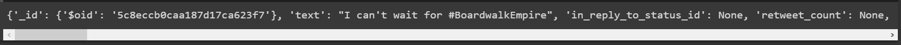
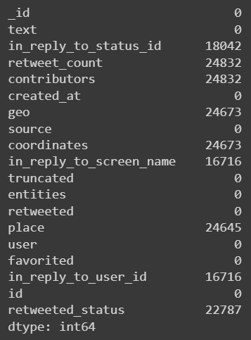
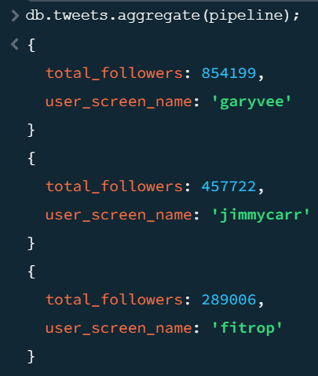
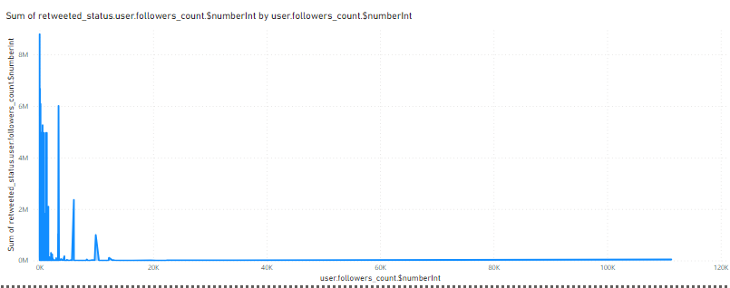

<a href="https://github.com/drshahizan/SECP3843/stargazers"></a>
<a href="https://github.com/drshahizan/SECP3843/network/members"></a>
<a href="https://github.com/drshahizan/SECP3843/pulls"></a>
<a href="https://github.com/drshahizan/SECP3843/issues"></a>
<a href="https://github.com/drshahizan/SECP3843/graphs/contributors"></a>


Don't forget to hit the :star: if you like this repo.

# Special Topic Data Engineering (SECP3843): Alternative Assessment

#### Name: Tan Yong Sheng
#### Matric No.: A20EC0157
#### Dataset: <a href="https://github.com/drshahizan/dataset/tree/main/mongodb/06-tweets">Tweets</a>

## Question 5 (a)
To optimize the performance of a portal when dealing with large volumes of data from a dataset, especially during dashboard visualizations, we can implement several strategies. Below are illustrative solution with code snippets and screenshots:

#
### Data Preprocessing
Data preprocessing can be done to reduce the database size by assigning correct data type and selecting the required column to import to database. This can ultimately reduce the dataset size and provide better performance of a portal.<br><br>
Source Code: <a href='https://github.com/TanYongSheng728/Python-big-data/blob/main/submission/TanYongSheng728/question5/files/code/Optimize_Portal_Performance.ipynb'>Data Preprocessing</a>
<br>
1. The first step is to load the dataset into Google Collab to perform data preprocessing.
```
import json
import pandas as pd


with open('modified_tweets.json', encoding='utf-8') as file:
    data = json.load(file)
    
print(data[1])
```

Output:
<p align="center">
</img>
</p>

2. The next step is to determine the dataset structure by using the code below.

```
df = pd.DataFrame(data)
df.info()
```

Output:
<p align="center">
</img>
</p>

From here we can see that most of the datatype are in `Object` which are not really suitable. Some of the datatype can change to integer or specify the object size to reduce the dataset size. 

3. Perform checking on each column to see if any null value. Then only decide the column with lowest null value to be selected for next step.

```
df.isnull().sum()
```

Output:
<p align="center">
</img>
</p>

4. Select only the potential column which can bring insightful information when doing data visualization.

```
selected_columns = ['text', 'source', 'entities', 'user']
filtered_data = [{column: record[column] for column in selected_columns} for record in data]
```

Data Preprocessing helps remove missing values, invalid values, duplicated records and improve the dataset acccuracy.

#
### Data Aggregation
Data Aggregation can be performed by using fucntion such as groupby, sum, count to enhance the performance when dealing large dataset.

1. Open the command prompt and navigate to the MongoDB installation directory. (C:\Program Files\MongoDB\Server\6.0\bin)
```
cd C:\Program Files\MongoDB\Server\6.0\bin
```

 - In the Command Prompt, paste the string copied and run.
 ```
 mongosh "mongodb+srv://tyscluster.tyt40lp.mongodb.net/" --apiVersion 1 --username tys072801
 ```

 Command Prompt: 
 <p align="center">
    </img>
</p>

2. By defualt it will select test database which are exactly the one we are going to use. If not type use test to switch to the database.
```
use test
```

3. Next is to define a aggregation pipeline for the mongodb to execute. It is divided into 4 part:
 - 1st part is group based on the user.screen_name and calculate the total followers for each group.
  - 2nd part is sort the document based on descending order
 - 3rd part is limit the document output to 3 users only
 - 4th part is excluding the id field and include only username and total followers count.
```
var pipeline = [
  {
    $group: {
      _id: "$user.screen_name",
      total_followers: { $sum: "$user.followers_count" }
    }
  },
  {
    $sort: { total_followers: -1 }
  },
  {
    $limit: 3
  },
  {
    $project: {
      _id: 0,
      user_screen_name: "$_id",
      total_followers: 1
    }
  }
];
```

4. After define we need to execute the pipline in the command prompt or using mongosh.shell. For this case we are using mongosh shell. The code below are used to execute the pipline.
```
db.tweets.aggregate(pipeline);
```

Output:
<p align="center">
    </img>
</p>

## Question 5 (b)
For this question we need to create a dashboard using the JSON file that we have been assigned.
I have ustilized a software called PowerBI which powered by Microsoft to aids in data visualization.

#
### Card

 - Card that shows the total user. This is the filter view for it.
<p align="center">
    </img>
</p>

Output:
<p align="center">
    </img>
</p>

 - Next card shows the average user followers. This is the filter view for it.
<p align="center">
    </img>
</p>

Output:
<p align="center">
    </img>
</p>

 - The last card shows the max user status count. This is the filter view for it.
<p align="center">
    </img>
</p>

Output:
<p align="center">
    </img>
</p>

#
### Chart

 - The chart is used to show the relationship between each user and their total retweet count
<p align="center">
    </img>
</p>

This is the filter view for it.
 <p align="center">
    </img>
</p>


## Contribution 🛠️
Please create an [Issue](https://github.com/drshahizan/special-topic-data-engineering/issues) for any improvements, suggestions or errors in the content.

You can also contact me using [Linkedin](https://www.linkedin.com/in/drshahizan/) for any other queries or feedback.

[](https://visitorbadge.io/status?path=https%3A%2F%2Fgithub.com%2Fdrshahizan)


