<a href="https://github.com/drshahizan/SECP3843/stargazers"></a>
<a href="https://github.com/drshahizan/SECP3843/network/members"></a>
<a href="https://github.com/drshahizan/SECP3843/pulls"></a>
<a href="https://github.com/drshahizan/SECP3843/issues"></a>
<a href="https://github.com/drshahizan/SECP3843/graphs/contributors"></a>


Don't forget to hit the :star: if you like this repo.

# Special Topic Data Engineering (SECP3843): Alternative Assessment

#### Name: Terence Loorthanathan
#### Matric No.: A20EC0165
#### Dataset: [tweets.json](https://github.com/drshahizan/dataset/tree/main/mongodb/06-tweets)

## Question 1 (a)
According to the case study, I was given five servers to be used in this project. Below i have listed my recommendation of how each one of the 5 servers should be configured and set up.


### Server 1: Django Web Framework

* Django should be set up here for the web application framework. (Simulation will be shown below)
* In this server database connections for both MySQL and MongoDB will be configured.
* Note : This server is required

### Server 2: MySQL Database Server

* MySQL should be installed here as the database for storing data.
* A new database can be created in MySQL to hold the relevant tables for storing data other than the JSON dataset [tweets](https://github.com/drshahizan/dataset/tree/main/mongodb/06-tweets).
* Data Domain for this Database could be : User Informations 🧑
  * Storing User's Password
  * Storing User's Username


### Server 3: MongoDB Database Server

* MongoDB should be installed here as another database for storing data.
* A new database can be created in MongoDB to hold the relevant collections for storing the JSON dataset [tweets](https://github.com/drshahizan/dataset/tree/main/mongodb/06-tweets).


### Server 4: Deployment Server

* This server should be set up to host and deploy the Django web application.
* A web server can be set up to handle incoming requests and route them to the Django application.
* Configure the server to run Django using a WSGI server (uWSGI).

### Server 5: Front-end Server

* this server can be configured as a front-end server (e.g., using Nginx, Apache) to handle incoming requests.
* Routing rules can be set up here to direct requests related to the portal to the Deployment Server (Server 4).
<br><br>

### Steps to integrate Django with MySQL and MongoDB
Below i will explain how to integrate Django with both MySQL and MongoDB. Keep in mind, i will be simulating a multi-server environment on my local machine to futher explain integration between all the components.
<br><br>

#### Server 1: Django Web Framework Integration
How will we simulate a Django Web Framwork server? By installing Django on my local machine. Then, Configuring the app's Django settings to establish connections with both MySQL and MongoDB databases. This will be done in the **settings.py** file.

1) Step 1 : Install Django

You can do this simply by running this command in your terminal. I would recommend to create a new folder for your application, opening it in **Visual Studio Code** and then running it in its built in Terminal.

```python
pip install django
```

Since i installed Django previously, I dont have to install it again. To check if Django is installed, you can run the code below.

```python
django-admin --version
```

Code & Output:

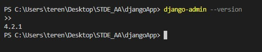</img>

2) Step 2 : Create the App

You can do this simply by using the **startproject** command shown below. Then, you have to use the **startapp** command to create the app. 

Note : Move into the directory after creating the project to make sure manage.py is readable.

Code & Output:

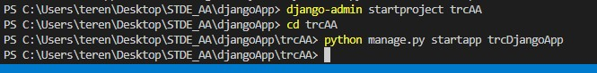</img>

<br>

3) Step 3 : Configure SQL

Before configuring, might be a good idea to set up the server first. [Click here](#server-2-mysql-database-server-integration)

To connect Django with MySQL, update the **DATABASES** dictionary with the necessary MySQL settings. My SQL Database dictionary is shown below

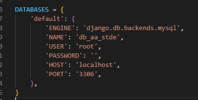</img>

<br>

Keep in mind, you need to install **mysqlclient** to connect with your mySQL database server.

<br>

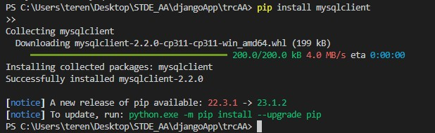</img>

<br>

Now we have to define a model, in **models.py**. This is entirely based on what mySQL database should be storing in the first place. But for this simulation, we would define a table that can store our json dataset.

<br>

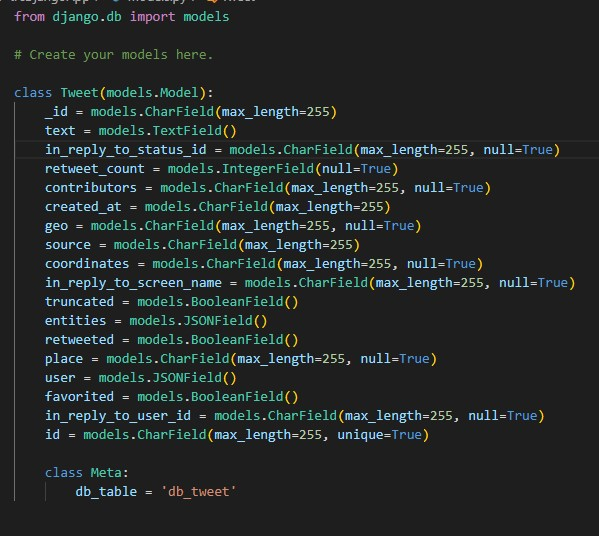</img>

<br>

Lastly we have to make migrations so run the following command in your terminal to create the necessary database tables based on your models.

```python
python manage.py makemigrations
python manage.py migrate
```

<br>

Output :

<br>

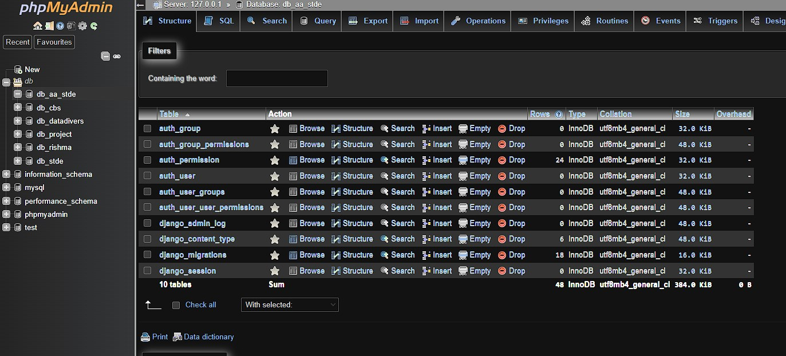</img>

<br>

4) Step 4 : Configure MongoDB

Before configuring, might be a good idea to set up the MongoDB server first. [Click here](#server-3-mongodb-database-server-integration)

To connect Django with MongoDB as well, update the **DATABASES** dictionary again but this time with the necessary MongoDB settings.

Note: You dont have to create a collection, it will be created for you. Just create a database using MongoDB Community Server

<br>

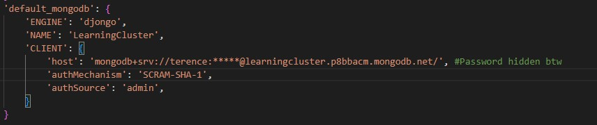</img>

<br>

Keep in mind, you need to install **djongo** to connect with your MongoDB database server.

<br>

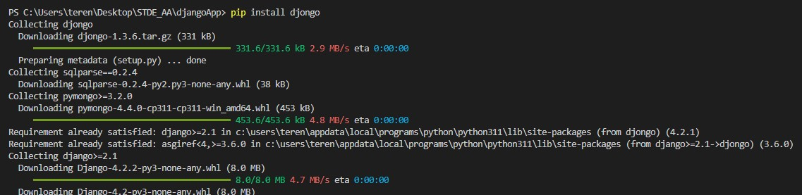</img>

<br>

Now we can skip straight to making migrations again as models were created before.So run the following command in your terminal to create the necessary database in MongoDB on the model.

```python
python manage.py migrate --database=default_mongodb
```

<br>

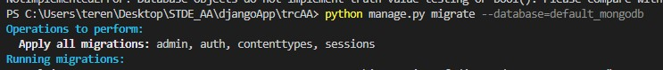</img>

<br>

Output :

<br>

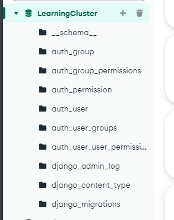</img>


#### Server 2: MySQL Database Server Integration
How will we simulate a MySQL Database Server? By using XAMPP. Then, creating a database of your choice and linking it with your [Server 1](#server-1-django-web-framework-integration). Please note that the name of the database has to be same in Server 1 and Server 2.

<br>

1) Step 1 : Install XAMPP

You can do that by simply visiting their [website](https://www.apachefriends.org/) and downloading their installer.

<br>

2) Step 2 : Starting the Server

Open up XAMPP, and just start **Apache** module and **MySQL** Module. There you go, your server 2 is up and running.

<br>

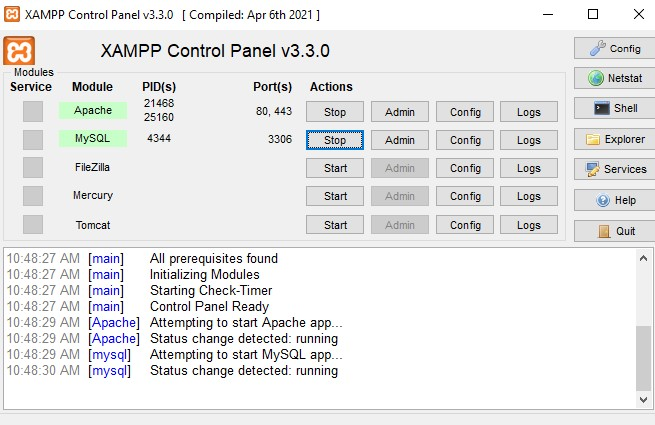</img>

<br>

2) Step 3 : Create Database

Now just click on Admin under **MySQL** Module and create your database, remember the name of the database has to be same in Server 1 and Server 2.

<br>

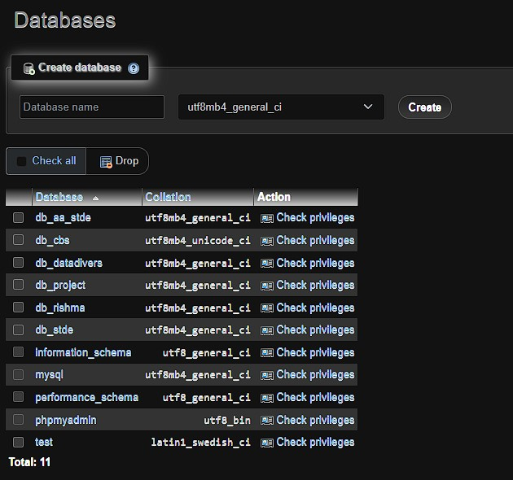</img>


#### Server 3: MongoDB Database Server Integration
How will we simulate a MongoDB Database Server? By using MongoDB Community Server. Then, creating a database of your choice and linking it with your [Server 1](#server-1-django-web-framework-integration). Please note that the name of the database has to be same in Server 1 and Server 3.

<br>

1) Step 1 : Creating an Account with MongoDB

You can do that by simply visiting their [website](https://www.mongodb.com/) and signing up.

<br>

2) Step 2 : Creating a Database

In **MongoDB Atlas** you have to create a database of your choice, remember to make sure that the name of the database is the same in Server 1 and Server 3.

<br>

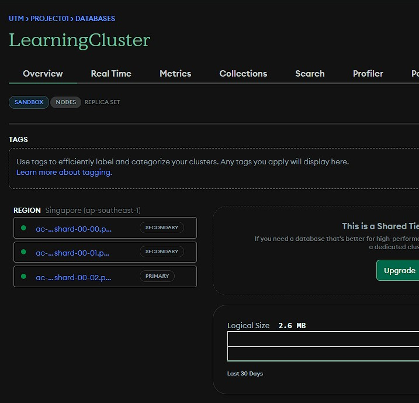</img>

<br>

1) Step 3 : Connect

Now you have to download **MongoDB Compass** and copy and paste the connection string to **Settings.py** in Server 1.

<br>

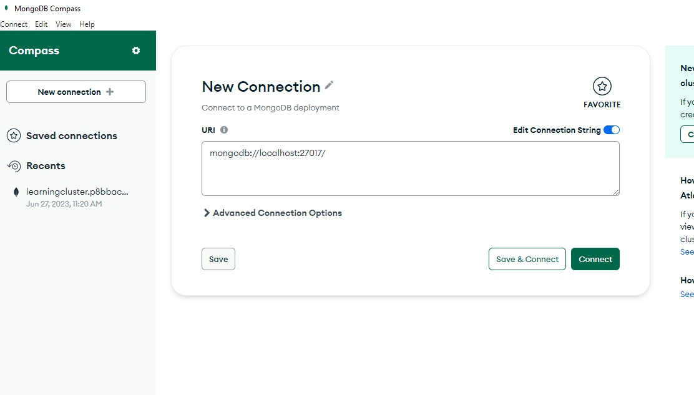</img>


## Question 1 (b)

### Portal : Architecture

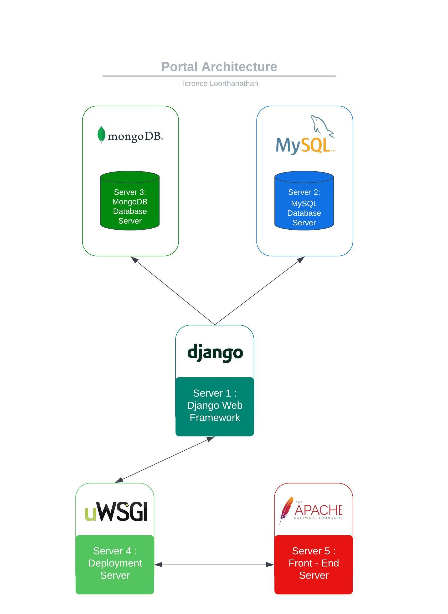</img>

From the figure above, we can see how the 5 servers are interconnected with each other. A brief overview of the Architecture :

* Server 1 : Django Web Framework
  * This server will have the django web framework which is a backend framework that handles the business logic, data processing, and rendering of dynamic web pages.
  * This server will be responsible for running the Django code, handling HTTP requests, and serving the web application to users.
* Server 2 : MySQL Database Server
  * This server will be holding any relevant tables for storing data other than the [tweets.json](https://github.com/drshahizan/dataset/tree/main/mongodb/06-tweets).
* Server 3 : MongoDB Database Server
  * This server will hold the relevant collections for storing the [tweets.json](https://github.com/drshahizan/dataset/tree/main/mongodb/06-tweets).
* Server 4 : Deployement Server
  * Once the server is configured to run Django using a WSGI server. This server can handle incoming requests and route them to the Django application.
  * “Since most web servers don’t natively speak Python, we need an interface to make that communication happen, comes to the rescue: the WSGI server.”
* Server 5 : Front-End Server
  * The server offloads Python from handling large, static file requests, allowing the Django application to focus on other tasks.
  * Python doesn't handle concurrent large file requests efficiently, but a reverse proxy like Apache serves as a guard, directing only necessary requests to Django.
  * Improving performance and security in the same time.

<br>

### Portal : Flow of Requests

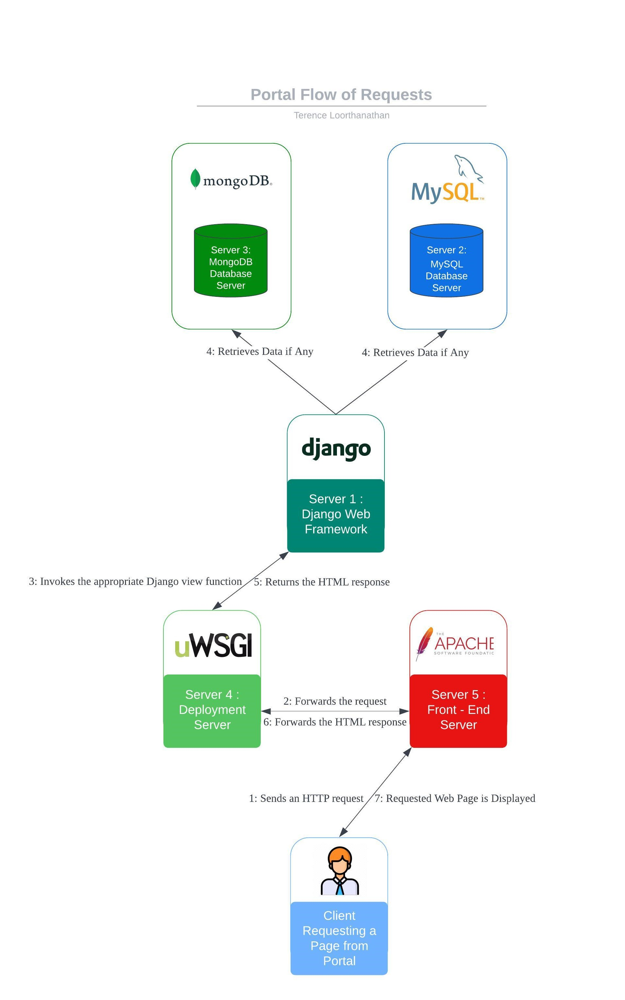</img>

How will the flow look like :

1) The client sends an HTTP request to the front-end server (**Server 5**).
2) The front-end server routes the request to the Deployment Server (**Server 4**) hosting the Django web application.
3) The Deployment Server passes the request to the WSGI server running the Django application.
4) The Django Web Framework on **Server 1** processes the request, performs necessary data retrieval from both **Server 3** and **Server 2**.
5) **Server 1** then generates a response.
6) The WSGI server on **Server 1** returns the response to the **Server 4**.
7) The Deployment Server sends the response back to the front-end server AKA **Server 5**.
8) The **Server 5** then delivers the response to the client, which displays the requested page in the web browser.

## Contribution 🛠️
Please create an [Issue](https://github.com/drshahizan/special-topic-data-engineering/issues) for any improvements, suggestions or errors in the content.

You can also contact me using [Linkedin](https://www.linkedin.com/in/drshahizan/) for any other queries or feedback.

[](https://visitorbadge.io/status?path=https%3A%2F%2Fgithub.com%2Fdrshahizan)


