<a href="https://github.com/drshahizan/SECP3843/stargazers"></a>
<a href="https://github.com/drshahizan/SECP3843/network/members"></a>
<a href="https://github.com/drshahizan/SECP3843/pulls"></a>
<a href="https://github.com/drshahizan/SECP3843/issues"></a>
<a href="https://github.com/drshahizan/SECP3843/graphs/contributors"></a>


Don't forget to hit the :star: if you like this repo.

# Special Topic Data Engineering (SECP3843): Alternative Assessment

#### Name: Terence Loorthanathan
#### Matric No.: A20EC0165
#### Dataset: [tweets.json](https://github.com/drshahizan/dataset/tree/main/mongodb/06-tweets)

## Question 2 (a)

Let’s dissect this question, by the end of this question I should have imported the tweets.json into a MongoDB database. There are 2 types of deployment for MongoDB, one of them through MongoDB Atlas and another by installing a local MongoDB deployment. Therefore, I am going to choose to use the MongoDB Atlas deployment. Below are the steps I followed to import my tweets.json into MongoDB Atlas.

* [Install Prerequisites](#Installing-Prerequisites)
* [Configurating](#Configurating)
* [Preparing the JSON file](#Preparing-the-JSON_file)
* [Importing the Prepared JSON file to MongoDB](Importing-the-Prepared-JSON-file-to-MongoDB)

<br>

### Installing Prerequisites

To load the file into MongoDB Atlas from your local pc you are going to need 3 different MongoDB Tools.

<br>

### MongoDB Community Server
Click [Here](https://www.mongodb.com/try/download/community-kubernetes-operator) to visit MongoDB Community Server download page.

<p align="center">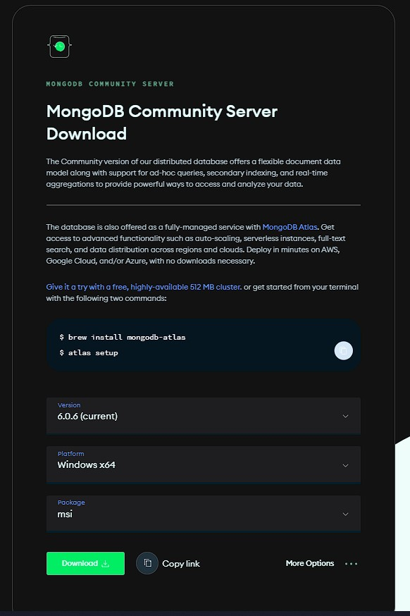</img></p>

* Once at the site simply, download the installer: Click on the "Download" button to start downloading the MongoDB Community Server installer.
* Once the download has completed, run the installer.
* During the installation process, you will be prompted to configure MongoDB. It is recommended to *take note of the installation directory* as it will be useful later. Please leave everything as default, installing *MongoDB Compass* is totally optional.

<br>

### MongoDB Shell

Click [Here](https://www.mongodb.com/try/download/shell) to visit MongoDB Shell download page.

<p align="center">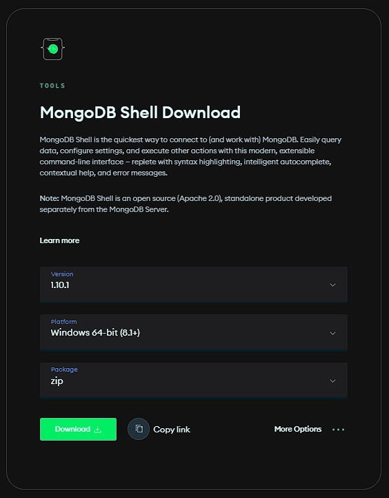</img></p>

Why do we need shell? For a few reasons: Requirement of the question. Not to mention, We need to connect to our MongoDB Deployment in Atlas.

* Once at the site simply, download the zip: Click on the "Download" button to start downloading the MongoDB Shell.
* Once the download has completed, Extract it at a desired location.
* Again, It is recommended to *take note of the installation directory* as it will be useful later.

<br>

### MongoDB Command Line Database Tools

Click [Here](https://www.mongodb.com/try/download/database-tools) to visit MongoDB Command Line Database Tools download page.

<p align="center">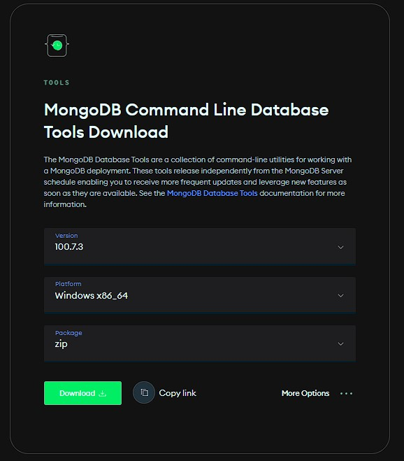</img></p>

Why do we need MongoDB Command Line Database Tools? For a few reasons: We need to Import our json dataset into Atlas, and we need the `mongoimport` function from MongoDB Command Line Database Tools to do it.

* Once at the site simply, download the zip: Click on the "Download" button to start downloading the MongoDB Command Line Database Tools.
* Once the download has completed, Extract it at a desired location.
* Again, It is recommended to *take note of the installation directory* as it will be useful later.

<br>

### Configurating

For this part its straight forward, we have to go to the add some PATH environment variables:

1) Open the Control Panel.
2) In the System and Security category, click System.
3) Click Advanced system settings. The System Properties modal display.
4) Click Environment Variables.
5) In the System variables section, select Path and click Edit. The Edit environment variable modal displays.
6) Click New and add the filepath to your all of the prerequisites binary. (Remember when i told you it will be
7) important to remember the filepath, now you have to use them)
8) Click OK to confirm your changes.

Final Outcome :

<p align="center">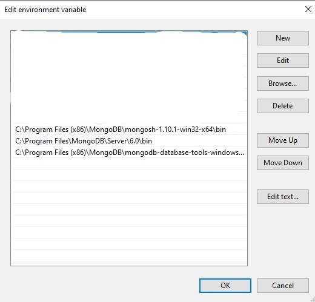</img></p>

By configurating through enviroment variables, you dont need to worry about your command prompt not recognising any of the commands.

<br>

### Preparing the JSON file

Before loading the dataset into MongoDB we have to make sure we prepare the dataset according to MongoDB structure. We can do this manually, but automating the process with google collab will be much more efficient.

Datasets before and after :
* Before : [tweets.json](https://github.com/drshahizan/dataset/tree/main/mongodb/06-tweets)
* After : [new_data.json](./files/code/new_data.json)

Want to take a look on how my collab file looked like? Click [here](./files/code/STDE_AA_TerenceLoorthanathan.ipynb).

<br>

### Importing the Prepared JSON file to MongoDB

<br>

Note: Keep Atlas open in the background throughout this process

First things first, we have to start mongoDB server. To do that a simple `mongod` in the command prompt will do the trick. As seen below.

<p align="center">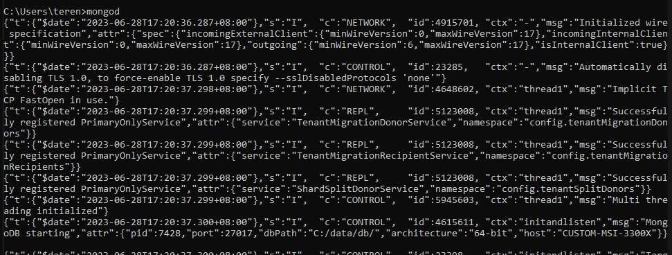</img></p>

Now we have to navigate to Atlas and click on the connect button, then click on connect through `shell` and then you will get a connection string. Simply paste it on your command prompt.

<p align="center">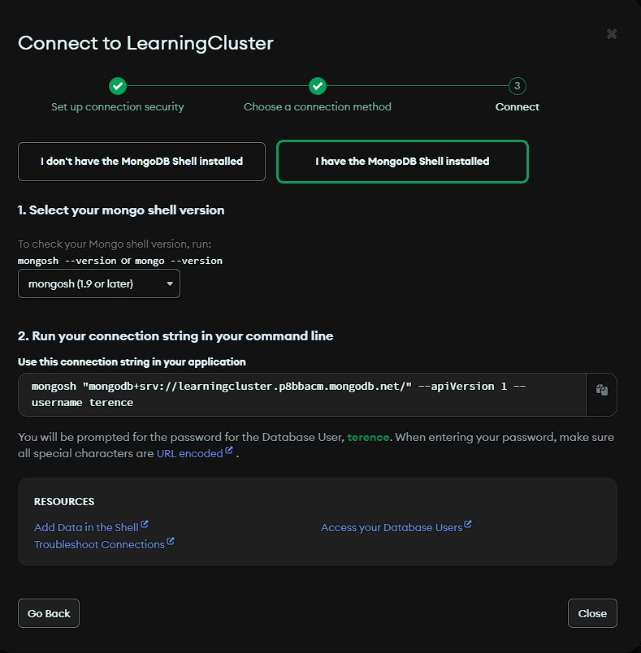</img></p>

After pasting this hit `Enter` and enter the password to your cluster. You defined this when you were making your account.

<p align="center">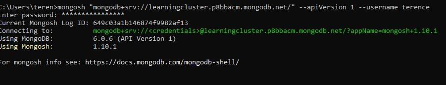</img></p>

You will be notified that you have successfully connected to your cluster, now you have to navigate to the collection that you desire to load your dataset into.

In my case, i have a database called `db_aa_stde` and a collection in it called `aa_collection`. Therefore a simple code, can get me to my collection as follows:

```bash
use db_aa_stde
db.aa_collection
```

<p align="center">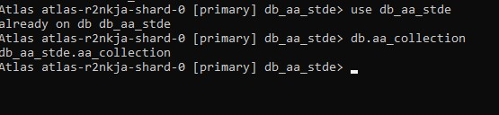</img></p>

Now to actually load the dataset into my database, for this we can use the `mongoimport` function from `MongoDB Command Line Database Tools`

The syntax will look like this:

```bash
mongoimport --uri="mongodb+srv://<connection-string>" --collection=aa_collection --file="https://example.com/new_data.json" --jsonArray
```

In my case it looked like this:

```bash
mongoimportmongoimport --uri="mongodb+srv://terence:<Password Here>@learningcluster.p8bbacm.mongodb.net/" --collection=aa_collection --file="E:\Downloads\new_data.json" --jsonArray
```

After pasting your syntax, hit `Enter` and watch your atlas collection fill up with data from your json file.

<p align="center">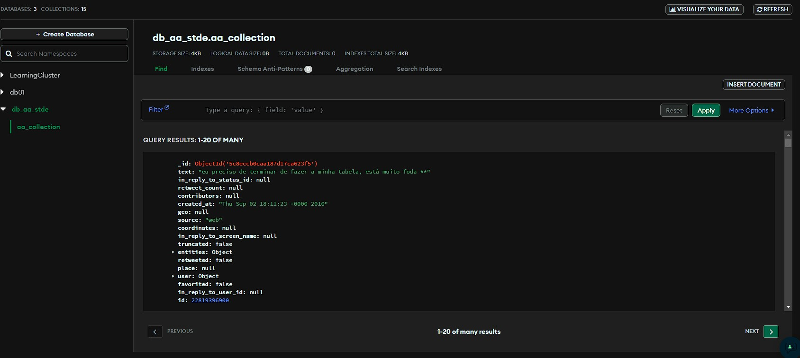</img></p>


## Question 2 (b)

### Content

* [Insert Query](Insert-Query)
* [Read Query](Read-Query)
* [Update Query](Update-Query)
* [Delete Query](Delete-Query)


### Insert Query

There are two common queries methods to insert data into MongoDB:
* `insertOne` : To insert one record and *This is the method that will be used for this demonstration*
* `insertMany` : To insert more than one record

Input inside command prompt:

<p align="center">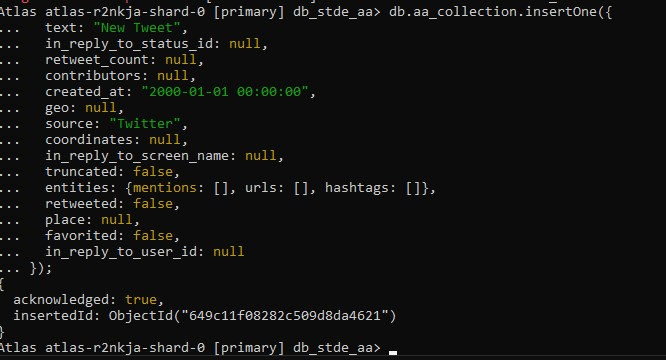</img></p>

Output in Atlas:

<p align="center">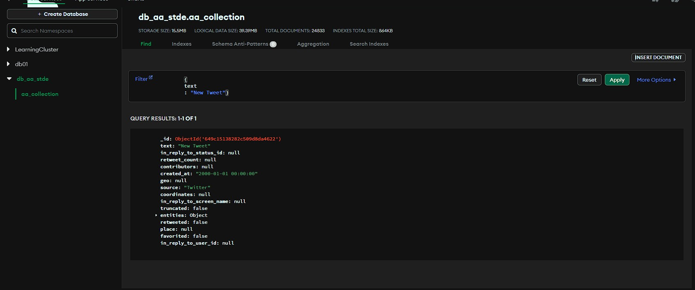</img></p>

### Read Query

There are two common queries methods to insert data into MongoDB:
* `findOne` : To find first record by some criteria
* `find` : To find all records by some criteria and *This is the method that will be used for this demonstration*

Input inside command prompt:

<p align="center">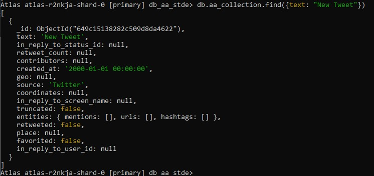</img></p>


### Update Query

There are two common queries methods to insert data into MongoDB:
* `updateOne` : To update a record based on a set rule and *This is the method that will be used for this demonstration*
* `updateMany` : To update more than one records based on a set rule and *This is the method that will be used for this demonstration*

Input inside command prompt for `updateOne`:

<p align="center">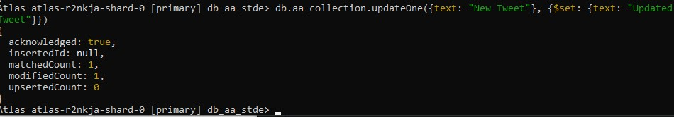</img></p>

Output in Atlas for `updateOne`:

<p align="center">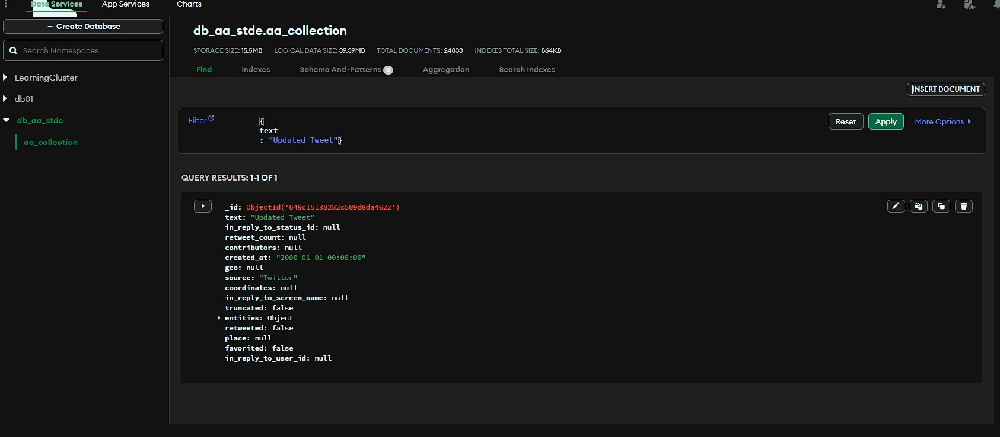</img></p>

Input inside command prompt for `updateMany`:

<p align="center">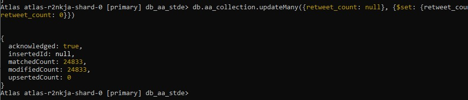</img></p>

Output in Atlas for `updateMany`:

<p align="center">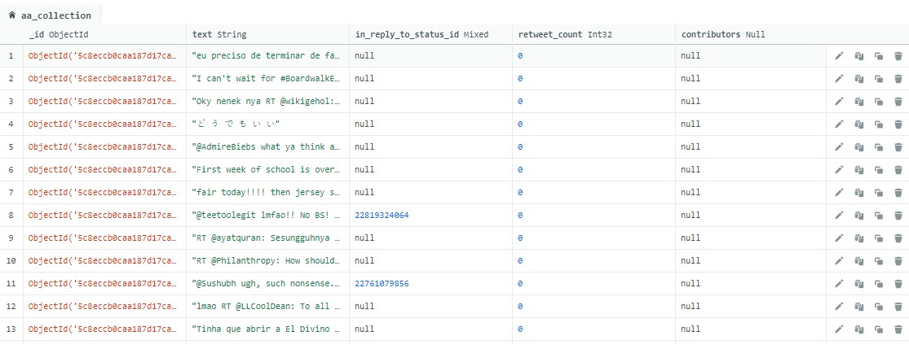</img></p>


### Delete Query

There are two common queries methods to insert data into MongoDB:
* `deleteOne` : To delete first record that matches the rule and *This is the method that will be used for this demonstration*
* `deleteMany` : To delete all records that matches the rule

Input inside command prompt:

<p align="center">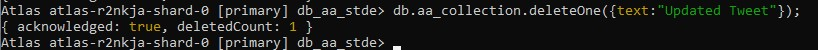</img></p>

Output in Atlas:

<p align="center">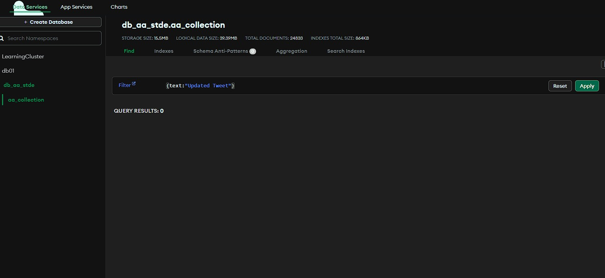</img></p>


## Contribution 🛠️
Please create an [Issue](https://github.com/drshahizan/special-topic-data-engineering/issues) for any improvements, suggestions or errors in the content.

You can also contact me using [Linkedin](https://www.linkedin.com/in/drshahizan/) for any other queries or feedback.

[](https://visitorbadge.io/status?path=https%3A%2F%2Fgithub.com%2Fdrshahizan)


