<a href="https://github.com/drshahizan/SECP3843/stargazers"></a>
<a href="https://github.com/drshahizan/SECP3843/network/members"></a>
<a href="https://github.com/drshahizan/SECP3843/pulls"></a>
<a href="https://github.com/drshahizan/SECP3843/issues"></a>
<a href="https://github.com/drshahizan/SECP3843/graphs/contributors"></a>


Don't forget to hit the :star: if you like this repo.

# Special Topic Data Engineering (SECP3843): Alternative Assessment

#### Name: Terence Loorthanathan
#### Matric No.: A20EC0165
#### Dataset: [tweets.json](https://github.com/drshahizan/dataset/tree/main/mongodb/06-tweets)

## Question 3 (a)
In this part, I need to create a login and registration function for three types of users: customers, technical workers, and senior management. I also need to implement separate welcome pages and functionalities for each user type. All of these should be done using django framework, with mySQL as the database.

- [Special Topic Data Engineering (SECP3843): Alternative Assessment](#special-topic-data-engineering-secp3843-alternative-assessment)
      - [Name: Terence Loorthanathan](#name-terence-loorthanathan)
      - [Matric No.: A20EC0165](#matric-no-a20ec0165)
      - [Dataset: tweets.json](#dataset-tweetsjson)
  - [Question 3 (a)](#question-3-a)
    - [Pre-Requisites](#pre-requisites)
    - [Defining User Model](#defining-user-model)
    - [Creating User Registration Views and Templates](#creating-user-registration-views-and-templates)
    - [Implementing Login Views and Templates](#implementing-login-views-and-templates)
    - [Creating Separate Welcome Pages](#creating-separate-welcome-pages)
    - [Configuring URLs](#configuring-urls)
    - [Demo](#demo)
  - [Question 3 (b)](#question-3-b)
  - [Contribution 🛠️](#contribution-️)


### Pre-Requisites

This part is very straight forward, we first have to start the project and create the app. Using the command below

```python
django-admin startproject question3
python manage.py startapp question3app
```

Note : Don't forget to install django first.`pip install Django` if you have not yet.

<p align="center">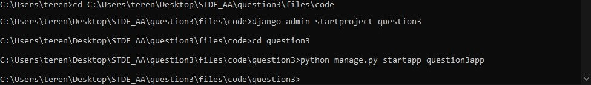</img></p>

Now we have to create the database for the project. `db_question3` in phpMyAdmin. Dont forget to start Apache and MySQL in XAMPP.

<p align="center">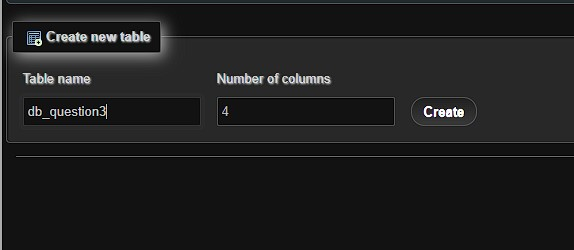</img></p>

Next lets add our app to the installed apps definition in `settings.py`

<p align="center">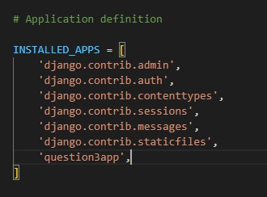</img></p>

Lastly, lets define out MySQL database in `settings.py` as well

<p align="center">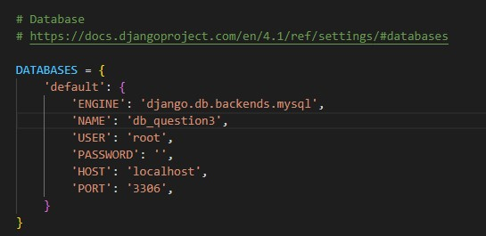</img></p>


### Defining User Model

We need to define a user model that includes fields for the user type and all the other credentials for users such as name, username, and password. Therefore, in the `models.py` file, we can define a model that looks similar to this:

<br>

<p align="center">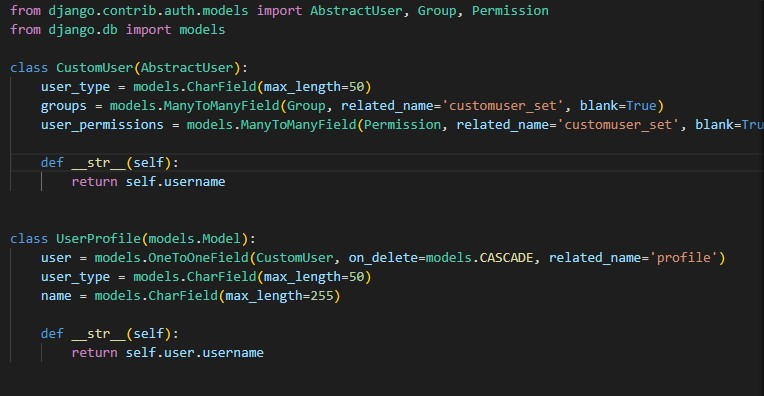</img></p>


Now we need to make migrations, so run the following code:

```python
python manage.py makemigrations
python manage.py migrate
```

### Creating User Registration Views and Templates

Now we can start to create a registration functionality in our django application, start by defining a view.

<br>

<p align="center">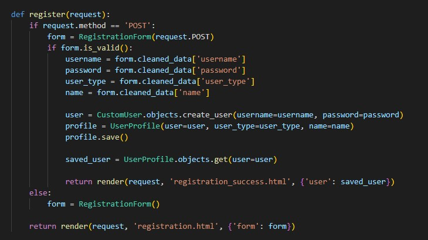</img></p>


Remember to import packages that are required to make this function work.

``` python
from django.contrib.auth.models import User
from django.contrib.auth.views import LoginView
from django.shortcuts import render, redirect
from .forms import RegistrationForm
from .models import UserProfile
from .models import CustomUser
```

Now we have to create the form where the user can fill in their credentials and pick a usertype. We need to create a file called `forms.py` in the application directory for this.

Next define the form as follows:

<br>

<p align="center">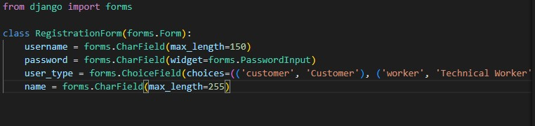</img></p>

From the view function it is easy to tell that we are missing some files, namely all the template files. So in the application directory, create a new directory named `templates` then create the `registration.html` and also the `registration_success.html` which will display the data saved if successful. Inside these files, code as follows:

`registration.html` : Page for user to register into the system

<br>

<p align="center">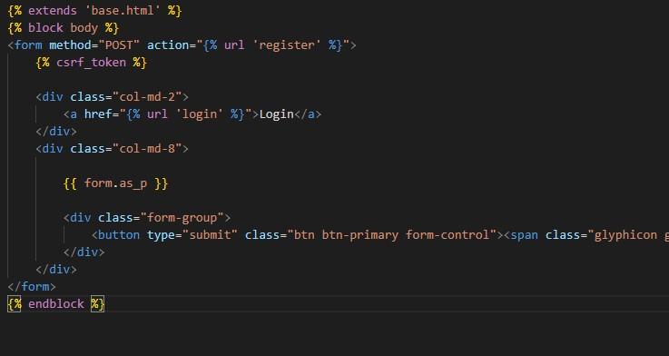</img></p>

`registration_success.html` : Page that displays the data saved into the system if successful

<br>

<p align="center">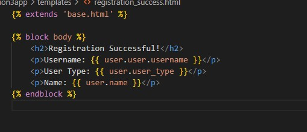</img></p>

### Implementing Login Views and Templates

Now we can start to create a login functionality in our django application, start by defining a view.

<br>

<p align="center">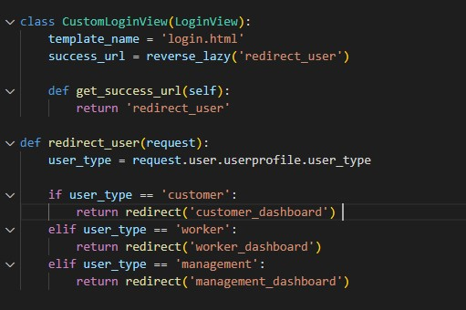</img></p>

We also have some libraries that we have to import for Login. As follows.

```python
from django.contrib.auth.decorators import login_required
from django.urls import reverse_lazy
```

Note : login_required libary allows us to restrict access to certain views for authenticated users only.

Now we need the `template` to make the login functionality work. The template file is as follows.

`login.html` : Page for user to register into the system

<br>

<p align="center"></img></p>


### Creating Separate Welcome Pages

Of course we need to know if our login works, so we need to create saperate welcome pages to test the functionalities we have given our django app.

Something as simple as follow will suffice:

`customer_dashboard_view.html` : Welcome page for customer users

<br>

<p align="center">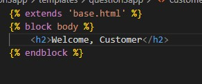</img></p>

`management_dashboard_view.html` : Welcome page for senior management users

<br>

<p align="center">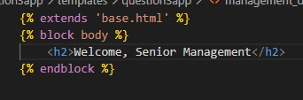</img></p>

`worker_dashboard_view.html` : Welcome page for technical worker users

<br>

<p align="center">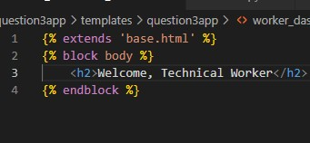</img></p>


### Configuring URLs

How will our page reroute to every page correctly, by using whatever we defined in the `urls.py`. Therefore, we should configure it before running our application.

<br>

<p align="center">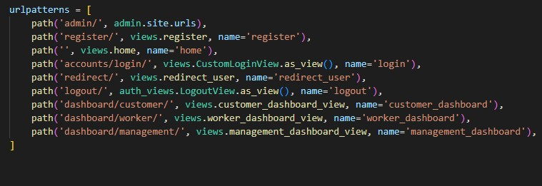</img></p>

The picture above, shows how to configure your urls file. And below are the libraries needed to make it work.

```python
from django.contrib import admin
from django.urls import path
from question3app import views
from django.contrib.auth import views as auth_views
```


### Demo

Finally, to run just type in `py manage.py runserver` in your terminal. Make sure you are in your project's root folder. To move to your project's root folder use the `cd DIRECTORY` command.

1) `Index.html` : Home Page of the App

<br>

<p align="center">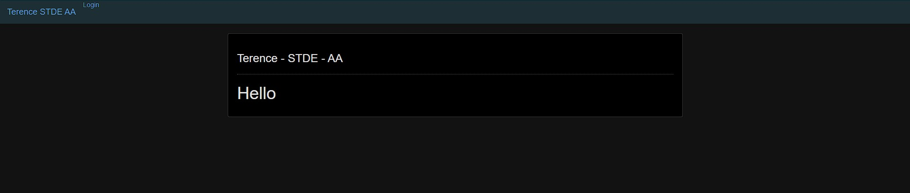</img></p>

2) `Login.html` : Login Page of the App

<br>

<p align="center">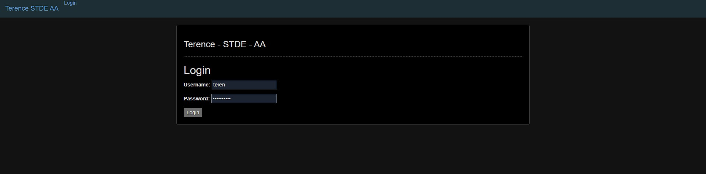</img></p>

3) `Register.html` : Registration Page of the App

<br>

<p align="center">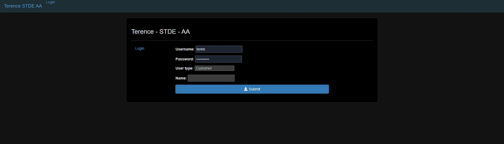</img></p>

4) `RegisterSuccessful.html` : To show the data registered into the system

<br>

<p align="center">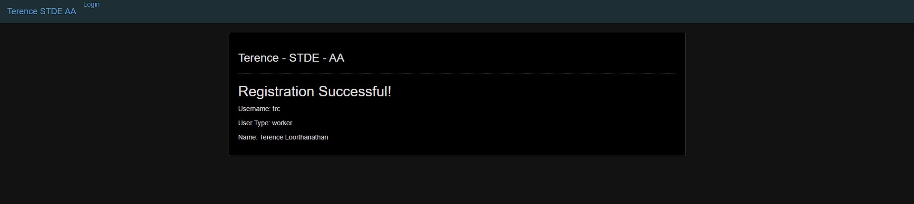</img></p>

5) `Customer.html` : Customer Welcome Page

<br>

<p align="center">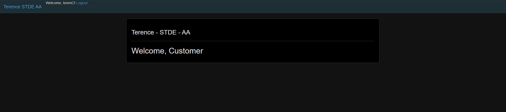</img></p>

6) `SeniorManagement.html` : Senior Management Welcome Page

<br>

<p align="center">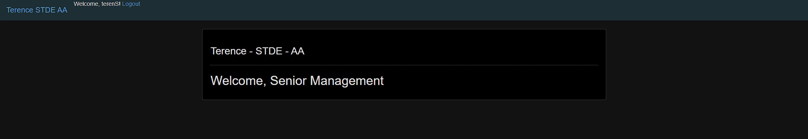</img></p>

7) `TechnicalWorker.html` : Technical Worker Welcome Page

<br>

<p align="center">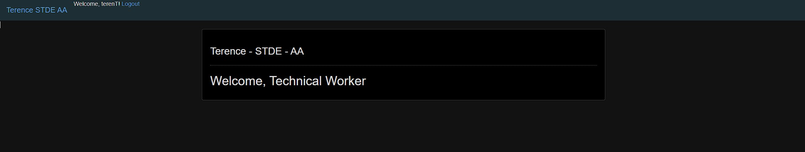</img></p>

8) `Django Admin` : To show Data Registered into system

<br>

<p align="center">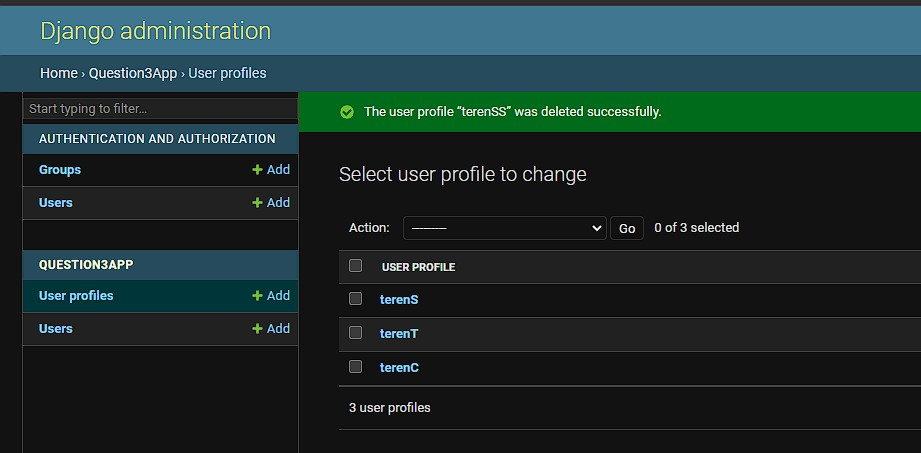</img></p>


## Question 3 (b)

According to the question, when working with two different databases, such as MySQL and MongoDB issues such as data replication and synchronization will arise. My task is to overcome this issue, it is recommended to explore replication techniques, usage of external tools is recommended.

Before we can start addressing the issue of data replication, we need to configure a application to configure both MySQL and MongoDB in one application. In `Django`, it will go something like this:

<br>

<p align="center">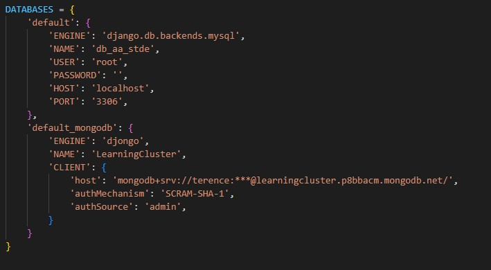</img></p>

<br>

### Method 1 : Replication

To replicate data changes between the two databases, we will need to implement mechanisms to capture, transform, and propagate the changes. For this we can utilize Signals and Custom Logic from Django, which will capture data changes in the MySQL database. Then through written custom logic it will transform the data and propagate it to the MongoDB database.

<br>

<p align="center">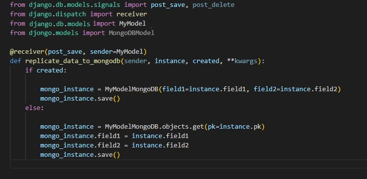</img></p>


Basically, the code above will receive any post into mySQL and post it into MongoDB database.

### Method 2 : Debezium

Debezium is an open source distributed platform for change data capture and it can point it at another databases if captured from another. This tools can monitor the database logs and emit change events that can be consumed by an application to update the target database. Therefore, this is more easier to implement but it difficulty to implement this solution does scale with complexity.

<br>

<p align="center">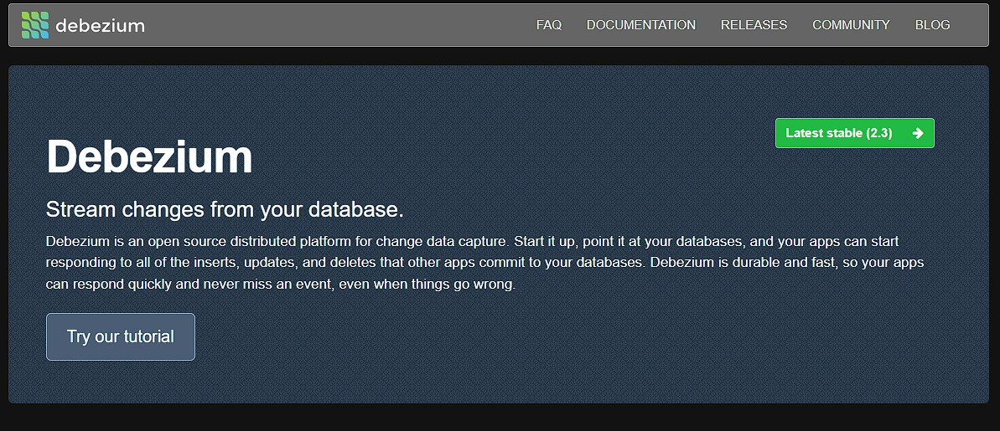</img></p>


## Contribution 🛠️
Please create an [Issue](https://github.com/drshahizan/special-topic-data-engineering/issues) for any improvements, suggestions or errors in the content.

You can also contact me using [Linkedin](https://www.linkedin.com/in/drshahizan/) for any other queries or feedback.

[](https://visitorbadge.io/status?path=https%3A%2F%2Fgithub.com%2Fdrshahizan)


