

Don't forget to hit the :star: if you like this repo.

# Special Topic Data Engineering (SECP3843): Alternative Assessment

#### Name: Terence Loorthanathan
#### Matric No.: A20EC0165
#### Dataset: [tweets.json](https://github.com/drshahizan/dataset/tree/main/mongodb/06-tweets)

## Question 4

In this part I decided to perform sentiment analysis to classify tweets as positive, negative, or neutral based on their content. The chosen machine learning approach for sentiment analysis is the Naive Bayes algorithm. This algorithm will give me insightful analysis of the dataset, as for the portal it will enable the users to gain valuable insights from the tweets. Later on, I will visualise and descrie how well this model performed.

  - [Question 4](#question-4)
    - [Import the Data](#import-the-data)
    - [Preparing the Data](#preparing-the-data)
    - [Preparing to Train the Model](#preparing-to-train-the-model)
    - [Train \& Evaluate the Naive Bayes Model](#train--evaluate-the-naive-bayes-model)
    - [Visualising the Dataset \& Performance of the Model](#visualising-the-dataset--performance-of-the-model)

Want a better look at how i coded this? Click <a href="./files/code/Question4_STDE_AA_TerenceLoorthanathan.ipynb">Here</a>

### Import the Data

First things first, we have to get the dataset into our development enviroment. This part is very straightforward. I have imported my new_data.json from the previous question into my google drive. Then i just wrote each line of document into the variable `data`.

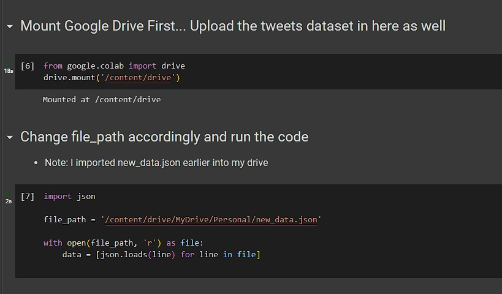</img>

### Preparing the Data

For this part I aimed to do a few things as part of preprocessing the data.

* Preprocess the text data
  * Remove all non-English characters
  * Remove all URLs
  * Remove all hashtags
  * Remove all emojis from the tweet
* Perform tokenization to split the text into individual words or tokens
* Apply lemmatization to reduce words to their base or root form

 

*Note : I Chose lemmatization instead of stemming, because we already are using english words. There are predefined dictionaries for english. Not to mention, the context is tweets, it would make much more sense.*

 

We have to start by installing all of the dependencies that is going to be used.

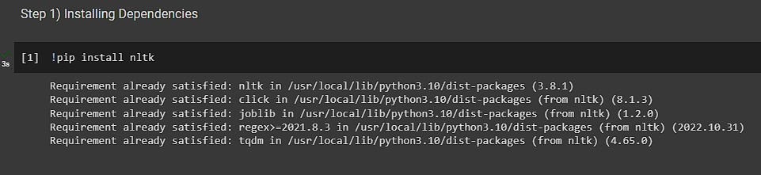</img>

Lets not forget to import them.

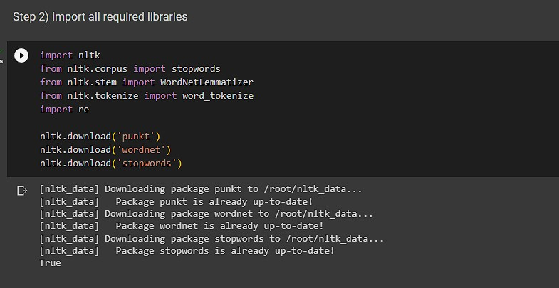</img>

In the preprocessing data part i defined a method in python (google colab) that performs all necessary tasks for each of the tweet content.

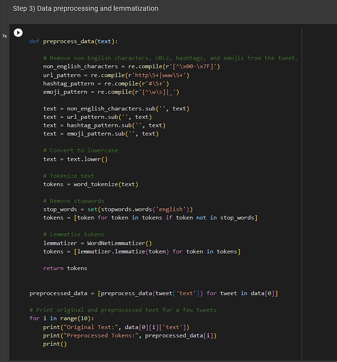</img>

This is the output for the preprocessing that was done.

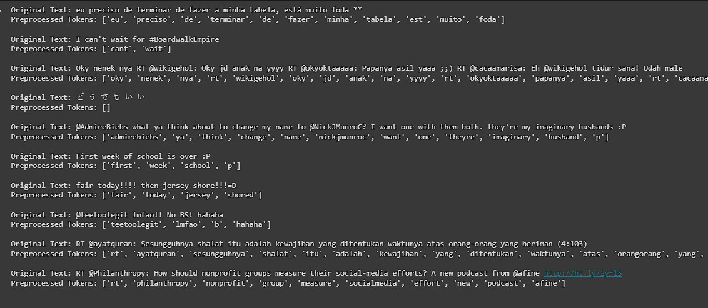</img>

### Preparing to Train the Model

Now we have to prepare to train the model, which also consists of several steps.

* Analysing each tweet content, determining their sentiments. Done using `textblob`.
* Splitting the data, into training data and testing data.
  
 

As usual, we have to start by importing all of the dependencies that is going to be used.

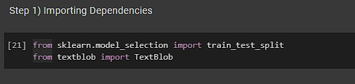</img>

Now we have to, analyse each tweet content using `TextBlob` and the assign a sentiment to each one of them. After that we have to Split the data into a training set and a test set.

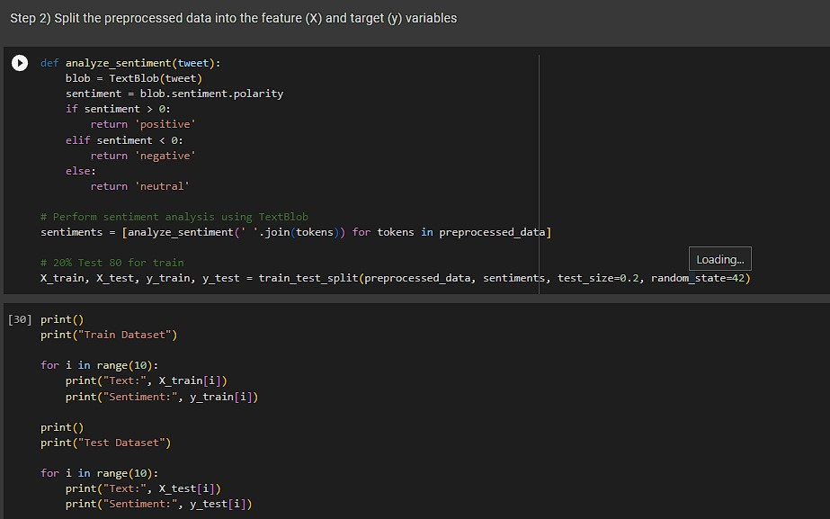</img>

This is the output for the splitting of the data that was done.

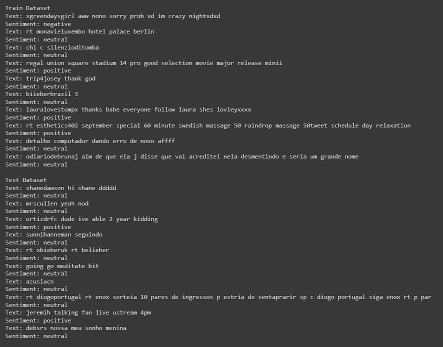</img>

### Train & Evaluate the Naive Bayes Model

Now we have to actually train the model. For this we will be using Naive Bayes. Why I used Naive Bayes? it works well for text classification tasks like sentiment analysis. It assumes that the features are conditionally independent given the class label. Again we have to go through a few steps to complete this part.

* Training the Model.
* Analysing the Accuracy and other performance identifiers.

As usual, we have to start by importing all of the dependencies that is going to be used.

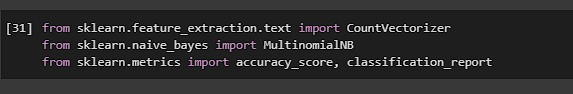</img>

Now we have to actually Train the model, first things first we have to vectorize the Text Data. In this process I will convert the preprocessed text data (X_train and X_test) into numerical features that can be used by the Naive Bayes classifier.

Then of course comes the training of the Naive Bayes Classifier using scikit-learn's MultinomialNB class.

Lastly, we have to make predictions, then evaluate how well the model performed based on its predictions

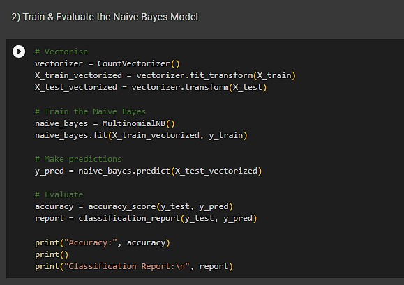</img>

The code below shows how accurate the model is. From the picture below, we can tell the model is able to correctly predict the sentiment label for about 80% of the test tweets. Which means the model performed very well.

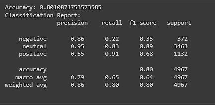</img>

### Visualising the Dataset & Performance of the Model

In this part we have to visualise how well the Model really did and also how the dataset looks like.

We can start by visualising how the dataset looks like then eventually visualising how the model performed.

As usual, we have to start by importing all of the dependencies that is going to be used.

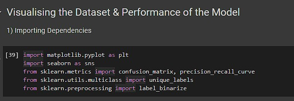</img>

**Pie Chart** - To show the distribution among sentiments

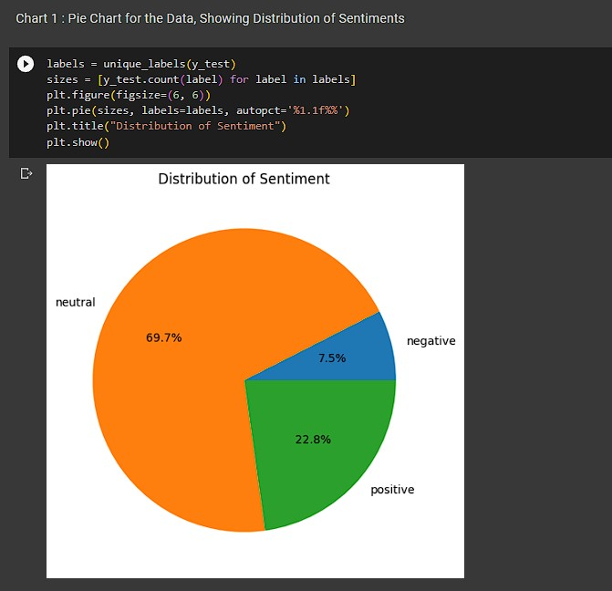</img>

**Bar Chart** - To show the distribution among sentiments

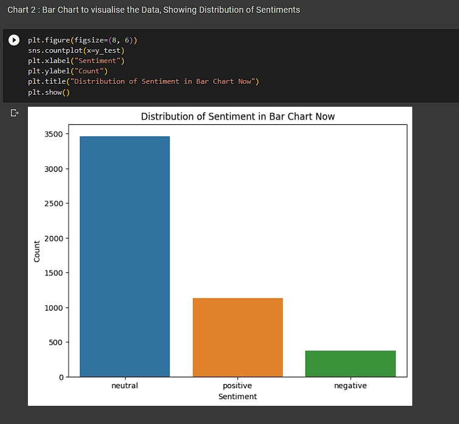</img>

**Confusion Matrix** - To show how well the model performed

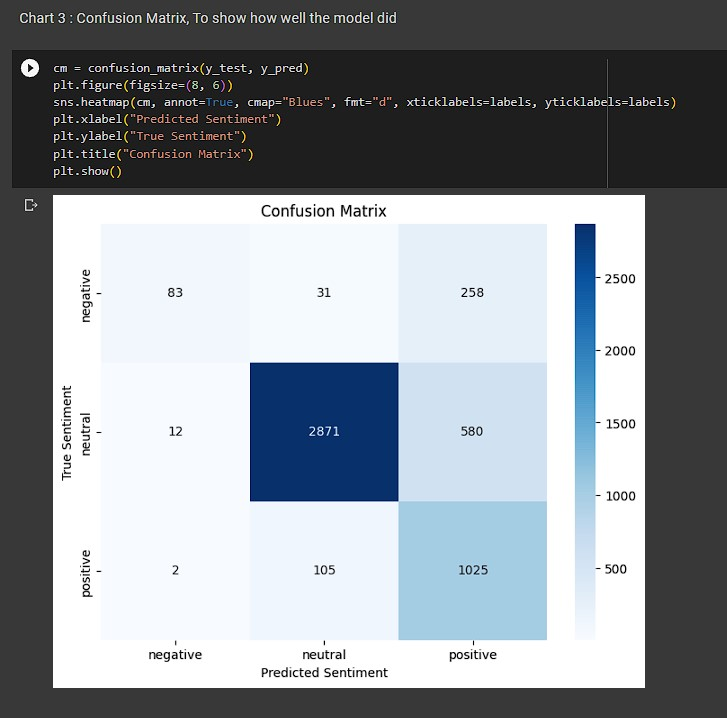</img>

**Precision-Recall Curve** - to show how the shows the tradeoff between precision and recall for different threshold which are nuetral, positive and negative

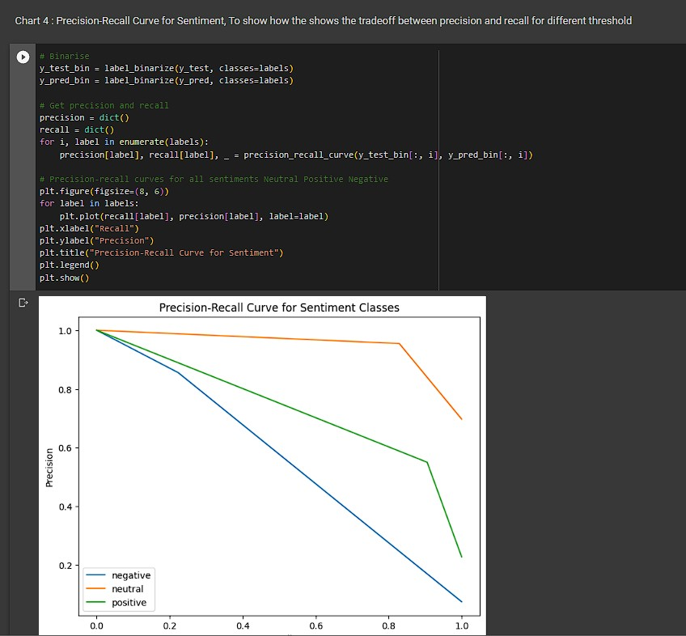</img>

Based on the visualisations it is an easy tell that,
* Nuetral Tweets : The precision and recall for the neutral class are relatively high, indicating that the model performs well in predicting neutral sentiment.
* Positive Tweets : The precision for positive sentiment is somewhat high, which means the model correctly identifies positive tweets around most of the time.
* Negative Tweets : The precision for positive sentiment is quite low comparing to the rest of the sentiments, which means the model correctly identifies negative tweets less compared to the rest of the sentiments.

## Contribution 🛠️
Please create an [Issue](https://github.com/drshahizan/special-topic-data-engineering/issues) for any improvements, suggestions or errors in the content.

You can also contact me using [Linkedin](https://www.linkedin.com/in/drshahizan/) for any other queries or feedback.

