<a href="https://github.com/drshahizan/SECP3843/stargazers"></a>
<a href="https://github.com/drshahizan/SECP3843/network/members"></a>
<a href="https://github.com/drshahizan/SECP3843/pulls"></a>
<a href="https://github.com/drshahizan/SECP3843/issues"></a>
<a href="https://github.com/drshahizan/SECP3843/graphs/contributors"></a>


Don't forget to hit the :star: if you like this repo.

# Special Topic Data Engineering (SECP3843): Alternative Assessment

#### Name: Terence Loorthanathan
#### Matric No.: A20EC0165
#### Dataset: [tweets.json](https://github.com/drshahizan/dataset/tree/main/mongodb/06-tweets)

## Question 5 (a)

There are several methods to optimise the performance of the portal when dealing with large volumes of JSON data from the [dataset tweets](https://github.com/drshahizan/dataset/tree/main/mongodb/06-tweets). Below are ways to optimise the performance of the to be portal if I had to deal with large volumns of JSON data. I will describe more ways to optimise performance on dashboard visualisations (for `Django`), as it was emphasized.

* [Through Processing the Data](#through-processing-the-data)
    * [Data Preprocessing](#data-preprocessing)
* [Through Optimising how the system works with databases](#through-optimising-how-the-system-works-with-databases)
    * [Indexing](#indexing)
    * [Caching](#caching)

Want a better look at how i coded the Data Preprocessing Part? Click <a href="./files/code/Question5_STDE_AA_TerenceLoorthanathan.ipynb">Here</a>

### Through Processing the Data

#### Data Preprocessing

<br>

Why does something like Data Preprocessing help with optimisation of the dashboard when it is dealing with large volumes of `JSON` data? Preprocessing techniques such as removing unnecessary fields and cleaning the data can significantly reduce the overall data size. This reduction in data size directly translates to faster data retrieval and processing, resulting in improved performance.

How can we remove unnecessary fields and cleaning the data? Scroll Down

*This Project was create in Google Colab*

Step 1) Import the Dataset into google colab

<p align="center">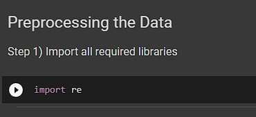</img></p>

Step 2) Preprocess the Data

<p align="center">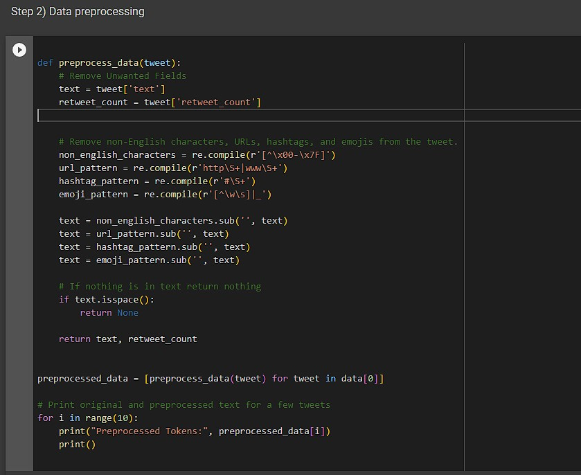</img></p>

The code shown above, is responsible for 3 tasks:

1) Unwanted Field Removal ;

    The method extracts the "text" and "retweet_count" fields from the tweet object.

2) Text Cleaning ;

    The method also removes non-English characters, URLs, hashtags, and emojis from the tweet's text content.

3) Text Validation ;

    After cleaning the text, the method checks if the resulting text is empty or consists only of whitespaces. If it is only whitespaces, it would remove it from the dataset. *A list comprehension will then filters out any `None` values*

Output:

<p align="center">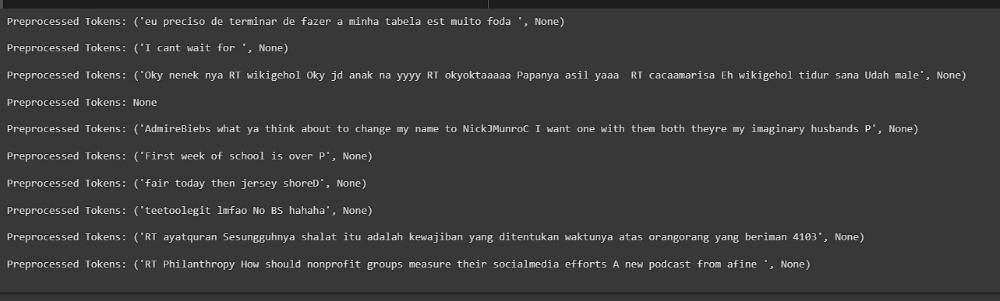</img></p>


### Through Optimising how the system works with databases

#### Indexing

Why would indexes help optimise performance of the dashboard? Indexes allow the database engine to quickly locate the required data based on the indexed fields. When working with large JSON databases, indexing the frequently accessed fields, can speed up query execution time. 

*Note : in my case retweet_count and text would be frequently accessed*

Step 1) Define which columns has to be indexed in the model

I have to define `retweet_count` and `text` as indexes.

<p align="center">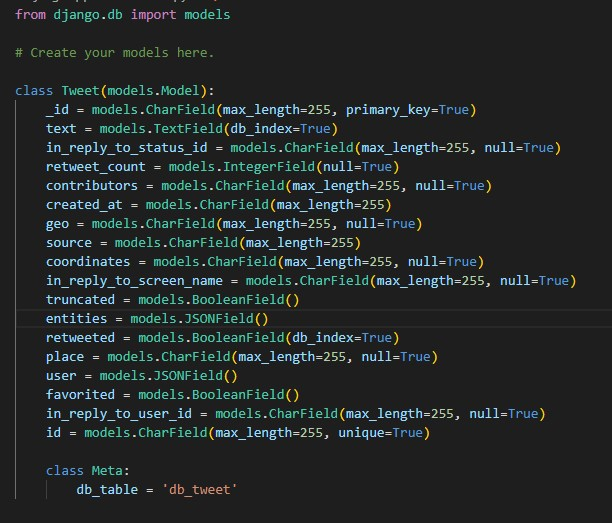</img></p>

Step 2) Update the database schema

Then, simply run the command below. To update the database schema:

```python
python manage.py makemigrations
python manage.py migrate
```

Output:

<p align="center">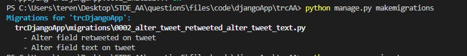</img></p>

#### Caching

Lastly, caching would also help in optimising the performance of the dashboard. Especially when there is a large JSON dataset involved with it. Basically, caching involves storing frequently accessed or computed data in a cache memory or cache storage system. Therefore, when the dashboard retrieves data, it first checks the cache for the requested information. If the data is found in the cache, it can be directly retrieved, avoiding the need for time-consuming database queries.

So it is very obvious now, why Caching would help optimise performance of the dashboard.

There are multiple ways to implement caching.

1) Django built in framework for caching
2) Redis Caching

Under normal circumstances, the built in framework for caching in Django will work fine. However, we are integrating two different databases with replicated data in them. So, using Redis Caching will be much simpler in our case.

Step 1) Install Redis Caching

A simple `pip install django-redis` in the terminal and hitting enter will install Redis Caching into your app. Provided you have internet connection.

<p align="center">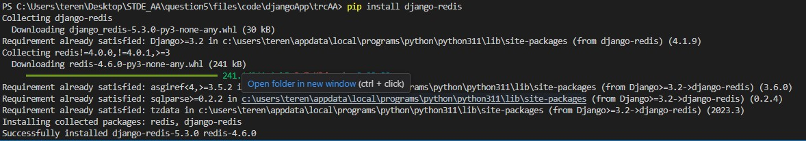</img></p>


Step 2) Configure the cache backend

We need to use the `cache` object provided by Django to cache data using Redis. Now we have properly configured Redis Cache.

<p align="center">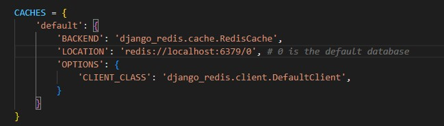</img></p>

But it is not over, since we have two different databases, one `MySQL` and one `MongoDB`, and we want to implement caching using Redis, we can modify the caching configuration to specify the database routers for each database separately.

<p align="center">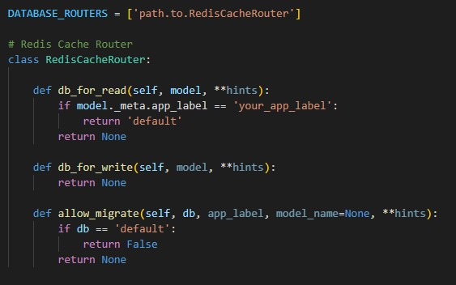</img></p>

Now we can implement caching for our project, most importantly to help optimise our database.


## Question 5 (b)

For this question, I am required to produce a dashboard utilizing the [tweets.json](https://github.com/drshahizan/dataset/tree/main/mongodb/06-tweets) dataset


* [Instructions](#instructions-on-using-charts-by-mongodb-atlas)
* [Chart 1 : Pie Chart](#chart-1--pie-chart)
* [Chart 2 : Grouped Bar Chart](#chart-2--grouped-bar-chart)
* [Chart 3 : Geo Heatmapp](#chart-3--geo-heatmapp)
* [Chart 4 : Line Chart](#chart-4--line-chart)
* [Chart 5 : Heat Map](#chart-5--heat-map)


### Instructions on Using Charts by MongoDB Atlas

First things first, we have to login into MongoDB Atlas. After loading the data into a collection, we can click on `charts`

<p align="center">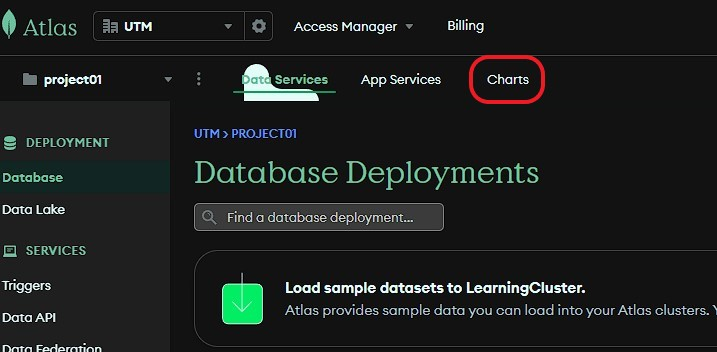</img></p>

After this, we can click on `Start` in the welcome page

<p align="center">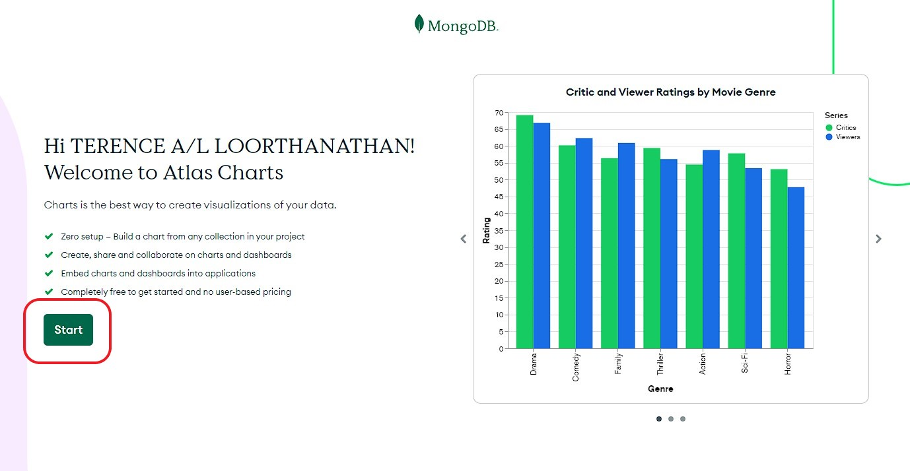</img></p>

**This is a cruicial step** : We need to pick the right datasource before proceeding

<p align="center">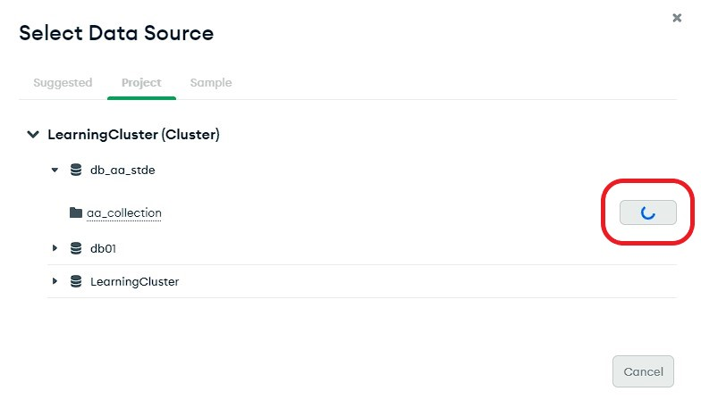</img></p>

Now we can see a sample chart, produced automatically by MongoDB. We can configure it and then save it to our Dashboard

<p align="center">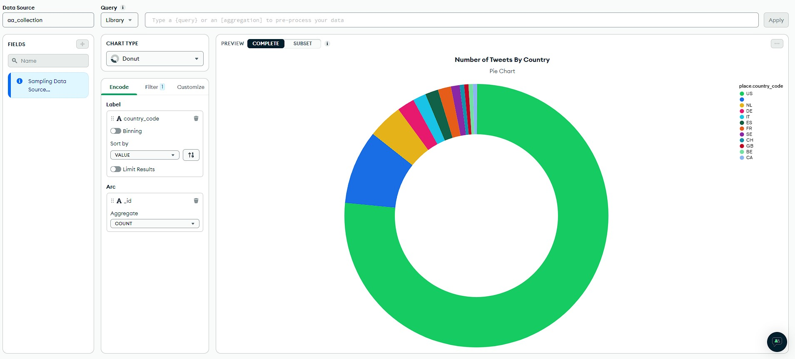</img></p>


### Chart 1 : Pie Chart

The pie chart below shows, the number of Tweets By Country. Null Values in Country are filtered out.

<p align="center">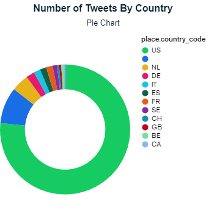</img></p>


### Chart 2 : Grouped Bar Chart

The grouped bar chart below shows, The number of hastags used per tweet. While the Line Chart shows the trend of the number of hastags used per tweet.

<p align="center">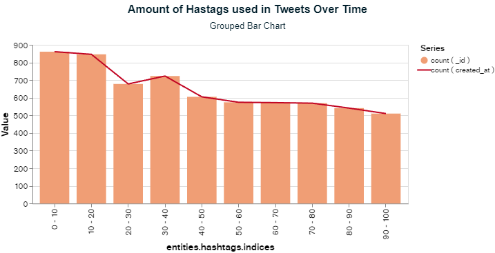</img></p>

### Chart 3 : Geo Heatmapp

The Geo Heatmap below, depicts the count of tweets that has the most contributers by coordinates.

<p align="center">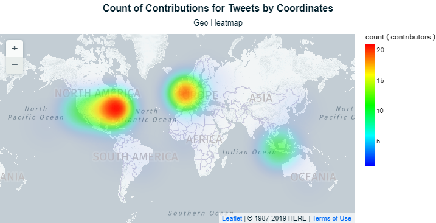</img></p>

### Chart 4 : Line Chart

The Line Chart below, depicts the number of user mention binned by 10 by number of total tweets for them.

<p align="center">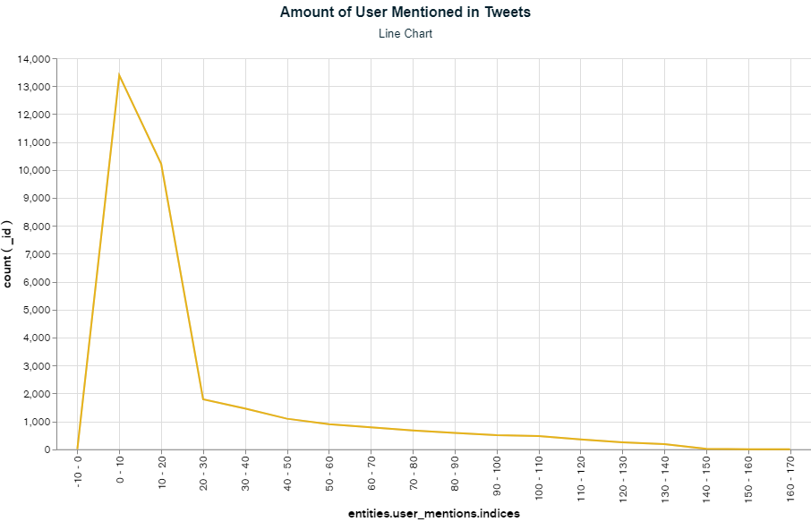</img></p>

### Chart 5 : Heat Map

The Heat Map below depicts, the Amount of URLS Binned by 10 used per tweet by country. The intensity of the heat map is determined by number of tweets for the category.

<p align="center"></img></p>

### Final Dashboard


<p align="center">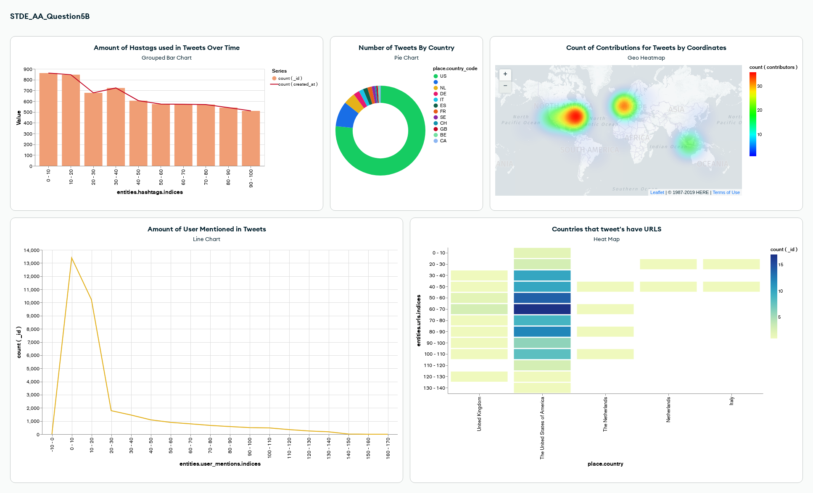</img></p>


## Contribution 🛠️
Please create an [Issue](https://github.com/drshahizan/special-topic-data-engineering/issues) for any improvements, suggestions or errors in the content.

You can also contact me using [Linkedin](https://www.linkedin.com/in/drshahizan/) for any other queries or feedback.

[](https://visitorbadge.io/status?path=https%3A%2F%2Fgithub.com%2Fdrshahizan)


