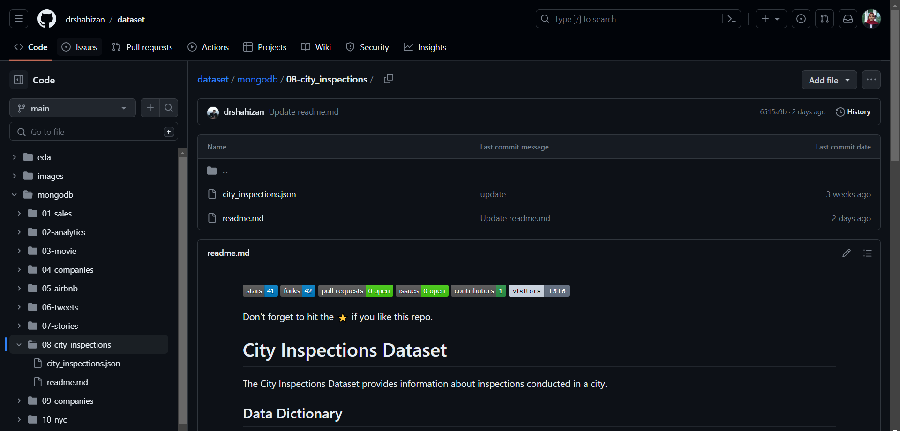
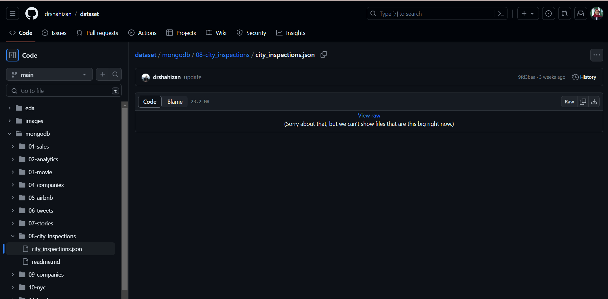
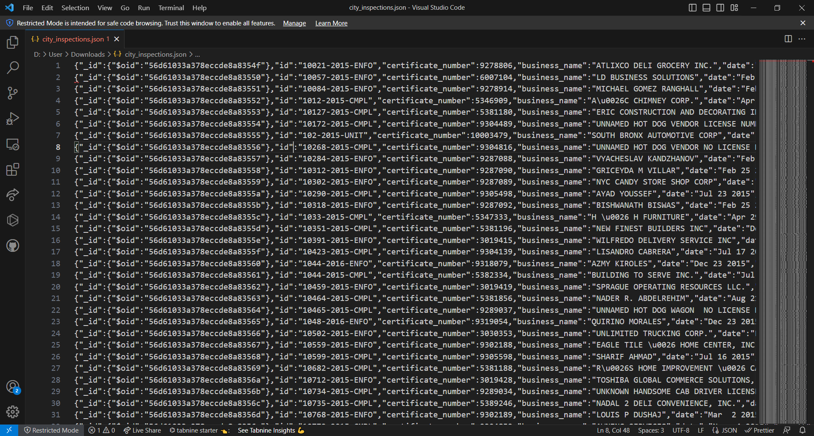
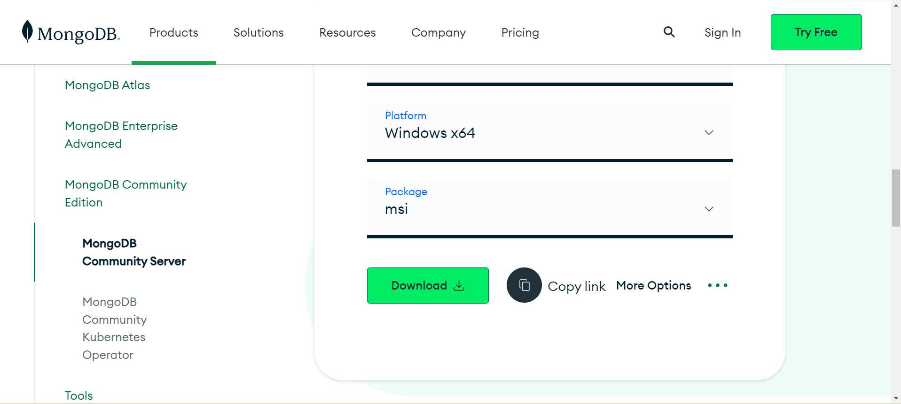
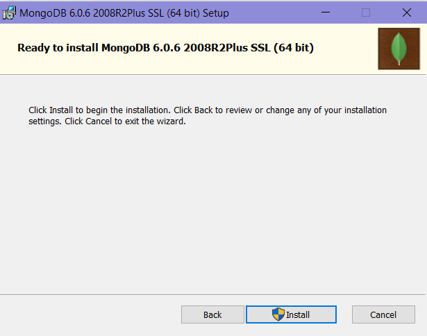
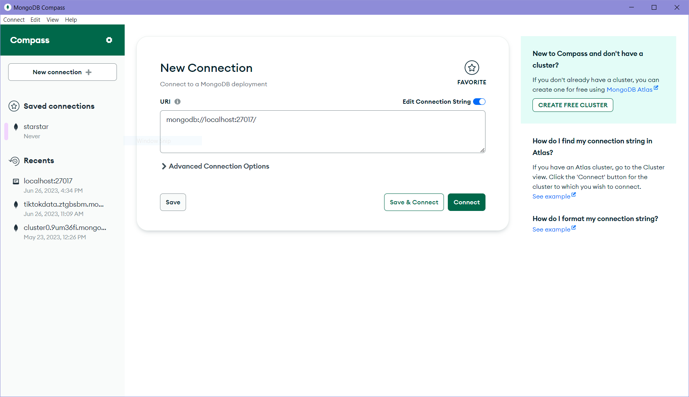
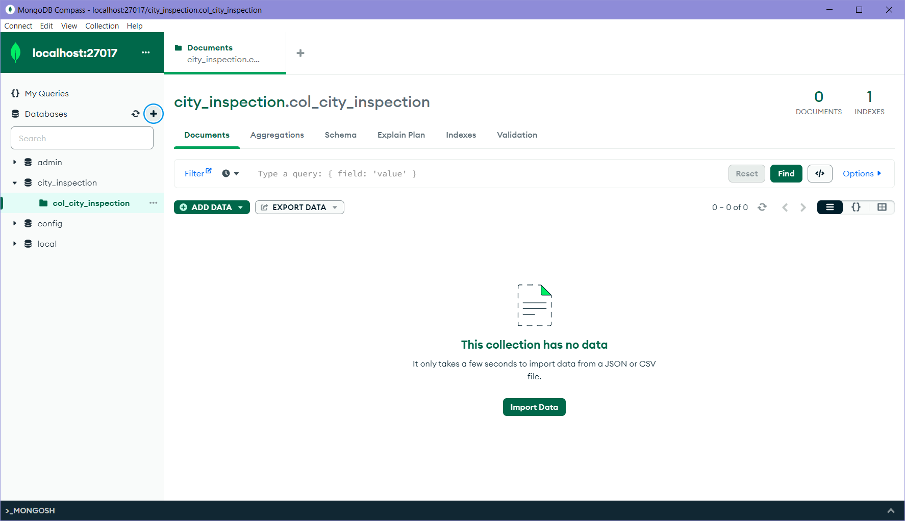
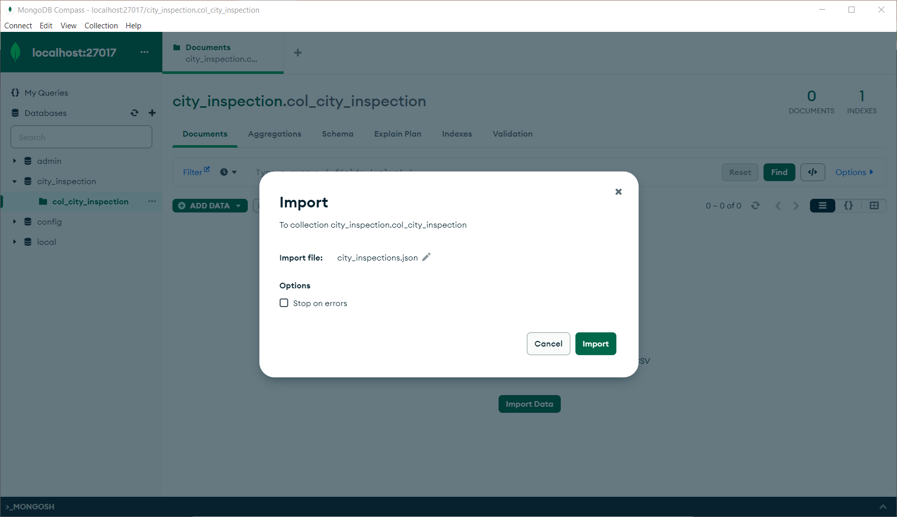
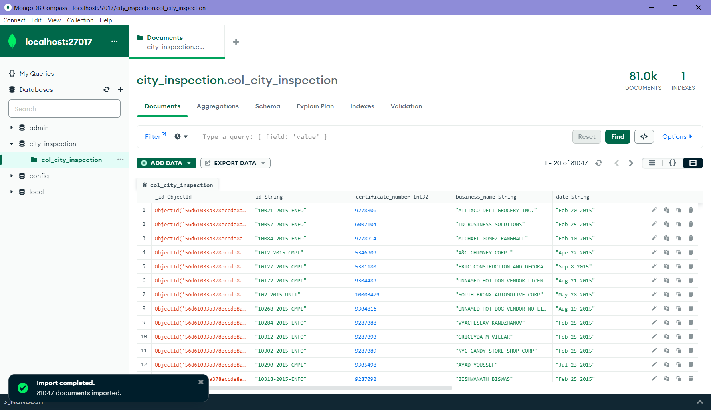

Don't forget to hit the :star: if you like this repo.

# Special Topic Data Engineering (SECP3843): Alternative Assessment

#### Name: Nur Izzah Mardhiah binti Rashidi
#### Matric No.: A20EC0116
#### Dataset: [City Inspections Dataset](https://github.com/drshahizan/dataset/tree/main/mongodb/08-city_inspections)

## Question 2 (a)
### Step-by-step process to add the data from the JSON file into MongoDB:
1. Download the JSON Dataset. Access the GitHub repository where the JSON dataset is hosted.

Locate and download the JSON file containing the City Inspections data to our local machine.
Open the JSON file using any code editor. For me, I prefer Visual Studio Code. 

2. Start MongoDB Server. Ensure that MongoDB is installed on our machine. If you do not have it installed, you can download it [here](https://www.mongodb.com/try/download/community)

After finished configure the setup, you can proceed to install.

3. Launch MongoDB Compass. Connect to the localhost. If there is no problem with the MongoDB Server previously, we will not have any problem to connect with localhost.

4. Create a database. I specify my database name to be "city_inspection". For collection, I named it "col_city_inspection".

The interface of newly empty database will be like this.

5. Import the JSON File. Within the collection view, locate the "Import Data" or "Import JSON" option. Select the JSON file we downloaded containing the City Inspections data.

6. Verify the Import. Once the import process completes, MongoDB Compass will provide a summary of the imported documents. Watch for the amount of documents imported. It should be the same as number of rows when we looked at the Visual Studio Code previously. We can change the view but I prefer to observe the dataset in tabular form. 

## Question 2 (b)
Lorem ipsum dolor sit amet, consectetur adipisicing elit, sed do eiusmod tempor incididunt ut labore et dolore magna aliqua. Ut enim ad minim veniam, quis nostrud exercitation ullamco laboris nisi ut aliquip ex ea commodo consequat. Duis aute irure dolor in reprehenderit in voluptate velit esse cillum dolore eu fugiat nulla pariatur. Excepteur sint occaecat cupidatat non proident, sunt in culpa qui officia deserunt mollit anim id est laborum.

## Contribution 🛠️
Please create an [Issue](https://github.com/drshahizan/special-topic-data-engineering/issues) for any improvements, suggestions or errors in the content.

You can also contact me using [Linkedin](https://www.linkedin.com/in/drshahizan/) for any other queries or feedback.

