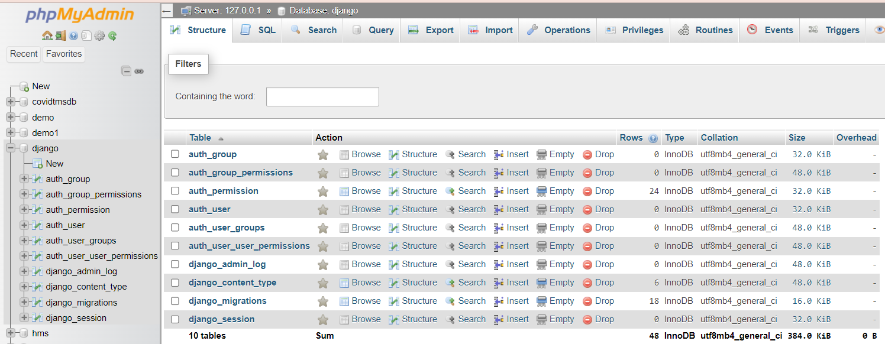
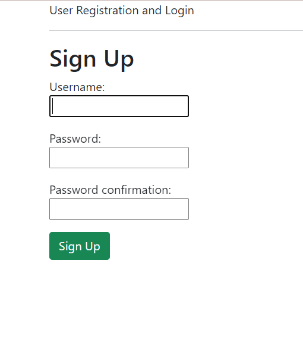
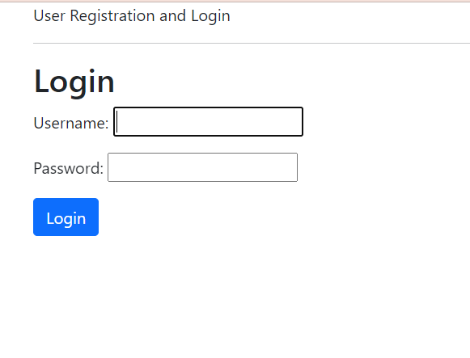

<a href="https://github.com/drshahizan/SECP3843/stargazers"></a>
<a href="https://github.com/drshahizan/SECP3843/network/members"></a>
<a href="https://github.com/drshahizan/SECP3843/pulls"></a>
<a href="https://github.com/drshahizan/SECP3843/issues"></a>
<a href="https://github.com/drshahizan/SECP3843/graphs/contributors"></a>


Don't forget to hit the :star: if you like this repo.

# Special Topic Data Engineering (SECP3843): Alternative Assessment

#### Name: Nur Izzah Mardhiah binti Rashidi
#### Matric No.: A20EC0116
#### Dataset: [City Inspections Dataset](https://github.com/drshahizan/dataset/tree/main/mongodb/08-city_inspections)

## Question 3 (a)
### Step by step in creating a module for user registration and login:
#### 1. Create Django project
- My project that I created was named "aa_project".

#### 2. Database Setup
- To use integrate MySQL with Django, we need to run this code in terminal.
  ```
  pip install mysqlclient
  ```
- Then, update Django project's settings.py file to configure the MySQL database using Django's ORM. By default, Django speficies the databse to be SQLite, hence we need to change that to MySQL. Configure the NAME, USER, PASSWORD, HOST, and PORT settings to connect to our MySQL database. Before that, I have created an empty database named "django" in PHPMyAdmin.
```
# Database
# https://docs.djangoproject.com/en/4.2/ref/settings/#databases

# DATABASES = {
#     'default': {
#         'ENGINE': 'django.db.backends.sqlite3',
#         'NAME': BASE_DIR / 'db.sqlite3',
#     }
# }

DATABASES = {
    'default': {
        'ENGINE': 'django.db.backends.mysql',
        'NAME': 'django',
        'USER': 'root',
        'PASSWORD': '',
        'HOST': 'localhost',
        'PORT': '3306'
    }
}
```
- Next, make migrations and migrate to refresh the SQL with tables that are pre-generated by Django. This is the result of migration in PhpMyAdmin.
<div align="center"></div>
- The table that will store user credentials information is the 'auth_user'.


#### 3. views.py
```
from django.shortcuts import render, redirect
from django.contrib.auth.forms import UserCreationForm
from django.contrib.auth import authenticate, login
from django.contrib.auth.forms import AuthenticationForm
from django.contrib.auth import authenticate, logout

def signup(request):
    if request.user.is_authenticated:
        return redirect('/')
    if request.method == 'POST':
        form = UserCreationForm(request.POST)
        if form.is_valid():
            form.save()
            username = form.cleaned_data.get('username')
            password = form.cleaned_data.get('password1')
            user = authenticate(username=username, password=password)
            login(request, user)
            return redirect('/')
        else:
            return render(request, 'signup.html', {'form': form})
    else:
        form = UserCreationForm()
        return render(request, 'signup.html', {'form': form})

def home(request):
    return render(request, 'home.html')

def login(request):
    form = AuthenticationForm()
    return render(request, 'login.html', {'form': form})

def signout(request):
    logout(request)
    return redirect('/')
```
#### 4. User Registration Page
```



   <h2>Sign Up</h2>
   <form method="post">
      
      
         <p>
            {{ field.label_tag }}<br>
            {{ field }}
            
               <p style="color: red">{{ error }}</p>
            
         </p>
      
      <button type="submit" class="btn btn-success">Sign Up</button>
   </form>

```
<div align="center"></div>


#### 5. Login Page
```



   <h2>Login</h2>
   <form method="post">
      
      {{ form.as_p }}
         <button type="submit" class="btn btn-primary">Login</button>
   </form>

```
<div align="center"></div>


## Question 3 (b)
#### Data Schema Mapping Technique
1. Set up database connections: Establish connections to both MySQL and MongoDB databases from our Django application. Since we already have connection with MySQL, we only need to declare connection with MongoDB here. This can be achieved by:
```
pip install pymongo
import pymongo
```
- Set up the MongoDB connection: In the same file, establish a connection to MongoDB server by creating an instance of the MongoClient class.
```
client = pymongo.MongoClient('mongodb://localhost:27017/')
```
- Access MongoDB databases and collections: Once the connection is established, we can access databases and collections in MongoDB using the client instance.
```
db = client['city_inspection']
collection = db['col_city_inspection']
```

3. Design data mapping: Define a mapping between the data models or schemas in MySQL and MongoDB. Determine how the data will be transformed and mapped from one database to the other.
```
class MyModel(models.Model):
    # MySQL fields declaration
    
    class Meta:
        db_table = 'tb_city_inspection'

class MyMongoModel(Document):
    # MongoDB fields declaration
    
    meta = {
        'collection': 'col_city_inspection'
    }

```
Data Migration Script:
```
# migration_mapping.py

MYSQL_TO_MONGO_MAPPING = {
    'tb_city_inspection': 'col_city_inspection',
}

# migration_script.py

from migration_mapping import MYSQL_TO_MONGO_MAPPING

def migrate_data(apps, schema_editor):
    # Perform data migration
    for mysql_table, mongo_collection in MYSQL_TO_MONGO_MAPPING.items():
        # Migrate data from MySQL to MongoDB based on the mapping

```


## Contribution 🛠️
Please create an [Issue](https://github.com/drshahizan/special-topic-data-engineering/issues) for any improvements, suggestions or errors in the content.

You can also contact me using [Linkedin](https://www.linkedin.com/in/drshahizan/) for any other queries or feedback.

[](https://visitorbadge.io/status?path=https%3A%2F%2Fgithub.com%2Fdrshahizan)


