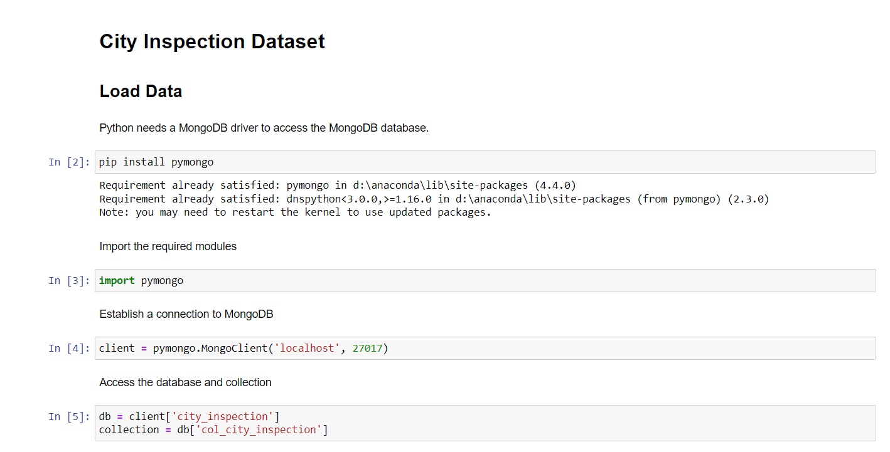
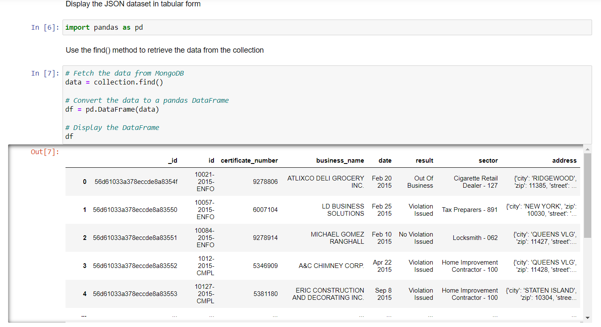
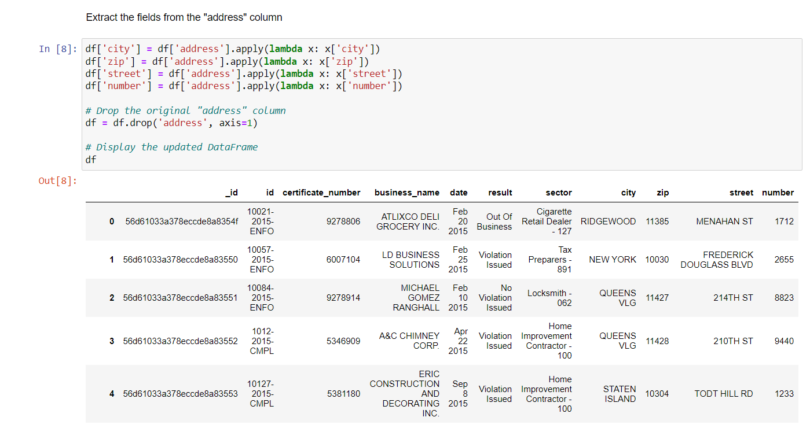
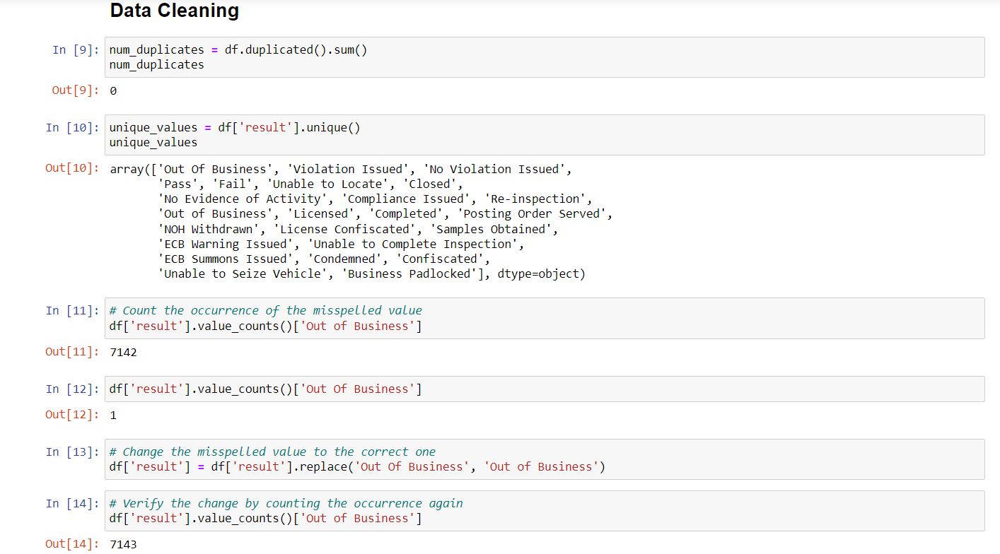
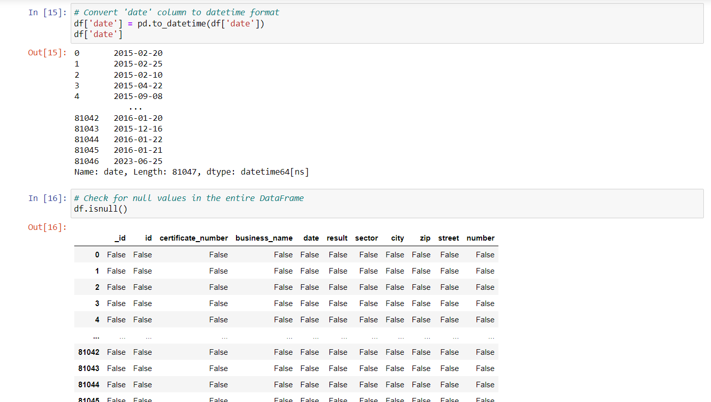

<a href="https://github.com/drshahizan/SECP3843/stargazers"></a>
<a href="https://github.com/drshahizan/SECP3843/network/members"></a>
<a href="https://github.com/drshahizan/SECP3843/pulls"></a>
<a href="https://github.com/drshahizan/SECP3843/issues"></a>
<a href="https://github.com/drshahizan/SECP3843/graphs/contributors"></a>


Don't forget to hit the :star: if you like this repo.

# Special Topic Data Engineering (SECP3843): Alternative Assessment

#### Name: Nur Izzah Mardhiah binti Rashidi
#### Matric No.: A20EC0116
#### Dataset: [City Inspections Dataset](https://github.com/drshahizan/dataset/tree/main/mongodb/08-city_inspections)

## Question 4 
The document can be referred [here](https://github.com/drshahizan/SECP3843/blob/main/submission/izzahmardhiah/question4/files/code/AA_City_Inspection.ipynb)
**1. Load dataset**
- Since my JSON data is stored in MongoDB Compass, I establishes a connection to a MongoDB database and retrieves the specific collection. 
<div align="center"></div>
<div align="center"></div>

**2. Transform the dataset into an appropriate manner**
<div align="center"></div>

**3. Data Cleaning**
<div align="center"></div>
<div align="center"></div>

**4. Machine Learning**
### Supervised Learning: Classification
I would like to predict the inspection result based on the sector.
**i. Decision Tree**
```
from sklearn.model_selection import train_test_split
from sklearn.tree import DecisionTreeClassifier
from sklearn.metrics import classification_report
from sklearn.preprocessing import LabelEncoder
from sklearn.feature_extraction.text import CountVectorizer

sectors = df['sector'].tolist()
results = df['result'].tolist()

# Encode the results using LabelEncoder
label_encoder = LabelEncoder()
encoded_results = label_encoder.fit_transform(results)

# Split the data into training and test sets
X_train, X_test, y_train, y_test = train_test_split(sectors, encoded_results, test_size=0.2, random_state=42)

# Vectorize the sectors using CountVectorizer
vectorizer = CountVectorizer()
X_train_vectors = vectorizer.fit_transform(X_train)
X_test_vectors = vectorizer.transform(X_test)

# Train the decision tree classifier
classifier = DecisionTreeClassifier()
classifier.fit(X_train_vectors, y_train)

new_sectors = ['Agriculture']

# Transform the new sectors using the fitted vectorizer
new_sectors_vectors = vectorizer.transform(new_sectors)

# Predict the results for the new sectors
predicted_results = classifier.predict(new_sectors_vectors)

# Decode the predicted results back to original labels
predicted_labels = label_encoder.inverse_transform(predicted_results)

for sectors, label in zip(new_sectors, predicted_labels):
    print(f"Sector: {sectors}, Predicted Result: {label}")

# Calculate and print the accuracy on the test set
accuracy = classifier.score(X_test_vectors, y_test)
print('Accuracy:', accuracy)

```

Output:

Sector: Agriculture, Predicted Result: Pass


Accuracy: 0.5898210980876002

**ii. Random Forest**
```
from sklearn.model_selection import train_test_split
from sklearn.ensemble import RandomForestClassifier
from sklearn.metrics import accuracy_score
from sklearn.feature_extraction.text import TfidfVectorizer

sectors = df['sector'].tolist()
results = df['result'].tolist()

# Split the data into training and test sets
X_train, X_test, y_train, y_test = train_test_split(sectors, results, test_size=0.2, random_state=42)

# Vectorize the sectors using TF-IDF Vectorizer
vectorizer = TfidfVectorizer()
X_train_vectors = vectorizer.fit_transform(X_train)
X_test_vectors = vectorizer.transform(X_test)

# Train the random forest classifier
classifier = RandomForestClassifier()
classifier.fit(X_train_vectors, y_train)

new_sectors = ['YTJT BUSINESS SOLUTIONS']

# Transform the new sectors using the fitted vectorizer
new_sectors_vectors = vectorizer.transform(new_sectors)

# Predict the results for the new sectors
predicted_results = classifier.predict(new_sectors_vectors)

for sectors, label in zip(new_sectors, predicted_results):
    print(f"Sector: {sectors}, Predicted Result: {label}")

# Calculate and print the accuracy on the test set
predicted_test_results = classifier.predict(X_test_vectors)
accuracy = accuracy_score(y_test, predicted_test_results)
print('Accuracy:', accuracy)


```
Output:
Sector: YTJT BUSINESS SOLUTIONS, Predicted Result: Pass


Accuracy: 0.5898210980876002

## Contribution 🛠️
Please create an [Issue](https://github.com/drshahizan/special-topic-data-engineering/issues) for any improvements, suggestions or errors in the content.

You can also contact me using [Linkedin](https://www.linkedin.com/in/drshahizan/) for any other queries or feedback.

[](https://visitorbadge.io/status?path=https%3A%2F%2Fgithub.com%2Fdrshahizan)


