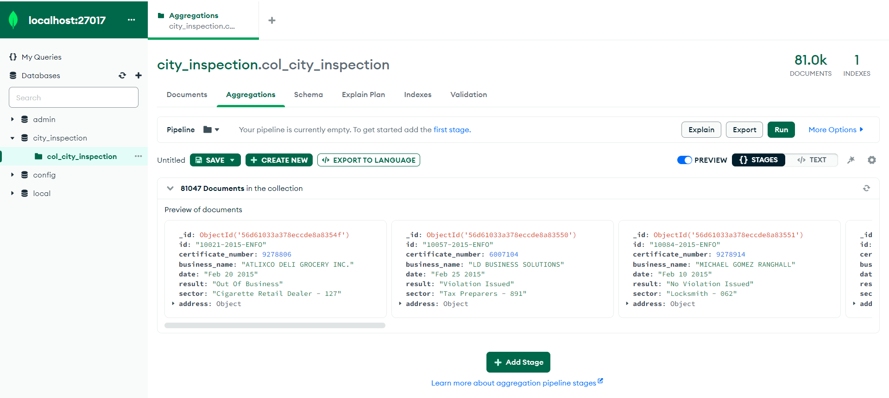
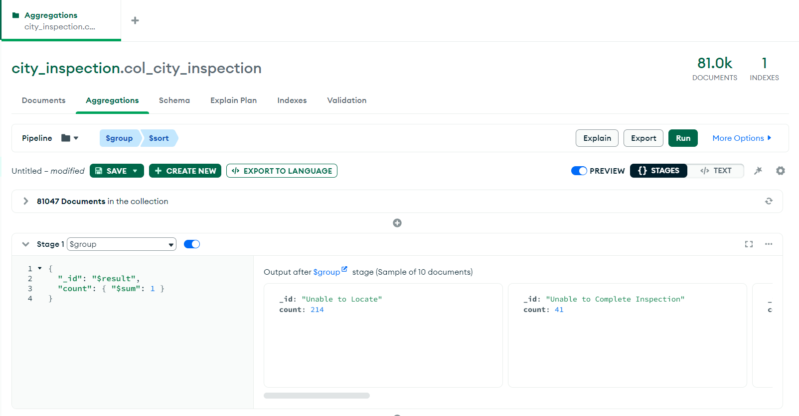
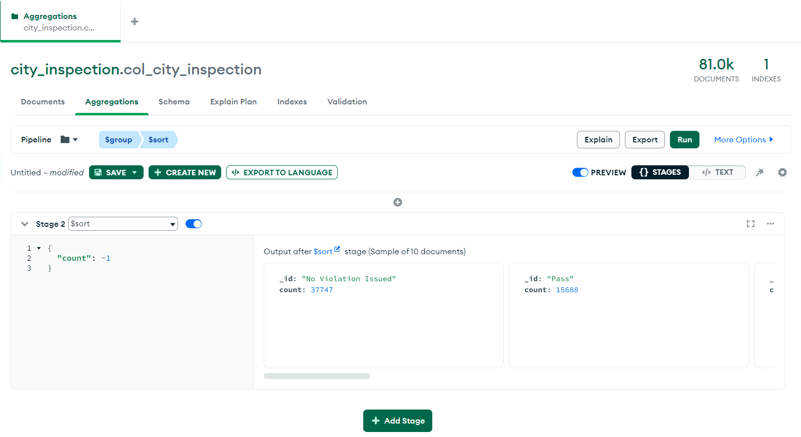
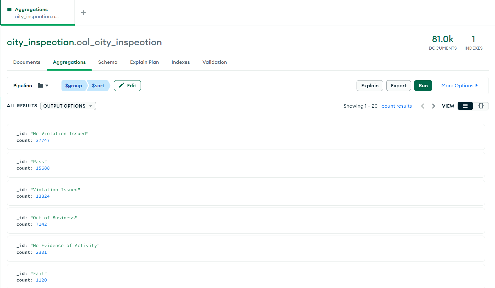
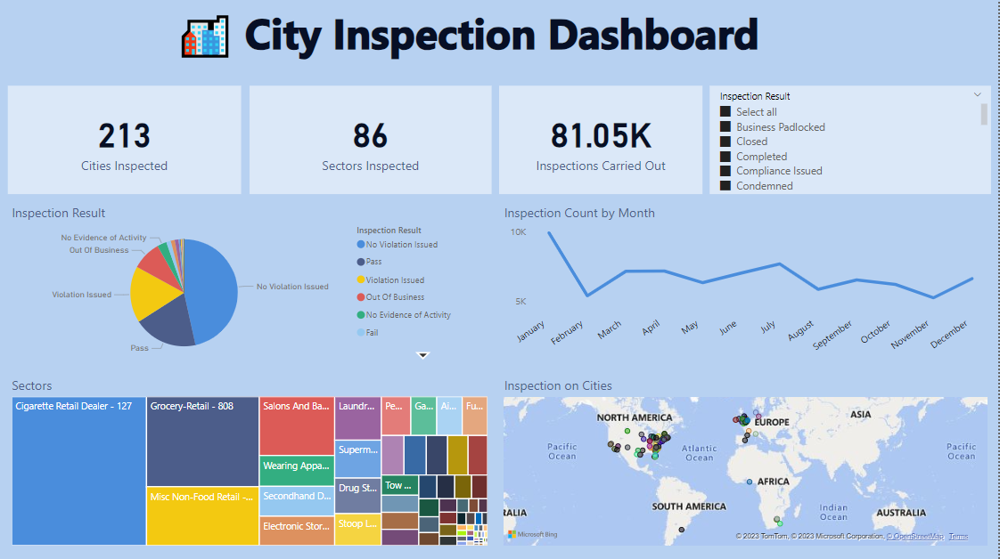

Don't forget to hit the :star: if you like this repo.

# Special Topic Data Engineering (SECP3843): Alternative Assessment

#### Name: Nur Izzah Mardhiah binti Rashidi
#### Matric No.: A20EC0116
#### Dataset: [City Inspections Dataset](https://github.com/drshahizan/dataset/tree/main/mongodb/08-city_inspections)

## Question 5 (a)
One of many ways to optimize the performance of our portal in dealing with large data especially when we would like to visualize dashboard is by <b>data aggregation.</b> 

Data aggregation is done on the server-side before sending it to the client for visualization. Use Django's query aggregation functions to calculate summaries, counts, averages, or other aggregated values based on our visualization requirements. This reduces the amount of data transferred and processed on the client-side.

Fortunately, using MongoDB Compass, we are able to perfom data aggregation easily! This is becuase MongoDB Compass offers a feature where we can build aggregation pipeline. Below, I will describe the step-by-step on how we can aggregate our data using a pipeline:-

1. Click on the "Aggregations" tab in MongoDB Compass.

2. In the Aggregations tab, we can construct the aggregation pipeline using various stages such as $match, $group, $project, $sort, etc. In this case, I created 2 stages and use $group and $sort operations.

3. First Stage: $group
- Use $group to group documents and perform aggregation operations.
- I group the documents based on 'result' column and calculate the count of documents in each group.

4. Second Stage: $sort
- $sort stage is then used to sort the results based on the count in descending order.

5. Click 'run'. This is the output

**How it helps in optimize large data?**

- The code allows us to summarize the data by counting the occurrences of each distinct value in the "result" field. This provides a quick overview of the distribution of results in the dataset.
- Aggregating data using the $group stage allows the database to perform the aggregation operation on the server-side, which can be more efficient and scalable compared to fetching the entire dataset and performing the aggregation on the client-side.
  

## Question 5 (b)

  
  [Click on the image to directly go to the dashboard]

### City Inspection Dashboard
The "City Inspection Dashboard" provides an overview of inspections carried out in different cities and sectors. It includes the following components:

#### <ins>Dashboard Cards</ins>
The dashboard features several cards that provide key metrics:

- Number of Cities: Displays the total number of cities involved in the inspections.
- Sectors Involved: Highlights the sectors that are included in the inspections.
- Inspections Carried Out: Shows the total count of inspections conducted.

#### <ins>Result of Inspection Percentage (Pie Chart)</ins>
The pie chart showcases the distribution of inspection results as a percentage. It offers insights into the outcome of the inspections.

#### <ins>Inspections by Month (Line Graph)</ins>
The line graph illustrates the number of inspections conducted over time, grouped by month. It enables the identification of inspection patterns and trends.

#### <ins>Sector Frequency (Heat Map)</ins>
The heat map represents the frequency of sectors involved in the inspections. It visually displays the sectors with higher or lower inspection frequencies.

#### <ins>Cities Involved (Map)</ins>
The map visualizes the cities that participated in the inspections. The bubble size corresponds to the frequency of inspections conducted in each city.

## Contribution 🛠️
Please create an [Issue](https://github.com/drshahizan/special-topic-data-engineering/issues) for any improvements, suggestions or errors in the content.

You can also contact me using [Linkedin](https://www.linkedin.com/in/drshahizan/) for any other queries or feedback.

