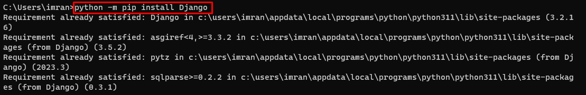
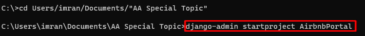
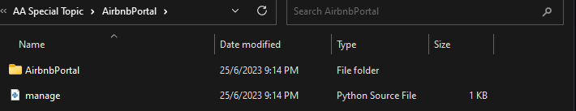
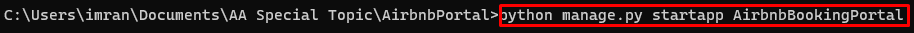
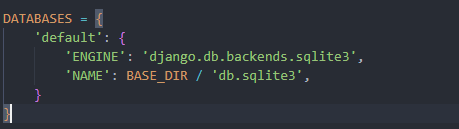
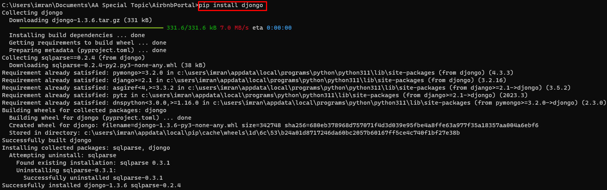
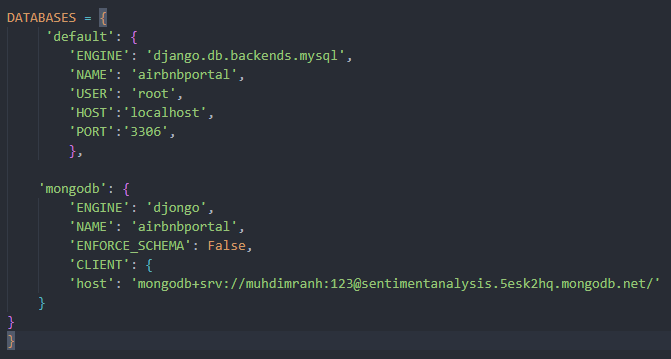
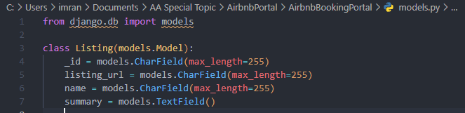
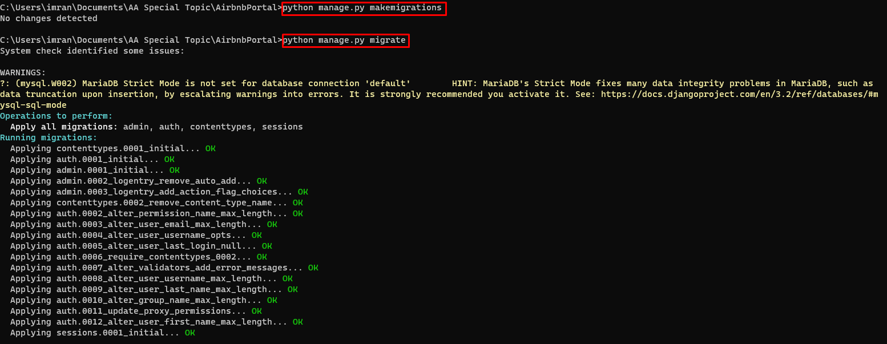
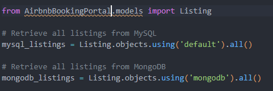

<a href="https://github.com/drshahizan/SECP3843/stargazers"></a>
<a href="https://github.com/drshahizan/SECP3843/network/members"></a>
<a href="https://github.com/drshahizan/SECP3843/pulls"></a>
<a href="https://github.com/drshahizan/SECP3843/issues"></a>
<a href="https://github.com/drshahizan/SECP3843/graphs/contributors"></a>


Don't forget to hit the :star: if you like this repo.

# Special Topic Data Engineering (SECP3843): Alternative Assessment

#### Name: MUHAMMAD IMRAN HAKIMI BIN MOHD SHUKRI
#### Matric No.:A20EC0213
#### Dataset:AIRBNB

## Question 1 (a)

To integrate Django with the JSON dataset and ensure efficient data storage and retrieval from both MySQL and MongoDB databases for Airbnb Booking Portal, there are numbers steps need to be followed:

1. **Install Django**: Start by installing Django by using the pip package manager to install Django. Use `python -m pip install Django`.



2. **Set up Django project**: Create a new Django project using the `django-admin startproject` command. This will create a project directory with the necessary files and folders.




3. **Create Django app**: Inside the project directory, create a new Django app using the `python manage.py startapp` command. This will create an app directory with the required files for the app.



4. **Configure the settings**: Open the settings.py file in the project directory and configure the database settings for both MySQL and MongoDB. Set the "DATABASES" dictionary to include the necessary configuration for MySQL and MongoDB databases. In this approach, I will be using the djongo library to connect to MongoDB. To add MongoDB and MySQL as database:



a. Install djongo using `pip install djongo` and mysqlclient using `pip install mysqlclient`.



b. Modify the "DATABASES" library as the following:

```
MongoDB: `DATABASES = {
        'default': {
            'ENGINE': 'djongo',
            'NAME': 'your-db-name',
            'ENFORCE_SCHEMA': False,
            'CLIENT': {
                'host': 'mongodb+srv://<username>:<password>@<atlas cluster>/<myFirstDatabase>?retryWrites=true&w=majority'
            }  
        }
}

MySQL: `DATABASES = {
	'default': {
		'ENGINE': 'django.db.backends.mysql',
		'NAME': 'mydb',
		'USER': 'root',
		'PASSWORD': 'admin',
		'HOST':'localhost',
		'PORT':'3306',
	}
}
```

c. To use both, here is an example of how I implement it in my settings.py:



5. **Define models**: In Django, models represent the structure of the data. Define models in the models.py file of the app to reflect the schema of the JSON dataset. Each model class should correspond to a table in the databases. Below is how can I write based on my dataset.



6. **Migrate the database**: Run the `python manage.py makemigrations` command to create the necessary database migrations based on the defined models. Then, run the `python manage.py migrate` command to apply these migrations and create the corresponding tables in both MySQL and MongoDB.



7. **Load data from JSON**: Write a script or a Django management command to read the JSON dataset (listingsAndReviews.json) and populate the tables in both databases. I will use the Django ORM to interact with the databases and insert the data.

8. **Querying and retrieving data**: Use Django's ORM to query and retrieve data from both databases. This can be done by writing queries and perform operations on the model to fetch the required data. For example, if i want to load anything from my dataset, I can use the retrieval query as below.



9. **Update and synchronization**: If the JSON dataset is updated or new data is added, I will need to update the databases accordingly.

10. **Test and optimize**: Test the integration thoroughly to ensure that data is stored and retrieved correctly from both MySQL and MongoDB. Optimize the queries and database operations for better performance, considering factors such as indexes and query optimization techniques.

From all the steps above, there are some steps that I may skip in case I already have the airbnb datasets populated in my MongoDB database. In this case, I can skip loading data from JSON (step 7).


## Question 1 (b)
Lorem ipsum dolor sit amet, consectetur adipisicing elit, sed do eiusmod tempor incididunt ut labore et dolore magna aliqua. Ut enim ad minim veniam, quis nostrud exercitation ullamco laboris nisi ut aliquip ex ea commodo consequat. Duis aute irure dolor in reprehenderit in voluptate velit esse cillum dolore eu fugiat nulla pariatur. Excepteur sint occaecat cupidatat non proident, sunt in culpa qui officia deserunt mollit anim id est laborum.


## Contribution 🛠️
Please create an [Issue](https://github.com/drshahizan/special-topic-data-engineering/issues) for any improvements, suggestions or errors in the content.

You can also contact me using [Linkedin](https://www.linkedin.com/in/drshahizan/) for any other queries or feedback.

[](https://visitorbadge.io/status?path=https%3A%2F%2Fgithub.com%2Fdrshahizan)


