<a href="https://github.com/drshahizan/SECP3843/stargazers"></a>
<a href="https://github.com/drshahizan/SECP3843/network/members"></a>
<a href="https://github.com/drshahizan/SECP3843/pulls"></a>
<a href="https://github.com/drshahizan/SECP3843/issues"></a>
<a href="https://github.com/drshahizan/SECP3843/graphs/contributors"></a>


Don't forget to hit the :star: if you like this repo.

# Special Topic Data Engineering (SECP3843): Alternative Assessment

#### Name: MUHAMMAD IMRAN HAKIMI BIN MOHD SHUKRI
#### Matric No.:A20EC0213
#### Dataset:AIRBNB

## Question 5 (a)
Lorem ipsum dolor sit amet, consectetur adipisicing elit, sed do eiusmod tempor incididunt ut labore et dolore magna aliqua. Ut enim ad minim veniam, quis nostrud exercitation ullamco laboris nisi ut aliquip ex ea commodo consequat. Duis aute irure dolor in reprehenderit in voluptate velit esse cillum dolore eu fugiat nulla pariatur. Excepteur sint occaecat cupidatat non proident, sunt in culpa qui officia deserunt mollit anim id est laborum.

## Question 5 (b)

In order to create a visualization dashboard, I chose MongoDB Atlas charts. I began by uploading my JSON Airbnb dataset into the MongoDB database (using mongoimport as in Question 2).  

MongoDB charts provide a drag-and-drop visualization creator, just like Tableau and PowerBI. It is very easy to use and it utilizes the JSON dataset that has been uploaded into the database.

Once JSON dataset has been uploaded, we can proceed with:

### 1. Go to MongoDB website.

Open the [MongoDB website](https://account.mongodb.com/account/login?_ga=2.62663724.188383531.1687805900-413483686.1685199079).

### 2. Click on `Charts` from the project dashboard.

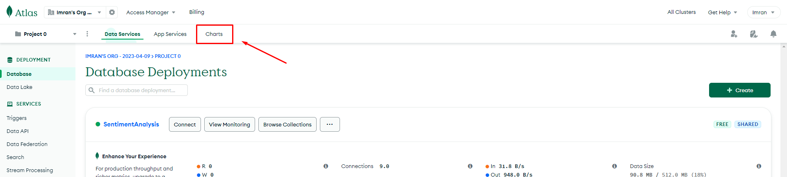


### 3. Click `Add Dashbord` if it is not already created.

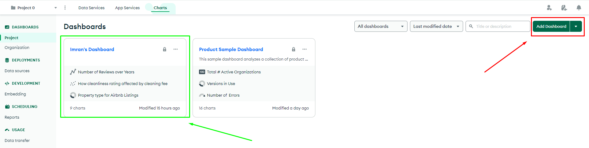


### 4. Inside the dashboard, click on Add Chart to begin visualization.

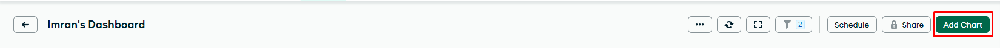


### 5. Choose your dataset.

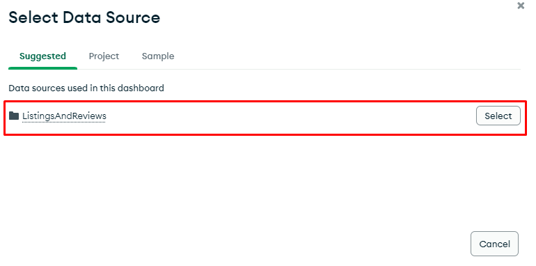


### 6. Begin drag-and-drop attributes fields into chart requirement field.


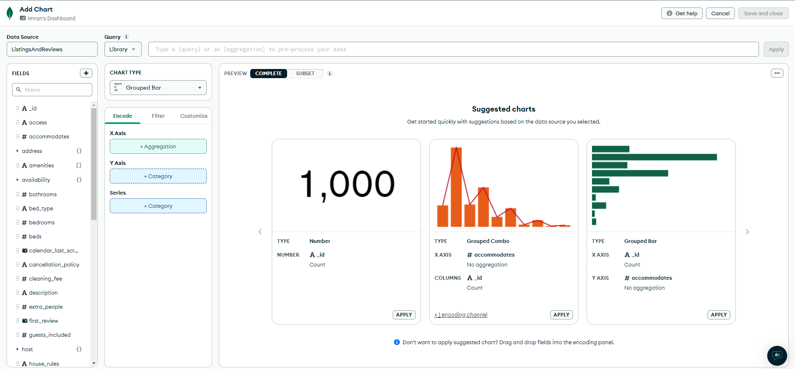

---

### Charts and Dashboard Development.


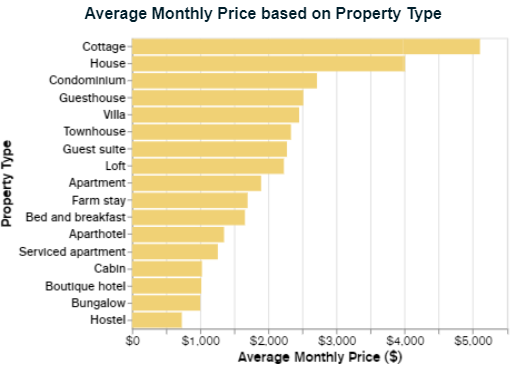

Above chart shows average monthly room price for each property type. But before visualization can be made, we need to ensure the price currency is standard and does not follow that particular country's currency. This is to ensure accurate data visualization. In order to do that, we can standardize the currency to be in USD. For that, we will utilize the query field the chart designer.

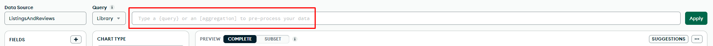

Query:

```
[
  {
    "$addFields": {
      "converted_monthlyprice": {
        "$switch": {
          "branches": [
            {
              "case": { "$eq": [ "$address.country", "Brazil" ] },
              "then": { "$multiply": [ "$monthly_price", 0.21 ] }  // Convert BRL to USD using exchange rate
            },
            {
              "case": { "$eq": [ "$address.country", "Spain" ] },
              "then": { "$multiply": [ "$monthly_price", 1.09 ] }  // Convert CAD to USD using exchange rate
            },
            {
              "case": { "$eq": [ "$address.country", "Canada" ] },
              "then": { "$multiply": [ "$monthly_price", 0.76 ] }  // Convert CAD to USD using exchange rate
            },
            {
              "case": { "$eq": [ "$address.country", "Portugal" ] },
              "then": { "$multiply": [ "$monthly_price", 1.09 ] }  // Convert CAD to USD using exchange rate
            },
            {
              "case": { "$eq": [ "$address.country", "China" ] },
              "then": { "$multiply": [ "$monthly_price", 0.14 ] }  // Convert CAD to USD using exchange rate
            },
            {
              "case": { "$eq": [ "$address.country", "Turkey" ] },
              "then": { "$multiply": [ "$monthly_price", 0.039 ] }  // Convert CAD to USD using exchange rate
            },
            {
              "case": { "$eq": [ "$address.country", "Hong Kong" ] },
              "then": { "$multiply": [ "$monthly_price", 0.13 ] }  // Convert CAD to USD using exchange rate
            },
            {
              "case": { "$eq": [ "$address.country", "Australia" ] },
              "then": { "$multiply": [ "$monthly_price", 0.67 ] }  // Convert CAD to USD using exchange rate
            }
          ],
          "default": "$monthly_price"  // Keep the original price for other countries
        }
      }
    }
  }
]
```

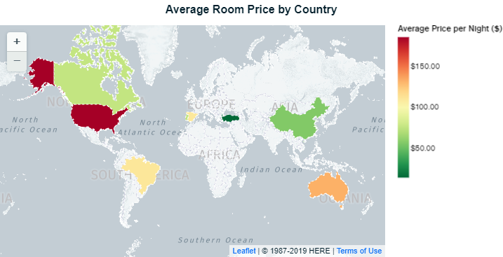

The chart above describes the average room price per night accross different countries. This will give accurate representation on how different countries' Airbnb listings prices differ from each other. Similarly, the price per night must be converted to be in USD.

Query:

```
[
  {
    "$addFields": {
      "converted_price": {
        "$switch": {
          "branches": [
            {
              "case": { "$eq": [ "$address.country", "Brazil" ] },
              "then": { "$multiply": [ "$price", 0.21 ] }  // Convert BRL to USD using exchange rate
            },
            {
              "case": { "$eq": [ "$address.country", "Spain" ] },
              "then": { "$multiply": [ "$price", 1.09 ] }  // Convert CAD to USD using exchange rate
            },
            {
              "case": { "$eq": [ "$address.country", "Canada" ] },
              "then": { "$multiply": [ "$price", 0.76 ] }  // Convert CAD to USD using exchange rate
            },
            {
              "case": { "$eq": [ "$address.country", "Portugal" ] },
              "then": { "$multiply": [ "$price", 1.09 ] }  // Convert CAD to USD using exchange rate
            },
            {
              "case": { "$eq": [ "$address.country", "China" ] },
              "then": { "$multiply": [ "$price", 0.14 ] }  // Convert CAD to USD using exchange rate
            },
            {
              "case": { "$eq": [ "$address.country", "Turkey" ] },
              "then": { "$multiply": [ "$price", 0.039 ] }  // Convert CAD to USD using exchange rate
            },
            {
              "case": { "$eq": [ "$address.country", "Hong Kong" ] },
              "then": { "$multiply": [ "$price", 0.13 ] }  // Convert CAD to USD using exchange rate
            },
            {
              "case": { "$eq": [ "$address.country", "Australia" ] },
              "then": { "$multiply": [ "$price", 0.67 ] }  // Convert CAD to USD using exchange rate
            }
          ],
          "default": "$price"  // Keep the original price for other countries
        }
      }
    }
  }
]
```

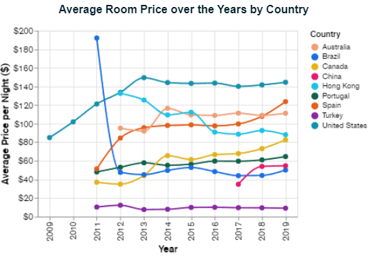

Line chart above describes price changes over the years across different countries.

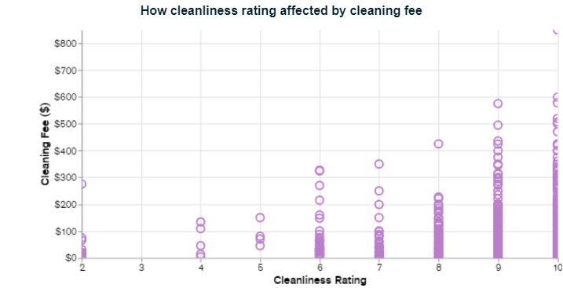

Scatter plot above visualizes the relationship between room cleanliness rating and cleaning fee. The result shows that higher cleaning fee tends to have higher cleanliness rating.

Query:

```
[
  {
    "$match": {
      "review_scores.review_scores_cleanliness": { "$ne": null }
    }
  },
  {
    "$addFields": {
      "converted_cleaning_fee": {
        "$switch": {
          "branches": [
            {
              "case": { "$eq": [ "$address.country", "Brazil" ] },
              "then": { "$multiply": [ "$cleaning_fee", 0.21 ] }  // Convert BRL to USD using exchange rate
            },
            {
              "case": { "$eq": [ "$address.country", "Spain" ] },
              "then": { "$multiply": [ "$cleaning_fee", 1.09 ] }  // Convert CAD to USD using exchange rate
            },
            {
              "case": { "$eq": [ "$address.country", "Canada" ] },
              "then": { "$multiply": [ "$cleaning_fee", 0.76 ] }  // Convert CAD to USD using exchange rate
            },
            {
              "case": { "$eq": [ "$address.country", "Portugal" ] },
              "then": { "$multiply": [ "$cleaning_fee", 1.09 ] }  // Convert CAD to USD using exchange rate
            },
            {
              "case": { "$eq": [ "$address.country", "China" ] },
              "then": { "$multiply": [ "$cleaning_fee", 0.14 ] }  // Convert CAD to USD using exchange rate
            },
            {
              "case": { "$eq": [ "$address.country", "Turkey" ] },
              "then": { "$multiply": [ "$cleaning_fee", 0.039 ] }  // Convert CAD to USD using exchange rate
            },
            {
              "case": { "$eq": [ "$address.country", "Hong Kong" ] },
              "then": { "$multiply": [ "$cleaning_fee", 0.13 ] }  // Convert CAD to USD using exchange rate
            },
            {
              "case": { "$eq": [ "$address.country", "Australia" ] },
              "then": { "$multiply": [ "$cleaning_fee", 0.67 ] }  // Convert CAD to USD using exchange rate
            }
          ],
          "default": "$cleaning_fee" // Keep the original cleaning fee for other countries
        }
      },
      "converted_price": {
        "$switch": {
          "branches": [
            {
              "case": { "$eq": [ "$address.country", "Brazil" ] },
              "then": { "$multiply": [ "$price", 0.21 ] }  // Convert BRL to USD using exchange rate
            },
            {
              "case": { "$eq": [ "$address.country", "Spain" ] },
              "then": { "$multiply": [ "$price", 1.09 ] }  // Convert CAD to USD using exchange rate
            },
            {
              "case": { "$eq": [ "$address.country", "Canada" ] },
              "then": { "$multiply": [ "$price", 0.76 ] }  // Convert CAD to USD using exchange rate
            },
            {
              "case": { "$eq": [ "$address.country", "Portugal" ] },
              "then": { "$multiply": [ "$price", 1.09 ] }  // Convert CAD to USD using exchange rate
            },
            {
              "case": { "$eq": [ "$address.country", "China" ] },
              "then": { "$multiply": [ "$price", 0.14 ] }  // Convert CAD to USD using exchange rate
            },
            {
              "case": { "$eq": [ "$address.country", "Turkey" ] },
              "then": { "$multiply": [ "$price", 0.039 ] }  // Convert CAD to USD using exchange rate
            },
            {
              "case": { "$eq": [ "$address.country", "Hong Kong" ] },
              "then": { "$multiply": [ "$price", 0.13 ] }  // Convert CAD to USD using exchange rate
            },
            {
              "case": { "$eq": [ "$address.country", "Australia" ] },
              "then": { "$multiply": [ "$price", 0.67 ] }  // Convert CAD to USD using exchange rate
            }
          ],
          "default": "$price" // Keep the original price for other countries
        }
      }
    }
  }
]
```

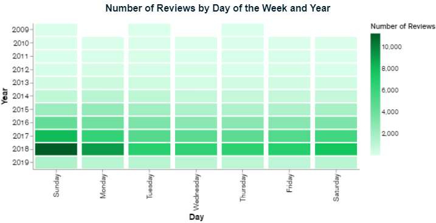

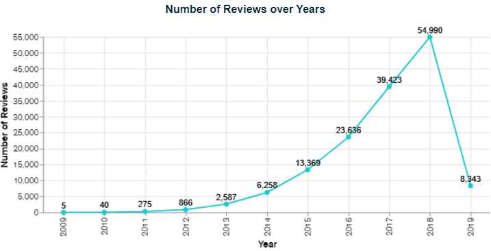


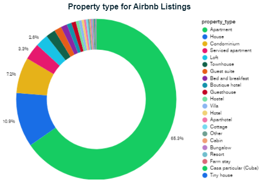

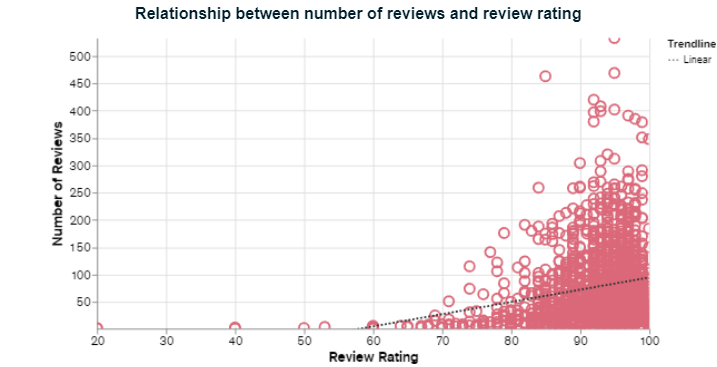


## Contribution 🛠️
Please create an [Issue](https://github.com/drshahizan/special-topic-data-engineering/issues) for any improvements, suggestions or errors in the content.

You can also contact me using [Linkedin](https://www.linkedin.com/in/drshahizan/) for any other queries or feedback.

[](https://visitorbadge.io/status?path=https%3A%2F%2Fgithub.com%2Fdrshahizan)


