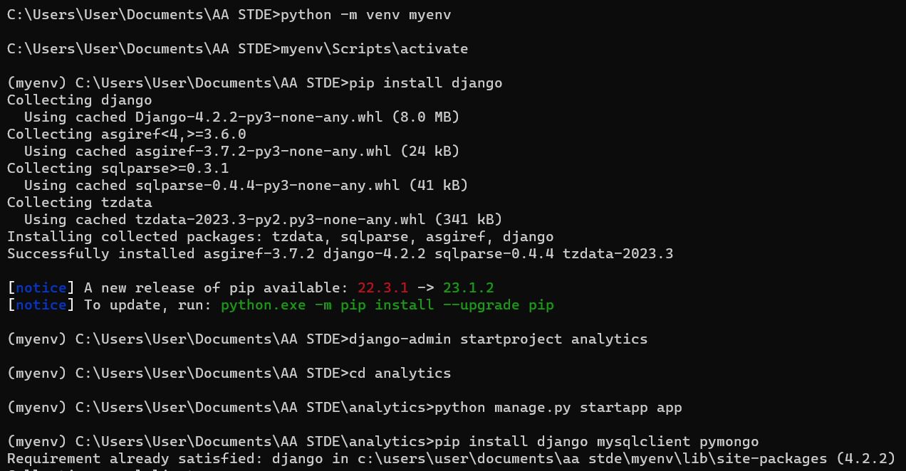
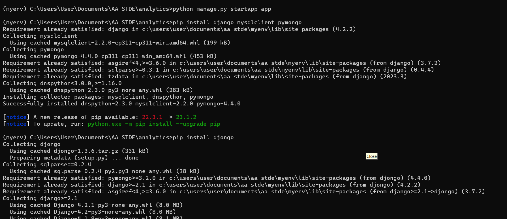
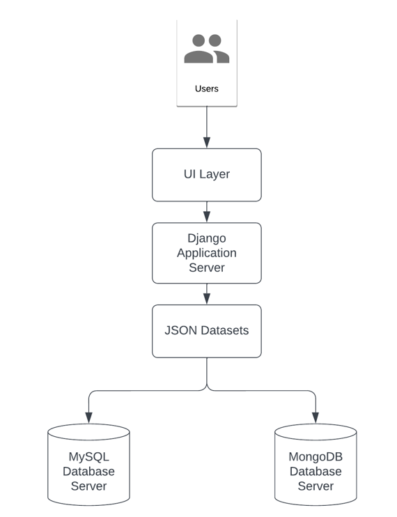

<a href="https://github.com/drshahizan/SECP3843/stargazers"></a>
<a href="https://github.com/drshahizan/SECP3843/network/members"></a>
<a href="https://github.com/drshahizan/SECP3843/pulls"></a>
<a href="https://github.com/drshahizan/SECP3843/issues"></a>
<a href="https://github.com/drshahizan/SECP3843/graphs/contributors"></a>


Don't forget to hit the :star: if you like this repo.

# Special Topic Data Engineering (SECP3843): Alternative Assessment

#### Name: Nur Syamalia Faiqah Binti Mohd Kamal
#### Matric No.: A20EC0118
#### Dataset : [Analytics Dataset](https://github.com/drshahizan/dataset/tree/main/mongodb/02-analytics)

## Question 1 (a)
In This questions, I will use 3 servers which are:
- Server 1: MongoDB Database Server
- Server 2: MySQL Database Server
- Server 3: Django Application Server

<p>To begin, allocating a separate web server guarantees that the Django web application has the resources to process user requests, generate dynamic web pages, and connect with databases. Isolating the web server from the database servers enables better resource management and prevents any database performance issues from affecting the responsiveness of the online application.</p>

<p>Having separate servers for MySQL and MongoDB databases improves database administration and optimisation. The MySQL database server processes SQL queries from the Django application and concentrates on storing structured data from the JSON dataset. Likewise, the MongoDB database server specialises in storing semi-structured data from JSON datasets and answers MongoDB queries. This division guarantees that each database technology is used to its full potential, allowing for efficient data storage and retrieval.</p>


### Prerequisites
Install the following below:
- [Python](https://www.python.org/downloads/)

### Steps
Step 1: Install Django:
 - Open command prompt.
 - Install Django using pip: `pip install django`.

Optional: Set up the virtual environment:
- A virtual environment is a self-contained environment that allows you to install packages without changing the overall Python installation on your machine. Run the following command in your terminal to establish a virtual environment:
  ```python
      python -m venv myenv
  ```
- Activate virtual environment
  ```python
      myenv\Scripts\activate
  ```

Step 2: Set up the Django project:
- Create a new Django project using the command: `django-admin startproject analytics`.
- Navigate into the project directory: `cd analytics`.
  
</img>

Step 3: Set up the Django app and install required packages:
- Create a new Django project using the command: `django-admin startapp app`.
- Install the Django MySQL package: `pip install mysqlclient`.
- Install the Django MongoDB package: `pip install djongo`.
- Install any other necessary dependencies based on your specific project requirements.
   
  </img>

- Open the `settings.py` file located in the project 'analytics' directory.
- Add in the `INSTALLED_APPS` configuration to include 'app'.
  ```python
     INSTALLED_APPS = [
       'django.contrib.admin',
       'django.contrib.auth',
       'django.contrib.contenttypes',
       'django.contrib.sessions',
       'django.contrib.messages',
       'django.contrib.staticfiles',
       'app',
    ]
  ```
  
Step 4: Configure the database in project settings:
- Open the `settings.py` file located in the project 'analytics' directory.
- Set the `DATABASES` configuration to include both MySQL and MongoDB settings. Here's an example:

   ```
     DATABASES = {
         'default': {
             'ENGINE': 'django.db.backends.mysql',
             'NAME': 'analytics',
             'USER': 'root',
             'HOST': 'localhost',
             'PORT': '3306',
         },
         
         'mongodb': {
             'ENGINE': 'djongo',
             'ENFORCE_SCHEMA': False,
             'NAME': 'analytics',
             'CLIENT': {
                 'host': 'mongodb://localhost:27017'
             }
         }
     }
     ```

Step 5: Define Django models:
- Open the `models.py` file in the 'app' directory.
- Define your models according to the JSON dataset's structure. Use Django's model fields to map the JSON data fields to the database fields.

    ```
       from django.db import models

       # Create your models here.
       class Account(models.Model):
           account_id = models.IntegerField(primary_key=True)
           limit = models.IntegerField()
           products = models.JSONField()
           
           def __str__(self):
               return f"Account ID: {self.account_id}"
           
       class Customer(models.Model):
           username = models.CharField(max_length=255)
           name = models.CharField(max_length=255)
           address = models.TextField()
           birthdate = models.DateTimeField()
           email = models.EmailField()
           active = models.BooleanField()
           accounts = models.JSONField()
           tier_and_details = models.JSONField()
       
           def __str__(self):
               return self.username
       
       
       class Transaction(models.Model):
           account_id = models.IntegerField()
           transaction_count = models.IntegerField()
           bucket_start_date = models.DateTimeField()
           bucket_end_date = models.DateTimeField()
           transactions = models.JSONField()
       
           def __str__(self):
               return f"Transactions for Account ID: {self.account_id}"
    ```
 

Step 6: Migrate the models:
 - Apply the initial migrations for both MySQL and MongoDB databases using the command.
   ```python
   python manage.py makemigrations
   ```
 - Django will create the necessary tables and collections in the databases based on your model definitions.
 - Once you have created the migration file, you can apply the migrations by running the following command.
   ```python
   python manage.py migrate
   ```

Step 7: Load the JSON dataset into databases:
 - Write a script or use Django's management command to load the JSON dataset into the MySQL and MongoDB databases.
 - In the script or management command, parse the JSON dataset, create Django model instances, and save them to the respective databases.

## Question 1 (b)

  </img>

<p>From the system architecture diagram above, I will be using 3 main servers which are Django application/web server, MySQL database server and MongoDB database server. The main reasons I choose these three main servers as it serve as the main purposes of data integration and consistency for this alternative assessment. It is also a flexible and more direct approach on the integration of these three servers. The web application produced using the Django web framework is hosted by the Django application server. It takes user requests and creates dynamic web pages in response. To access and save data, it communicates with both MySQL and MongoDB databases. Furthermore, the MySQL database server is in charge of storing structured data or relational data from JSON datasets. It responds to SQL queries from the Django application server and saves the results in tables with predefined schemas.  Finally, the MongoDB database server excels in storing semi-structured or unstructured data from JSON datasets. It organizes data into collections, which are similar to tables in a relational database.</p>

<p>Firstly, the users will interact with the User interfaces(UI) layer. UI layer will help users to see the display of web application which is Django on their any screens devices for friendly user interaction. Then, any requests and processes in the Django web application server will be done here. When the users request for any data from the user interface. It will retrieve the data from the databases and display it in Django.</p>

<p>Furthermore, the JSON datasets contain all the information of the accounts.json, customers.json and transactions.json as the main sources of this alternative assessment. These datasets will be stored in the MySQL database server and MongoDB database server. Lastly, the MySQL database server and MongoDB database server where all the data are stored. The MySQL database server will process and retrieve the data in structured SQL queries, while the MongoDB database server will process and retrieve the data in documents from the selected collections queries.</p>


## Contribution 🛠️
Please create an [Issue](https://github.com/drshahizan/special-topic-data-engineering/issues) for any improvements, suggestions or errors in the content.

You can also contact me using [Linkedin](https://www.linkedin.com/in/drshahizan/) for any other queries or feedback.

[](https://visitorbadge.io/status?path=https%3A%2F%2Fgithub.com%2Fdrshahizan)


