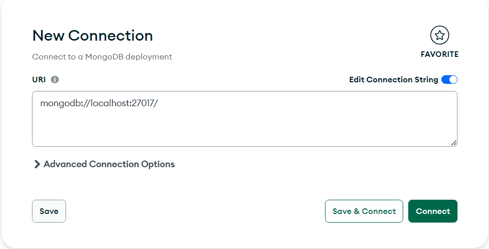
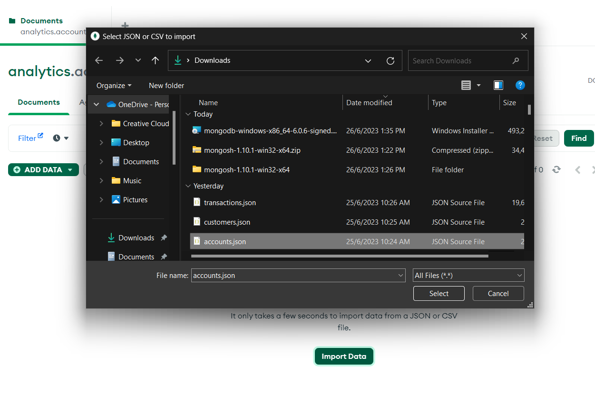
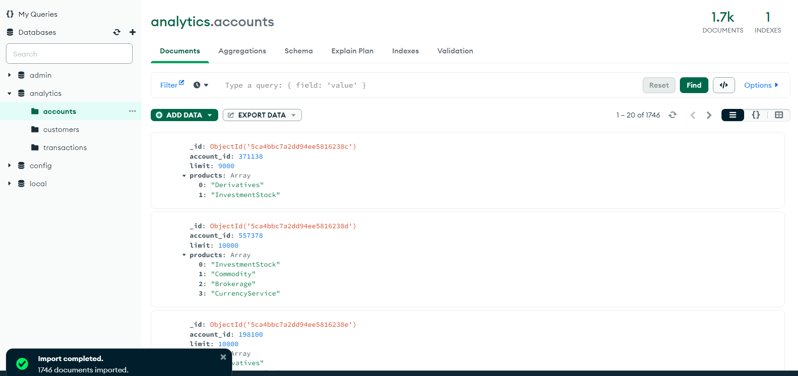
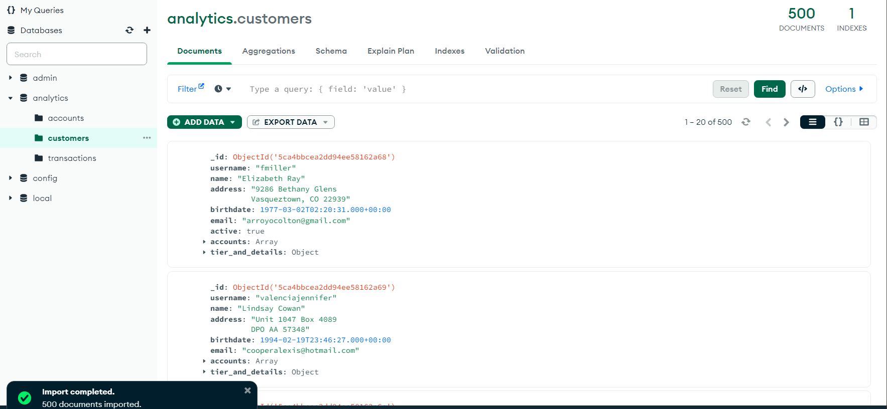
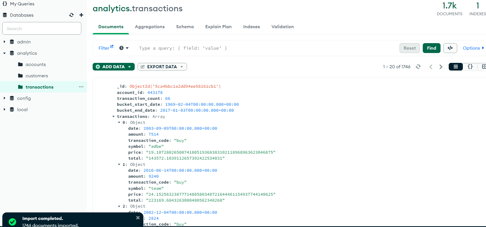
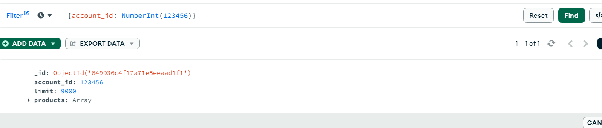
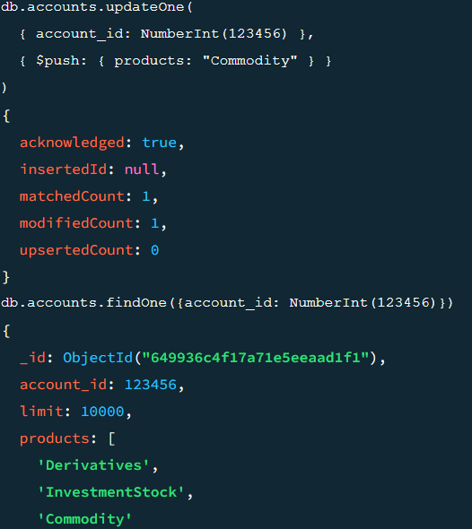
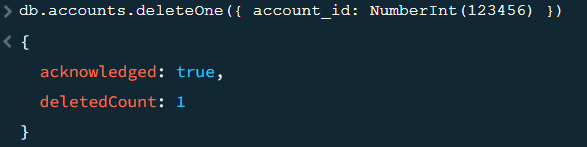

<a href="https://github.com/drshahizan/SECP3843/stargazers"></a>
<a href="https://github.com/drshahizan/SECP3843/network/members"></a>
<a href="https://github.com/drshahizan/SECP3843/pulls"></a>
<a href="https://github.com/drshahizan/SECP3843/issues"></a>
<a href="https://github.com/drshahizan/SECP3843/graphs/contributors"></a>


Don't forget to hit the :star: if you like this repo.

# Special Topic Data Engineering (SECP3843): Alternative Assessment

#### Name: Nur Syamalia Faiqah Binti Mohd Kamal
#### Matric No.: A20EC0118
#### Dataset : [Analytics Dataset](https://github.com/drshahizan/dataset/tree/main/mongodb/02-analytics)

## Question 2 (a)
### Prerequisites
Install all the following below:
1. Install [MongoDB Community Server](https://www.mongodb.com/try/download/community)
2. Install [MongoDB Shell](https://www.mongodb.com/try/download/shell)
3. Edit paths in the system environment variables. Then, it will include the MongoDB and Mongosh folder directory

### Steps
1. Download the JSON file:
 - Download all datasets (accounts.json, customers.json and transactions. json in [Analytics Dataset](https://github.com/drshahizan/dataset/tree/main/mongodb/02-analytics).
 - Check each JSON files metadata and values.

2. Start the MongoDB server / MongoDB Compass:
- Open your command-line interface and start the MongoDB server by running the following command:
     ```javascript
     mongod
     ```
  - Or, open and connect to localhost like below images
     </img>

3. Access the MongoDB shell:
 - Open a new command-line interface window and access the MongoDB shell by running the following command:
     ```javascript
     mongo
     ```

4. Create database and Collection:
- In MongoDB Compass, right-click on '+' and create the database name = "analytics" and create the collections("accounts", "customers", "transactions").

5. Import JSON Files
 - Import the selected JSON file in the choose collection.
     </img>
- Check the documents after imported.
     </img>
     </img>
     </img>


## Question 2 (b)

<p>In the MongoDB Shell, all CRUD (Create, Read, Update and Delete} quesries operations will done here.</p>

i. Create - 1 query:
This query creates a new document in the specified collection with the provided fields and values.

```javascript
db.accounts.insertOne({
  account_id: NumberInt(123456),
  limit:  NumberInt(9000),
  products: ['Derivatives', 'InvestmentStock']
})
```


ii. Read - 1 query:
This query retrieves the first document from the collection that matches the specified field and value.

```javascript
db.accounts.findOne({account_id: NumberInt(123456)})
```

</img>

iii. Update - 2 queries:
- This query updates a specific field in a document that matches the specified field and value.

```javascript
db.accounts.updateOne(
  { account_id: NumberInt(371138) }, 
  { $set: { limit: NumberInt(10000) } } 
)

```

</img>

- This query  updates by adding  value in array 'products' in a document that matches the specified field and value.

```javascript
db.accounts.updateOne(
  { account_id: NumberInt(12345) },
  { $push: { products: "Commodity" } }
)
```

</img>

iv. Delete - 1 query:

This query deletes the first document from the collection that matches the specified field and value.
```javascript
db.accounts.deleteOne({ account_id: NumberInt(123456) })
```

</img>

## Contribution 🛠️
Please create an [Issue](https://github.com/drshahizan/special-topic-data-engineering/issues) for any improvements, suggestions or errors in the content.

You can also contact me using [Linkedin](https://www.linkedin.com/in/drshahizan/) for any other queries or feedback.

[](https://visitorbadge.io/status?path=https%3A%2F%2Fgithub.com%2Fdrshahizan)


