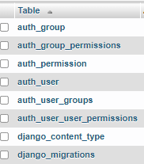
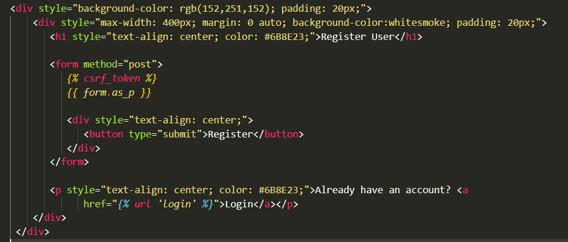
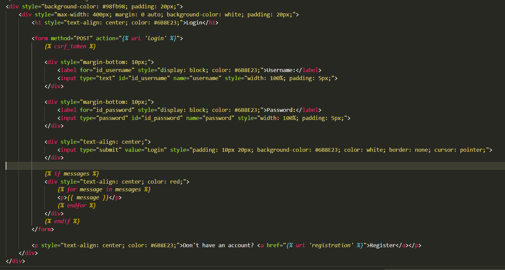
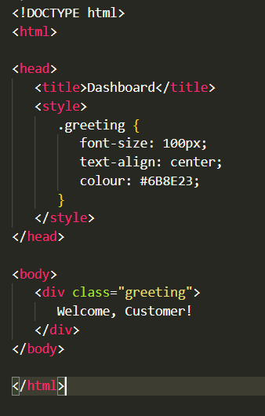
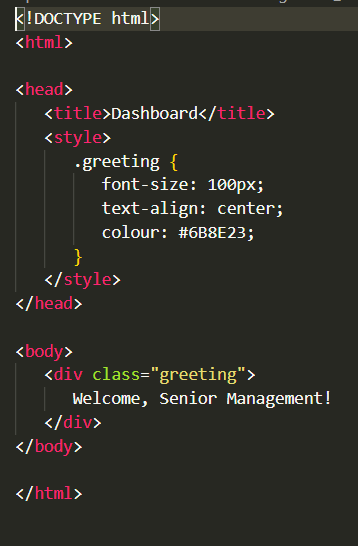
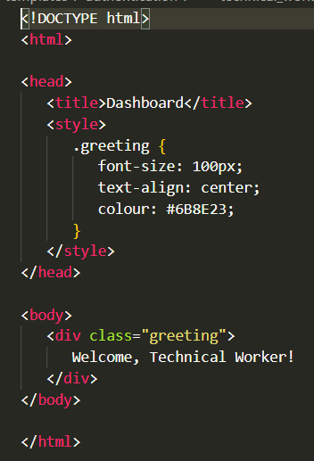
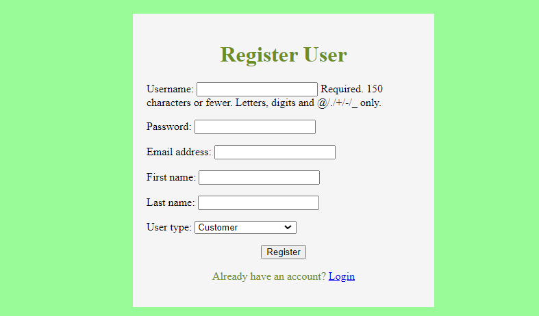
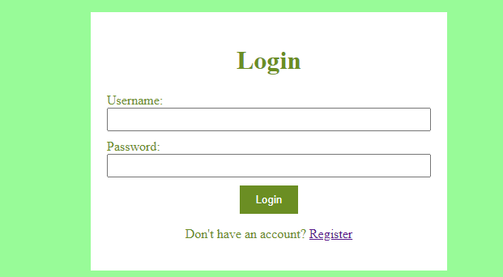
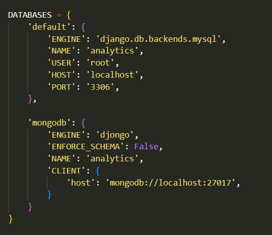

<a href="https://github.com/drshahizan/SECP3843/stargazers"></a>
<a href="https://github.com/drshahizan/SECP3843/network/members"></a>
<a href="https://github.com/drshahizan/SECP3843/pulls"></a>
<a href="https://github.com/drshahizan/SECP3843/issues"></a>
<a href="https://github.com/drshahizan/SECP3843/graphs/contributors"></a>


Don't forget to hit the :star: if you like this repo.

# Special Topic Data Engineering (SECP3843): Alternative Assessment

#### Name: Nur Syamalia Faiqah Binti Mohd Kamal
#### Matric No.: A20EC0118
#### Dataset : [Analytics Dataset](https://github.com/drshahizan/dataset/tree/main/mongodb/02-analytics)

## Question 3 (a)

1. Setting up Django:
- Install Django framework on the web server using the `pip install django` command.
- Create virtual environment and activate it.
```python
python -m venv myenv
myenv\Scripts\activate
```
- Create a new Django project using the `django-admin startproject user` command.
- Install MySQL using the `pip install mysqlclient` command.

2. Configure MySQL Database:
- Open the Django project's settings file (`settings.py`).
- Set up the MySQL database connection by providing the database name, user, password, and host.
- Specify the database engine as `'django.db.backends.mysql'`.
```python
DATABASES = {
 'default': {
     'ENGINE': 'django.db.backends.mysql',
     'NAME': 'user',
     'USER': 'root',
     'PASSWORD': '',
     'HOST': 'localhost',
     'PORT': '3306'
 }
}
```

3. Define the User Model:
- Create a new app by using the `python manage.py startapp app` command.
- Open the Django project's settings file (`settings.py`) and add  `app` in INSTALLED_APP.
```python
INSTALLED_APPS = [
 'django.contrib.admin',
 'django.contrib.auth',
 'django.contrib.contenttypes',
 'django.contrib.sessions',
 'django.contrib.messages',
 'django.contrib.staticfiles',
 'app',
]
```
- In the Django app, open the `models.py` file and define the User model class.
- Add fields like username, password, email, etc. to represent the user's information.
- Implement any additional fields required for customer, technical workers, and senior management.
```python
from django.db import models
from django.contrib.auth.models import AbstractUser

# Create your models here.
class User(AbstractUser):
 USER_TYPES = (
     ('customer', 'Customer'),
     ('technical_worker', 'Technical Worker'),
     ('senior_management', 'Senior Management'),
 )
 user_type = models.CharField(max_length=20, choices=USER_TYPES)
 # Add any additional fields you need for each user type

 groups = models.ManyToManyField(
     'auth.Group',
     related_name='custom_user_set',
     blank=True,
     help_text='The groups this user belongs to. A user will get all permissions granted to each of their groups.',
     verbose_name='groups',
 )

 user_permissions = models.ManyToManyField(
     'auth.Permission',
     related_name='custom_user_set',
     blank=True,
     help_text='Specific permissions for this user.',
     verbose_name='user permissions',
 )
```

4. Generate Database Tables:
- Create new database name `user` in MySQL.
- Run the migrations to create the necessary database tables based on the defined models.
- Use the `python manage.py makemigrations` command to generate migrations.
- Apply the migrations using the `python manage.py migrate` command.
- After migrations, the tables can be seen like below:

   </img>

5. Implement User Registration and Login Views:
   
- In views.py:
  
```python
from .forms import UserRegistrationForm, LoginForm
from django.shortcuts import render, redirect
from django.contrib.auth import authenticate, login
from django.contrib import messages

# Handle login and registration form
def registration(request):
    if request.method == 'POST':
        form = UserRegistrationForm(request.POST)
        if form.is_valid():
            user = form.save(commit=False)
            user.set_password(form.cleaned_data['password'])
            user.save()
            return redirect('login') 
    else:
        form = UserRegistrationForm()
        
    return render(request, 'registration.html', {'form': form})

def login_view(request):
    if request.method == 'POST':
        username = request.POST.get('username')
        password = request.POST.get('password')
        user = authenticate(request, username=username, password=password)

        if user is not None:
            login(request, user)
            print(f"Logged in as {username}")
            print(f"User type: {user.user_type}")
            
            if user.user_type == 'customer':
                print("Redirecting to customer dashboard")
                return redirect('customer_dashboard')
            elif user.user_type == 'technical_worker':
                print("Redirecting to technical worker dashboard")
                return redirect('technical_worker_dashboard')
            elif user.user_type == 'senior_management':
                print("Redirecting to management dashboard")
                return redirect('management_dashboard')
        else:
            messages.error(request, 'Invalid username or password.')
    
    return render(request, 'login.html')

# Handle dashboard views for all user types
def customer_dashboard_view(request):
    return render(request, 'customer_dashboard.html')

def technical_worker_dashboard_view(request):
    return render(request, 'technical_worker_dashboard.html')

def management_dashboard_view(request):
    return render(request, 'management_dashboard.html')
```

- In forms.py:
  
```python
from django import forms
from .models import User

class LoginForm(forms.Form):
    username = forms.CharField(label='username')
    password = forms.CharField(label='password', widget=forms.PasswordInput)

class UserRegistrationForm(forms.ModelForm):
    password = forms.CharField(widget=forms.PasswordInput)
    user_type = forms.ChoiceField(choices=User.USER_TYPES)

class Meta:
    model = User
    fields = ['username', 'password', 'email', 'first_name', 'last_name', 'user_type']
```

- .html for:
   - User registration page:
   
   </img>
   
   - Login page:
   
   </img>
   
   - Customer dashboard page:
   
   </img>
   
   - Senior management dashboard page:
   
   </img>
   
   - Technical worker dashboard page:
   
   </img>


6. Set URLs and Templates:
- Define URL patterns in the app's `urls.py` file to map views to URLs.

```python
from django.contrib import admin
from django.urls import path, include
from app.views import registration, login_view, customer_dashboard_view, technical_worker_dashboard_view, management_dashboard_view

urlpatterns = [
    path('customer_dashboard/', customer_dashboard_view, name='customer_dashboard'),
    path('technical_worker_dashboard/', technical_worker_dashboard_view, name='technical_worker_dashboard'),
    path('management_dashboard/', management_dashboard_view, name='management_dashboard'),
    path('', login_view, name='home'),
    path('login/', login_view, name='login'),
    path('admin/', admin.site.urls),
    path('register/', registration, name='registration'),
]
```
- Open the Django project's settings file (`settings.py`) and edit in TEMPLATES.

```python
TEMPLATES = [
    {
        'BACKEND': 'django.template.backends.django.DjangoTemplates',
        'DIRS': [
            os.path.join(BASE_DIR, 'app/templates/'),
            os.path.join(BASE_DIR, 'app/templates/authentication'),
            ],
        'APP_DIRS': True,
        'OPTIONS': {
            'context_processors': [
                'django.template.context_processors.debug',
                'django.template.context_processors.request',
                'django.contrib.auth.context_processors.auth',
                'django.contrib.messages.context_processors.messages',
            ],
        },
    },
]
```

7. Run server:
- In command prompt, run below:
```python
python manage.py runserver
```
- User registration page:

   </img>
   
- Login page:

  </img>

## Question 3 (b)
<p>When working with two different databases, such as MySQL and MongoDB, there are several approaches to address the challenge of data replication and synchronization. 
One possible solution is to use an external tool or library that facilitates real-time updates and seamless interaction between the databases. 
Here's a general outline of the steps involved in implementing such a solution:</p>

1. Install related packages. As, we already build connection to MySQL from previous question, we need to install MongoDB related packages in the command.
 ```python
 pip install pymongo
 import pymongo
 ```
2. Configure the database by openning in ('settings.py') in DATABASES:
   </img>

3. Access MongoDB databases and collections: Once the connection is established, we can access databases and collections in MongoDB using the client instance.
 ```python
 db = client['analytics']
 collection1 = db['accounts']
 collection2 = db['customers']
 collection3 = db['transactions']
 ```
4. Design data mapping by creating a mapping between MySQL and MongoDB data models or schemas. Determine how data from one database will be translated and mapped to another.

For MySQL (Django models):
```python
class MyModelAccounts(models.Model):
    # MySQL fields declaration
    
    class Meta:
        db_table = 'tb_accounts'

class MyModelCustomers(models.Model):
    # MySQL fields declaration
    
    class Meta:
        db_table = 'tb_customers'

class MyModelTransactions(models.Model):
    # MySQL fields declaration
    
    class Meta:
        db_table = 'tb_transactions'
```

For MongoDB (MongoDB models):
```python
class MyMongoModelAccounts(Document):
    # MongoDB fields declaration
    
    meta = {
        'collection': 'col_accounts'
    }

class MyMongoModelCustomers(Document):
    # MongoDB fields declaration
    
    meta = {
        'collection': 'col_customers'
    }

class MyMongoModelTransactions(Document):
    # MongoDB fields declaration
    
    meta = {
        'collection': 'col_transactions'
    }
```

5. Add data migration scripts:
```python
from app.models import MyModelAccounts, MyModelCustomers, MyModelTransactions
from app.mongo_models import MyMongoModelAccounts, MyMongoModelCustomers, MyMongoModelTransactions

def migrate_data():
    # Fetch data from MySQL models
    mysql_accounts = MyModelAccounts.objects.all()
    mysql_customers = MyModelCustomers.objects.all()
    mysql_transactions = MyModelTransactions.objects.all()
    
    # Transfer data to MongoDB models
    for mysql_account in mysql_accounts:
        mongo_account = MyMongoModelAccounts()
        # Set MongoDB fields using MySQL data
        mongo_account.field1 = mysql_account.field1
        mongo_account.field2 = mysql_account.field2
        # ...
        mongo_account.save()
    
    for mysql_customer in mysql_customers:
        mongo_customer = MyMongoModelCustomers()
        # Set MongoDB fields using MySQL data
        mongo_customer.field1 = mysql_customer.field1
        mongo_customer.field2 = mysql_customer.field2
        # ...
        mongo_customer.save()
    
    for mysql_transaction in mysql_transactions:
        mongo_transaction = MyMongoModelTransactions()
        # Set MongoDB fields using MySQL data
        mongo_transaction.field1 = mysql_transaction.field1
        mongo_transaction.field2 = mysql_transaction.field2
        # ...
        mongo_transaction.save()

# Run the migration script
migrate_data()
```


## Contribution 🛠️
Please create an [Issue](https://github.com/drshahizan/special-topic-data-engineering/issues) for any improvements, suggestions or errors in the content.

You can also contact me using [Linkedin](https://www.linkedin.com/in/drshahizan/) for any other queries or feedback.

[](https://visitorbadge.io/status?path=https%3A%2F%2Fgithub.com%2Fdrshahizan)


