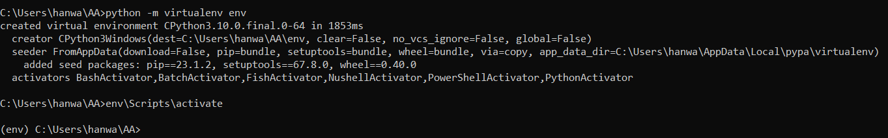
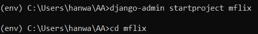
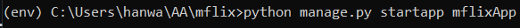
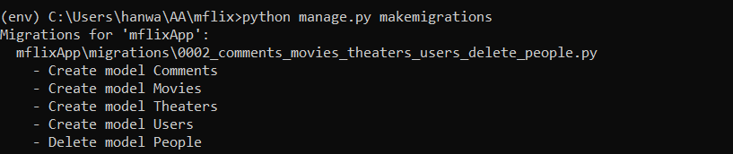
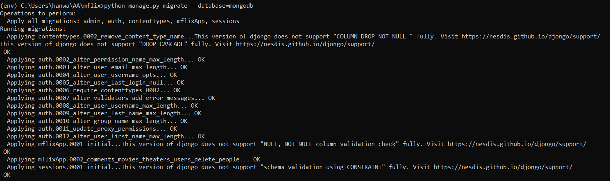
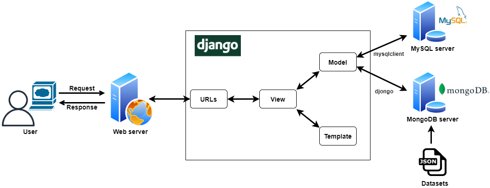

<a href="https://github.com/drshahizan/SECP3843/stargazers"></a>
<a href="https://github.com/drshahizan/SECP3843/network/members"></a>
<a href="https://github.com/drshahizan/SECP3843/pulls"></a>
<a href="https://github.com/drshahizan/SECP3843/issues"></a>
<a href="https://github.com/drshahizan/SECP3843/graphs/contributors"></a>


Don't forget to hit the :star: if you like this repo.

# Special Topic Data Engineering (SECP3843): Alternative Assessment

#### Name: Ong Han Wah
#### Matric No.: A20EC0129
#### Dataset: Mflix Dataset

## Question 1 (a)

1. Create a virtual environment.
```
python -m virtualenv env
```

2. Activate the virtual environment.
```
env\Scripts\activate
```



3. Install neccesary libraries.
```
pip install django
pip install djongo
pip install pymongo
pip install pytz
pip install mysqlclient
```

4. Create a Django project.
```
django-admin startproject mflix
```

5. Create an app in the Django project.
```
cd mflix
python manage.py startapp mflixApp
```





6. Update the databases configuration for MySQL and MongoDB in settings.py
```
DATABASES = {
    'default': {
        'ENGINE': 'django.db.backends.mysql',  
        'NAME': 'db_mflix',  
        'USER': 'root',  
        'PASSWORD': '',  
        'HOST': '127.0.0.1',  
        'PORT': '3306',
    },
    'mongodb': {
        'ENGINE': 'djongo',
        'NAME': 'mflix',
        'ENFORCE_SCHEMA': False,
    }
}
```

7. Define the models in models.py
```
from django.db import models

class Movies(models.Model):
    awards = models.JSONField()
    cast = models.JSONField()
    countries = models.JSONField()
    directors = models.JSONField()
    fullplot = models.TextField()
    genres = models.JSONField()
    imdb = models.JSONField()
    languages = models.JSONField()
    lastupdated = models.CharField(max_length=100)
    metacritic = models.IntegerField()
    num_mflix_comments = models.IntegerField()
    plot = models.TextField()
    poster = models.CharField(max_length=100)
    rated = models.CharField(max_length=100)
    released = models.DateTimeField()
    runtime = models.IntegerField()
    title = models.CharField(max_length=100)
    tomatoes = models.JSONField()
    type = models.CharField(max_length=100)
    writers = models.JSONField()
    year = models.IntegerField()

class Theaters(models.Model):
    location = models.CharField(max_length=100)
    theaterId = models.JSONField()

class Users(models.Model):
    email = models.CharField(max_length=100)
    name = models.CharField(max_length=100)
    password = models.CharField(max_length=100)

class Comments(models.Model):
    date = models.DateTimeField()
    email = models.CharField(max_length=100)
    movie_id = models.CharField(max_length=100)
    name = models.CharField(max_length=100)
    text = models.TextField()
```

8. Make migrations and migrate
```
python manage.py makemigrations
python manage.py migrate
```





## Question 1 (b)



- **Web server**: responsible for handling incoming HTTP requests and generating dynamic web pages.

- **Django**: a high-level Python web framework, serves as the foundation for the web server. It follows the Model-View-Template (MVT) architectural pattern.
    - The **Model** is responsible for handling data and the database.
    - The **View** is responsible for handling user requests and returning a response.
    - The **Template** is responsible for rendering the HTML that is returned to the user.

-  **MySQL**: a relational database management system (RDBMS) used to store structured data related to users' accounts/credentials such as usernames, passwords etc.
    - Django interacts with the MySQL database through its built-in support for MySQL connections and the **mysqlclient** library.

- **MongoDB**: a NoSQL database used to store the Mflix dataset which consists of unstructured JSON documents containing complex nested object structures.
    - Django interacts with MongoDB using the **Djongo** library, which provides an ORM interface to MongoDB.

- **Dataset (JSON)**: The dataset component refers to the JSON (JavaScript Object Notation) data that will be used in the portal which is the Mflix dataset. The JSON dataset contains data in key-value pairs, representing objects and arrays.


## Contribution 🛠️
Please create an [Issue](https://github.com/drshahizan/special-topic-data-engineering/issues) for any improvements, suggestions or errors in the content.

You can also contact me using [Linkedin](https://www.linkedin.com/in/drshahizan/) for any other queries or feedback.

[](https://visitorbadge.io/status?path=https%3A%2F%2Fgithub.com%2Fdrshahizan)


