<a href="https://github.com/drshahizan/SECP3843/stargazers"></a>
<a href="https://github.com/drshahizan/SECP3843/network/members"></a>
<a href="https://github.com/drshahizan/SECP3843/pulls"></a>
<a href="https://github.com/drshahizan/SECP3843/issues"></a>
<a href="https://github.com/drshahizan/SECP3843/graphs/contributors"></a>


Don't forget to hit the :star: if you like this repo.

# Special Topic Data Engineering (SECP3843): Alternative Assessment

#### Name: Ong Han Wah
#### Matric No.: A20EC0129
#### Dataset: Mflix Dataset

## Question 2 (a)
To carry out the task, we need to install [MongoDB Community Server](https://www.mongodb.com/try/download/community). To use the mongodb shell and mongoimport tool, we need to download the [MongoDB Shell](https://www.mongodb.com/try/download/shell) and [MongoDB Database Tools](https://www.mongodb.com/try/download/database-tools). After downloading the zip file and unzip the downloaded folder, copy-paste the bin folders all .exe files into the MongoDB bin folder.
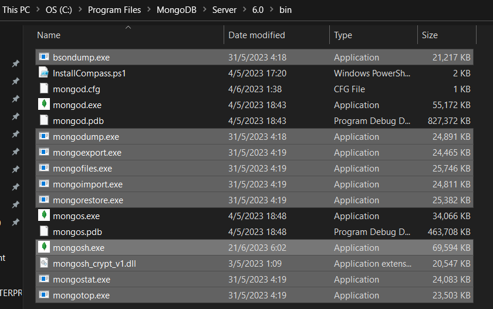</img>

### Step 1: Download the JSON file
Download the [movies.json](https://github.com/drshahizan/dataset/blob/main/mongodb/03-movie/movies.json) dataset.

### Step 2: Start the MongoDB server
Open command prompt and navigate to the MongoDB bin folder.
```
cd C:\Program Files\MongoDB\Server\6.0\bin
```
Then, run `mongod` to start the MongoDB server.
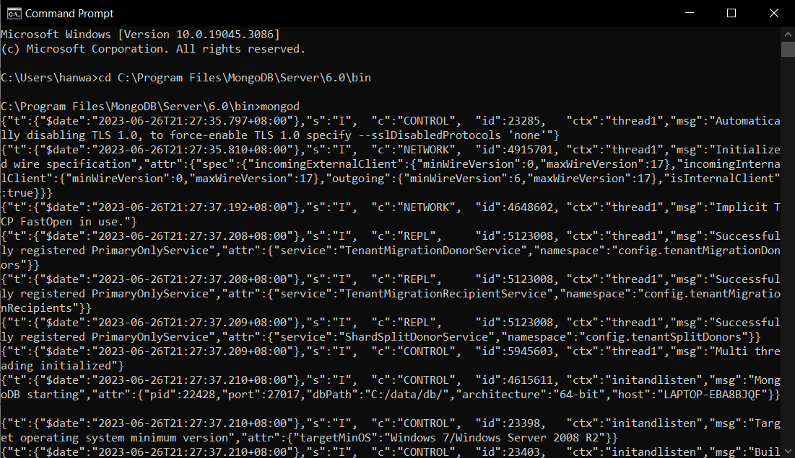</img>

### Step 3: Accessing the MongoDB shell
After starting up MongoDB, access mongo shell by running `mongosh` command in the command prompt. This will connect to a MongoDB instance running on the localhost with default port 27017.
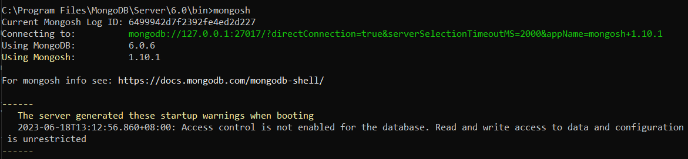</img>

### Step 4: Selecting the target database
Once accessed to the Mongo Shell, the following code specify or create the database named mflix if it does not exist.
```
use mflix
```

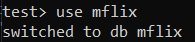</img>

### Step 5: Choosing the collection
The following code specify the collection where we want to store our data.
```
db.movies
```

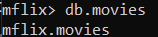</img>

### Step 6: Executing the import command
Next, we can run the `mongoimport` command to import the dataset from json file.
```
mongoimport --db mflix --collection movies --file "C:\Users\hanwa\Documents\GitHub\dataset\mongodb\03-movie\movies.json"
```
> - The --db flag specifies the target database name.
> - The --collection flag specifies which collection within that database to import data into.
> - The --file flag indicates where the JSON file is located.

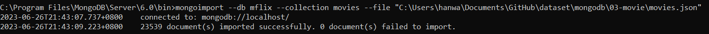</img>

## Question 2 (b)

i) Create

Creating new document can done using the `insertOne()` or `insertMany()` function provided by MongoDB. The following example create a new document in the movies colection using `insertOne()`.
```
db.movies.insertOne({
  "plot": "The quick brown fox jumps over the lazy dog.",
  "genres": ["Short"],
  "runtime": 1,
  "cast": ["Ali","Ahmad"],
  "num_mflix_comments": 1,
  "title": "Test",
  "fullplot": "The quick brown fox jumps over the lazy dog.",
  "countries": ["MY"],
  "released": {
    "$date": {
      "$numberLong": "-2418768000000"
    }
  },
  "directors": ["William"],
  "rated": "UNRATED",
  "lastupdated": "2015-08-26 00:03:50.133000000",
  "year": 1893,
  "imdb": {
    "rating": 6.2,
    "votes": 1189,
    "id": 5
  },
  "type": "movie"
});
```
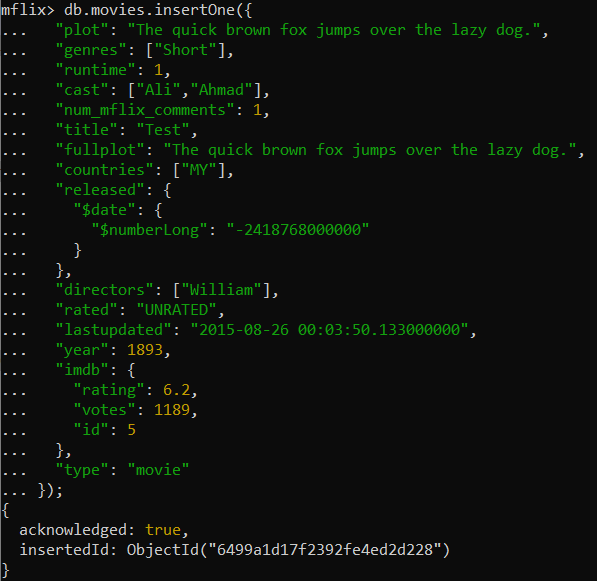</img>

ii) Read

Reading data from our collection can be done using `find()` function which returns all documents matching desired criteria. The following query find all documents with title "Test" in the movies collection.
```
db.movies.find({ title: "Test" });
```
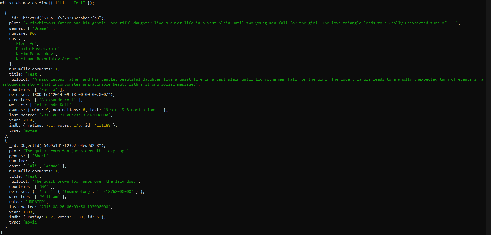</img>

iii) Update

Updating existing records in MongoDb can be achieved with either `updateOne()` or `updateMany()`. 

This following query updates the "num_mflix_comments" field for one specific record based on its unique '_id' value using `updateOne()`.
```
db.movies.updateOne(
   { "_id" : ObjectId("6499a1d17f2392fe4ed2d228") },
   { $set: { "num_mflix_comments": 0 } }
);
```
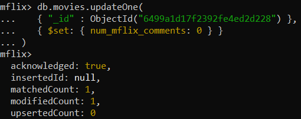</img>

This following query updates the "languages" field for all records having title of "Test" using `updateMany()`.
```
db.movies.updateMany(
   { "title": "Test" },
   { $set: { "languages": ["English"] } }
);
```
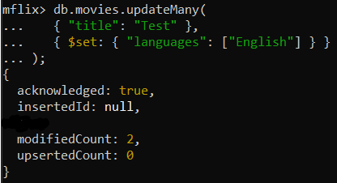</img>

iv) Delete

Deleting documents from our collection can be done using `deleteOne()` or `deleteMany()`. 

The following query deletes one specific record based on its unique '_id' value using `deleteOne()`.
```
db.movies.deleteOne({"_id" : ObjectId("6499a1d17f2392fe4ed2d228")});
```
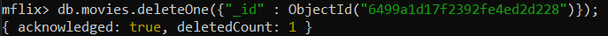</img>

## Contribution 🛠️
Please create an [Issue](https://github.com/drshahizan/special-topic-data-engineering/issues) for any improvements, suggestions or errors in the content.

You can also contact me using [Linkedin](https://www.linkedin.com/in/drshahizan/) for any other queries or feedback.

[](https://visitorbadge.io/status?path=https%3A%2F%2Fgithub.com%2Fdrshahizan)


