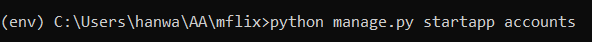
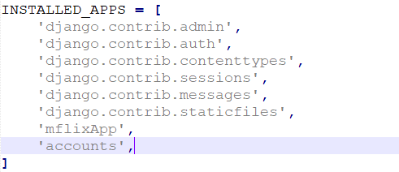
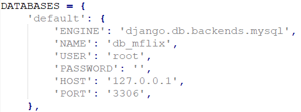
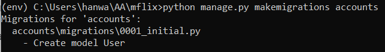
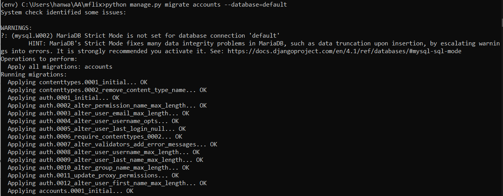
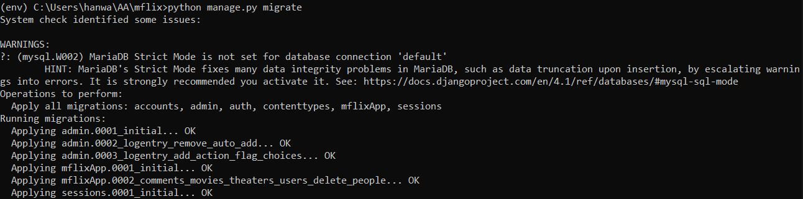
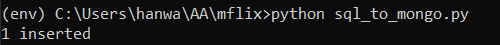

<a href="https://github.com/drshahizan/SECP3843/stargazers"></a>
<a href="https://github.com/drshahizan/SECP3843/network/members"></a>
<a href="https://github.com/drshahizan/SECP3843/pulls"></a>
<a href="https://github.com/drshahizan/SECP3843/issues"></a>
<a href="https://github.com/drshahizan/SECP3843/graphs/contributors"></a>


Don't forget to hit the :star: if you like this repo.

# Special Topic Data Engineering (SECP3843): Alternative Assessment

#### Name: Ong Han Wah
#### Matric No.: A20EC0129
#### Dataset: Mflix Dataset

## Question 3 (a)

1. This section uses the Django project created in Question 1(a). Locate the project directory and activate the virtual environment.
```
env\Scripts\activate
```

2. Navigate to the Django project folder and create a Django app for handling user registration and login. 
```
python manage.py startapp accounts
```


3. Include the `accounts` app in the project's settings by adding it to the `INSTALLED_APPS` list and make sure the database is configured for MySQL in the `settings.py` file.





4. Define the User model in the `models.py` of the accounts app.
```py
from django.db import models
from django.contrib.auth.models import AbstractUser

class User(AbstractUser):
    USER_TYPES = [
        ('customer', 'Customer'),
        ('technical', 'Technical Worker'),
        ('management', 'Senior Management'),
    ]
    user_type = models.CharField(max_length=50, choices=USER_TYPES)
    
    def __str__(self):
        return self.username
```

5. Generate and apply the necessary database migrations to create the user table in the MySQL database.
```
python manage.py makemigrations
python manage.py migrate
```





6. Create a registration and login form by putting the following code into a new file called `forms.py` in the `account`s app.
```py
from django import forms
from django.contrib.auth.forms import UserCreationForm
from .models import User

class RegistrationForm(UserCreationForm):
    USER_TYPES = [
        ('customer', 'Customer'),
        ('technical', 'Technical Worker'),
        ('management', 'Senior Management'),
    ]

    user_type = forms.ChoiceField(choices=USER_TYPES)

    class Meta:
        model = User
        fields = ('username', 'email', 'user_type', 'password1', 'password2')

class LoginForm(forms.Form):
    username = forms.CharField(max_length=65)
    password = forms.CharField(max_length=65, widget=forms.PasswordInput)
```

7. Update `views.py` in the `accounts` app to handle user registration and login functionality.
```py
from django.shortcuts import render, redirect
from django.contrib.auth import authenticate, login, logout
from .forms import RegistrationForm, LoginForm

def home(request):
    return render(request, 'accounts/home.html')

def register(request):
    if request.method == 'POST':
        form = RegistrationForm(request.POST)
        if form.is_valid():
            form.save()
            return redirect('login')
    else:
        form = RegistrationForm()
    return render(request, 'accounts/register.html', {'form': form})

def user_login(request):
    if request.method == 'POST':
        username = request.POST.get('username')
        password = request.POST.get('password')
        user = authenticate(request, username=username, password=password)
        if user:
            login(request, user)
            return redirect('home')
        else:
            error_message = "Invalid login credentials"
            return render(request, 'accounts/login.html')

def sign_out(request):
    logout(request)
    return redirect('login')
```

8. Next, we need to create necessary html files for the views. Inside the `accounts` directory, create a directory called `templates`. Then inside the templates directory, create another directory named `accounts` and put the html files in it.
- `home.html`
```html

    <div class="alert alert-success" role="alert">
        <h3>Welcome {{ user.username }}!</h3>
        <a href="">Logout</a>
    </div>

    <div class="alert alert-success" role="alert">
        <h3>Welcome!</h3>
        <a href="">Signup</a>
        <a href="">Login</a>
    </div>

```

- `register.html`
```html
<h3>Register here</h3>
<hr>

<form action="" method="POST">
    
    {{ form.as_p }}

    <button type="submit">Register</button>
</form>
<p>Already have account ? <a href=> Login Here</a></p>
```

- `login.html`
```html
<h3>Login</h3>
<hr>

<form action="" method="POST">
    
    {{ form.as_p }}

    <button type="submit">Login</button>
</form>
<p>Don't have account ? <a href=""> Sign Up Here</a></p>
```

9. Define the routes in the `urls.py` file.
```py
from django.contrib import admin
from django.urls import path
from accounts import views as accounts_views

urlpatterns = [
    path('admin/', admin.site.urls),
    path('', accounts_views.home, name='home'),
    path('login/', accounts_views.user_login, name='login'),
    path('register/', accounts_views.register, name='register'),
    path('logout/', accounts_views.sign_out, name='logout'),
]
```

## Question 3 (b)

1. Install necessary libraries.
```
pip install mysql-connector 
pip install pymongo
```

2. Create a new python script named `sql_to_mongo.py` to replicate the data from MySQL to MongoDB.
```py
import mysql.connector 
import pymongo
 
delete_existing_documents = True
 
mysql_host="localhost" 
mysql_database="db_mflix" 
mysql_user="root" 
mysql_password=""
 
mongodb_host = "mongodb://localhost:27017/" 
mongodb_dbname = "mflix"
mongodb_col = "accounts_user"
 
mysqldb = mysql.connector.connect( 
   host=mysql_host, 
   database=mysql_database, 
   user=mysql_user, 
   password=mysql_password 
)

mycursor = mysqldb.cursor(dictionary=True) 
mycursor.execute("SELECT * from accounts_user;") 
myresult = mycursor.fetchall()
 
myclient = pymongo.MongoClient(mongodb_host) 
mydb = myclient[mongodb_dbname] 
mycol = mydb[mongodb_col]
 
if len(myresult) > 0: 
       x = mycol.insert_many(myresult) #myresult comes from mysql cursor 
       print(len(x.inserted_ids), "inserted")
```

Run the code to execute the script.
```
python sql_to_mongo.py
```



## Contribution 🛠️
Please create an [Issue](https://github.com/drshahizan/special-topic-data-engineering/issues) for any improvements, suggestions or errors in the content.

You can also contact me using [Linkedin](https://www.linkedin.com/in/drshahizan/) for any other queries or feedback.

[](https://visitorbadge.io/status?path=https%3A%2F%2Fgithub.com%2Fdrshahizan)


